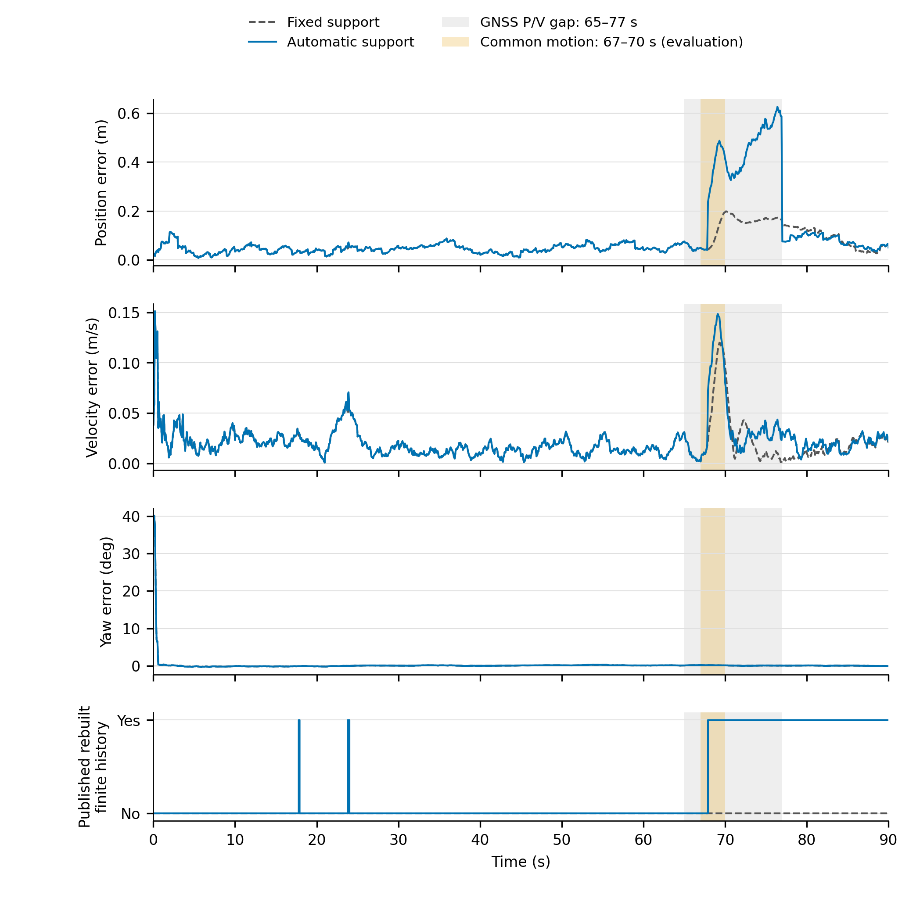

# M1完整自动有限运动结果：历史修复发生，导航收益失败

2026-10-08。正式结论：**M1未通过，继续M1的物理修正，不进入M2导航。** 完整90秒自动运行正常结束，1287/1287行全部保留；固定对照同样完整。失败不是运行中断、覆盖减少或只切换标签。自动耗时1989.53秒，固定63.03秒；均为离线计算。

## 完整导航结果

以下均为已发布因果状态的时间加权RMSE。分母是同一后端、同一输入的固定支撑U3，不是V3。自动方案在运行前固定sigma_u=0.075m/s、tau=100s、附加编辑代价0、工作带2log20，结果后未调参或改规则。

| 区间 s | 位置 固定→自动 / m | 速度 固定→自动 / m/s | 航向 固定→自动 / deg |
| --- | ---: | ---: | ---: |
| 完整0–90 | 0.075066→0.156693 | 0.026658→0.029752 | 2.145714→2.145709 |
| 健康支撑0–65 | 0.048830→0.048895 | 0.023437→0.023561 | 2.524150→2.524150 |
| 滑移前65–67（P/V已中断） | 0.052849→0.052849 | 0.013274→0.013274 | 0.174670→0.174670 |
| 共同运动67–70 | 0.106766→0.342817 | 0.077582→0.100771 | 0.170005→0.169177 |
| 运动后、恢复前70–77 | 0.167684→0.479964 | 0.029056→0.031500 | 0.072526→0.071233 |
| 整个P/V缺口65–77 | 0.140418→0.405248 | 0.045018→0.056097 | 0.124011→0.123288 |
| 恢复77–90 | 0.094281→0.080207 | 0.017401→0.021157 | 0.060119→0.060173 |

缺口位置恶化188.60%、速度恶化24.61%；完整位置恶化108.74%、速度恶化11.60%。恢复位置改善14.93%，但恢复速度恶化21.59%，不能据恢复位置改判成功。25–35部分载波、40–55全相位中断、55–65重捕获三段的p/v/yaw逐项与固定对照相同。

区间沿预先声明的闭区间样本和相邻段梯形权重，不插值、不填空窗、不去掉初始化。共同完整时间轴、生成器与种子均匹配；CSV状态与保存的评价数组逐项一致。精确数值和额外健康段见M1_AUTOMATIC90_RESULT.json。



[PDF](M1_FINITE_PAIR_PROCESS.pdf)；[完整图注](M1_FINITE_PAIR_PROCESS_CAPTION.md)。图包含初始化航向峰和全部失败段，未裁剪误差轴。

## 历史重建确实进入了共同状态

- 主四足策略在67.9秒实际发布，持续到90秒，共283行；从64.0秒checkpoint重建，覆盖最早64.8秒的足弧使用，共44个事件，effective_from=null表示整条弧历史。
- 另有17.8秒1行及23.8–23.9秒3行短暂有限模型发布，随后回到固定。全程4次非线性展开、6次参考切换。
- 全部287条重建发布行的p/v/rpy与所选候选的实际条件状态完全一致。旧revocation/replay计数为0，不影响这一证据；分数赢家没有被当成发布状态。
- 67.9秒相对固定方案的位置变化约[-0.1917,-0.03435,-0.02229]m，速度变化[-0.05175,-0.01088,-0.00382]m/s，yaw只变化-0.001554度。发生的是显著平移分配变化，不能称为航向介导的导航收益。
- 90秒仍有425个未展开的非线性解释，完整非线性支持标记为false。工作带内的单个赢家不等于唯一可信方向。

## 病因证据与唯一下一项诊断

已确认的时间语义：support_policy.replace_group将自动候选的effective_from写成负无穷，navigator从最早足弧使用前恢复。有限过程因此从64.8秒起覆盖原弧全部历史，也改变了故障前固定支撑的假设；原始健康观测并未删除，但其解释被放松。branch在出生时令s0为零坐标、u0服从标准差0.075m/s的正常速度先验，再按tau=100秒传播。已冻结文件记录其12秒单轴先验位移标准差约0.882m。

足观测主要约束s-p；整弧近常速共同运动允许将机体速度与共同接触速度互相分配，尤其在P/V缺口中。代码核对未发现R^T(c+s-p)-r符号、接触初始化或交叉协方差消元错误的证据。**健康前段放松过早是有具体依据的病因假设，尚非唯一归因**；3秒起动—停止过程与长相关时间OU的形状不匹配也可能重要。

下一项仅做首次主发布时刻之前的源似然起动时间profile：从同一个64.0秒checkpoint，固定全部输入、整数及现有参数，对无变化、整弧有限运动、各实际观测边界开始有限运动的条件解释比较至67.9秒。检查源分数、p/v和s/u联合后验，尤其共同速度相关；不从评价真值67秒设定起点，不读导航误差来选择起点。

若原始观测支持弧内起动且保留前段约束能降低共同速度混淆，下一步才在同一导航算法中实现未知变化时刻及对应依赖撤销。若源profile不定位起动，或仍不能解释运动形状，就据该结果修改物理假设；不能固定一个方便的起动时刻、继续扫tau或改门限。profile只作归因，不作经过校准的概率，也不冒充自动完整成果。

## 复现与范围

输入种子6100801；自动导航代码提交0760d6a7ef878cdf6c17ccb6f3670e0a6bdfa390。固定完整结果见M1_FIXED90_RESULT.json。自动结果根：`/home/kaiwen/research/LegSA-GINS-SCRATCH/INTEGRATED_LEGGED_HEADING_20261008/M1_FULL01_AUTOMATIC_FINITE`。完整原始决策、CSV、NPZ和输入快照保留在各运行根；2.6MB完整配对JSON保留在相邻M1_FULL01_PAIR_READOUT，仓库摘要保留全部发布策略分段和展开事件。

```bash
env PYTHONPATH=src OPENBLAS_NUM_THREADS=1 OMP_NUM_THREADS=1 MKL_NUM_THREADS=1 \
  /home/kaiwen/research/LegSA-GINS-ENV/support-carrier-joint/bin/python \
  scripts/paper_rebuild/run_support_carrier_joint.py \
  --output-root NEW_OUTPUT_ROOT --seed 6100801 --duration 90 --modes U3 \
  --support-inference shared_separator --support-prediction foot_external \
  --support-motion-model docs/paper_rebuild/INTEGRATED_LEGGED_HEADING_20261008/M1_SUPPORT_WORKING_MODEL.json
```

已完成结果的读取使用read_joint_finite_pair.py及--fixed-root/--automatic-root/--output-root；无需重跑。此次读取修正了大候选历史字段超过CSV默认128KiB限制的问题，只改变离线读取能力。过程图已视觉检查。

本结果证明自动条件历史修复链实际运行，同时否定这一个冻结工作模型的M1导航收益。没有完成三个创新，没有新增V3实测比较，没有修改蹬脚对齐、原始数据或测试集；长期目标不下调。
