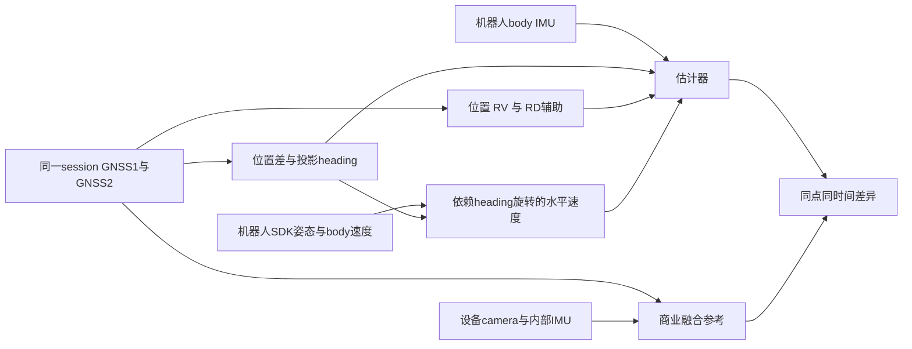

# TIM：从导航误差到可验证的测量不确定度

日期：2026-10-04。本文是研究设计和独立方程整理，**不宣称已完成实体校准、区间覆盖验收或新方法科学实验**。原 V3 与现有诊断结果保持各自身份。配套三张图是常数假设下的解析示例，未读取实验/参考载荷。

## 1. 主贡献应当是什么

TIM 版本应围绕“短横向基线与姿态依赖速度的量值定义、相关传播及可用域验证”组织，而不是再列一张定位 RMSE 排名。当前只有软件合同、工程参数和相对共享参考的误差表；将这些改名为 uncertainty 不会形成测量贡献。[TIM 作者指南](https://ieee-ims.org/publication/ieee-tim/information-authors)

建议的英文研究问题：

> **TIM-RQ1.** How can the uncertainty of a short lateral-baseline heading observable be evaluated when receiver errors are correlated, the horizontal projection changes with attitude, and installation and timing parameters are uncertain?
>
> **TIM-RQ2.** How should attitude-dependent robot-reported velocity aiding be propagated and validated when the heading, velocity and reference share information sources?
>
> **TIM-RQ3.** Can a declared measurement model predict usable domains and held-out interval coverage without fitting its uncertainty parameters to the evaluation reference?

这是一项候选测量研究。相关传播、Monte Carlo、Allan variance 或 PSD 本身均已有成熟文献。TIM 2023 的 Cucci 等已经以真实噪声模型和 Monte Carlo 研究随机标定及估计不确定度的正确性；本项目的新意必须来自**明确且有证据的异源/共源混合测量链、退化域和物理验证**，不能以“又使用了一次 Monte Carlo”作为创新。[Cucci 等，2023](https://doi.org/10.1109/TIM.2023.3267360)

## 2. 先确定量，而不是先调滤波噪声

|量|必须固定的对象和定义|现有证据与边界|
|---|---|---|
|基线投影方向 ψ⊥|GNSS2−GNSS1，在共同 NED、实际观测历元和非零水平投影下的方向；声明横向 −y 安装时加 π/2|有软件顺序和角度公式；实体天线相位中心、三维安装与同步尚需记录|
|机器人 Euler yaw ψ|指定刚体 FRD 轴的 ZYX yaw，限定 Euler 有效域|一般倾斜下不等于 ψ⊥；原 V3 使用标量近似，新诊断版不可回贴原结果|
|SDK 辅助 vH|SDK 输出所代表点的地固水平速度，FLU→FRD→NED、增益及有效域|目前先是 provider 构造量；输出点、内部融合、Ĉ 的物理正确性未标定|
|位置/速度|传播 IMU 点、观测天线点和论文输出点分别说明|声明杆臂不等于量测杆臂；历史评价位置运输未同步运输 STD|
|参考差异 d|同点、同坐标、同时间支持的估计−参考|商用参考共享 GNSS 血缘；只能先称 agreement，误差与 uncertainty 都需要模型|

VIM 区分被测量、校准和不确定度；软件修改或给文件 SHA 不是计量溯源。Type A/B 是不确定度评价方式，不分别等于随机/系统误差。[VIM 2.3、2.26、2.28–2.29、2.39、2.41](https://www.bipm.org/documents/20126/2071204/JCGM_200_2012.pdf)

## 3. 测量链和相同来源

这是日志血缘与软件依赖图，不是已经证实的实体接线图。参考中视觉与另一个 IMU 的参与可以增加不同来源，却不会让已共享的 GNSS 误差消失。SDK 内部姿态和速度也可能来自共同估计器；未知交叉块必须标 NOT_ESTIMATED，不能默认为零。

## 4. 双接收机与短基线传播

以下定义 n=NED、b=机器人 FRD，C=C_b^n；所有角微扰为 rad。安装、点位、时刻未知属于输入量或模型偏差，不能悄悄当精确常数。共同物理时刻 t 附近，令 δτ_i=真实采样时刻−名义采样时刻：

\[
 \tilde p_i^n=p_I^n+C\ell_{I,A_i}^b+v_{A_i}^n\delta\tau_i+e_i+\delta p_{i,model},\qquad
 \tilde b=\tilde p_2-\tilde p_1. \tag{T1}
\]

位置解误差 e_i 可含共同改正、环境、接收机差异、偏差和错误固定；它不是“原始载波噪声”的同义词。在安装点正确且同步的理想模型中，b=C(ℓ2−ℓ1)。声明 ℓ2−ℓ1=[0,−L,0] 时：

\[
 \psi_\perp=\operatorname{wrap}\{\operatorname{atan2}(b_E,b_N)+\pi/2\},\quad
 r^2=b_N^2+b_E^2>0,\quad
 j_b=[-b_E/r^2,\ b_N/r^2,\ 0]. \tag{T2}
\]

若 C=Rz(ψ)Ry(θ)Rx(φ)，完整投影与 Euler yaw 的差为

\[
 \operatorname{wrap}(\psi_\perp-\psi)
 =\operatorname{atan2}(-\sin\theta\sin\phi,\cos\phi)\quad\text{在有效投影/角度域内}. \tag{T3}
\]

该式是声明横向安装下的几何恒等式；未验证实体轴时不能由它校准真实安装。已有 EXT 名义投影解释检查只排除了“该理想量差足以解释大错”的说法，没有证明安装或天线顺序。

令 Uij=Cov(e_i,e_j)，则相对位置误差的协方差为

\[
 U_b=U_{22}+U_{11}-U_{21}-U_{12},\qquad
 u^2(\psi_\perp)\simeq j_bU_bj_b^T. \tag{T4}
\]

T4 只展开位置误差块。含 ℓ、安装旋转、坐标基和时钟时，使用完整 x 和 Ux，传播 Uy≈JxUxJxᵀ，包括交叉块。接收机三轴 accuracy 字段不提供 U12；**运动位置的样本协方差混入真实运动，不是误差协方差**。估计 U12 需要可识别的共同几何、带不确定度的参考或共同影响模型。[GUM 100 §5.2](https://www.bipm.org/documents/20126/2071204/JCGM_100_2008_E.pdf)、[GUM 102 §6.2.1、C.3](https://www.bipm.org/documents/20126/2071204/JCGM_102_2011_E.pdf)

当 r→0，\|jb\|=1/r；r=0 时方向没有定义。当前 native 单位基线投影平方 10⁻¹² 数值门仅排除数值奇点，不是经过验证的实用精度门。r 非零也不保证近似充分。显著非线性应传播联合分布或考虑高阶项；角度需要圆周区间，而不是机械套用 ±2u。[2026 GUM Amendment 1](https://www.bipm.org/documents/20126/2071204/JCGM_100_Amd1_2026.pdf)

[U01 假设图](assumed_sensitivity/Fig_U01_projection_correlation.png)只解释这个机制。正相关在位置差中可能抵消；这不证明与商业参考比较时也发生同样抵消。

## 5. 错固定与连续噪声是两层问题

BOTH_FIXED 是上游两个接收机的状态标记；它没有提供“整数已正确”的外部标签。若将错误固定混入单个小 Gaussian STD，可能看起来数值连续，却没有表达大偏差模式。

可以用状态/假设 A 的混合模型表述条件分布：

\[
 \operatorname{Var}(Y\mid\mathcal E)
 =E\{\operatorname{Var}(Y\mid A,\mathcal E)\mid\mathcal E\}
 +\operatorname{Var}\{E(Y\mid A,\mathcal E)\mid\mathcal E\}. \tag{T5}
\]

其中 ℰ 为准入事件，局部线性量才采用普通方差；跨角分支使用圆周分布。T5 是概率恒等式，**不是已估得混合权重或错误固定率**。Gaussian 条件协方差、可用率、错固定风险应分别报告。固定 ratio 阈值不能无条件解释成固定错误概率；模型驱动验证已有文献，项目尚无可宣称校准的 probability。[Verhagen 与 Teunissen，2013](https://doi.org/10.1007/s10291-012-0299-z)

## 6. SDK 速度：姿态、尺度、点位与交叉项

令 M=diag(1,−1,−1) 将 SDK FLU 转 FRD，S 取 N/E 两维；输出首先为

\[
 z_H=kS\hat C Mv^{SDK}. \tag{T6}
\]

现有 Ĉ 使用 A1 投影 heading、−SDK pitch、SDK roll 构造 Euler 旋转；没有物理校准证明它总等于 C_true。native heading prediction 的修复没有改掉旧 provider 的姿态代理。尺度 k、固定 STD 都是历史工程模型，不等于可溯源校准量。

采用本推导的**右乘 body 小角** C_true=Cnom Exp([δα]×)，不是原滤波 PHI token 的直接替代。定义 x=(vSDK,α,k,τ,model,…)，局部式为

\[
 \delta z_H=A\delta v^{SDK}+B\delta\alpha+c\delta k+d\delta\tau+\delta z_{model},
\quad A=kSCM,\ B=-kSC[Mv^{SDK}]_\times,\ c=SCMv^{SDK},\ d=\dot z_H. \tag{T7}
\]

\[
 U_H\simeq AU_{vv}A^T+BU_{\alpha\alpha}B^T
 +AU_{v\alpha}B^T+BU_{\alpha v}A^T
 +c u_k^2c^T+d u_\tau^2d^T+\text{其余显著交叉/模型项}. \tag{T8}
\]

未知 Uvα 不能零填。它包含 SDK 内部共同估计、A1 与 receiver velocity 来源重叠及参数拟合带来的关系。[U02 假设图](assumed_sensitivity/Fig_U02_heading_velocity_cross_term.png)展示忽略交叉项可能偏乐观也可能偏保守，没有估计实际 ρ。

如果 SDK 点 P 与 IMU 点 I 不同，刚体地固点速度为 vP=vI+C(ωeb×ℓIP)。当前 native 的 RV/RD 杆臂采用 bias/scale 补偿后的 gyro Δθ/Δt 近似，并未显式扣 Earth-rate；不能把现有实现写成已校准的精确 ωeb。N08 切平面反馈协方差近似与 N17 截断 Earth-coupling 块也仍保留。

实际 accepted-domain 证据限定：D61 heading/HV 故障内没有 accepted HV；D62 保留 heading，有条件 HV/RP 更新。两类 fault 内 RD accepted=0，故 F04–A03 差异不是故障内新 RD 观测桥接。测量链的 availability 必须指实际调度和准入，不能只看 flag/provider-valid。 原 F02→F03 还共同改变航向门限，不能用该结构对照的成绩差校准 RV 信息增量或独立测量收益。

## 7. 输出点和时间运输不能只改坐标值

\[
 p_P=p_I+C\ell_{IP},\qquad
 J_P=[I,-C[\ell_{IP}]_\times,C,v_P,\ldots],\quad U_P\simeq J_PU_xJ_P^T. \tag{T9}
\]

这里是局部米制 NED；全球运输应先在 ECEF 使用对应旋转再转 LLH。声明 ℓ 与方法估计姿态、参数拟合可能相关，必须保留交叉块；LLH 角度不能直接加米制杆臂。历史 V3 评价位置运输没有 covariance transport，旧 STD 只能作为未运输诊断。

每个 clock 写 τj=aj tj+cj，并记录 timestamp 所指事件。软件共同 iTOW 证明配键，不证明不同设备、IMU、参考或网络 receipt 在物理上都同步。局部时间项为 +v δτ、+a δτ、+ψdot δτ，δτ 定义见 T1；插值还含模型/间隔误差。[U03 假设图](assumed_sensitivity/Fig_U03_asynchronous_direction.png)不是项目实际时差检测，也不能用“shift 到最低 RMSE”替代 clock 校准。

## 8. 共享参考下不能从 RMSE 扣出绝对 uncertainty

同点、同坐标、完全相同支持/权重下，令真实量 x、方法=x+em、参考=x+er，则 d=em−er：

\[
 U_d=U_m+U_r-U_{mr}-U_{rm},\qquad
 E\|d\|^2=E\|e_m\|^2+E\|e_r\|^2-2E(e_m^Te_r). \tag{T10}
\]

期望平方包括偏差；tr(U) 不是全部 MSE。仅有 d 不能唯一辨识 Um、Ur、Umr。两方法对同参考的 MSE 相减可消去同一 Er² 项，仍剩 −2E[(eA−eB)ᵀer]；RMSE 开方后更不能线性相减。支持不同则共同参考平方项也不能直接消去。

解决路径不是硬改名为 independent truth：**可以保留共享参考，报告 agreement，并建立可识别的相关参考模型；也可以对具体被测量引入独立、带不确定度的验证链。** 后者不必强求全 6DOF 昂贵参考：若只主张短基线方向测量，可先用已知方向/倾斜、量测三维几何和合适的独立角度标准。要主张绝对全球位置，再补对应位置/时间验证。

## 9. 哪些现在能算，哪些不能靠现有数据补出来

|现在可用代码/资料做|缺少实体事实时仍不能做|
|---|---|
|明确全部量、frame/point/time、来源图；对版本/准入/共同支持作真实登记|证明接线、天线相位中心、SDK输出点、BODY→POI和时钟运输是实际装置事实|
|推导 Jacobian 和交叉块；解析常数假设图；对有依据的参数区间做透明敏感性|把假设 ρ/σ 当实测，把 fixed STD 当标准不确定度，把名义 .35 m 当独立 surveyed长度|
|已有受控故障与 RD/HV 开关对照限定作用域；从保留数据查实际 accepted counts；F02/F03 的 RV/heading-gate 共变不作 RV 独立归因|把相同三条基线/多 seed/插值行数当许多独立采集，或把注册 6,468 当未见结果外推验证|
|若既有资料包含真实可识别误差与参考 U，可按明确合同分析其相关性；否则保留未辨识|从运动坐标样本协方差直接估误差 cov，或从共享参考一次 RMSE 唯一拆出 absolute accuracy|
|为尚未标定模型作 MC/压力测试计划，区分模型内覆盖与物理覆盖|仅凭模型内 MC/PSD/合成 Jacobian 测试声称实际区间已校准或安全完整性保证|

时间相关的误差会改变滤波协方差含义；逐历元 R 放大并不自动提供 sequential error bound。Crespillo 等 2020/2023 的保证要求真实误差符合指定 Gauss–Markov 类和参数范围。本项目尚未验证这些前提，不能套用保证。[2020](https://doi.org/10.1109/PLANS46316.2020.9109874)、[2023](https://doi.org/10.1109/TAES.2023.3242943)

## 10. 最小研究闭环与可证伪标准

1. **量与实体台账先行。** 绑定一套具体装置/firmware/session；记录点、轴、安装、clock、参考输出模式。每个预算数字有来源/条件/单位；未知不零填。照片作为装置证据，不能作尺寸标定。
2. **量测/参数识别与验证分开。** 选择针对目标量的几何/角度/速度测量；重复安装与动态姿态要覆盖拟投稿声明的域。独立测量记录提供值、修正、U、相关块和时间条件；若不能辨识相关块，就把范围和敏感性作为限制。
3. **冻结完整模型。** 在验证前固定参数、域、拒绝规则和目标覆盖概率/误差限；同时写单次量测还是区间/轨迹统计，规定独立单位。新建研究身份，不因看到旧分数重调原 V3。
4. **计算验证。** 局部解析与联合分布传播在适用域交叉核；非线性/角包络/离散错误模式各自处理。MC 是已声明模型的数值传播，先证明输入分布有证据，不能让 MC 制造证据。[GUM 101 §5.1、5.6](https://www.bipm.org/documents/20126/2071204/JCGM_101_2008_E.pdf)
5. **保留失败的物理检验。** 在未参与拟合的采集/装置条件上报告误差、覆盖、区间宽度、拒绝/缺测和恢复；同时给共同支持与注册分母。若声称覆盖 p，应报告其统计不确定度及独立单位数，不以密集相关时间行虚增样本量。
6. **失败也能回答问题。** 若预测 U 在某个投影/动态/相关域无法达到预注册覆盖，则这就是模型适用边界；不能剔除该域后称整个量测链可信。最小接受标准是“预算可追溯、验证独立于拟合、覆盖/失效如实报告”，并非必须赢 RMSE。

以上是研究设计标准，不是 TIM 官方强制样本量/阈值。数据复用须标明原论文/实验身份与新增问题；GPS 与 TIM 不能把同一贡献仅改名拆成两份同时投稿。当前仍缺实体预算和验证，**NOT_SUBMISSION_READY**。
