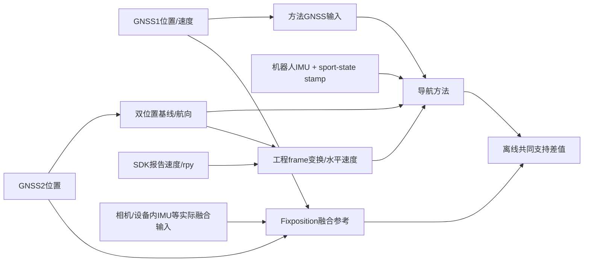

# TIM测量链、事件对齐与不确定度模型（2026-10-05）

本块是基于已证软件合同与新增作者声明的测量模型及待验证预算，不是已完成的校准。只读取既有文件/公开网页；没有读取新的raw/reference载荷、运行科学模块或绘图；原V3与后续诊断结果不变。公开接口版本、名义机械模型、现场量测和软件参数各自保持身份。

## 1. TIM需要回答的测量问题

截至本次访问，TIM要求创新主体落在仪器与测量；测量链及验证须足以理解其性能。把数据集RMSE称为仪器不确定度不符合其明确说明。本项目可研究“短基线航向与机器人报告速度在共用GNSS来源、异步时钟及不完整外参证据下的条件测量性能”，但提出预算方程尚未证明预算数值有效。官方页面没有规定必须重跑全部6468格；也没有规定所有导航论文只能采用某一种参考设备。[TIM官方作者指南](https://ieee-ims.org/publication/ieee-tim/information-authors)

VIM要求先明确被测量，并以取得的信息描述其值的分散；校准还须建立带不确定度的标准与仪器示值关系。本次配置参数、CAD模型和历史残差调参都不能自动满足这一定义。[被测量](https://jcgm.bipm.org/vim/en/2.3.html)、[不确定度](https://jcgm.bipm.org/vim/en/2.26.html)、[校准](https://jcgm.bipm.org/vim/en/2.39.html)

下列量须分开报告：

|量|明确的定义|当前可支持的层级|
|---|---|---|
|位置|指定GNSS标记历元、指定导航frame中GNSS1天线相位中心的位置；转到IMU或FP输出点时另列模型|既有结果按已声明物理点/配置运输；实际相位中心与外参不确定度未闭合|
|短基线航向|已指定天线顺序、安装轴与水平投影的方位角；单位rad，展示可转deg|position-derived heading；不是新载波模糊度估计器，也不自动等于Euler yaw|
|机器人辅助速度|从SDK报告速度通过工程变换得到的N/E两分量|输入frame/点位及内部融合尚未获实机证据；不能称独立腿部FK速度|
|对参考差值|同历元、同点、同角量定义、同支持下的方法输出减商业融合参考|经验agreement；不是已经分离方法误差和参考误差的绝对accuracy/U|

数学中n为NED，b为FRD，C_b^n为body到navigation的旋转。若使用SDK的FLU假设，M=diag(1,−1,−1)作FLU→FRD。坐标假设不是实机frame校准。取δτ=t_acquisition−t_nominal；本块时间敏感度的正号均按x(t+δτ)−x(t)定义。右乘小旋转定义为C_true=C_nom Exp([δα_b]×)，δα_b的单位为rad；不是对原C++PHI约定已经完成映射证明。

## 2. 当前实际输入和参考血缘

已读项目parser从SportModeState外层stamp读取时间，IMU子消息没有独立stamp字段。作者确认IMU使用机器人时钟、GNSS使用GNSS时钟；采用踢动后的接收机位置/速度及机身IMU变化来选择起点，观察对象不是商业融合轨迹。CAD被作者确认对应同一次安装结构；相机侧朝前。这些是有归属的作者事实，未给出每段offset/drift、消息latency、安装小角度或敏感中心的不确定度。

此图表示已知共享来源与当前工程依赖，不表示所有Fixposition融合输入在每个历元均接受。camera朝前及设备存在camera不能使共享GNSS参考变为独立truth；须以实际status/配置核每段模式。详细接口身份见`OFFICIAL_INTERFACE_AND_AUTHOR_FACTS.md`；安装证据见`../installation/INSTALLATION_EVIDENCE_REVIEW.md`。

新八包userio-raw的同伴解析汇总已保存实际FP_A-TF v2消息：各包POI/VRTK之间均为零平移、单位四元数，原消息ASCII checksum检查无失败。本块全文阅读`../data_and_selection/RECORDED_FP_TF_SUMMARY.csv`的17行；不重复读取raw。identity逆向仍为identity，因此该结论不依赖把parent/child方向颠倒。它关闭这八包的POI/VRTK名义输出frame配置问题；不证明旧BY2/H/O同配置，也不关闭robot IMU→VRTK→antenna相位中心的量测链。

新八份body日志的同伴机器profile已给出stamp连续性及quat/rpy数值自洽诊断，本块只阅读其汇总。把秒数解释为UTC所得的日期相合、stamp单调或wxyz转换自洽，分别支持数值格式解释；均不证明跨设备时钟同步、真姿态、SDK速度物理frame或独立性。不得把未注册的新八份日志自动当BY2/H/O对应文件。

## 3. 双时钟与事件对齐的可识别性

### 3.1 软件配键不是同步证书

令s=sec+10⁻⁹nanosec，是body outer-stamp的数值；只把GNSS标记时轴记为t_G，不声称已建立UTC/SI溯源。相对时钟的候选仿射模型为

$$t_G=h(s)=s+b+d(s-s_0). \tag{C1}$$

b单位s；d是相对频率偏差（无量纲；显示为ppm时乘10⁶）；s_0是固定中心时刻。解析合同中的base_time减法和配置offset只给出软件采用的变换；不能据此宣布真实b或d已估得。

令t^G_k、s^I_k分别为GNSS接收机P/V与机身IMU上所选事件marker的记录时标；定义ΔL_k=L_G,k−L_I,k为两路时标对应的输出/滤波延迟差，ΔM_k=M_G,k−M_I,k为同一操作在两路观测量上出现的物理响应/起动定义差。则一阶观测模型为

$$y_k=t^G_k-s^I_k=b+d(s^I_k-s_0)+\Delta L_k+\Delta M_k+\epsilon_k. \tag{C2}$$

ε_k包括人工选点、采样及marker提取误差。ΔL/ΔM为带符号的差，不是必定正值。GNSS位置、速度与IMU加速度/角速度具有不同导数、带宽和机械响应；“峰值重合”没有普遍物理保证。到达/写盘时刻也不能直接代替传感器采样时刻。

一个marker只提供一个方程，不能同时识别b与d。若假设d=0，可求一个包含ΔL、ΔM的有效起点差b_eff；在延迟和响应未独立确定时，它不是纯clock offset。两个分开的marker在延迟模型已知或恒定等额外假设下才可拟合斜率；若延迟随时间变化，其变化仍可与drift混淆。marker数量增加不自动解除这种混淆。

对每段记录须保存：原始两路时标、选点区间与规则、操作者、是否每段独立选点、实际采用的b_eff/base_time/offset、是否只截公共起点而未作校正、时钟reset/重复/丢帧区间。BY2/H/O对应事实目前未逐段闭合。只在方法执行前用接收机P/V与IMU作事件配键，和在离线评价中用参考轨迹拟合最优delay是不同协议；后者不能在同一测试段上声称未调参。

### 3.2 时间误差进入被测量

令真正采样时刻相对名义映射的残差为δτ。若把其各项定义成“true−nominal”的带符号残余校正，可写

$$\delta\tau=\delta b+(s-s_0)\delta d+\delta\ell+\delta m+\delta e,
\quad u_\tau^2=q^T U_\eta q,\quad q=[1,s-s_0,1,1,1]^T. \tag{C3}$$

η=[δb,δd,δℓ,δm,δe]^T；δℓ/δm不是不经换号就照搬C2的ΔL/ΔM，而是采样映射中剩余的延迟/响应修正。完整U_η必须保留与clock拟合量的cross。其clock部分为u_b²+(s−s_0)²u_d²+2(s−s_0)cov(b,d)。若marker误差已传播入U_bd，不能又将同一marker方差独立加一次；若分项处理，应使用完整联合模型防止重复计数。

$$\delta p\simeq v\delta\tau,\qquad
\delta v\simeq a\delta\tau,\qquad
\delta\psi\simeq\dot\psi\delta\tau. \tag{C4}$$

这些是指定比较方向下的局部敏感度，不是已有误差数值。时间量和位置/速度/姿态可能相关，不能只对所有输出加一个独立时间噪声。采样间隔可算，但Δt/√12只在有依据的均匀量化假设下成立；本块没有使用这一分布假设生成预算。

异步两天线位置还给出

$$\tilde b\simeq b+v_{A2}\delta\tau_2-v_{A1}\delta\tau_1+e_2-e_1. \tag{C5}$$

共同平移只有在真正共同历元及相应运动条件下才会抵消。clock差会把机身运动引入短基线，接收机配对规则须连同其signed时间差报告。

## 4. 短基线航向：水平投影与交叉协方差

在明确的有向基线b=p_A2−p_A1及其安装约定下，采用

$$\psi_\perp=\operatorname{atan2}(b_E,b_N)+\pi/2,\quad r^2=b_N^2+b_E^2,
\quad j_\psi=[-b_E/r^2,\ b_N/r^2,\ 0]. \tag{H1}$$

π/2与天线顺序/机体−y轴约定绑定；换天线或换轴不能保留该常数而称等价。若−y刚体基线与ZYX Euler角约定匹配，投影角与Euler yaw的差为atan2(−sinθsinφ,cosφ)。这是有条件的几何关系，不证明实际安装旋转已知；本块不重算原yaw成绩。

$$U_b=U_{22}+U_{11}-U_{21}-U_{12},\qquad
u_\psi^2=j_\psi U_b j_\psi^T. \tag{H2}$$

U_ij=cov(e_i,e_j)，所有位置项单位m²，uψ单位rad。若时间/安装误差已在U_b中按完整模型传播，不重复另加。相同改正、环境及共享解算可以产生U_12；只有两路边际cov无法唯一恢复cross，不应默认0。两路共同误差可能在基线中部分消去，相关性方向和大小仍需证据。

r→0时j发散，纯数学非零门不等于实用航向可用性。可用条件应由应用预先规定的uψ目标、错误fixed风险及实际支持共同定义；例如在预算可信后检验jU_bj^T≤uψ,target²。原native近垂直数值门与固定heading std不提供这种验证。R5是构造recipe，BOTH_FIXED是接收机质量状态，二者不能把固定std变成物理校准量。

Starter Kit的0.350m、CAD组件原点距离、RTK推导中值与真实相位中心长度是不同比较对象。厂商1m基线的航向规格和3cm外参配置要求不能代替本装置的不确定度。错误fixed/天线顺序错误/未识别frame属于模型或混合状态风险，仅对“正确固定”历元做小扰动传播不覆盖这些风险。

## 5. SDK速度：联合姿态、比例与时间传播

原HV软件合同可写为

$$z_H=k S\widehat C Mv_{SDK},\quad S=\begin{bmatrix}1&0&0\\0&1&0\end{bmatrix}. \tag{V1}$$

此处Ĉ是工程proxy：以预生成A1投影航向及SDK roll/pitch构造旋转，其中冻结代码使用负SDK pitch；它不是已校准真实姿态。原native N01的后续修正没有反向改写这个provider。SDK velocity在IDL中没有frame/POI/cov字段；未证frame方向不能仅用一个小的Gaussian角噪声掩盖，应先识别离散的模型选择。k是工程比例值，历史残差拟合不是标准校准。

在所声明右乘body小角下，令w=Mv_SDK，可得

$$A=kS\widehat CM,\quad B=-kS\widehat C[w]_\times,\quad c=S\widehat Cw,
\quad \delta z=A\delta v+B\delta\alpha+c\delta k+\dot z\delta\tau. \tag{V2}$$

$$U_z=J U_x J^T,
\quad x=(v_{SDK},\delta\alpha_b,k,\tau),\quad J=[A\ B\ c\ \dot z]. \tag{V3}$$

其速度/姿态部分包含AU_vvA^T+BU_ααB^T+AU_vαB^T+BU_αvA^T；比例、时间及它们与前两量的cross也须保留。SDK rpy与velocity可能出自同一内部估计器；HV还借用A1，因此其与GNSS/方法prior的相关性另需检查。若将z_H作为滤波measurement，单独给U_z还不足以证明measurement与prior独立。公开IDL没有披露这些cross或内部融合算法，不能由“不同字段”推出独立。

若SDK报告速度的物理点与目标点不同，还需刚体点速运输。不能把未知POI只作为速度噪声忽略。

## 6. 外参、点位与模型边界

$$p_P=p_I+C\ell,\qquad v_P=v_I+C(\omega_{eb}^b\times\ell),
\quad J_P=[I,\ -C[\ell]_\times,\ C,\ v_P,\ldots]. \tag{P1}$$

J_P的示例状态顺序是(p_I,δα_b,δℓ,δτ,…)；它与V3的x排序不同，须按对应量组装，不可直接复制矩阵列。位置cov为J_PU_jointJ_P^T。ℓ单位m，δα单位rad；安装、姿态、位置、clock及cross须有记录。相机侧朝前不能闭合机器人IMU→FP sensor→输出POI→天线的整条变换链。单独收到的tf-static三条edge没有闭合sensor→POI/天线；新八包userio-raw中的实际POI/VRTK identity补足了这八包的一段配置edge，仍没有关闭robot IMU外参和天线相位中心，不用默认零补其余缺项。

本轮继承的源码审查显示RV/RD杆臂补偿使用bias/scale补偿gyro增量除dt，并未显式扣Earth rate；这近似于ω_ib而非已经证实的精确ω_eb。原V3还保留N08切空间reset近似及N17截断Earth耦合状态模型等边界。代码矩阵正定/测试通过不等于全动态模型误差或协方差校准已闭合；本块不修源或用诊断版本取代原V3。

## 7. 共享参考的差值模型与可报告结论

对同点、同时标、同量定义的差d=z_m−z_r，

$$d=e_m-e_r,\qquad U_d=U_m+U_r-U_{mr}-U_{rm}. \tag{R1}$$

U只描述相应误差分散；若有未校正均值μ_d，MSE还包含μ_dμ_d^T。RMSE是该评价支持上的平方误差指标，不是自动得到的standard U。对两方法在完全相同支持上

$$E\|d_1\|^2-E\|d_2\|^2=
E\|e_1\|^2-E\|e_2\|^2-2E[(e_1-e_2)^Te_r]. \tag{R2}$$

共享reference的平方项虽在这个相同支持的差中抵消，cross并未抵消；RMSE更不能线性相减来“扣掉参考误差”。若支持不同，连共享平方项也不能按同一均值抵消。仅观察d不能唯一辨识U_m、U_r、U_mr；既有残差小不构成独立accuracy证明。

现有数据能整理时间间隔、输出支持、基线投影、软件Jacobian、declared参数与模式等可观察事实，并给假设敏感性或界限。未验证输入分布/cross时，Monte Carlo只会传播假设，不会把它们变成现场校准；正确fixed的小扰动Gaussian传播与wrong-fix可用风险也应分开。

## 8. 现在交付什么，下一步需要什么

`INPUT_UNCERTAINTY_BUDGET.csv`是一张可填预算台账：未知项标NOT_ESTIMATED，不以0代替。`MINIMAL_VALIDATION_PROTOCOL.md`给出最少记录、可识别性条件和事前接受标准；不是本次已执行实验。`METHODS_INSERT_EN_AND_ZH.md`可用于正文，明确当前事实与后续验证。

优先完成接口/实际配置/每段事件记录，再做时钟与几何量测；随后在未用于参数选择的记录上检验预算及共同支持agreement。相关性不能独立估得时给基于明确假设的bounds，并保留agreement结论；不为论文声称完整校准强行填数字。

GUM的联合输入与相关传播为本块方法论依据，方程C1–R2是项目条件下的建模推导，不是从厂商规格抄来的标定结果。当前BIPM目录含JCGM100:2008及2026非线性修订、101分布传播、102多输出与GUM6测量模型；本块不声称全文重读这些出版物。[官方JCGM入口](https://www.bipm.org/en/committees/jc/jcgm/publications)
