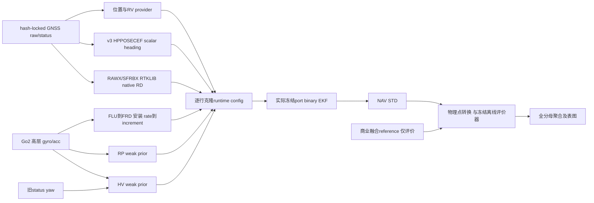

# LegSA-GINS 代码科学审查（阶段性实质交付）

**已有可复现科学/软件缺陷，不能给正式算法整体PASS；本报告也不宣称全仓逐行完成。** 冻结正式二进制、实际配置与回显、评价器的身份已核实；正式port原生代码、输入链关键模块、raw_gnss全模块、部分运行/聚合/评价已完成语义审查和必要实函数/原生验证。四段XB完整扫描与现有GNSS-only全窗调用均已结束，保留无解与失败。正式求解器、raw、冻结输入/输出没有修改。审查完成度、候选修复完成度、试跑与论文有效性四者分开。

## 1. 已证实的主要问题及影响

|问题|触发与本轮证据|影响边界/处置|
|---|---|---|
|GNSS全失效使辅助更新失去调度 N09|冻结旧binary和当前binary完整config→loader→runtime；有效RD/RP/HV各10更新，GNSS validity全零时各0；仍100个有限NAV|会破坏“辅助在全部GNSS失效时继续独立更新”的解释。修调度候选后须新协议重跑受影响实验，本轮未动正式版本。|
|SA NIS不使用实际顺序创新 N12|dz=1,Hdx=1,S=2，应0，实际0.5；真正EKFUpdate却用dz−Hdx/Joseph|权重/拒绝决策可能与实际创新不一致。不能把日志NIS当正确创新统计，也不能因此宣称所有旧NAV已发散。|
|异步杆臂速度用未补偿当前IMU N11|纯gyro bias反例在res1产生0.152882m/s假杆臂速度；res2补偿后为0|与非零杆臂、bias/scale和异步分支有关；需绑定实际采样关系重评。|
|缺失数值变零观测 N15/P-IN-05|native RP/RD缺字段仍实际更新一次；Python helper CSV NaN可转0并保留available|缺测不等于零。优先做fail-closed候选；当前已归档provider是否含坏字段尚未全查，不能倒推历史触发。|
|Matrix/wrap/inverse/IO/cov防护 N04–07/N13/N19|二维列越界改下一行；Inf/1e308 wrap timeout；缩放良态矩阵误拒/NaN传播；writer失败未抛；不定P或非对角NaN仍health PASS|边界缺陷确认，不表示正常输入都触发。隔离候选只修Matrix/wrap，正常输入回归不变；其余未修。|
|输出全窗与评价恢复身份门 CTL-01/03|请求[0,100]s仅t=10s一行仍通过；恢复row未绑定output_seal NAV SHA/方法，有原函数合成反例|确认门控缺项，未证明历史实际截断/错配。旧结果需先只读绑定核查，不能用这些反例推断全部NAV有误。|
|横向投影方位+90°不是一般Euler yaw N01/N02|当前扰动独立推导+原生组合倾斜FD；roll=.3,pitch=.4 时偏差−6.868822°，H遗漏最大.376796；上游provider没有倾斜补偿|标量模型在小pitch/特定姿态是近似。不能默认换B3就更优；旧实际姿态影响未重算。|
|非L1波长、旧Python LS方向 RG-01/02|直接调用原函数；多频信号的波长返回错误或None；物理距离导数oracle真NED[1,−2,−10]被算成近似反号且残差极小|已找实际caller；当前正式RD用native RTKLIB，不经过这两个旧Python计算路径，不能归罪所有正式RD结果。|

全部裁定含真实路径、行号、触发、测试/静态证据、影响方法、建议和未验证项，见 [FINDINGS.csv](FINDINGS.csv)。这是合并裁定行，包含反证、条件风险和重叠发现，不是独立严重bug的计数。单靠单元测试通过也没有将任何模型升级为论文有效性通过。

其它已确认缺项与条件风险包括：传播F省略Coriolis/重力等导数的短时近似；反馈后P重置的高阶约定；RV/RD bias/scale导数；RP大pitch限幅；HV关闭垂向的999哨兵进入权重；共享测量互相关；参考gap/重复/RP插值；部分输出被称全窗；case bootstrap的推断单位。完整推导与量级见 [NATIVE_REVIEW.md](NATIVE_REVIEW.md)，不能用“参考实现如此”作证明。

反证包括：B3 H符号与单基线零空间正确；位置H初筛误差来自不合适FD步长，换合理步长收敛；小pitch scalar yaw的符号和角度跨界正确；Joseph/零杆臂RV在局部已知噪声试验内一致；当前v3聚合保留失败分母且不把失败填0。反证均有适用范围，不等于全系统通过。

## 2. 代码总量与真实审查深度

库存基线是隔离分支起点 `eb3cbed314693358c7c38442b6fbbb7afcf0342e`。初始3,085文件/552,271行，后续仅追加遗漏的25个配置CSV与9个自有补丁文本、保留全部旧已审标记，修订为 **3,091个tracked + 28个原工作树未跟踪代码/配置 = 3,119文件，554,133物理行**。其中Python 2,756文件469,959行、C++/hpp 154文件22,356行、YAML 130文件48,096行，其余为配置/构建/脚本/补丁。计数边界及追加收据见 [CODE_MAP.md](CODE_MAP.md)。不是去注释后的LOC；配置/测试也纳入分母。submodule第三方源树另记录，未假称逐行审完编译器、Eigen或整个RTKLIB。

<!-- COVERAGE_CURRENT -->
当前完成全文语义审查 **248文件、40,419行（按文件7.95%，按库存物理行7.29%）**；14文件仅部分函数组，40个既有测试文件只执行或选定函数执行而未完成全文语义审查，2,817文件未读。后面三类共2,871文件未完成全文语义审查。已识别自有C++的154文件/22,356行及两个CMake共111行已全部语义审查；外部自有8文件仅静态审查，本轮没有动态运行。冻结外部评价器421行另审，不塞进当前源码分母；本轮新写审查代码36文件/3,957行另表。
<!-- /COVERAGE_CURRENT -->

[CODE_REVIEW_COVERAGE.csv](CODE_REVIEW_COVERAGE.csv) 逐文件保存身份/行数/关系/用途/调用者/依赖/输入输出/实际深度/说明/问题ID；未读文件的这些语义项仍明确PENDING，**这本身就是未完成工作，不用自动AST填词冒充完成**。完整函数/关键连续组说明分别在原生、OTHER、EXTERNAL、RAW_GNSS、SHARED_SENSOR、FORMAL_CONTROL、CONTRACT、PYTHON_INPUT和PYTHON_EVALUATION报告。逐条receipt合并，不重跑inventory清空已审标记；执行测试不升级语义深度。

[REMAINING_REVIEW_QUEUE.csv](REMAINING_REVIEW_QUEUE.csv) 按模块汇总全部未完成文件；包括大量paper_rebuild测试/配置、horizontal_literature其余自有适配、脚本、reporting/evaluation、Go2 prior、FGO/feedback以及历史自有控制代码。历史标签没有豁免语义审查；本轮仅将其旧性能排除为新性能证据。当前缺口远不止几个小工具，不能说“核心链审完就等于整仓完成”。

## 3. 版本和真实方法身份

实际工作基线来自 `stage/clean3-math-repair` 的eb3cbed，原工作树tracked干净、29个原未跟踪项保留；新分支 `audit/code-xbpg-20260105-20261001` 独立worktree。入口ACTIVE_CONTEXT明确SUPERSEDED，不以历史正文替代最新协议与本轮授权。没有切main/reset/stash/clean，也没有把原未跟踪脚本自动提交。

|角色|身份与关系|
|---|---|
|审查当前源码|eb3cbed，cpp tree `9de8416699df24e7924c5eab28fce140eeea2925`；本轮原算法源码不变|
|正式留存binary|SHA256 `96ae436d82ba8922c68382bd73fc42c8bf4bcb22d72a43a8bd05f506043a9c1c`；freeze code `ca73cb1fb48a020fd2a450d79e520562c34eeb24`，不能用HEAD倒推|
|当前源码新Release binary|`cbf554baf9c83490e40b207b97f04ef77f51d9962f7bce463f1e644416ef789e`；含B3可选接口，默认关闭|
|正式v3 runner|保留记录code `7d43b9af26120ed5dde21f53e515386361072ba6`，5个C00实际config live hash与record一致|
|冻结评价器|`aa0492482b6467cdd701bc8882aca11c4170bbe2e7c6bb5f932679dc204978da`，本轮实际文件hash和源码复核|
|隔离数值候选|见NATIVE_CANDIDATE_RESULTS/patch；仅scratch副本Matrix+wrap，未装到正式target|
|XB GNSS-only|另有rnx2rtkp/convbin/native helper source/compile/config身份与每次输入/输出hash；不沿用LegSA/F04标签|

完整SHA/配置值/实际native echo/已记录provider hash列在 [METHOD_IDENTITY.csv](METHOD_IDENTITY.csv)。provider列明确`RECORDED_HASH_ONLY`：本轮没有重复大盘hash或假装已重建全部正式历史provider。从原始观测到所有历史provider的完整生成lineage、独立性和未跟踪实际依赖仍有未闭合项；因此**身份链局部已闭合，端到端科学有效性未彻底闭合**。

|唯一方法|位置+IMU|RV|scalar heading|RD|RP|HV|SA|实际区别|
|---|---|---|---|---|---|---|---|---|
|F01|是|是|否|否|否|否|否|single antenna EKF|
|F02|是|否|basic|否|否|否|否|加入basic yaw同时移除RV|
|F03=A02|是|是|robust scalar|否|否|否|否|AB0000；与F02还改变yaw分支|
|A04|是|是|robust scalar|是|是|是|否|AB1011|
|F04=A01|是|是|robust scalar|是|是|是|是|AB1111|

这些正式行的B3、QM、QA fallback、FGO feedback均关闭。F01→F02→F03不是严格单项递增，不能用该梯度图编造单因素消融因果。F04是v3 raw HPPOSECEF双fixed scalar，不是baseline3d正式结果；保留标签同名不意味着二进制/数值相同。

## 4. 从输入到表图的实际链

各节点单位/状态变化/异常路径见模块审查。IMU文件是增量非rate；位置BLH(rad,rad,m)/误差NED(m)，速度NED，body FRD，Cbn主动body→nav、wxyz、ZYX。杆臂须分别覆盖IMU→GNSS APC和IMU→评价POI，不由一个“baseline长度”替代。RV/PVT、RD/RAWX、RP/HV/Go2弱先验、位置/状态质量元数据源分别追踪；同硬件/上游滤波的相关不能靠不同字段名消失。

正式config是自有逐行parser，不是完整YAML。原生测试覆盖科学计数/负数/布尔/列表/重复键/未知键/注释/中文路径与截断。参数最后生效值以loader/profile override及native echo为准，SA alpha有连续覆盖赋值；CSV std存在不代表被用于最终R。不得以YAML round-trip重新格式化冻结文本，也不能凭新增一个看似合法YAML字段认为solver支持它。

当前若干manifest的false是声明或options回显；本轮9次GNSS-only调用另外实际核查strace无reference open，但这不能替代所有历史provider的上游无泄漏证明。原生合成测试的“real/trace opens=0”是合成fixture调用范围声明，不冒充同样的OS访问计数。

## 5. 独立数学、验证与候选

[NATIVE_REVIEW.md](NATIVE_REVIEW.md) 给出当前左乘导航误差、反馈符号、21维F/G/Q/Phi、全部启用观测h/residual/H/R、倾斜/退化/天线反序及协方差相关推导，逐矩阵/索引列行定位。NIS门控与最终Joseph使用的R/S须分开；source-aware metadata仅以实际传入字段为准。P正对角不是PSD，health PASS不是Cholesky证明。P reset缺失按当前误差约定列为有限角近似风险，没有仅凭函数名判全局错误。

实际构建链接了完整正式target，既有相关测试21通过；不是只编译types/rotation。还运行了config/file-loader集成、静止/平移/组合倾斜转动/全GNSS中断、FD步长扫描、异常/非有限/二维索引/超时、四种集成状态健康和热路径计时。2000独立已知噪声试验仅检验零杆臂3维RV/Joseph，mean NIS2.98646、NEES3.04688；未声称完成全21维非线性NEES或门控后卡方验证。真实商业reference从未充当NEES真值。

当前/冻结binary在6 toy模式18个输出及2 config用例6个输出相同；候选在6 toy模式18个输出相同，正常角20,001个回归点逐字相同。文件/断言/样本点数都不充当独立场景数。候选对巨大有限角返回有限、非有限/越界抛异常；上层实际classifier6测试将新异常保持不可分类/受控hard-stop，而非成功。候选到正式controller完整异常注入尚未执行，候选也未触及XB。

本轮最终新Python审查测试60 passed / 59 strict-xfailed、退出0；另一个既有合约测试组1 failed / 9 passed / 4 strict-xfailed、退出1（旧7路径键断言与当前11键样例失配，保留不修）；这些xfail证明未修复旧缺陷，不能宣称CI全部科学正确。开发中两次fixture失败、缺openpyxl技术修复、输出分类改进均保留说明；详细命令、互有重叠的测试组与收据见 [TEST_RECEIPTS.json](TEST_RECEIPTS.json)。原生观测器exit0表示完成观测，不意味着所检查旧实现都满足断言。

## 6. 上轮13项的最终裁定

|项|本轮裁定|补充闭合|
|---|---|---|
|1 横向+90 vs Euler|已确认缺陷（一般姿态模型不一致）|provider全文检查无倾斜补偿；旧实际数值影响未重评。|
|2 scalar H|条件性风险/近似|倾斜导数遗漏量化，小pitch/跨界正常反证。|
|3 B3|H错误说法已反证；R条件性风险|正确单基线零空间不证明pAcc独立各轴或真实性能。|
|4 Matrix|已确认缺陷|二维越界原生反例；候选仅隔离修复。|
|5 wrap|已确认缺陷|±Inf/巨大有限值timeout；候选正常回归。|
|6 inverse|已确认缺陷|绝对pivot阈值/非有限防护；未优化正式实现。|
|7 Euler近奇异|已确认缺陷|88/89度恢复矩阵误差，真正90度分支可恢复。|
|8 P reset|条件性风险/近似|按左乘约定推导J_l；尚未量化真实校正尺度。|
|9 nearest/调度|已确认缺陷|未来/重复aux、全GNSS失效aux0，另有端点刷新限制。|
|10 跨源相关|条件性风险/近似|位置/heading/RV/RD及Go2内部状态共享信息；不宣称R inflation自动保证一致。|
|11 v3旧HV/std|条件性风险/近似（数据流事实已确认）|只换主heading，HV仍status方向和原std，未声称整链独立换源。|
|12 BY2O选择/共参考|条件性风险/近似（选择参与已确认）|v3 validity、LC01结果后修订有Git/合约证据；共享reference交叉项不抵消。|
|13 候选异常/回归|有限正常回归已确认；端到端候选controller证据不足|实际classifier已测6种错误字串，未装候选到正式流程。|

第11–13项补证、选择是否预先及共享参考排序反例见 [SELECTION_AND_REFERENCE_REVIEW.md](SELECTION_AND_REFERENCE_REVIEW.md)。没有把明确post-hoc选择重命名盲测，也没有把已声明后验修订说成隐瞒调参。

## 7. 四段XB与旧实验处置

四段88文件全量解析，配对S1/xb1…S4/xb4且其它交集为0。默认20个主槽因物理输入资格未满足保留NOT_RUN；**F01独立受安装/APC/Go2采集时钟与初始化基准限制，不因双fixed为0阻塞**。可解释的既有receiver-only RTK/RD均已完整记录调用，三段RTK无解，S2仅7/1882历元、1.2秒，RD全部无速度。详见 [XBPG_DATA_REVIEW.md](XBPG_DATA_REVIEW.md)、[GNSS_EXPLORATORY_RESULTS.md](GNSS_EXPLORATORY_RESULTS.md)、RUNS/METRICS及4张真实图。

需要优先重审/未来重跑的是：全部GNSS停更仍声称aux维持的结论；SA NIS解释及受其权重影响的比较；大倾斜scalar模型；把STD当完整POI/Euler置信度；未给失败/截断分母的精度；F01/F02/F03单因素因果与盲测表述。改代码后的数值必须新版本/新协议运行，不覆盖旧表。仅元数据/标签问题先追加审计更正，并非必须重跑solver。

未被上述反例直接推翻的：正常输入所测Matrix/wrap回归、原生位置H与B3 H符号、局部Joseph/RV一致性、保留binary的数值身份。Python旧LS/非L1波长/其它target缺陷不可直接移植为正式port缺陷；RTKLIB既有工作也不被其他方法问题自动否定。v2.1恢复评价还需按CTL-03重新核对NAV/方法/评价器身份，输出完整性按CTL-01/P-EVAL-04核对首尾与缺口；确认错配或截断后再决定是否需要重评或新版本重跑。哪些具体旧case实际触发、影响几米/几度仍UNKNOWN；本轮没有重跑Canonical-541来编造答案。

## 8. 未完成与最小续作

1. 按剩余队列继续全部自有Python、配置、测试和历史控制代码的语义审查；不以已完成原生链代替全仓完成。
2. 先建立独立候选的invalid-input/调度/NIS修复与正常输入回归；正式分支仍不直接替换。补21维长时Monte Carlo、P reset/传播近似的量级验证及外层异常分类。
3. 用采集版本、此次mount记录和设备同步证据闭合四段Go2→APC/POI关系；不要从reference误差反推。物理条件闭合后先冻结F01的独立迁移协议，再考虑有资格的其它模块。
4. 为RD编译星座能力和星历/有效卫星无解原因作独立软件诊断；不因当前GPS/SBAS helper无解判原始全部没用，不把不同编译/星座结果替换首轮主记录。

三篇目标文献完整复现/公平比较仍未完成；本轮仅审已有外部适配身份和缺口，没有启动新全矩阵或写三篇稿件。没有ZIP交接包、raw清理、主分支合并、release或强推。
