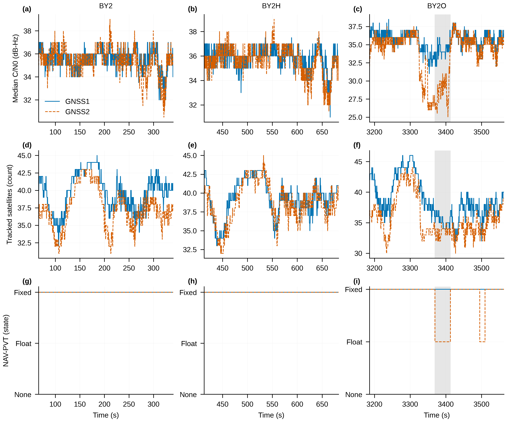
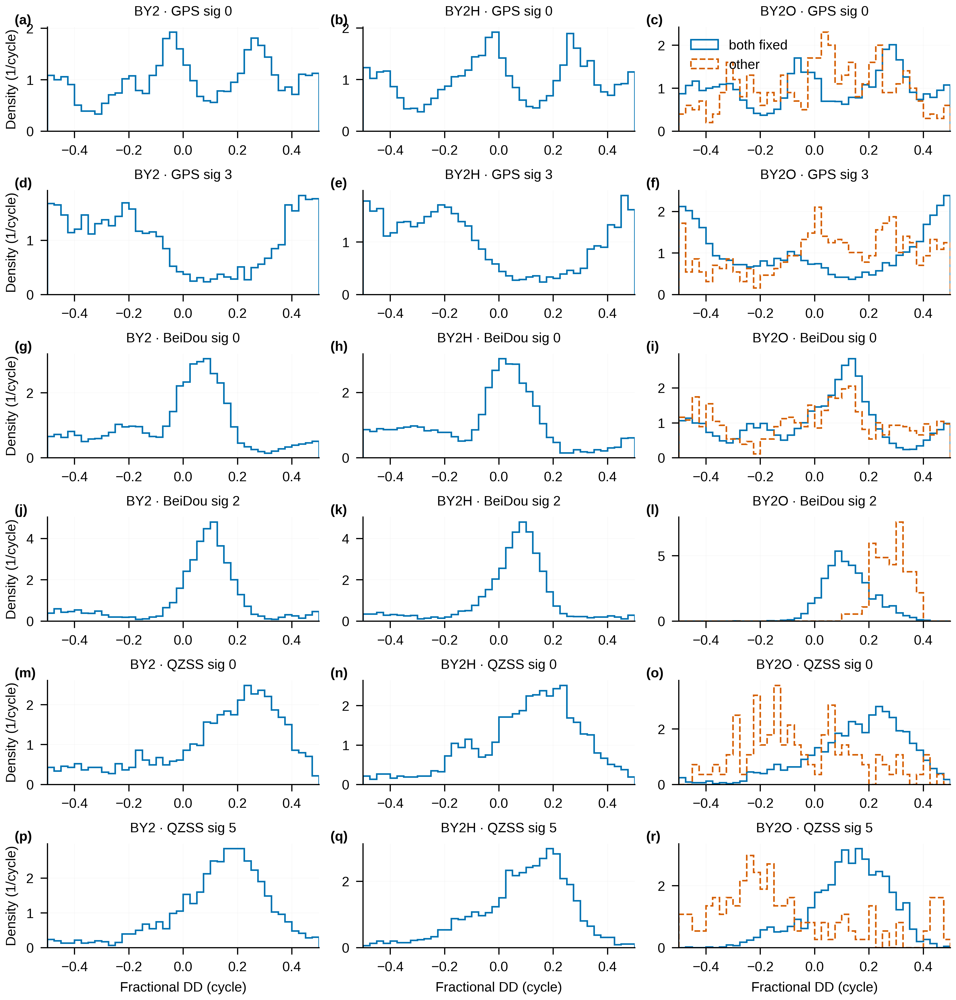
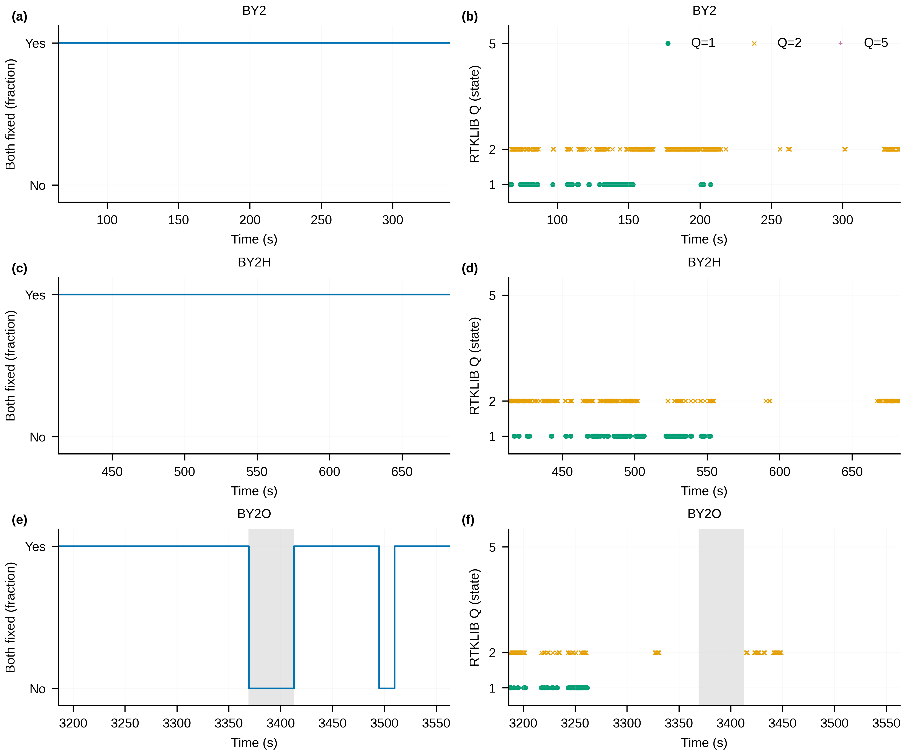

# DG-01 原始 GNSS 观测诊断与 RTKLIB 配置审计

状态：诊断及交付检查完成；仅陈述观测事实，不作方法适用性裁决。登记提交 `ceb00f2925ddd9e721fd05fe91392a9bf080e3a0`；结果提交为本文件所属提交，最终回贴给出确切哈希与 push 回执。

## 0. 边界、输入与分母

LegSA 解算/评估、provider、外部原生、RTKLIB 重跑均为 0；参考原始轨迹读取 0。三序列现有 RINEX 齐全，未重建、未调用 bridge。所有数据读取经过原始哈希或输入清单登记；没有读取 trace/.bag/.fpl 文件。G: 只写 DG01 目录。原始文件开始和结束核验 12/12；既有未跟踪 29/29 保持原样，提交前后另作 Git 复核。

HX02 实际根为 `<CLEAN_ROOT>/stages/CLEAN9_EXTERNAL_COMPARISON/HX02_FIVE_CATEGORY`。时窗及 base_time 见 DG01_REGISTRATION.md：BY2 [66,340]、BY2H [413,683]、BY2O [3186,3563] s。这里 NAV 的闭窗与 RAWX 的小数时标不强行改成同一历元分母。源文件别名由本地 DATA_PATHS 配置解析；逐文件 SHA256 见 DG01_INPUT_SHA256.json。

## D1. 消息与 NAV-RELPOSNED 身份

原始流消息逐类型数量/速率，以及 status 每个字段的非空数量均在 DG01_MESSAGE_INVENTORY.csv（sequence、receiver、stream、message_or_field 唯一定位）。以下为主要 UBX 消息窗口计数，窗口按导出消息 stamp 裁切；后文解码 NAV 使用 iTOW 观测时标，因此端点计数可相差一行。完整清单保留其他 UBX/NMEA 消息。

| sequence | receiver | UBX-NAV-PVT | UBX-NAV-RELPOSNED | UBX-NAV-SAT | UBX-NAV-SIG | UBX-RXM-RAWX | UBX-RXM-SFRBX |
| --- | --- | --- | --- | --- | --- | --- | --- |
| BY2 | 1 | 1370 | 1370 | 1370 | 1370 | 1370 | 4611 |
| BY2 | 2 | 1370 | 1370 | 1370 | 1370 | 1370 | 4499 |
| BY2H | 1 | 1350 | 1350 | 1350 | 1350 | 1350 | 4573 |
| BY2H | 2 | 1350 | 1350 | 1350 | 1350 | 1350 | 4591 |
| BY2O | 1 | 1885 | 1885 | 1885 | 1885 | 1885 | 7376 |
| BY2O | 2 | 1885 | 1885 | 1885 | 1885 | 1885 | 6212 |

UBX 长度/checksum 失败帧共 28，出处同清单该列求和。字段解码遵循 [u-blox ZED-F9T 接口说明](https://content.u-blox.com/sites/default/files/ZED-F9T_InterfaceDescription_%28UBX-18053584%29.pdf)。

NAV-RELPOSNED 在两机均存在。下表长度是其消息内 relPosLength，未与参考比较。其量级约为公里，并非 0.35 m；基准站 ID 也保留。因此不能把消息名称或 heading-valid 标志直接当作机载两天线短基线航向。全部 carrSoln、长度差分布及最大绝对偏差见 DG01_RELPOSNED.csv。

| sequence | receiver | NAV_epochs | RELPOS_median_m | RELPOS_heading_valid | RELPOS_refids |
| --- | --- | --- | --- | --- | --- |
| BY2 | 1 | 1371 | 3055.467 | 1371 | 391 |
| BY2 | 2 | 1371 | 3055.576 | 1371 | 391 |
| BY2H | 1 | 1351 | 3054.912 | 1351 | 391 |
| BY2H | 2 | 1351 | 3054.981 | 1351 | 391 |
| BY2O | 1 | 1886 | 3040.560 | 1886 | 391 |
| BY2O | 2 | 1886 | 3040.814 | 1886 | 391 |

来源：DG01_OVERVIEW.csv 同序列/接收机行；相对长度为 m，valid 列是计数，分母为 NAV_epochs。

## D2. 单机质量与双 fixed 状态

| sequence | receiver | raw_epochs | raw_signal_rows | cno_p05 | cno_median | cno_p95 | lock_resets | cp_overflow | RINEX_LLI0 |
| --- | --- | --- | --- | --- | --- | --- | --- | --- | --- |
| BY2 | 1 | 1370 | 84914 | 19 | 36 | 43 | 2380 | 17272 | 411 |
| BY2 | 2 | 1370 | 80329 | 19 | 35 | 43 | 2334 | 14490 | 443 |
| BY2H | 1 | 1350 | 83507 | 19 | 36 | 43 | 2278 | 15921 | 450 |
| BY2H | 2 | 1350 | 81261 | 19 | 36 | 43 | 2285 | 15163 | 432 |
| BY2O | 1 | 1885 | 114749 | 19 | 36 | 43 | 2240 | 17718 | 485 |
| BY2O | 2 | 1885 | 107198 | 18 | 34 | 42 | 2749 | 22440 | 591 |

来源：DG01_OVERVIEW.csv；C/N0 单位 dB-Hz。后三列分别是 locktime 减小、cpStdev=15 的无效样本、RINEX LLI bit 0 事件，按不同卫星/信号累计，不能相加称为真实周跳。它们的每分钟率、各信号暴露量、C/N0×高度角箱和 NAV-SIG 载波使用/改正使用在 DG01_SIGNAL_QUALITY.csv。计数差异保留，不互相替代。

NAV-PVT 的 hAcc 与 HPPOSECEF 的 pAcc 分开报告；接收机自报精度不是独立精度验证。参与载波且使用改正的卫星数来自 crUsed AND crCorrUsed，不推断内部已固定整数集合。

| sequence | metric | n | event_count | fraction | longest_s |
| --- | --- | --- | --- | --- | --- |
| BY2 | both_fixed | 1371 | 1371 | 1 | 274.000 |
| BY2 | one_fixed | 1371 | 0 | 0 | 0 |
| BY2 | neither_fixed | 1371 | 0 | 0 | 0 |
| BY2 | agreement | 1371 | 1371 | 1 | UNAVAILABLE |
| BY2H | both_fixed | 1351 | 1351 | 1 | 270.000 |
| BY2H | one_fixed | 1351 | 0 | 0 | 0 |
| BY2H | neither_fixed | 1351 | 0 | 0 | 0 |
| BY2H | agreement | 1351 | 1351 | 1 | UNAVAILABLE |
| BY2O | both_fixed | 1886 | 1595 | 0.846 | 183.400 |
| BY2O | one_fixed | 1886 | 291 | 0.154 | 43.400 |
| BY2O | neither_fixed | 1886 | 0 | 0 | 0 |
| BY2O | agreement | 1886 | 1886 | 1 | UNAVAILABLE |

来源：DG01_FIX_STATUS_TIMELINE.csv。agreement 行专指 v3 yaw_valid；三序列全部匹配且一致。NAV 闭窗分母与 RAWX 相差端点历元，是原始时标导致，未为匹配结果删行。BY2O 一机 float 时均为 GNSS2，GNSS1 在窗口内保持 fixed；出处 DG01_SIGNAL_QUALITY.csv 的 NAV_PVT/carrSoln 行。

SFIG-DG1：两机逐历元 C/N0 中位数、跟踪卫星数及 NAV-PVT 载波状态。灰区为指定 BY2O 主段。原始波动照画，不平滑；RAWX 出现的卫星计为跟踪，不等同于 RTK 使用。

## D3. 两机一致性

| sequence | scope | metric | n | median | p05 | p95 | min | max |
| --- | --- | --- | --- | --- | --- | --- | --- | --- |
| BY2 | paired_epochs | rcvTow_R2_minus_R1_s | 1370 | 0 | 0 | 0 | 0 | 0 |
| BY2 | common_satellites_all | count_per_epoch | 1370 | 34 | 31 | 40 | 29 | 41 |
| BY2H | paired_epochs | rcvTow_R2_minus_R1_s | 1350 | 0 | 0 | 0 | 0 | 0 |
| BY2H | common_satellites_all | count_per_epoch | 1350 | 36 | 31 | 40 | 30 | 41 |
| BY2O | paired_epochs | rcvTow_R2_minus_R1_s | 1885 | 0 | 0 | 0 | 0 | 0 |
| BY2O | common_satellites_all | count_per_epoch | 1885 | 32 | 30 | 39 | 28 | 41 |

来源：DG01_INTER_RECEIVER.csv。三个窗口的 RAWX rcvTow 标签差均为零，未配对数均为零；这只说明导出标签一致，不能证明硬件时钟、载波相位或接收链同步。C/N0 差和周跳指标同历元交并比逐信号完整列在该 CSV。

同历元、同信号的 RAWX 事件（lock reset OR overflow）汇总如下；比例的分母是并集信号样本，非历元数。

| sequence | both_count | union_count | intersection_over_union |
| --- | --- | --- | --- |
| BY2 | 9142 | 15706 | 0.582 |
| BY2H | 9934 | 16486 | 0.603 |
| BY2O | 10055 | 21977 | 0.458 |

## D4. 位置几何代理下的小数双差

按登记使用 HPPOSECEF 两机位置、广播轨道和原始载波。以下 residual=geometry−phase，采用 (−0.5,0.5] 周包裹；P95 列是绝对值分位。它没有使用方法输出的基线方向。非双方 fixed 的位置仅是较弱几何代理，不拿它证明固定解相位异常。

| sequence | gnss | signal | fix_group | n | median | p95_abs_cycles | frac_abs_gt025 |
| --- | --- | --- | --- | --- | --- | --- | --- |
| BY2 | 0 | 0 | both_fixed | 4195 | 0.019 | 0.477 | 0.466 |
| BY2 | 0 | 3 | both_fixed | 3215 | -0.142 | 0.485 | 0.644 |
| BY2 | 3 | 0 | both_fixed | 8355 | 0.028 | 0.458 | 0.246 |
| BY2 | 3 | 2 | both_fixed | 2153 | 0.088 | 0.439 | 0.165 |
| BY2 | 5 | 0 | both_fixed | 1304 | 0.190 | 0.441 | 0.462 |
| BY2 | 5 | 5 | both_fixed | 1828 | 0.157 | 0.407 | 0.287 |
| BY2H | 0 | 0 | both_fixed | 4251 | -0.002 | 0.479 | 0.483 |
| BY2H | 0 | 3 | both_fixed | 3372 | -0.160 | 0.486 | 0.609 |
| BY2H | 3 | 0 | both_fixed | 8185 | -0.000 | 0.466 | 0.298 |
| BY2H | 3 | 2 | both_fixed | 2203 | 0.072 | 0.409 | 0.122 |
| BY2H | 5 | 0 | both_fixed | 1495 | 0.134 | 0.412 | 0.272 |
| BY2H | 5 | 5 | both_fixed | 1786 | 0.116 | 0.361 | 0.197 |
| BY2O | 0 | 0 | both_fixed | 5030 | 0.024 | 0.474 | 0.554 |
| BY2O | 0 | 0 | other | 399 | 0.039 | 0.447 | 0.373 |
| BY2O | 0 | 3 | both_fixed | 3723 | -0.033 | 0.489 | 0.671 |
| BY2O | 0 | 3 | other | 513 | 0.088 | 0.485 | 0.489 |
| BY2O | 3 | 0 | both_fixed | 9968 | 0.061 | 0.476 | 0.323 |
| BY2O | 3 | 0 | other | 1032 | 0.044 | 0.476 | 0.459 |
| BY2O | 3 | 2 | both_fixed | 1882 | 0.116 | 0.286 | 0.095 |
| BY2O | 3 | 2 | other | 74 | 0.283 | 0.372 | 0.662 |
| BY2O | 5 | 0 | both_fixed | 1325 | 0.184 | 0.410 | 0.362 |
| BY2O | 5 | 0 | other | 112 | -0.084 | 0.403 | 0.268 |
| BY2O | 5 | 5 | both_fixed | 1791 | 0.139 | 0.338 | 0.210 |
| BY2O | 5 | 5 | other | 148 | -0.174 | 0.464 | 0.446 |

来源：DG01_FRACTIONAL_DD.csv。系统编号 0=GPS、3=BeiDou、5=QZSS；信号编号保持 UBX 原码。完整直方图见图；所有稳定卫星/pivot 组合的 20 s 单元在 G: 的各序列 FRACTIONAL_STABILITY.csv.gz，汇总见 DG01_DD_STABILITY_SUMMARY.csv。

| sequence | gnss | signal | n_identity_time_cells | median_circular_sd | p95_circular_sd |
| --- | --- | --- | --- | --- | --- |
| BY2 | 0 | 0 | 73 | 0.061 | 0.189 |
| BY2 | 0 | 3 | 63 | 0.107 | 0.197 |
| BY2 | 3 | 0 | 121 | 0.070 | 0.173 |
| BY2 | 3 | 2 | 32 | 0.076 | 0.140 |
| BY2 | 5 | 0 | 22 | 0.086 | 0.176 |
| BY2 | 5 | 5 | 27 | 0.088 | 0.182 |
| BY2H | 0 | 0 | 80 | 0.074 | 0.164 |
| BY2H | 0 | 3 | 74 | 0.104 | 0.182 |
| BY2H | 3 | 0 | 120 | 0.068 | 0.181 |
| BY2H | 3 | 2 | 34 | 0.073 | 0.237 |
| BY2H | 5 | 0 | 24 | 0.096 | 0.212 |
| BY2H | 5 | 5 | 25 | 0.094 | 0.181 |
| BY2O | 0 | 0 | 97 | 0.067 | 0.169 |
| BY2O | 0 | 3 | 75 | 0.090 | 0.149 |
| BY2O | 3 | 0 | 166 | 0.061 | 0.135 |
| BY2O | 3 | 2 | 27 | 0.065 | 0.103 |
| BY2O | 5 | 0 | 23 | 0.080 | 0.137 |
| BY2O | 5 | 5 | 26 | 0.089 | 0.114 |

上述圆离散是卫星/pivot/20 s 单元内部的变化，不能把合并直方图的偏峰直接说成恒定偏置。不同信号和组合有不同离散，存在时间变化；本任务没有估计或扣除相位偏置。

覆盖限制：使用的 HX02 Kepler 星历含 GPS/BeiDou/QZSS，未含 Galileo 星历记录；GLONASS 异频载波未强行按同波长整数 DD 处理，SBAS 也未进入该模型。它们仍进入 D1–D3 和可用的 CMC 统计，D4 不可计算计数留在 DD_UNAVAILABLE.json；不能把缺行解释成残差为零或跟踪失败。轨道计算另以 BY2 NAV-SAT 整数高度角作格式/符号核对，明细 ORBIT_SANITY_CHECK.csv，没有用该检查筛选结果。

SFIG-DG2：各已具备几何输入信号的小数双差密度。蓝实线为双方 fixed，橙虚线为其他状态；后者只在有样本的 BY2O 出现。每列使用相同的包裹范围与固定分箱，不按数值删除信号。

## D5. CMC 与 BY2O 主段

| sequence | receiver | proxy | segment | n_finite_sd | median_sd_m | p95_sd_m |
| --- | --- | --- | --- | --- | --- | --- |
| BY2 | 1 | dual_frequency_MP | outside | 64 | 0.413 | 1.276 |
| BY2 | 1 | single_frequency_linear | outside | 74 | 0.370 | 1.852 |
| BY2 | 2 | dual_frequency_MP | outside | 60 | 0.418 | 1.737 |
| BY2 | 2 | single_frequency_linear | outside | 74 | 0.412 | 1.468 |
| BY2H | 1 | dual_frequency_MP | outside | 66 | 0.471 | 1.484 |
| BY2H | 1 | single_frequency_linear | outside | 71 | 0.385 | 2.046 |
| BY2H | 2 | dual_frequency_MP | outside | 60 | 0.420 | 1.681 |
| BY2H | 2 | single_frequency_linear | outside | 75 | 0.354 | 1.339 |
| BY2O | 1 | dual_frequency_MP | outside | 64 | 0.579 | 1.810 |
| BY2O | 1 | dual_frequency_MP | primary | 42 | 0.648 | 4.058 |
| BY2O | 1 | single_frequency_linear | outside | 77 | 0.351 | 2.330 |
| BY2O | 1 | single_frequency_linear | primary | 32 | 0.175 | 4.342 |
| BY2O | 2 | dual_frequency_MP | outside | 64 | 0.541 | 1.800 |
| BY2O | 2 | dual_frequency_MP | primary | 28 | 0.976 | 2.447 |
| BY2O | 2 | single_frequency_linear | outside | 82 | 0.423 | 2.279 |
| BY2O | 2 | single_frequency_linear | primary | 42 | 0.603 | 2.410 |

来源：DG01_CMC_OVERVIEW.csv，逐卫星/信号/高度角箱结果在 DG01_CMC.csv；单位 m。这里是各有限单元 SD 的中位/P95，非整个窗口单一 CMC SD。dual_frequency_MP 消一阶电离层后按连续弧去均值；single_frequency_linear 只去线性慢趋势。少于两个样本的弧不可计算。两者不混汇，也不是纯多径估计。primary 仅指 BY2O 指定主段，其他窗记 outside。不能由该表将多径、信号跟踪、位置代理与运动效应唯一分离。

## D6. RTKLIB 配置与既有 Q 状态

实际 RTKLIB 源码提交为 `180043ee24b6d2b168f98b64be15f69d50046b1a`。官方页面将 2.4.3 列为 beta；可核验的官方用户手册为 2.4.2，本报告未冒称读到独立 2.4.3 手册。配置含义以该手册与实际 options.c/rtkpos.c/rtkcmn.c 交叉核对。[官方版本说明](https://rtklib.com/)、[手册 E.7(7)](https://www.rtklib.com/prog/manual_2.4.2.pdf)。

| option | BY2 | BY2H | BY2O |
| --- | --- | --- | --- |
| ant2-postype | single | single | single |
| out-outstat | off | off | off |
| out-solstatic | all | all | all |
| pos1-dynamics | off | off | off |
| pos1-elmask | 15 | 15 | 15 |
| pos1-frequency | l1+l2 | l1+l2 | l1+l2 |
| pos1-navsys | 33 | 33 | 33 |
| pos1-posmode | movingbase | movingbase | movingbase |
| pos1-snrmask | 0 | 0 | 0 |
| pos1-snrmask_L1 | 0,0,0,0,0,0,0,0,0 | 0,0,0,0,0,0,0,0,0 | 0,0,0,0,0,0,0,0,0 |
| pos1-snrmask_L2 | 0,0,0,0,0,0,0,0,0 | 0,0,0,0,0,0,0,0,0 | 0,0,0,0,0,0,0,0,0 |
| pos1-snrmask_L5 | 0,0,0,0,0,0,0,0,0 | 0,0,0,0,0,0,0,0,0 | 0,0,0,0,0,0,0,0,0 |
| pos1-snrmask_b | off | off | off |
| pos1-snrmask_r | 0 | 0 | 0 |
| pos2-arelmask | 0 | 0 | 0 |
| pos2-arlockcnt | 0 | 0 | 0 |
| pos2-arminfix | 10 | 10 | 10 |
| pos2-armode | continuous | continuous | continuous |
| pos2-arthres | 3 | 3 | 3 |
| pos2-baselen | 0.350 | 0.350 | 0.350 |
| pos2-basesig | 0.010 | 0.010 | 0.010 |
| pos2-bdsarmode | on | on | on |
| pos2-elmaskhold | 0 | 0 | 0 |
| pos2-gloarmode | off | off | off |
| pos2-maxage | 30 | 30 | 30 |
| pos2-rejionno | 30 | 30 | 30 |

来源：DG01_RTKLIB_CONFIG_AUDIT.csv，每序列每键均列原值、实际解释、缺省来源和对应 .conf。三个配置均显式给出 0.350 m 基线与 0.010 m sigma，因此“未配置长度约束”不符合文件事实。但 constbl 有协方差/非线性条件，缺运行残差日志，不能判定每历元真正应用了多少次。

navsys=33 仅启用 GPS 与 BeiDou，GLONASS 没有被选入，gloarmode=off 不能单独作为低固定率原因。AR 为 continuous，非 fix-and-hold；arminfix 的设置不等于已经 hold。旧 pos1-snrmask 通过 searchopt 的字符串前缀匹配落到 rover 开关，不是被静默忽略；base 保持缺省关闭。没有依据结果改变任何 AR、SNR、高度角或动力学门限。

RECOMMENDED_RTKLIB_MOVINGBASE_CONFIG.diff 仅建议将旧 SNR 键写成两个显式关闭开关、显式写出原有 hold 缺省、将未来残差日志开启；其余数值保持原样。该 diff 没有执行，也不承诺提高固定率。

| sequence | Q | n_pos | n_Q | fraction_Q | n_nav_matched | both_fixed_n |
| --- | --- | --- | --- | --- | --- | --- |
| BY2 | 1 | 569 | 153 | 0.269 | 153 | 153 |
| BY2 | 2 | 569 | 416 | 0.731 | 416 | 416 |
| BY2 | 5 | 569 | 0 | 0 | 0 | 0 |
| BY2H | 1 | 465 | 179 | 0.385 | 179 | 179 |
| BY2H | 2 | 465 | 286 | 0.615 | 286 | 286 |
| BY2H | 5 | 465 | 0 | 0 | 0 | 0 |
| BY2O | 1 | 281 | 113 | 0.402 | 113 | 113 |
| BY2O | 2 | 281 | 168 | 0.598 | 168 | 168 |
| BY2O | 5 | 281 | 0 | 0 | 0 | 0 |

来源：DG01_RTKLIB_Q_OVERLAP.csv。.pos 的条件分母仅是现有输出行，不能替代原生配对历元分母。Q=2 的大量输出同样落在两机各自 fixed 的时刻；二者是不同解算对象的状态标签。

| sequence | n | valid_n | valid_fraction |
| --- | --- | --- | --- |
| BY2 | 1370 | 153 | 0.112 |
| BY2H | 1350 | 179 | 0.133 |
| BY2O | 1885 | 112 | 0.059 |

来源：DG01_VALIDITY_MOTION.csv，RTKLIB/full。BY2O .pos 有一条 Q=1 的时间为 3186.000 s，对应原生表 3185.998 s，后者在闭窗外，所以两表分别为 113 与 112；详见 DG01_RTKLIB_BOUNDARY_ROWS.csv。未把差别当作失败或改写窗口。

SFIG-DG3：双接收机 fixed 时间线与 RTKLIB 现有 .pos Q 状态。无 .pos 输出的时刻留空，不补成 Q=5。灰区为 BY2O 主段。

## D7. 有效历元的运动分布

| sequence | method | group | n | valid_n | valid_fraction |
| --- | --- | --- | --- | --- | --- |
| BY2 | EXT01 | course_turning | 1037 | 748 | 0.721 |
| BY2 | EXT01 | translating | 333 | 232 | 0.697 |
| BY2 | EXT02 | course_turning | 1037 | 734 | 0.708 |
| BY2 | EXT02 | translating | 333 | 230 | 0.691 |
| BY2 | EXT03 | course_turning | 1037 | 413 | 0.398 |
| BY2 | EXT03 | translating | 333 | 128 | 0.384 |
| BY2 | EXT04_FAR | course_turning | 1037 | 0 | 0 |
| BY2 | EXT04_FAR | translating | 333 | 0 | 0 |
| BY2 | EXT04_PAR | course_turning | 1037 | 0 | 0 |
| BY2 | EXT04_PAR | translating | 333 | 0 | 0 |
| BY2 | RTKLIB | course_turning | 1037 | 114 | 0.110 |
| BY2 | RTKLIB | translating | 333 | 39 | 0.117 |
| BY2H | EXT01 | course_turning | 1028 | 805 | 0.783 |
| BY2H | EXT01 | translating | 322 | 254 | 0.789 |
| BY2H | EXT02 | course_turning | 1028 | 781 | 0.760 |
| BY2H | EXT02 | translating | 322 | 247 | 0.767 |
| BY2H | EXT03 | course_turning | 1028 | 345 | 0.336 |
| BY2H | EXT03 | translating | 322 | 122 | 0.379 |
| BY2H | EXT04_FAR | course_turning | 1028 | 0 | 0 |
| BY2H | EXT04_FAR | translating | 322 | 0 | 0 |
| BY2H | EXT04_PAR | course_turning | 1028 | 0 | 0 |
| BY2H | EXT04_PAR | translating | 322 | 0 | 0 |
| BY2H | RTKLIB | course_turning | 1028 | 144 | 0.140 |
| BY2H | RTKLIB | translating | 322 | 35 | 0.109 |
| BY2O | EXT01 | course_turning | 1020 | 833 | 0.817 |
| BY2O | EXT01 | low_speed | 458 | 117 | 0.255 |
| BY2O | EXT01 | translating | 407 | 278 | 0.683 |
| BY2O | EXT02 | course_turning | 1020 | 805 | 0.789 |
| BY2O | EXT02 | low_speed | 458 | 114 | 0.249 |
| BY2O | EXT02 | translating | 407 | 272 | 0.668 |
| BY2O | EXT03 | course_turning | 1020 | 183 | 0.179 |
| BY2O | EXT03 | low_speed | 458 | 14 | 0.031 |
| BY2O | EXT03 | translating | 407 | 72 | 0.177 |
| BY2O | EXT04_FAR | course_turning | 1020 | 0 | 0 |
| BY2O | EXT04_FAR | low_speed | 458 | 0 | 0 |
| BY2O | EXT04_FAR | translating | 407 | 0 | 0 |
| BY2O | EXT04_PAR | course_turning | 1020 | 0 | 0 |
| BY2O | EXT04_PAR | low_speed | 458 | 0 | 0 |
| BY2O | EXT04_PAR | translating | 407 | 0 | 0 |
| BY2O | RTKLIB | course_turning | 1020 | 77 | 0.075 |
| BY2O | RTKLIB | low_speed | 458 | 0 | 0 |
| BY2O | RTKLIB | translating | 407 | 35 | 0.086 |

来源：DG01_VALIDITY_MOTION.csv；固定 20 s 时间段结果在同表 grouping=time20s。low_speed 是 GNSS 速度小于登记阈值；course_turning 是 GNSS course 差分，不是机体角速度，也没有测量步态。BY2O 的低速样本中 RTKLIB 没有有效历元；这与场景/接收状态共同变化，不能归因为静止本身。EXT01/EXT02 的 valid 也不能直接叫整数固定率。

## 数据支持的范围与执行记录

信号跟踪不一致：两机可见集合、C/N0 与事件计数存在差别，可由相应 CSV 逐信号查证；没有证明它是固定率的唯一原因。周跳：三个不同指示器都有计数，但不将 lock reset 或 cpStdev 溢出全算成已验证周跳。多径：提供去电离层/慢趋势后的代理量和高度角条件统计，没有独立多径观测。配置：明确记录星座、AR 模式、长度约束、旧键解析和日志缺口，没有运行替代配置，因果效果不能判定。

实现核对中修复了中间 CSV 的浮点保存精度、单点 CMC 弧的不可计算处理，以及无表头 GNSS18 的 yaw_valid 列位置：其为第 18 列（零基17），依据 clean5_parity/providers.py，不是位置有效位。登记中的“从表头识别”对该文件不适用，属于格式定位修正，没有更改 yaw_valid 定义或阈值。所有报告使用修正后的诊断输出。

图形 QA 在不修改库文件的前提下扩充了 dB-Hz/cycle/state 单位识别，补齐独立面板字母；修复字体不支持的上标字符。三图均机器 7/7，实际 PNG 3/3 检视通过，174 mm 宽，PNG 宽 4178 px，提供 PDF/SVG。系统 Axes3D 警告与本任务二维图无关。

数据结构/哈希检查 24/24；机器图 QA 21/21。报告生成时耗时 25.72 分钟。scratch 的本任务字体缓存结束删除；仓库仅存汇总与图，逐历元明细在 G: DG01。INPUT_SHA256.json 和 OUTPUT_SHA256.json 分别登记输入/输出；不做交接包。结果提交与 push 的终态在回贴给出，以免提交自引用。

提交前复核：已登记输入 64/64 字节一致；既有未跟踪 29/29 原样且未暂存，Git 新增/修改仅限本任务允许路径；scratch 已删除。DG01_CLOSEOUT.json 留存检查结果，提交后再次核对 29 条状态，最终回执位于 G: DG01/FINAL_RECEIPT.json。

## 原始文件哈希

| sequence | receiver | stream | sha256 |
| --- | --- | --- | --- |
| BY2 | 1 | raw | 5d2ac46d28c14470cd8b2c910d8cba12492bed0e72517e98496188851f5bc027 |
| BY2 | 1 | status | 9761d2d7055356857bd7b26a251fdd60fdf6c2b18a882dac74bc35d164e42e08 |
| BY2 | 2 | raw | 39249696329530452a1049b5b39e2c1d8f7e89ae2190d2c95bce70f5b4f44583 |
| BY2 | 2 | status | a89763da91481f454d24c6b404a1484901acf54bdf4ffd11113cc7475c223b1e |
| BY2H | 1 | raw | b6e0e3108b0902350eb7655fe1a2db23a8f320136ddc6c54bcd7e5dbe2d17508 |
| BY2H | 1 | status | 6e169474adea70ef9899ef02409015f7cd225aadf1efbe63e51af2a39e297ef2 |
| BY2H | 2 | raw | 87e4056c85b58595792578a62aeceb1b594475d654e4e49eb7fccaf5bfff56aa |
| BY2H | 2 | status | 7773d3c52394b9941c7809a208fa04f6e72e82b7427aaf5de267e1122463c2f8 |
| BY2O | 1 | raw | 6035d50419eaa0ff29d9a4b053dbed5d715fd2bec38f44ad4b4be02ca54a4ba9 |
| BY2O | 1 | status | c3958ba9442c1a84b25c3be6ab649cc3aad2e5976c3f525127a2136d9b72255f |
| BY2O | 2 | raw | 4f18ec7d618c675238d5c40a868ba01802a9d2da9325877d715f75f2f939119f |
| BY2O | 2 | status | 584f489fb3768358b5ee36d752d39b9614398db174ab8b45244910688898d8d9 |

每行均为 RAW_FILE_HASH_LOCK.csv 与实际文件哈希一致；路径见 DG01_INPUT_SHA256.json，以 RAW_ROOT 相对路径展开。

## Inter-receiver ambiguity resolution on this platform

The recorded receiver solution states and inter-receiver ambiguity outcomes describe different quantities. Both receivers reported fixed solutions throughout the BY2 and BY2H navigation windows. On BY2O, both were fixed at 1595 of 1886 navigation epochs, and the joint flag agreed with the retained heading-validity input. The exported RAWX epoch labels matched between receivers, but this does not establish physical clock or carrier-phase synchronization. Signal-level tracking, carrier-validity indicators, and fractional double differences varied between constellations and frequencies. Position-based geometric double differences retained non-zero fractional residuals even when both receiver solutions were fixed. These residuals and the detrended code-minus-carrier quantities are diagnostic proxies, not an identification of a unique error source. NAV-RELPOSNED messages were present, but their kilometre-scale lengths and recorded base-station identifier do not describe the robot’s short antenna separation. The retained RTKLIB configuration already specified a 0.350 m baseline constraint with a 0.010 m standard deviation. It selected GPS and BeiDou with continuous ambiguity resolution; GLONASS was excluded. The original paired-epoch fixed-output counts were 153/1370, 179/1350, and 112/1885. No alternative configuration was executed. Consequently, the observations document coexistence of receiver RTK fixing and sparse inter-receiver fixed output, while leaving the relative contributions of tracking, propagation, timing, geometry, and processing settings unresolved.
