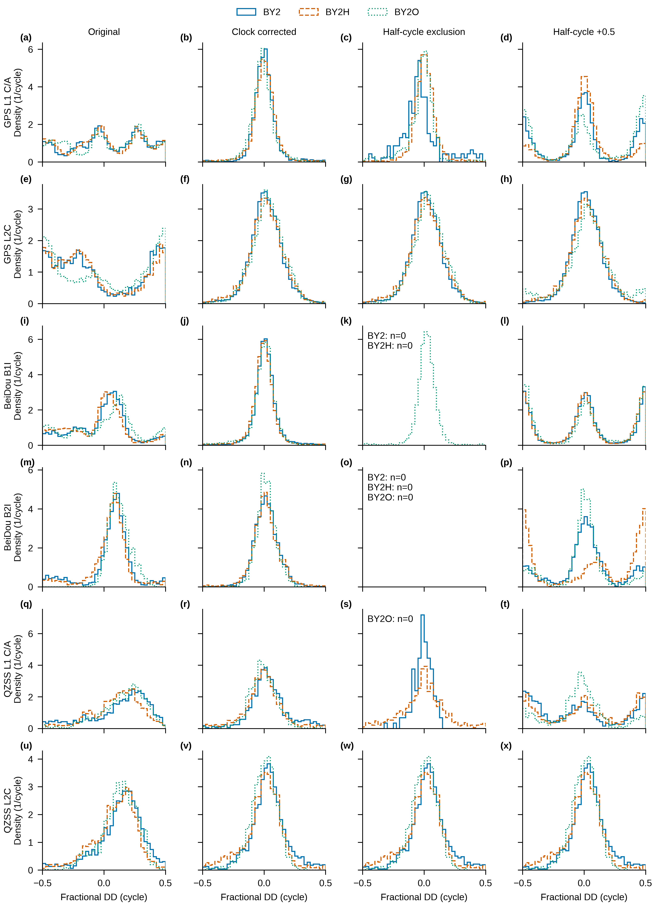
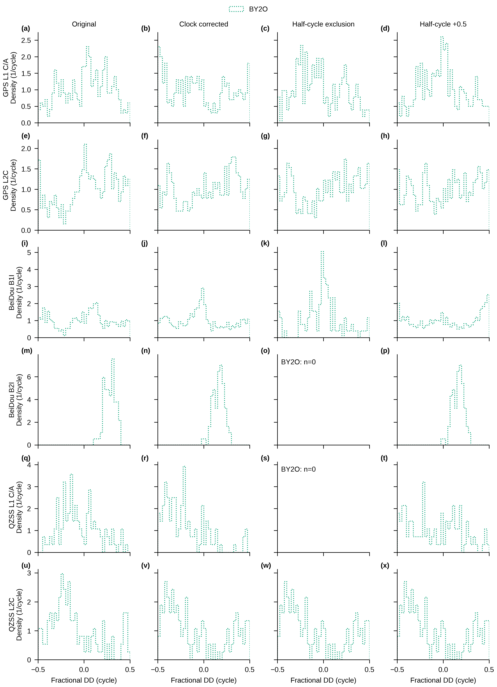

# DG-01R：钟差、半周标志与官方 convbin 对照

状态：只读诊断计算完成。登记提交 `86567e8bd07f7bb4645cc95cecb11d073ce66e7c`；结果提交为本文件所属提交，最终回执登记精确哈希。原始哈希 12/12，convbin 数据转换 6 次；其他外部导航、LegSA、评估、provider 均 0，参考轨迹读取 0。

## 0. 口径与输入

本报告沿用 DG01_REGISTRATION 的观测/卫星/pivot/fix_group 身份，只更改指定卫星几何与半周处理。窗口 BY2 [66,340]、BY2H [413,683]、BY2O [3186,3563] s；base_time、钟差插值、包裹、直方图和 RINEX 比较容差在 DG01R_REGISTRATION.md 计算前写定。源码/输入逐文件哈希在 DG01R_INPUT_SHA256.json。`<DG01>`、`<DG01R>` 分别指 `<CLEAN_ROOT>/stages/CLEAN10_GNSS_RAW_DIAGNOSTIC/` 下对应目录；实际绝对路径和完整转换 argv 留 G:，仓库采用本地配置别名。

## R1. 接收机钟差改变了卫星几何诊断

CLK 为 NAV-CLOCK clkB，单位 ns 转 s；下表 Delta_clk=clkB2−clkB1。n 是成对 RAWX 历元数。同 HP iTOW 的 CLOCK 全部存在，未用插值、未因时钟缺失删行。完整成对历元集与 D4 使用历元集在本数据上相同。每台接收机的接收时刻分别减去自身 clkB，四轮几何传播时间迭代计算各自发射时刻；HPPOSECEF 位置不变。

| sequence | n | median_ms | p05_ms | p95_ms | min_ms | max_ms | max_abs_ms | max_first_order_DD_cycles | max_exact_clock_geometry_cycles |
| --- | --- | --- | --- | --- | --- | --- | --- | --- | --- |
| BY2 | 1370 | -0.442592 | -0.442813 | -0.441781 | -0.442816 | -0.441579 | 0.442816 | 2.24763 | 2.24763 |
| BY2H | 1350 | -0.437281 | -0.440434 | -0.434064 | -0.44078 | -0.433659 | 0.44078 | 1.85168 | 1.85168 |
| BY2O | 1885 | -0.425639 | -0.437095 | -0.409271 | -0.438118 | -0.407228 | 0.438118 | 2.46378 | 2.46378 |

来源：DG01R_CLOCK_OFFSET.csv；每个最大 DD 影响的逐行值在 G: 各序列 DD_VERSIONS.csv.gz。近似影响为 abs((range_rate_s−range_rate_p)*Delta_clk)/lambda；完整修正使用两个独立发射时刻，而非该线性近似。

DG01 原未包裹残差共 68339 行被逐行重现，最大误差 0 周。独立发射时刻但将 clkB 设零的对照，与原 R0 的最大包裹差为 7.81103653e-06 周；完整钟差几何变化的绝对幅度与一阶近似之间最大差为 6.00007871e-07 周。来源：DD_ALL_VERSIONS.csv.gz；这两个量用于分清钟差项和实现细节，未用于调参。

运动近似：按任务要求忽略接收机在时刻修正期间的自身位移，位置仍取原 HPPOSECEF。题述“0.2 s 内自身运动 ≤1.2 mm”保留为任务给定假设，未验证；s/ms 单位仍待作者确认，不能写成实测运动上界。上述表给出实际两机钟差，未用参考轨迹或运动结果调整该假设。

以下列出各信号的四版本结果。label 为 序列/UBX系统:信号/fixed类别，0=GPS、3=BeiDou、5=QZSS；P95 是包裹残差绝对值，单位周。R0/R1/R2B 的身份分母相同，R2a 只按登记的端点半周条件剔除；UNAVAILABLE 表示没有有限样本。完整 mean/median/SD/分位/圆离散等列分别在同名 FRACTIONAL_DD CSV。

| label | R0_n | R2A_n | R0_p95_abs_cycles | R1_p95_abs_cycles | R2A_p95_abs_cycles | R2B_p95_abs_cycles | R0_frac_abs_gt025 | R1_frac_abs_gt025 |
| --- | --- | --- | --- | --- | --- | --- | --- | --- |
| BY2/0:0/both_fixed | 4195 | 185 | 0.476949 | 0.191856 | 0.386463 | 0.489827 | 0.465554 | 0.0355185 |
| BY2/0:3/both_fixed | 3215 | 3215 | 0.484736 | 0.270284 | 0.270284 | 0.270284 | 0.643546 | 0.0650078 |
| BY2/3:0/both_fixed | 8355 | 0 | 0.457553 | 0.195611 | UNAVAILABLE | 0.492578 | 0.246439 | 0.0295631 |
| BY2/3:2/both_fixed | 2153 | 0 | 0.438601 | 0.202565 | UNAVAILABLE | 0.477763 | 0.165351 | 0.0236879 |
| BY2/5:0/both_fixed | 1304 | 117 | 0.441266 | 0.372976 | 0.141592 | 0.489093 | 0.461656 | 0.129601 |
| BY2/5:5/both_fixed | 1828 | 1828 | 0.407094 | 0.328683 | 0.328683 | 0.328683 | 0.287199 | 0.100109 |
| BY2H/0:0/both_fixed | 4251 | 3376 | 0.478836 | 0.21392 | 0.190324 | 0.473083 | 0.48271 | 0.0383439 |
| BY2H/0:3/both_fixed | 3372 | 3351 | 0.485615 | 0.293696 | 0.294523 | 0.300057 | 0.609134 | 0.0818505 |
| BY2H/3:0/both_fixed | 8185 | 0 | 0.4663 | 0.203331 | UNAVAILABLE | 0.491784 | 0.298228 | 0.0346976 |
| BY2H/3:2/both_fixed | 2203 | 0 | 0.409476 | 0.225941 | UNAVAILABLE | 0.494058 | 0.122106 | 0.0385837 |
| BY2H/5:0/both_fixed | 1495 | 752 | 0.412091 | 0.367612 | 0.394018 | 0.486517 | 0.271572 | 0.107692 |
| BY2H/5:5/both_fixed | 1786 | 1786 | 0.360518 | 0.354836 | 0.354836 | 0.354836 | 0.197088 | 0.115342 |
| BY2O/0:0/both_fixed | 5030 | 427 | 0.474345 | 0.205614 | 0.288966 | 0.493063 | 0.553877 | 0.0292247 |
| BY2O/0:0/other | 399 | 205 | 0.447275 | 0.485533 | 0.444015 | 0.446381 | 0.373434 | 0.546366 |
| BY2O/0:3/both_fixed | 3723 | 3280 | 0.488939 | 0.26453 | 0.261122 | 0.436047 | 0.671233 | 0.0625839 |
| BY2O/0:3/other | 513 | 391 | 0.484858 | 0.479832 | 0.486378 | 0.486371 | 0.489279 | 0.553606 |
| BY2O/3:0/both_fixed | 9968 | 3071 | 0.475795 | 0.234826 | 0.159696 | 0.49275 | 0.322632 | 0.0432384 |
| BY2O/3:0/other | 1032 | 103 | 0.476453 | 0.473137 | 0.480646 | 0.490589 | 0.459302 | 0.434109 |
| BY2O/3:2/both_fixed | 1882 | 0 | 0.285776 | 0.167193 | UNAVAILABLE | 0.469395 | 0.0945802 | 0.00371945 |
| BY2O/3:2/other | 74 | 0 | 0.372256 | 0.254206 | UNAVAILABLE | 0.254206 | 0.662162 | 0.0675676 |
| BY2O/5:0/both_fixed | 1325 | 0 | 0.409516 | 0.232175 | UNAVAILABLE | 0.474343 | 0.362264 | 0.034717 |
| BY2O/5:0/other | 112 | 0 | 0.402691 | 0.461881 | UNAVAILABLE | 0.475021 | 0.267857 | 0.535714 |
| BY2O/5:5/both_fixed | 1791 | 1791 | 0.337795 | 0.208573 | 0.208573 | 0.208573 | 0.210497 | 0.0268007 |
| BY2O/5:5/other | 148 | 148 | 0.464405 | 0.474829 | 0.474829 | 0.474829 | 0.445946 | 0.702703 |

来源：DG01R_VERSION_COMPARISON.csv，由四个 FRACTIONAL_DD 汇总表按同一身份连接。修正后双方 fixed 的多种信号分布集中于零附近；非双方 fixed 的 BY2O 几何代理未出现相同的集中程度。原 DG01 未校正钟差的宽分布不能单独用于“存在非整数硬件偏差”的归因；本次只更正观测几何诊断，不改写任何已有方法输出、固定率或导航结果。

## R2. 半周标志的两种处理并列

完整三标志组合在 DG01R_HALFCYC_FLAGS.csv 的 kind=combination 行，原 tracking 字节和逐观测标志在 G: FLAGS_DETAIL.csv.gz。下表 full 指全部共同信号样本，D4 指原非 pivot DD 行；另有 D4_endpoint_unique 统计同时计入原 pivot，避免用非 pivot 比例解释整条 DD 的删除率。

| sequence | gnss | signal | frequency_id | n_D4_nonpivot | n_all_common | sub_disagree_n_D4_nonpivot | sub_disagree_n_all_common | sub_disagree_fraction_D4_nonpivot | sub_disagree_fraction_all_common |
| --- | --- | --- | --- | --- | --- | --- | --- | --- | --- |
| BY2 | 0 | 0 | 0 | 4195 | 10827 | 2420 | 4277 | 0.576877 | 0.395031 |
| BY2 | 0 | 3 | 0 | 3215 | 7505 | 0 | 0 | 0 | 0 |
| BY2 | 1 | 0 | 0 | UNAVAILABLE | 1648 | UNAVAILABLE | 786 | UNAVAILABLE | 0.476942 |
| BY2 | 2 | 0 | 0 | UNAVAILABLE | 6347 | UNAVAILABLE | 0 | UNAVAILABLE | 0 |
| BY2 | 2 | 6 | 0 | UNAVAILABLE | 6632 | UNAVAILABLE | 0 | UNAVAILABLE | 0 |
| BY2 | 3 | 0 | 0 | 8355 | 14436 | 4407 | 6470 | 0.527469 | 0.448185 |
| BY2 | 3 | 2 | 0 | 2153 | 4920 | 1533 | 3365 | 0.71203 | 0.683943 |
| BY2 | 5 | 0 | 0 | 1304 | 3437 | 351 | 1988 | 0.269172 | 0.578411 |
| BY2 | 5 | 5 | 0 | 1828 | 3582 | 0 | 0 | 0 | 0 |
| BY2 | 6 | 0 | 0 | UNAVAILABLE | 1206 | UNAVAILABLE | 109 | UNAVAILABLE | 0.0903814 |
| BY2 | 6 | 0 | 5 | UNAVAILABLE | 285 | UNAVAILABLE | 8 | UNAVAILABLE | 0.0280702 |
| BY2 | 6 | 0 | 7 | UNAVAILABLE | 1340 | UNAVAILABLE | 482 | UNAVAILABLE | 0.359701 |
| BY2 | 6 | 0 | 8 | UNAVAILABLE | 1339 | UNAVAILABLE | 327 | UNAVAILABLE | 0.244212 |
| BY2 | 6 | 0 | 9 | UNAVAILABLE | 1359 | UNAVAILABLE | 370 | UNAVAILABLE | 0.272259 |
| BY2 | 6 | 0 | 10 | UNAVAILABLE | 1219 | UNAVAILABLE | 256 | UNAVAILABLE | 0.210008 |
| BY2 | 6 | 0 | 11 | UNAVAILABLE | 1367 | UNAVAILABLE | 482 | UNAVAILABLE | 0.352597 |
| BY2 | 6 | 0 | 13 | UNAVAILABLE | 1352 | UNAVAILABLE | 235 | UNAVAILABLE | 0.173817 |
| BY2 | 6 | 2 | 5 | UNAVAILABLE | 40 | UNAVAILABLE | 19 | UNAVAILABLE | 0.475 |
| BY2 | 6 | 2 | 7 | UNAVAILABLE | 1141 | UNAVAILABLE | 294 | UNAVAILABLE | 0.257669 |
| BY2 | 6 | 2 | 8 | UNAVAILABLE | 1051 | UNAVAILABLE | 509 | UNAVAILABLE | 0.484301 |
| BY2 | 6 | 2 | 9 | UNAVAILABLE | 1176 | UNAVAILABLE | 210 | UNAVAILABLE | 0.178571 |
| BY2 | 6 | 2 | 10 | UNAVAILABLE | 1063 | UNAVAILABLE | 258 | UNAVAILABLE | 0.242709 |
| BY2 | 6 | 2 | 11 | UNAVAILABLE | 1111 | UNAVAILABLE | 285 | UNAVAILABLE | 0.256526 |
| BY2 | 6 | 2 | 13 | UNAVAILABLE | 1161 | UNAVAILABLE | 369 | UNAVAILABLE | 0.317829 |
| BY2H | 0 | 0 | 0 | 4251 | 10975 | 875 | 1584 | 0.205834 | 0.144328 |
| BY2H | 0 | 3 | 0 | 3372 | 7365 | 21 | 22 | 0.00622776 | 0.0029871 |
| BY2H | 1 | 0 | 0 | UNAVAILABLE | 1684 | UNAVAILABLE | 347 | UNAVAILABLE | 0.206057 |
| BY2H | 2 | 0 | 0 | UNAVAILABLE | 5941 | UNAVAILABLE | 0 | UNAVAILABLE | 0 |
| BY2H | 2 | 6 | 0 | UNAVAILABLE | 6549 | UNAVAILABLE | 0 | UNAVAILABLE | 0 |
| BY2H | 3 | 0 | 0 | 8185 | 14655 | 4168 | 6451 | 0.509224 | 0.440191 |
| BY2H | 3 | 2 | 0 | 2203 | 4840 | 755 | 2507 | 0.342714 | 0.517975 |
| BY2H | 5 | 0 | 0 | 1495 | 3429 | 160 | 1118 | 0.107023 | 0.326043 |
| BY2H | 5 | 5 | 0 | 1786 | 3475 | 0 | 0 | 0 | 0 |
| BY2H | 6 | 0 | 0 | UNAVAILABLE | 1203 | UNAVAILABLE | 194 | UNAVAILABLE | 0.161264 |
| BY2H | 6 | 0 | 3 | UNAVAILABLE | 447 | UNAVAILABLE | 19 | UNAVAILABLE | 0.0425056 |
| BY2H | 6 | 0 | 5 | UNAVAILABLE | 1319 | UNAVAILABLE | 0 | UNAVAILABLE | 0 |
| BY2H | 6 | 0 | 7 | UNAVAILABLE | 1347 | UNAVAILABLE | 408 | UNAVAILABLE | 0.302895 |
| BY2H | 6 | 0 | 8 | UNAVAILABLE | 1318 | UNAVAILABLE | 608 | UNAVAILABLE | 0.461305 |
| BY2H | 6 | 0 | 9 | UNAVAILABLE | 1350 | UNAVAILABLE | 643 | UNAVAILABLE | 0.476296 |
| BY2H | 6 | 0 | 10 | UNAVAILABLE | 1341 | UNAVAILABLE | 226 | UNAVAILABLE | 0.168531 |
| BY2H | 6 | 0 | 11 | UNAVAILABLE | 1350 | UNAVAILABLE | 484 | UNAVAILABLE | 0.358519 |
| BY2H | 6 | 0 | 13 | UNAVAILABLE | 1336 | UNAVAILABLE | 212 | UNAVAILABLE | 0.158683 |
| BY2H | 6 | 2 | 7 | UNAVAILABLE | 1134 | UNAVAILABLE | 166 | UNAVAILABLE | 0.146384 |
| BY2H | 6 | 2 | 8 | UNAVAILABLE | 1338 | UNAVAILABLE | 243 | UNAVAILABLE | 0.181614 |
| BY2H | 6 | 2 | 9 | UNAVAILABLE | 1157 | UNAVAILABLE | 644 | UNAVAILABLE | 0.556612 |
| BY2H | 6 | 2 | 10 | UNAVAILABLE | 1119 | UNAVAILABLE | 282 | UNAVAILABLE | 0.252011 |
| BY2H | 6 | 2 | 11 | UNAVAILABLE | 1130 | UNAVAILABLE | 213 | UNAVAILABLE | 0.188496 |
| BY2H | 6 | 2 | 13 | UNAVAILABLE | 1163 | UNAVAILABLE | 307 | UNAVAILABLE | 0.263972 |
| BY2O | 0 | 0 | 0 | 5429 | 13218 | 1987 | 4161 | 0.365997 | 0.314798 |
| BY2O | 0 | 3 | 0 | 4236 | 8955 | 168 | 379 | 0.0396601 | 0.0423227 |
| BY2O | 1 | 0 | 0 | UNAVAILABLE | 2061 | UNAVAILABLE | 1018 | UNAVAILABLE | 0.493935 |
| BY2O | 2 | 0 | 0 | UNAVAILABLE | 9766 | UNAVAILABLE | 0 | UNAVAILABLE | 0 |
| BY2O | 2 | 6 | 0 | UNAVAILABLE | 9228 | UNAVAILABLE | 0 | UNAVAILABLE | 0 |
| BY2O | 3 | 0 | 0 | 11000 | 17416 | 4149 | 5847 | 0.377182 | 0.335726 |
| BY2O | 3 | 2 | 0 | 1956 | 4788 | 1580 | 3286 | 0.807771 | 0.686299 |
| BY2O | 5 | 0 | 0 | 1437 | 4086 | 1066 | 2932 | 0.741823 | 0.717572 |
| BY2O | 5 | 5 | 0 | 1939 | 4191 | 0 | 0 | 0 | 0 |
| BY2O | 6 | 0 | 0 | UNAVAILABLE | 1700 | UNAVAILABLE | 790 | UNAVAILABLE | 0.464706 |
| BY2O | 6 | 0 | 5 | UNAVAILABLE | 1662 | UNAVAILABLE | 171 | UNAVAILABLE | 0.102888 |
| BY2O | 6 | 0 | 7 | UNAVAILABLE | 1882 | UNAVAILABLE | 456 | UNAVAILABLE | 0.242295 |
| BY2O | 6 | 0 | 8 | UNAVAILABLE | 1841 | UNAVAILABLE | 816 | UNAVAILABLE | 0.443237 |
| BY2O | 6 | 0 | 9 | UNAVAILABLE | 1784 | UNAVAILABLE | 1047 | UNAVAILABLE | 0.586883 |
| BY2O | 6 | 0 | 10 | UNAVAILABLE | 1872 | UNAVAILABLE | 852 | UNAVAILABLE | 0.455128 |
| BY2O | 6 | 0 | 11 | UNAVAILABLE | 1874 | UNAVAILABLE | 660 | UNAVAILABLE | 0.352188 |
| BY2O | 6 | 0 | 12 | UNAVAILABLE | 2 | UNAVAILABLE | 0 | UNAVAILABLE | 0 |
| BY2O | 6 | 0 | 13 | UNAVAILABLE | 1861 | UNAVAILABLE | 867 | UNAVAILABLE | 0.465879 |
| BY2O | 6 | 2 | 5 | UNAVAILABLE | 1075 | UNAVAILABLE | 69 | UNAVAILABLE | 0.064186 |
| BY2O | 6 | 2 | 7 | UNAVAILABLE | 1605 | UNAVAILABLE | 498 | UNAVAILABLE | 0.31028 |
| BY2O | 6 | 2 | 8 | UNAVAILABLE | 1649 | UNAVAILABLE | 413 | UNAVAILABLE | 0.250455 |
| BY2O | 6 | 2 | 9 | UNAVAILABLE | 1394 | UNAVAILABLE | 859 | UNAVAILABLE | 0.616212 |
| BY2O | 6 | 2 | 10 | UNAVAILABLE | 1571 | UNAVAILABLE | 451 | UNAVAILABLE | 0.287078 |
| BY2O | 6 | 2 | 11 | UNAVAILABLE | 1675 | UNAVAILABLE | 512 | UNAVAILABLE | 0.305672 |
| BY2O | 6 | 2 | 13 | UNAVAILABLE | 1765 | UNAVAILABLE | 402 | UNAVAILABLE | 0.227762 |

| sequence | R0 | R1 | R2A | R2B |
| --- | --- | --- | --- | --- |
| BY2 | 21050 | 21050 | 5345 | 21050 |
| BY2H | 21292 | 21292 | 9265 | 21292 |
| BY2O | 25997 | 25997 | 9416 | 25997 |

来源：DG01R_HALFCYC_FLAGS.csv 和 DD_ALL_VERSIONS.csv.gz。R2a 删除任一端点 subHalfCyc 两机不一致的原 DD 行，原 pivot 不变；因此一些信号整组 n=0，不能把空图当成残差消失。R2b 在 subHalfCyc=1 的一侧加回 0.5 周，四个相位项均处理；未选择某一版本作为“正确结果”。

GPS L2C（UBX sigId=3）的边界峰定义为 abs(wrapped)>=0.45 周，正负端分别计数。最大 0.05 周箱质量为周期相邻两个固定箱的最大占比，仅作形状描述，没有优劣门限。

| sequence | fix_group | version | n | positive_edge_n | negative_edge_n | edge_n | edge_fraction | max_005_cycle_fraction |
| --- | --- | --- | --- | --- | --- | --- | --- | --- |
| BY2 | both_fixed | R1 | 3215 | 5 | 6 | 11 | 0.00342146 | 0.176361 |
| BY2H | both_fixed | R1 | 3372 | 9 | 9 | 18 | 0.00533808 | 0.166667 |
| BY2O | both_fixed | R1 | 3723 | 6 | 3 | 9 | 0.00241741 | 0.173785 |
| BY2O | other | R1 | 513 | 29 | 21 | 50 | 0.0974659 | 0.0896686 |
| BY2 | both_fixed | R2A | 3215 | 5 | 6 | 11 | 0.00342146 | 0.176361 |
| BY2H | both_fixed | R2A | 3351 | 9 | 9 | 18 | 0.00537153 | 0.166517 |
| BY2O | both_fixed | R2A | 3280 | 3 | 0 | 3 | 0.000914634 | 0.175305 |
| BY2O | other | R2A | 391 | 27 | 20 | 47 | 0.120205 | 0.0792839 |
| BY2 | both_fixed | R2B | 3215 | 5 | 6 | 11 | 0.00342146 | 0.176361 |
| BY2H | both_fixed | R2B | 3372 | 15 | 12 | 27 | 0.00800712 | 0.16548 |
| BY2O | both_fixed | R2B | 3723 | 74 | 72 | 146 | 0.0392157 | 0.155251 |
| BY2O | other | R2B | 513 | 34 | 27 | 61 | 0.118908 | 0.0760234 |

来源：DG01R_L2C_PEAKS.csv（另保留 R0 与零钟差对照）。例如 BY2 双 fixed 的边界峰从 R0 的 551/3215 降至 R1 的 11/3215；R2a/R2b 在该信号上仍为 11/3215。BY2O 双 fixed 的 R1 为 9/3723，R2a 为 3/3280，R2b 为 146/3723。两种处理的样本集和峰形变化都照报，不能因图形更集中而择优。

SFIG-DG2R：双方 fixed 的逐信号包裹双差密度，左至右为 R0、R1、R2a、R2b。每条曲线在自身有限样本上归一化，颜色/线型区分序列；相同一行共享密度轴，固定 0.025 周箱。n=0 注记表示该序列按 R2a 规则全部剔除，不表示物理误差为零。

SFIG-DG2R-OTHER：非双方 fixed 的同一对照，仅 BY2O 有样本；该组 HPPOSECEF 是较弱的几何代理。所有版本和缺失组均保留。

## R3. UBX 与官方 convbin

官方 RTKLIB 源码提交 `180043ee24b6d2b168f98b64be15f69d50046b1a`；已有 convbin SHA256 `85b6b981374c7df957492d9423a3c650a35cb5e7253598651070adf4d9f1df2a`，未编译、未修改源码。六份 UBX 保留评估消息到达窗内所有 UBX 帧原字节和顺序；不补窗外消息。默认全系统/信号，RINEX 3.04、-f 5、-od -os，没有 -halfc 或时标调整选项。原命令逐字见 G: CONVBIN_RUNS.json；别名版本见 DG01R_CONVBIN_COMMANDS.json。

| sequence | receiver | frames | bad_checksum_or_length | bytes | ubx_sha256 |
| --- | --- | --- | --- | --- | --- |
| BY2 | 1 | 26586 | 1 | 6796172 | 8a67b183b430907b1c9a50a9f6c77dffd072831d955b98e9cf536bbbcbde5dd0 |
| BY2 | 2 | 26474 | 0 | 6511113 | e750bb8c17fd1242221e7d3e6717a6f1579c06ce182fadeb59824ad10d50bc07 |
| BY2H | 1 | 26225 | 0 | 6681204 | 1a19354c63ab4f1ce7ecbac7642d2125fa3c2c1b288edead076f15a6ad492442 |
| BY2H | 2 | 26243 | 1 | 6561584 | 023d3dba102a7e439695458a42be1d3a495a4efec8db5b3d0d4c0d718d57084c |
| BY2O | 1 | 37607 | 22 | 9231960 | b64d76693d8fe097b898ed7c2add0f16e8abf8fa740296939034df5f93d40fd4 |
| BY2O | 2 | 36446 | 1 | 8752634 | 6a0690243d9459fa547529766a5239a9a3bab663aa97364874bd5cc53b946af0 |

来源：DG01R_UBX_EXTRACTION.csv。bad_checksum_or_length 是提取帧的校验统计，原样交官方解码器，不替它修帧。源码 makefile 启用 GLO/QZSS/Galileo/BeiDou/IRNSS，NFREQ=5、NEXOBS=3；系统能力不等于窗口内一定解出该系统星历。

| sequence | receiver | bridge_full_epochs | convbin_full_epochs | bridge_window_epochs | convbin_window_epochs | common_window_epochs | bridge_only_epochs | convbin_only_epochs |
| --- | --- | --- | --- | --- | --- | --- | --- | --- |
| BY2 | 1 | 1509 | 1370 | 1370 | 1369 | 1369 | 1 | 0 |
| BY2 | 2 | 1509 | 1370 | 1370 | 1369 | 1369 | 1 | 0 |
| BY2H | 1 | 1483 | 1350 | 1350 | 1349 | 1349 | 1 | 0 |
| BY2H | 2 | 1483 | 1350 | 1350 | 1349 | 1349 | 1 | 0 |
| BY2O | 1 | 2231 | 1885 | 1885 | 1884 | 1884 | 1 | 0 |
| BY2O | 2 | 2231 | 1885 | 1885 | 1884 | 1884 | 1 | 0 |

| sequence | receiver | category | time_s |
| --- | --- | --- | --- |
| BY2 | 1 | epoch_bridge_only | 339.998 |
| BY2 | 2 | epoch_bridge_only | 339.998 |
| BY2H | 1 | epoch_bridge_only | 682.998 |
| BY2H | 2 | epoch_bridge_only | 682.998 |
| BY2O | 1 | epoch_bridge_only | 3563 |
| BY2O | 2 | epoch_bridge_only | 3563 |

来源：DG01R_RINEX_EPOCHS.csv 与 DG01R_EPOCH_DIFFERENCES.csv。bridge 输入包含更长的原始历史，而本次按题设只提取消息到达窗；每侧共同观测按微秒标签精确连接。单侧端点按原值报告，不做最近邻或窗外补配。

| sequence | receiver | n_common | bridge_only | convbin_only | C_common | C_nonzero | L_common | L_nonzero | phase_fraction_half | phase_fraction_other | LLI_bit0_different | LLI_bit1_different | S_common | S_convbin_only |
| --- | --- | --- | --- | --- | --- | --- | --- | --- | --- | --- | --- | --- | --- | --- |
| BY2 | 1 | 84848 | 66 | 0 | 84848 | 0 | 36527 | 0 | 0 | 0 | 2 | 0 | 0 | 84848 |
| BY2 | 2 | 80268 | 61 | 0 | 80268 | 0 | 33838 | 0 | 0 | 0 | 3 | 0 | 0 | 80268 |
| BY2H | 1 | 83439 | 68 | 0 | 83439 | 0 | 36155 | 0 | 0 | 0 | 2 | 0 | 0 | 83439 |
| BY2H | 2 | 81196 | 65 | 0 | 81196 | 0 | 35109 | 0 | 0 | 0 | 5 | 0 | 0 | 81196 |
| BY2O | 1 | 114683 | 66 | 0 | 114683 | 0 | 58782 | 0 | 0 | 0 | 2 | 0 | 0 | 114683 |
| BY2O | 2 | 107134 | 64 | 0 | 107134 | 0 | 46859 | 0 | 0 | 0 | 1 | 0 | 0 | 107134 |

来源：DG01R_RINEX_OVERVIEW.csv，完整逐信号表 DG01R_RINEX_CROSSCHECK.csv。共同伪距 551568 个，非零差异 0；共同相位 247270 个，原始数值差非零 0，小数 ±0.5 类和 other 类均 0。LLI bit0 差异 15，bit1 差异 0。

数值信噪比 S 列：bridge 缺失，S_common=0，因此不能报告“两套 SNR 数值一致”；convbin 输出的 S 和 D 列作为单侧字段差异保留。载波字段的 SSI 位两侧均为空白（按登记作 0），相同的空白不构成 C/N0 数值验证。

全部 LLI bit0 差异如下；token 为 RINEX 原 16 字符字段的 repr，末尾字符包含 LLI/SSI，表内路径定位见主交叉核对表。

| sequence | receiver | satellite | signal | time_s | bridge_LLI | convbin_LLI | bridge_L_token | convbin_L_token | bridge_line | convbin_line |
| --- | --- | --- | --- | --- | --- | --- | --- | --- | --- | --- |
| BY2 | 1 | C10 | 7I | 66.798 | 0 | 1 | ' 143444493.328  ' | ' 143444493.3281 ' | 2264 | 212 |
| BY2 | 1 | C08 | 7I | 127.998 | 2 | 3 | ' 153111393.7732 ' | ' 153111393.7733 ' | 14072 | 12020 |
| BY2 | 2 | G11 | 1C | 66.198 | 0 | 1 | ' 118408273.184  ' | ' 118408273.1841 ' | 1965 | 76 |
| BY2 | 2 | R21 | 2C | 67.398 | 0 | 1 | '  86458884.730  ' | '  86458884.7301 ' | 2202 | 313 |
| BY2 | 2 | G22 | 1C | 67.598 | 0 | 1 | ' 112398631.334  ' | ' 112398631.3341 ' | 2259 | 370 |
| BY2H | 1 | R20 | 2C | 417.198 | 0 | 1 | '  80415287.618  ' | '  80415287.6181 ' | 3531 | 966 |
| BY2H | 1 | J07 | 2L | 422.398 | 1 | 0 | ' 151637169.3141 ' | ' 151637169.314  ' | 4654 | 2089 |
| BY2H | 2 | J04 | 2L | 413.798 | 1 | 0 | ' 152364656.3951 ' | ' 152364656.395  ' | 2631 | 240 |
| BY2H | 2 | R20 | 2C | 414.998 | 0 | 1 | '  79864833.188  ' | '  79864833.1881 ' | 2851 | 460 |
| BY2H | 2 | C27 | 2I | 415.398 | 0 | 1 | ' 117777463.223  ' | ' 117777463.2231 ' | 2930 | 539 |
| BY2H | 2 | C42 | 2I | 416.198 | 0 | 1 | ' 126495445.346  ' | ' 126495445.3461 ' | 3093 | 702 |
| BY2H | 2 | R21 | 1C | 417.198 | 0 | 1 | ' 110493112.818  ' | ' 110493112.8181 ' | 3304 | 913 |
| BY2O | 1 | G14 | 1C | 3187 | 2 | 3 | ' 115489438.2602 ' | ' 115489438.2603 ' | 9627 | 257 |
| BY2O | 1 | G11 | 2L | 3191 | 1 | 0 | '  93706444.9701 ' | '  93706444.970  ' | 10523 | 1153 |
| BY2O | 2 | J02 | 2L | 3189.2 | 1 | 0 | ' 151302020.7261 ' | ' 151302020.726  ' | 8401 | 661 |

这些差异在已有 RINEX 文件之间确实存在，但输入历史长度不同，不能仅凭本次比较把差异归因于 bridge 错误或时钟/半周处理。官方 ublox.c 的 slip 判据包含 locktime 变化与 subHalfCyc 状态变化；RINEX 转换还保留缺失相位期间的标志状态。此处不复跑更长窗口来消除差别。

| sequence | receiver | system | bridge | convbin |
| --- | --- | --- | --- | --- |
| BY2 | 1 | C | 14 | 13 |
| BY2 | 1 | E | 0 | 0 |
| BY2 | 1 | G | 8 | 7 |
| BY2 | 1 | I | 0 | 0 |
| BY2 | 1 | J | 3 | 3 |
| BY2 | 1 | R | 7 | 7 |
| BY2 | 1 | S | 5 | 4 |
| BY2 | 2 | C | 12 | 12 |
| BY2 | 2 | E | 0 | 0 |
| BY2 | 2 | G | 9 | 8 |
| BY2 | 2 | I | 0 | 0 |
| BY2 | 2 | J | 3 | 3 |
| BY2 | 2 | R | 7 | 7 |
| BY2 | 2 | S | 4 | 3 |
| BY2H | 1 | C | 13 | 13 |
| BY2H | 1 | E | 0 | 0 |
| BY2H | 1 | G | 10 | 10 |
| BY2H | 1 | I | 0 | 0 |
| BY2H | 1 | J | 3 | 3 |
| BY2H | 1 | R | 7 | 7 |
| BY2H | 1 | S | 6 | 5 |
| BY2H | 2 | C | 13 | 13 |
| BY2H | 2 | E | 0 | 0 |
| BY2H | 2 | G | 9 | 9 |
| BY2H | 2 | I | 0 | 0 |
| BY2H | 2 | J | 3 | 3 |
| BY2H | 2 | R | 7 | 7 |
| BY2H | 2 | S | 6 | 5 |
| BY2O | 1 | C | 17 | 16 |
| BY2O | 1 | E | 0 | 0 |
| BY2O | 1 | G | 9 | 8 |
| BY2O | 1 | I | 0 | 0 |
| BY2O | 1 | J | 3 | 3 |
| BY2O | 1 | R | 9 | 8 |
| BY2O | 1 | S | 8 | 7 |
| BY2O | 2 | C | 15 | 13 |
| BY2O | 2 | E | 0 | 0 |
| BY2O | 2 | G | 9 | 9 |
| BY2O | 2 | I | 0 | 0 |
| BY2O | 2 | J | 3 | 3 |
| BY2O | 2 | R | 8 | 8 |
| BY2O | 2 | S | 7 | 7 |

来源：DG01R_NAV_COUNTS.csv。这里是各自全 nav 文件的星历记录条数，不是同 toe/toc 子集。六份 convbin nav 和六份 bridge nav 的 Galileo 条目均为 0，因此本次没有产生可用 Galileo 星历；其它星座条数差异与不同输入历史并列记录，未据此认定导航解码错误。

所有非零类别（观测/历元单侧、C/L 单侧、D/S 单侧、LLI、导航单侧记录）按序列/接收机/信号保存前20样本：G: RINEX_NONZERO_EXAMPLES.jsonl.gz，索引 DG01R_RINEX_EXAMPLE_INDEX.csv。每例包括两侧原始行、行号、原历元行与字段 token；缺失一侧为 null。逐观测差异全表为 G: 各序列各接收机 RINEX_DIFFERENCES.csv.gz。

## 检查、边界与交付

数值身份/代数/解析/哈希检查 49/49，图形机器 QA 14/14，两张实际 PNG 均查看。174 mm 宽、PNG 宽 4178 px，提供 PDF/SVG。机器单位识别仅在进程内扩充 cycle/1/cycle，未改 qa.py。未保留参考数据、未运行导航；六份 convbin 访问日志内合计六次 convbin execve，其他 execve 0，参考打开和 DG01R 外写入均 0，见 G: ACCESS_AUDIT.json。

R1 沿用 DG01 星历覆盖，仅 GPS/BeiDou/QZSS；未用 R3 新输出替换 R1 输入，不套用 GLONASS 异频整数 DD。原始文件、DG01 121 项输出、RTKLIB 927 项受版本控制文件、29 个用户文件结束再核对。scratch 只放字体缓存，结束删除；仓库仅汇总、图与脚本，G: 保留明细及输入/输出 SHA256 清单。结果提交与 push 精确回执写入 G: FINAL_RECEIPT.json。

提交前复核：原始文件 12/12、DG01 输出 121/121、RTKLIB 受版本控制文件 927/927、已登记输入 62/62 字节一致，既有未跟踪 29/29 原样；Git 仅本任务允许路径。scratch 已删除。DG01R_CLOSEOUT.json 留存复核结果，最终提交后状态与 push 回执在 G: FINAL_RECEIPT.json。

## 对 HX-07 的建议

若 R3 的共同相位、LLI 及相关输入差异均为零，且 R1/R2 后仍无窄峰，则无需因本诊断重跑 RTKLIB。若 R3 有相位或 LLI 差异，则建议以 convbin RINEX 做一次 RTKLIB 动基线对照，配置保持不变，并保持时间窗/预热历史可核对；只有 Galileo 星历可用时，另加一行 navsys 含 Galileo 的变体。当前满足的是 LLI 差异非零这一条件；这不等于已经证实 bridge 有错误，也不承诺重跑能提高固定率。本任务不执行这些后续条件动作。
