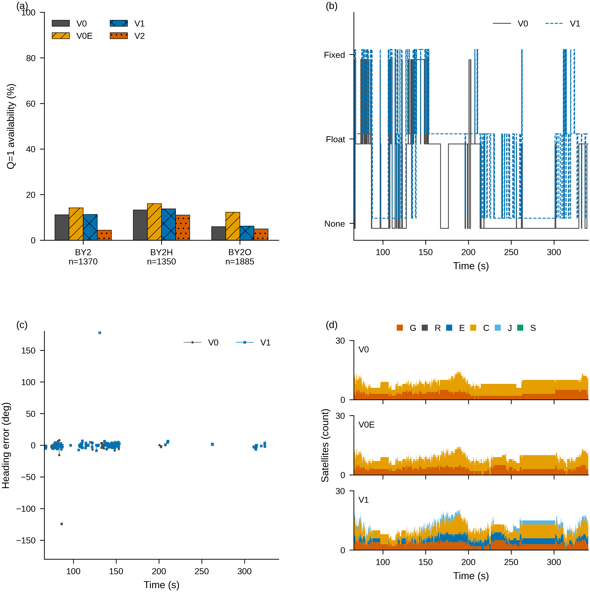

# HX-07-R 结果报告

## 1. 硬停解释与控制组修正

HX-07 的 V0 使用 DG-01R 仅评估窗内帧转换的观测，去复现 HX-02 完整重建流的结果，输入历史不一致。HX-02 三序列完整观测历元数为 1509/1483/2231，窗内 1370/1350/1885；DG-01R 共同伪距 551568、相位 247270 的数值差异为 0，LLI bit0 差异 15 处。原控制组登记了覆盖差异却仍采用 ±2 门，得到 BY2 157/1370 对 153/1370、差 +4 后按规则硬停。原生退出码为 0，该记录不作为解算错误证据；控制组设计没有固定输入历史。来源：已 pin 的 DG01R_RINEX_EPOCHS.csv、DG01R_RINEX_CROSSCHECK.csv、HX07/HARD_STOP.json。HX-07 的原文与产物一字不改，157/1370 保留为转换路径/输入历史敏感性补充行。

本次只用 HX-02 自己的完整 obs，与原二进制、配置和起点参数复现；在其基础上依次更换星历（V0E）、星座掩码（V1）、AR 模式（V2）。不按结果选择配置。

## 2. G1–G6 与逐运行计数

登记前 BRDC 头为 `     3.05           NAVIGATION DATA     MIXED               RINEX VERSION / TYPE`；主版本 3。继承 91 pin、RTKLIB 927 源码均匹配；完整 pin 数见 HX07R_INPUT_SHA256.json（119 项）。G2 三序列计数精确复现，G2b 非注释行差异如下；G3 三序列全部通过，逐字段实际值与期望值见 HX07R_EVAL_REPRODUCTION.json。

| sequence | expected | observed | G2_passed | G2b_different_lines |
|---|---|---|---|---|
| BY2 | 153 | 153 | True | 0 |
| BY2H | 179 | 179 | True | 0 |
| BY2O | 112 | 112 | True | 0 |

| sequence | valid_count | valid_rmse_deg | hold_rmse_deg | q2_count | q2_rmse_deg | passed |
|---|---|---|---|---|---|---|
| BY2 | 153 | 14.566166 | 58.241052 | 416 | 90.785046 | True |
| BY2H | 179 | 27.011169 | 55.117993 | 286 | 104.891563 | True |
| BY2O | 112 | 23.13895 | 129.988223 | 168 | 91.735474 | True |

实际计数：{"LegSA_evaluator": 0, "LegSA_solver": 0, "heading_evaluations": 13, "other_external": 0, "reference_opens": 13, "rnx2rtkp": 12}。每条原生和评估审计见 HX07R_AUDIT.json；每个评估参考只读打开一次并核验同一批 bytes 的 SHA-256；父进程拒绝 raw/reference 打开，其他外部方法未运行。

| sequence | variant | returncode | start | end |
|---|---|---|---|---|
| BY2H | V0 | 0 | 2026-09-27T13:28:31.999444+00:00 | 2026-09-27T13:28:35.841860+00:00 |
| BY2H | V0E | 0 | 2026-09-27T13:28:53.437080+00:00 | 2026-09-27T13:29:01.600902+00:00 |
| BY2H | V1 | 0 | 2026-09-27T13:29:25.071668+00:00 | 2026-09-27T13:29:34.294191+00:00 |
| BY2H | V2 | 0 | 2026-09-27T13:29:58.937392+00:00 | 2026-09-27T13:30:07.658351+00:00 |
| BY2O | V0 | 0 | 2026-09-27T13:28:36.551429+00:00 | 2026-09-27T13:28:41.240894+00:00 |
| BY2O | V0E | 0 | 2026-09-27T13:29:02.950541+00:00 | 2026-09-27T13:29:13.176845+00:00 |
| BY2O | V1 | 0 | 2026-09-27T13:29:35.593541+00:00 | 2026-09-27T13:29:47.191960+00:00 |
| BY2O | V2 | 0 | 2026-09-27T13:30:08.924158+00:00 | 2026-09-27T13:30:20.167429+00:00 |
| BY2 | V0 | 0 | 2026-09-27T13:28:26.829279+00:00 | 2026-09-27T13:28:31.209402+00:00 |
| BY2 | V0E | 0 | 2026-09-27T13:28:44.098367+00:00 | 2026-09-27T13:28:52.038769+00:00 |
| BY2 | V1 | 0 | 2026-09-27T13:29:14.565007+00:00 | 2026-09-27T13:29:23.806312+00:00 |
| BY2 | V2 | 0 | 2026-09-27T13:29:48.601287+00:00 | 2026-09-27T13:29:57.663619+00:00 |

G5 最终 size+mtime 快照 331249/331249 相同、变化 0；G6 提交前仅允许路径，既有未跟踪 29/29 路径及 SHA-256 原样保留。回执见 HX07R_PROTECTED_METADATA_CHECK.json、<HX07R>/FINAL_VALIDATION.json 与 FINAL_RECEIPT.json。

## 3. 三序列结果、Q 分布、ratio 与长度残差

| variant | sequence | valid_count | paired_denominator | availability | valid_rmse_deg | hold_rmse_deg | hold_scored | no_heading_before_first | q2_count | q2_rmse_deg |
|---|---|---|---|---|---|---|---|---|---|---|
| V0 | BY2 | 153 | 1370 | 0.111679 | 14.566166 | 58.241052 | 1370 | 0 | 416 | 90.785046 |
| V0 | BY2H | 179 | 1350 | 0.132593 | 27.011169 | 55.117993 | 1332 | 18 | 286 | 104.891563 |
| V0 | BY2O | 112 | 1885 | 0.059416 | 23.13895 | 129.988223 | 1885 | 0 | 168 | 91.735474 |
| V0E | BY2 | 194 | 1370 | 0.141606 | 20.646991 | 53.423211 | 1370 | 0 | 643 | 70.39077 |
| V0E | BY2H | 217 | 1350 | 0.160741 | 31.263814 | 65.426186 | 1294 | 56 | 584 | 78.465718 |
| V0E | BY2O | 231 | 1885 | 0.122546 | 20.402911 | 34.735076 | 1885 | 0 | 813 | 72.566471 |
| V1 | BY2 | 154 | 1370 | 0.112409 | 14.611254 | 57.336597 | 1370 | 0 | 681 | 68.616054 |
| V1 | BY2H | 186 | 1350 | 0.137778 | 12.732971 | 42.438227 | 1339 | 11 | 599 | 75.684142 |
| V1 | BY2O | 117 | 1885 | 0.062069 | 21.781901 | 85.865956 | 1885 | 0 | 844 | 66.024935 |
| V2 | BY2 | 60 | 1370 | 0.043796 | 4.511761 | 32.368885 | 1370 | 0 | 775 | 43.465845 |
| V2 | BY2H | 149 | 1350 | 0.11037 | 10.622992 | 39.641752 | 1339 | 11 | 636 | 75.698929 |
| V2 | BY2O | 93 | 1885 | 0.049337 | 19.205502 | 96.114244 | 1885 | 0 | 868 | 51.256356 |
| V0-convbin | BY2 | 157 | 1370 | 0.114599 | 14.361272 | 58.968112 | 1365 | 5 | 411 | 91.01709 |

来源：所有表的 source 列；G: <HX07R>/RUNS/<sequence>_<variant>/COMMAND.json、ASSOCIATION_SUMMARY.json、eval/OUTPUT/HEADING_METRICS.json。

三种分母分别保留；全文件计数不替代窗内配对分母。

| variant | sequence | scope | metric | n | denominator | fraction_own_denominator | paired_denominator | fraction_paired_denominator |
|---|---|---|---|---|---|---|---|---|
| V0 | BY2 | full_file | Q1 | 177 | 660 | 0.268182 | 1370 | 0.129197 |
| V0 | BY2 | full_file | Q2 | 483 | 660 | 0.731818 | 1370 | 0.352555 |
| V0 | BY2 | full_file | Q5 | 0 | 660 | 0 | 1370 | 0 |
| V0 | BY2 | full_file | Q-1 | 0 | 660 | 0 | 1370 | 0 |
| V0 | BY2 | pos_label_window | Q1 | 153 | 569 | 0.268893 | 1370 | 0.111679 |
| V0 | BY2 | pos_label_window | Q2 | 416 | 569 | 0.731107 | 1370 | 0.30365 |
| V0 | BY2 | pos_label_window | Q5 | 0 | 569 | 0 | 1370 | 0 |
| V0 | BY2 | pos_label_window | Q-1 | 0 | 569 | 0 | 1370 | 0 |
| V0 | BY2 | paired_window | Q1 | 153 | 1370 | 0.111679 | 1370 | 0.111679 |
| V0 | BY2 | paired_window | Q2 | 416 | 1370 | 0.30365 | 1370 | 0.30365 |
| V0 | BY2 | paired_window | Q5 | 0 | 1370 | 0 | 1370 | 0 |
| V0 | BY2 | paired_window | Q-1 | 801 | 1370 | 0.584672 | 1370 | 0.584672 |
| V0 | BY2H | full_file | Q1 | 180 | 512 | 0.351562 | 1350 | 0.133333 |
| V0 | BY2H | full_file | Q2 | 332 | 512 | 0.648438 | 1350 | 0.245926 |
| V0 | BY2H | full_file | Q5 | 0 | 512 | 0 | 1350 | 0 |
| V0 | BY2H | full_file | Q-1 | 0 | 512 | 0 | 1350 | 0 |
| V0 | BY2H | pos_label_window | Q1 | 179 | 465 | 0.384946 | 1350 | 0.132593 |
| V0 | BY2H | pos_label_window | Q2 | 286 | 465 | 0.615054 | 1350 | 0.211852 |
| V0 | BY2H | pos_label_window | Q5 | 0 | 465 | 0 | 1350 | 0 |
| V0 | BY2H | pos_label_window | Q-1 | 0 | 465 | 0 | 1350 | 0 |
| V0 | BY2H | paired_window | Q1 | 179 | 1350 | 0.132593 | 1350 | 0.132593 |
| V0 | BY2H | paired_window | Q2 | 286 | 1350 | 0.211852 | 1350 | 0.211852 |
| V0 | BY2H | paired_window | Q5 | 0 | 1350 | 0 | 1350 | 0 |
| V0 | BY2H | paired_window | Q-1 | 885 | 1350 | 0.655556 | 1350 | 0.655556 |
| V0 | BY2O | full_file | Q1 | 165 | 504 | 0.327381 | 1885 | 0.087533 |
| V0 | BY2O | full_file | Q2 | 339 | 504 | 0.672619 | 1885 | 0.179841 |
| V0 | BY2O | full_file | Q5 | 0 | 504 | 0 | 1885 | 0 |
| V0 | BY2O | full_file | Q-1 | 0 | 504 | 0 | 1885 | 0 |
| V0 | BY2O | pos_label_window | Q1 | 113 | 281 | 0.402135 | 1885 | 0.059947 |
| V0 | BY2O | pos_label_window | Q2 | 168 | 281 | 0.597865 | 1885 | 0.089125 |
| V0 | BY2O | pos_label_window | Q5 | 0 | 281 | 0 | 1885 | 0 |
| V0 | BY2O | pos_label_window | Q-1 | 0 | 281 | 0 | 1885 | 0 |
| V0 | BY2O | paired_window | Q1 | 112 | 1885 | 0.059416 | 1885 | 0.059416 |
| V0 | BY2O | paired_window | Q2 | 168 | 1885 | 0.089125 | 1885 | 0.089125 |
| V0 | BY2O | paired_window | Q5 | 0 | 1885 | 0 | 1885 | 0 |
| V0 | BY2O | paired_window | Q-1 | 1605 | 1885 | 0.851459 | 1885 | 0.851459 |
| V0E | BY2 | full_file | Q1 | 244 | 959 | 0.254432 | 1370 | 0.178102 |
| V0E | BY2 | full_file | Q2 | 715 | 959 | 0.745568 | 1370 | 0.521898 |
| V0E | BY2 | full_file | Q5 | 0 | 959 | 0 | 1370 | 0 |
| V0E | BY2 | full_file | Q-1 | 0 | 959 | 0 | 1370 | 0 |
| V0E | BY2 | pos_label_window | Q1 | 194 | 837 | 0.23178 | 1370 | 0.141606 |
| V0E | BY2 | pos_label_window | Q2 | 643 | 837 | 0.76822 | 1370 | 0.469343 |
| V0E | BY2 | pos_label_window | Q5 | 0 | 837 | 0 | 1370 | 0 |
| V0E | BY2 | pos_label_window | Q-1 | 0 | 837 | 0 | 1370 | 0 |
| V0E | BY2 | paired_window | Q1 | 194 | 1370 | 0.141606 | 1370 | 0.141606 |
| V0E | BY2 | paired_window | Q2 | 643 | 1370 | 0.469343 | 1370 | 0.469343 |
| V0E | BY2 | paired_window | Q5 | 0 | 1370 | 0 | 1370 | 0 |
| V0E | BY2 | paired_window | Q-1 | 533 | 1370 | 0.389051 | 1370 | 0.389051 |
| V0E | BY2H | full_file | Q1 | 217 | 874 | 0.248284 | 1350 | 0.160741 |
| V0E | BY2H | full_file | Q2 | 657 | 874 | 0.751716 | 1350 | 0.486667 |
| V0E | BY2H | full_file | Q5 | 0 | 874 | 0 | 1350 | 0 |
| V0E | BY2H | full_file | Q-1 | 0 | 874 | 0 | 1350 | 0 |
| V0E | BY2H | pos_label_window | Q1 | 217 | 801 | 0.270911 | 1350 | 0.160741 |
| V0E | BY2H | pos_label_window | Q2 | 584 | 801 | 0.729089 | 1350 | 0.432593 |
| V0E | BY2H | pos_label_window | Q5 | 0 | 801 | 0 | 1350 | 0 |
| V0E | BY2H | pos_label_window | Q-1 | 0 | 801 | 0 | 1350 | 0 |
| V0E | BY2H | paired_window | Q1 | 217 | 1350 | 0.160741 | 1350 | 0.160741 |
| V0E | BY2H | paired_window | Q2 | 584 | 1350 | 0.432593 | 1350 | 0.432593 |
| V0E | BY2H | paired_window | Q5 | 0 | 1350 | 0 | 1350 | 0 |
| V0E | BY2H | paired_window | Q-1 | 549 | 1350 | 0.406667 | 1350 | 0.406667 |
| V0E | BY2O | full_file | Q1 | 283 | 1390 | 0.203597 | 1885 | 0.150133 |
| V0E | BY2O | full_file | Q2 | 1107 | 1390 | 0.796403 | 1885 | 0.587268 |
| V0E | BY2O | full_file | Q5 | 0 | 1390 | 0 | 1885 | 0 |
| V0E | BY2O | full_file | Q-1 | 0 | 1390 | 0 | 1885 | 0 |
| V0E | BY2O | pos_label_window | Q1 | 232 | 1045 | 0.22201 | 1885 | 0.123077 |
| V0E | BY2O | pos_label_window | Q2 | 813 | 1045 | 0.77799 | 1885 | 0.4313 |
| V0E | BY2O | pos_label_window | Q5 | 0 | 1045 | 0 | 1885 | 0 |
| V0E | BY2O | pos_label_window | Q-1 | 0 | 1045 | 0 | 1885 | 0 |
| V0E | BY2O | paired_window | Q1 | 231 | 1885 | 0.122546 | 1885 | 0.122546 |
| V0E | BY2O | paired_window | Q2 | 813 | 1885 | 0.4313 | 1885 | 0.4313 |
| V0E | BY2O | paired_window | Q5 | 0 | 1885 | 0 | 1885 | 0 |
| V0E | BY2O | paired_window | Q-1 | 841 | 1885 | 0.446154 | 1885 | 0.446154 |
| V1 | BY2 | full_file | Q1 | 186 | 957 | 0.194357 | 1370 | 0.135766 |
| V1 | BY2 | full_file | Q2 | 771 | 957 | 0.805643 | 1370 | 0.562774 |
| V1 | BY2 | full_file | Q5 | 0 | 957 | 0 | 1370 | 0 |
| V1 | BY2 | full_file | Q-1 | 0 | 957 | 0 | 1370 | 0 |
| V1 | BY2 | pos_label_window | Q1 | 154 | 835 | 0.184431 | 1370 | 0.112409 |
| V1 | BY2 | pos_label_window | Q2 | 681 | 835 | 0.815569 | 1370 | 0.49708 |
| V1 | BY2 | pos_label_window | Q5 | 0 | 835 | 0 | 1370 | 0 |
| V1 | BY2 | pos_label_window | Q-1 | 0 | 835 | 0 | 1370 | 0 |
| V1 | BY2 | paired_window | Q1 | 154 | 1370 | 0.112409 | 1370 | 0.112409 |
| V1 | BY2 | paired_window | Q2 | 681 | 1370 | 0.49708 | 1370 | 0.49708 |
| V1 | BY2 | paired_window | Q5 | 0 | 1370 | 0 | 1370 | 0 |
| V1 | BY2 | paired_window | Q-1 | 535 | 1370 | 0.390511 | 1370 | 0.390511 |
| V1 | BY2H | full_file | Q1 | 186 | 858 | 0.216783 | 1350 | 0.137778 |
| V1 | BY2H | full_file | Q2 | 672 | 858 | 0.783217 | 1350 | 0.497778 |
| V1 | BY2H | full_file | Q5 | 0 | 858 | 0 | 1350 | 0 |
| V1 | BY2H | full_file | Q-1 | 0 | 858 | 0 | 1350 | 0 |
| V1 | BY2H | pos_label_window | Q1 | 186 | 785 | 0.236943 | 1350 | 0.137778 |
| V1 | BY2H | pos_label_window | Q2 | 599 | 785 | 0.763057 | 1350 | 0.443704 |
| V1 | BY2H | pos_label_window | Q5 | 0 | 785 | 0 | 1350 | 0 |
| V1 | BY2H | pos_label_window | Q-1 | 0 | 785 | 0 | 1350 | 0 |
| V1 | BY2H | paired_window | Q1 | 186 | 1350 | 0.137778 | 1350 | 0.137778 |
| V1 | BY2H | paired_window | Q2 | 599 | 1350 | 0.443704 | 1350 | 0.443704 |
| V1 | BY2H | paired_window | Q5 | 0 | 1350 | 0 | 1350 | 0 |
| V1 | BY2H | paired_window | Q-1 | 565 | 1350 | 0.418519 | 1350 | 0.418519 |
| V1 | BY2O | full_file | Q1 | 188 | 1302 | 0.144393 | 1885 | 0.099735 |
| V1 | BY2O | full_file | Q2 | 1114 | 1302 | 0.855607 | 1885 | 0.590981 |
| V1 | BY2O | full_file | Q5 | 0 | 1302 | 0 | 1885 | 0 |
| V1 | BY2O | full_file | Q-1 | 0 | 1302 | 0 | 1885 | 0 |
| V1 | BY2O | pos_label_window | Q1 | 118 | 962 | 0.122661 | 1885 | 0.062599 |
| V1 | BY2O | pos_label_window | Q2 | 844 | 962 | 0.877339 | 1885 | 0.447745 |
| V1 | BY2O | pos_label_window | Q5 | 0 | 962 | 0 | 1885 | 0 |
| V1 | BY2O | pos_label_window | Q-1 | 0 | 962 | 0 | 1885 | 0 |
| V1 | BY2O | paired_window | Q1 | 117 | 1885 | 0.062069 | 1885 | 0.062069 |
| V1 | BY2O | paired_window | Q2 | 844 | 1885 | 0.447745 | 1885 | 0.447745 |
| V1 | BY2O | paired_window | Q5 | 0 | 1885 | 0 | 1885 | 0 |
| V1 | BY2O | paired_window | Q-1 | 924 | 1885 | 0.490186 | 1885 | 0.490186 |
| V2 | BY2 | full_file | Q1 | 83 | 957 | 0.086729 | 1370 | 0.060584 |
| V2 | BY2 | full_file | Q2 | 874 | 957 | 0.913271 | 1370 | 0.637956 |
| V2 | BY2 | full_file | Q5 | 0 | 957 | 0 | 1370 | 0 |
| V2 | BY2 | full_file | Q-1 | 0 | 957 | 0 | 1370 | 0 |
| V2 | BY2 | pos_label_window | Q1 | 60 | 835 | 0.071856 | 1370 | 0.043796 |
| V2 | BY2 | pos_label_window | Q2 | 775 | 835 | 0.928144 | 1370 | 0.565693 |
| V2 | BY2 | pos_label_window | Q5 | 0 | 835 | 0 | 1370 | 0 |
| V2 | BY2 | pos_label_window | Q-1 | 0 | 835 | 0 | 1370 | 0 |
| V2 | BY2 | paired_window | Q1 | 60 | 1370 | 0.043796 | 1370 | 0.043796 |
| V2 | BY2 | paired_window | Q2 | 775 | 1370 | 0.565693 | 1370 | 0.565693 |
| V2 | BY2 | paired_window | Q5 | 0 | 1370 | 0 | 1370 | 0 |
| V2 | BY2 | paired_window | Q-1 | 535 | 1370 | 0.390511 | 1370 | 0.390511 |
| V2 | BY2H | full_file | Q1 | 149 | 858 | 0.17366 | 1350 | 0.11037 |
| V2 | BY2H | full_file | Q2 | 709 | 858 | 0.82634 | 1350 | 0.525185 |
| V2 | BY2H | full_file | Q5 | 0 | 858 | 0 | 1350 | 0 |
| V2 | BY2H | full_file | Q-1 | 0 | 858 | 0 | 1350 | 0 |
| V2 | BY2H | pos_label_window | Q1 | 149 | 785 | 0.189809 | 1350 | 0.11037 |
| V2 | BY2H | pos_label_window | Q2 | 636 | 785 | 0.810191 | 1350 | 0.471111 |
| V2 | BY2H | pos_label_window | Q5 | 0 | 785 | 0 | 1350 | 0 |
| V2 | BY2H | pos_label_window | Q-1 | 0 | 785 | 0 | 1350 | 0 |
| V2 | BY2H | paired_window | Q1 | 149 | 1350 | 0.11037 | 1350 | 0.11037 |
| V2 | BY2H | paired_window | Q2 | 636 | 1350 | 0.471111 | 1350 | 0.471111 |
| V2 | BY2H | paired_window | Q5 | 0 | 1350 | 0 | 1350 | 0 |
| V2 | BY2H | paired_window | Q-1 | 565 | 1350 | 0.418519 | 1350 | 0.418519 |
| V2 | BY2O | full_file | Q1 | 141 | 1302 | 0.108295 | 1885 | 0.074801 |
| V2 | BY2O | full_file | Q2 | 1161 | 1302 | 0.891705 | 1885 | 0.615915 |
| V2 | BY2O | full_file | Q5 | 0 | 1302 | 0 | 1885 | 0 |
| V2 | BY2O | full_file | Q-1 | 0 | 1302 | 0 | 1885 | 0 |
| V2 | BY2O | pos_label_window | Q1 | 93 | 962 | 0.096674 | 1885 | 0.049337 |
| V2 | BY2O | pos_label_window | Q2 | 869 | 962 | 0.903326 | 1885 | 0.461008 |
| V2 | BY2O | pos_label_window | Q5 | 0 | 962 | 0 | 1885 | 0 |
| V2 | BY2O | pos_label_window | Q-1 | 0 | 962 | 0 | 1885 | 0 |
| V2 | BY2O | paired_window | Q1 | 93 | 1885 | 0.049337 | 1885 | 0.049337 |
| V2 | BY2O | paired_window | Q2 | 868 | 1885 | 0.460477 | 1885 | 0.460477 |
| V2 | BY2O | paired_window | Q5 | 0 | 1885 | 0 | 1885 | 0 |
| V2 | BY2O | paired_window | Q-1 | 924 | 1885 | 0.490186 | 1885 | 0.490186 |
| V0-convbin | BY2 | full_file | Q1 | 157 | 568 | 0.276408 | 1370 | 0.114599 |
| V0-convbin | BY2 | full_file | Q2 | 411 | 568 | 0.723592 | 1370 | 0.3 |
| V0-convbin | BY2 | full_file | Q5 | 0 | 568 | 0 | 1370 | 0 |
| V0-convbin | BY2 | full_file | Q-1 | 0 | 568 | 0 | 1370 | 0 |
| V0-convbin | BY2 | pos_label_window | Q1 | 157 | 568 | 0.276408 | 1370 | 0.114599 |
| V0-convbin | BY2 | pos_label_window | Q2 | 411 | 568 | 0.723592 | 1370 | 0.3 |
| V0-convbin | BY2 | pos_label_window | Q5 | 0 | 568 | 0 | 1370 | 0 |
| V0-convbin | BY2 | pos_label_window | Q-1 | 0 | 568 | 0 | 1370 | 0 |
| V0-convbin | BY2 | paired_window | Q1 | 157 | 1370 | 0.114599 | 1370 | 0.114599 |
| V0-convbin | BY2 | paired_window | Q2 | 411 | 1370 | 0.3 | 1370 | 0.3 |
| V0-convbin | BY2 | paired_window | Q5 | 0 | 1370 | 0 | 1370 | 0 |
| V0-convbin | BY2 | paired_window | Q-1 | 802 | 1370 | 0.585401 | 1370 | 0.585401 |

ratio（窗内 .pos 标签时间，所有/Q1/Q2）：

| variant | sequence | metric | n | min | p05 | median | p95 | max |
|---|---|---|---|---|---|---|---|---|
| V0 | BY2 | ratio_Qall | 569 | 1 | 1 | 1.2 | 18.86 | 163.2 |
| V0 | BY2 | ratio_Q1 | 153 | 3 | 3.36 | 7.2 | 39.12 | 163.2 |
| V0 | BY2 | ratio_Q2 | 416 | 1 | 1 | 1.1 | 2.325 | 4.2 |
| V0 | BY2H | ratio_Qall | 465 | 1 | 1 | 2 | 12.28 | 55.4 |
| V0 | BY2H | ratio_Q1 | 179 | 3 | 3.3 | 6.2 | 15.7 | 55.4 |
| V0 | BY2H | ratio_Q2 | 286 | 1 | 1 | 1.4 | 2.6 | 3 |
| V0 | BY2O | ratio_Qall | 281 | 1 | 1 | 1.9 | 21.3 | 265.1 |
| V0 | BY2O | ratio_Q1 | 113 | 3 | 3.32 | 6.3 | 56.22 | 265.1 |
| V0 | BY2O | ratio_Q2 | 168 | 1 | 1 | 1.3 | 2.6 | 3 |
| V0E | BY2 | ratio_Qall | 837 | 1 | 1 | 1.4 | 21.36 | 129.8 |
| V0E | BY2 | ratio_Q1 | 194 | 3 | 3.1 | 8 | 48.56 | 129.8 |
| V0E | BY2 | ratio_Q2 | 643 | 1 | 1 | 1.2 | 2.5 | 4.3 |
| V0E | BY2H | ratio_Qall | 801 | 1 | 1 | 1.4 | 11.4 | 325.4 |
| V0E | BY2H | ratio_Q1 | 217 | 3 | 3.2 | 5.8 | 17.64 | 325.4 |
| V0E | BY2H | ratio_Q2 | 584 | 1 | 1 | 1.2 | 2.4 | 2.9 |
| V0E | BY2O | ratio_Qall | 1045 | 1 | 1 | 1.6 | 9 | 680 |
| V0E | BY2O | ratio_Q1 | 232 | 3 | 3.1 | 4.85 | 25.625 | 680 |
| V0E | BY2O | ratio_Q2 | 813 | 1 | 1 | 1.3 | 2.7 | 45.2 |
| V1 | BY2 | ratio_Qall | 835 | 1 | 1 | 1.2 | 8.33 | 31.4 |
| V1 | BY2 | ratio_Q1 | 154 | 3 | 3.165 | 5.7 | 16.28 | 31.4 |
| V1 | BY2 | ratio_Q2 | 681 | 1 | 1 | 1.1 | 2.4 | 3 |
| V1 | BY2H | ratio_Qall | 785 | 1 | 1 | 1.4 | 7.28 | 36.7 |
| V1 | BY2H | ratio_Q1 | 186 | 3 | 3.1 | 4.6 | 13.5 | 36.7 |
| V1 | BY2H | ratio_Q2 | 599 | 1 | 1 | 1.1 | 2.6 | 3 |
| V1 | BY2O | ratio_Qall | 962 | 1 | 1 | 1.1 | 7.595 | 92.3 |
| V1 | BY2O | ratio_Q1 | 118 | 3 | 3.2 | 5.85 | 34.315 | 92.3 |
| V1 | BY2O | ratio_Q2 | 844 | 1 | 1 | 1.1 | 2.185 | 2.9 |
| V2 | BY2 | ratio_Qall | 835 | 1 | 1 | 1.1 | 3.83 | 168 |
| V2 | BY2 | ratio_Q1 | 60 | 3 | 3.1 | 5.3 | 9.525 | 19.6 |
| V2 | BY2 | ratio_Q2 | 775 | 1 | 1 | 1.1 | 2.3 | 168 |
| V2 | BY2H | ratio_Qall | 785 | 1 | 1 | 1.3 | 6.2 | 999.9 |
| V2 | BY2H | ratio_Q1 | 149 | 3 | 3.1 | 4.8 | 30.4 | 999.9 |
| V2 | BY2H | ratio_Q2 | 636 | 1 | 1 | 1.1 | 2.525 | 3 |
| V2 | BY2O | ratio_Qall | 962 | 1 | 1 | 1.2 | 4.595 | 53 |
| V2 | BY2O | ratio_Q1 | 93 | 3 | 3.2 | 4.7 | 28.84 | 53 |
| V2 | BY2O | ratio_Q2 | 869 | 1 | 1 | 1.1 | 2.3 | 3 |
| V0-convbin | BY2 | ratio_Qall | 568 | 1 | 1 | 1.35 | 17.86 | 152 |
| V0-convbin | BY2 | ratio_Q1 | 157 | 3 | 3.26 | 7.8 | 29.78 | 152 |
| V0-convbin | BY2 | ratio_Q2 | 411 | 1 | 1 | 1.1 | 2.5 | 4.6 |

长度残差为 norm(ENU)−0.350 m，仅作诊断，不改配置中 0.350±0.010 m 的约束。

| variant | sequence | metric | n | mean | median | p05 | p95 | max_abs |
|---|---|---|---|---|---|---|---|---|
| V0 | BY2 | baseline_residual_m_Q1 | 153 | 0.018394 | 0.002619 | -0.037661 | 0.128006 | 0.357748 |
| V0 | BY2 | baseline_residual_m_Q2 | 416 | 0.565894 | 0.048847 | 0.001352 | 2.446779 | 19.917405 |
| V0 | BY2H | baseline_residual_m_Q1 | 179 | 0.046764 | 0.006684 | -0.018046 | 0.270288 | 2.253786 |
| V0 | BY2H | baseline_residual_m_Q2 | 286 | 0.62166 | 0.269245 | 0.005678 | 2.420593 | 17.862993 |
| V0 | BY2O | baseline_residual_m_Q1 | 113 | 0.071302 | -0.002046 | -0.064037 | 0.233773 | 4.689515 |
| V0 | BY2O | baseline_residual_m_Q2 | 168 | 0.118316 | 0.080559 | 0.005902 | 0.340504 | 3.016447 |
| V0E | BY2 | baseline_residual_m_Q1 | 194 | 0.025719 | 0.007168 | -0.036793 | 0.161886 | 0.731267 |
| V0E | BY2 | baseline_residual_m_Q2 | 643 | 0.065028 | 0.025047 | -0.003697 | 0.239611 | 4.754427 |
| V0E | BY2H | baseline_residual_m_Q1 | 217 | 0.045193 | 0.009296 | -0.016056 | 0.263412 | 2.253286 |
| V0E | BY2H | baseline_residual_m_Q2 | 584 | 0.705677 | 0.060872 | 0.003454 | 0.809147 | 198.116319 |
| V0E | BY2O | baseline_residual_m_Q1 | 232 | 0.042309 | 0.002808 | -0.047709 | 0.124833 | 4.685726 |
| V0E | BY2O | baseline_residual_m_Q2 | 813 | 0.100147 | 0.018108 | -0.000075 | 0.25107 | 6.548504 |
| V1 | BY2 | baseline_residual_m_Q1 | 154 | 0.011307 | 0.006293 | -0.028591 | 0.068818 | 0.380696 |
| V1 | BY2 | baseline_residual_m_Q2 | 681 | 0.040053 | 0.023962 | -0.011193 | 0.125496 | 1.536424 |
| V1 | BY2H | baseline_residual_m_Q1 | 186 | 0.025309 | 0.005072 | -0.019888 | 0.043052 | 2.191737 |
| V1 | BY2H | baseline_residual_m_Q2 | 599 | 3.359643 | 0.09929 | 0.001172 | 18.254744 | 227.386793 |
| V1 | BY2O | baseline_residual_m_Q1 | 118 | 0.085621 | 0.007703 | -0.010657 | 0.064279 | 4.685945 |
| V1 | BY2O | baseline_residual_m_Q2 | 844 | 0.17308 | 0.017667 | -0.001944 | 0.087397 | 48.36958 |
| V2 | BY2 | baseline_residual_m_Q1 | 60 | 0.016393 | 0.008511 | 0.000639 | 0.074096 | 0.124476 |
| V2 | BY2 | baseline_residual_m_Q2 | 775 | 0.014872 | 0.008352 | -0.014176 | 0.053077 | 1.579304 |
| V2 | BY2H | baseline_residual_m_Q1 | 149 | 0.524387 | 0.007039 | -0.022274 | 0.066809 | 49.201491 |
| V2 | BY2H | baseline_residual_m_Q2 | 636 | 3.1649 | 0.050317 | 0.00241 | 17.521637 | 227.434687 |
| V2 | BY2O | baseline_residual_m_Q1 | 93 | 0.134719 | 0.005963 | -0.014879 | 0.069075 | 6.988696 |
| V2 | BY2O | baseline_residual_m_Q2 | 869 | 0.160914 | 0.015035 | -0.005477 | 0.049448 | 48.311722 |
| V0-convbin | BY2 | baseline_residual_m_Q1 | 157 | 0.013324 | 0.000405 | -0.03177 | 0.118805 | 0.357884 |
| V0-convbin | BY2 | baseline_residual_m_Q2 | 411 | 0.555774 | 0.054745 | 0.001449 | 2.18774 | 19.204585 |

来源 HX07R_FIX_STATISTICS.csv；原始 .pos 路径逐行列在 source。

## 4. 卫星使用与残差

$SAT 字段顺序来自官方 rtkpos.c L151/L342–346；等级 2，每行 17 字段。使用统计分母为窗内 $POS 输出历元；每个系统缺失的历元计 0，频率 1/2 分别计 vsat=1 的不同卫星。union 为跨频率去重；不是把两个频率相加成卫星数。Q1 载波残差只取 vsat=1，Q 来自 $POS 的解状态，不用单颗卫星 fix 标志代替。P95 同时报带符号与绝对值，RMS 用带符号残差平方。

| variant | sequence | system | frequency | stat_epochs | min | median | max | distinct_valid_satellites | epochs_at_least_one | epochs_at_least_one_union_frequencies |
|---|---|---|---|---|---|---|---|---|---|---|
| V0 | BY2 | G | 1 | 569 | 0 | 4 | 6 | 9 | 566 | 566 |
| V0 | BY2 | G | 2 | 569 | 0 | 0 | 3 | 3 | 33 | 566 |
| V0 | BY2 | R | 1 | 569 | 0 | 0 | 0 | 0 | 0 | 0 |
| V0 | BY2 | R | 2 | 569 | 0 | 0 | 0 | 0 | 0 | 0 |
| V0 | BY2 | E | 1 | 569 | 0 | 0 | 0 | 0 | 0 | 0 |
| V0 | BY2 | E | 2 | 569 | 0 | 0 | 0 | 0 | 0 | 0 |
| V0 | BY2 | C | 1 | 569 | 0 | 5 | 10 | 12 | 568 | 569 |
| V0 | BY2 | C | 2 | 569 | 0 | 2 | 4 | 4 | 455 | 569 |
| V0 | BY2 | J | 1 | 569 | 0 | 0 | 0 | 0 | 0 | 0 |
| V0 | BY2 | J | 2 | 569 | 0 | 0 | 0 | 0 | 0 | 0 |
| V0 | BY2 | S | 1 | 569 | 0 | 0 | 0 | 0 | 0 | 0 |
| V0 | BY2 | S | 2 | 569 | 0 | 0 | 0 | 0 | 0 | 0 |
| V0 | BY2H | G | 1 | 465 | 0 | 4 | 7 | 10 | 459 | 459 |
| V0 | BY2H | G | 2 | 465 | 0 | 0 | 3 | 3 | 26 | 459 |
| V0 | BY2H | R | 1 | 465 | 0 | 0 | 0 | 0 | 0 | 0 |
| V0 | BY2H | R | 2 | 465 | 0 | 0 | 0 | 0 | 0 | 0 |
| V0 | BY2H | E | 1 | 465 | 0 | 0 | 0 | 0 | 0 | 0 |
| V0 | BY2H | E | 2 | 465 | 0 | 0 | 0 | 0 | 0 | 0 |
| V0 | BY2H | C | 1 | 465 | 0 | 5 | 10 | 11 | 463 | 465 |
| V0 | BY2H | C | 2 | 465 | 0 | 2 | 3 | 3 | 353 | 465 |
| V0 | BY2H | J | 1 | 465 | 0 | 0 | 0 | 0 | 0 | 0 |
| V0 | BY2H | J | 2 | 465 | 0 | 0 | 0 | 0 | 0 | 0 |
| V0 | BY2H | S | 1 | 465 | 0 | 0 | 0 | 0 | 0 | 0 |
| V0 | BY2H | S | 2 | 465 | 0 | 0 | 0 | 0 | 0 | 0 |
| V0 | BY2O | G | 1 | 281 | 0 | 3 | 5 | 7 | 277 | 277 |
| V0 | BY2O | G | 2 | 281 | 0 | 0 | 3 | 4 | 55 | 277 |
| V0 | BY2O | R | 1 | 281 | 0 | 0 | 0 | 0 | 0 | 0 |
| V0 | BY2O | R | 2 | 281 | 0 | 0 | 0 | 0 | 0 | 0 |
| V0 | BY2O | E | 1 | 281 | 0 | 0 | 0 | 0 | 0 | 0 |
| V0 | BY2O | E | 2 | 281 | 0 | 0 | 0 | 0 | 0 | 0 |
| V0 | BY2O | C | 1 | 281 | 0 | 4 | 7 | 10 | 276 | 278 |
| V0 | BY2O | C | 2 | 281 | 0 | 2 | 3 | 3 | 167 | 278 |
| V0 | BY2O | J | 1 | 281 | 0 | 0 | 0 | 0 | 0 | 0 |
| V0 | BY2O | J | 2 | 281 | 0 | 0 | 0 | 0 | 0 | 0 |
| V0 | BY2O | S | 1 | 281 | 0 | 0 | 0 | 0 | 0 | 0 |
| V0 | BY2O | S | 2 | 281 | 0 | 0 | 0 | 0 | 0 | 0 |
| V0E | BY2 | G | 1 | 837 | 0 | 4 | 6 | 9 | 828 | 828 |
| V0E | BY2 | G | 2 | 837 | 0 | 0 | 3 | 4 | 41 | 828 |
| V0E | BY2 | R | 1 | 837 | 0 | 0 | 0 | 0 | 0 | 0 |
| V0E | BY2 | R | 2 | 837 | 0 | 0 | 0 | 0 | 0 | 0 |
| V0E | BY2 | E | 1 | 837 | 0 | 0 | 0 | 0 | 0 | 0 |
| V0E | BY2 | E | 2 | 837 | 0 | 0 | 0 | 0 | 0 | 0 |
| V0E | BY2 | C | 1 | 837 | 0 | 5 | 10 | 12 | 836 | 837 |
| V0E | BY2 | C | 2 | 837 | 0 | 2 | 4 | 4 | 593 | 837 |
| V0E | BY2 | J | 1 | 837 | 0 | 0 | 0 | 0 | 0 | 0 |
| V0E | BY2 | J | 2 | 837 | 0 | 0 | 0 | 0 | 0 | 0 |
| V0E | BY2 | S | 1 | 837 | 0 | 0 | 0 | 0 | 0 | 0 |
| V0E | BY2 | S | 2 | 837 | 0 | 0 | 0 | 0 | 0 | 0 |
| V0E | BY2H | G | 1 | 801 | 0 | 3 | 7 | 10 | 790 | 790 |
| V0E | BY2H | G | 2 | 801 | 0 | 0 | 3 | 3 | 50 | 790 |
| V0E | BY2H | R | 1 | 801 | 0 | 0 | 0 | 0 | 0 | 0 |
| V0E | BY2H | R | 2 | 801 | 0 | 0 | 0 | 0 | 0 | 0 |
| V0E | BY2H | E | 1 | 801 | 0 | 0 | 0 | 0 | 0 | 0 |
| V0E | BY2H | E | 2 | 801 | 0 | 0 | 0 | 0 | 0 | 0 |
| V0E | BY2H | C | 1 | 801 | 0 | 5 | 10 | 12 | 799 | 801 |
| V0E | BY2H | C | 2 | 801 | 0 | 2 | 3 | 3 | 576 | 801 |
| V0E | BY2H | J | 1 | 801 | 0 | 0 | 0 | 0 | 0 | 0 |
| V0E | BY2H | J | 2 | 801 | 0 | 0 | 0 | 0 | 0 | 0 |
| V0E | BY2H | S | 1 | 801 | 0 | 0 | 0 | 0 | 0 | 0 |
| V0E | BY2H | S | 2 | 801 | 0 | 0 | 0 | 0 | 0 | 0 |
| V0E | BY2O | G | 1 | 1045 | 0 | 4 | 6 | 8 | 1038 | 1039 |
| V0E | BY2O | G | 2 | 1045 | 0 | 0 | 3 | 5 | 231 | 1039 |
| V0E | BY2O | R | 1 | 1045 | 0 | 0 | 0 | 0 | 0 | 0 |
| V0E | BY2O | R | 2 | 1045 | 0 | 0 | 0 | 0 | 0 | 0 |
| V0E | BY2O | E | 1 | 1045 | 0 | 0 | 0 | 0 | 0 | 0 |
| V0E | BY2O | E | 2 | 1045 | 0 | 0 | 0 | 0 | 0 | 0 |
| V0E | BY2O | C | 1 | 1045 | 0 | 5 | 9 | 12 | 1038 | 1041 |
| V0E | BY2O | C | 2 | 1045 | 0 | 2 | 3 | 3 | 682 | 1041 |
| V0E | BY2O | J | 1 | 1045 | 0 | 0 | 0 | 0 | 0 | 0 |
| V0E | BY2O | J | 2 | 1045 | 0 | 0 | 0 | 0 | 0 | 0 |
| V0E | BY2O | S | 1 | 1045 | 0 | 0 | 0 | 0 | 0 | 0 |
| V0E | BY2O | S | 2 | 1045 | 0 | 0 | 0 | 0 | 0 | 0 |
| V1 | BY2 | G | 1 | 835 | 0 | 4 | 6 | 9 | 823 | 823 |
| V1 | BY2 | G | 2 | 835 | 0 | 0 | 3 | 4 | 41 | 823 |
| V1 | BY2 | R | 1 | 835 | 0 | 0 | 0 | 0 | 0 | 0 |
| V1 | BY2 | R | 2 | 835 | 0 | 0 | 0 | 0 | 0 | 0 |
| V1 | BY2 | E | 1 | 835 | 0 | 2 | 5 | 5 | 590 | 678 |
| V1 | BY2 | E | 2 | 835 | 0 | 2 | 5 | 5 | 564 | 678 |
| V1 | BY2 | C | 1 | 835 | 0 | 5 | 10 | 12 | 833 | 835 |
| V1 | BY2 | C | 2 | 835 | 0 | 2 | 4 | 4 | 585 | 835 |
| V1 | BY2 | J | 1 | 835 | 0 | 0 | 3 | 3 | 367 | 388 |
| V1 | BY2 | J | 2 | 835 | 0 | 0 | 3 | 3 | 88 | 388 |
| V1 | BY2 | S | 1 | 835 | 0 | 0 | 0 | 0 | 0 | 0 |
| V1 | BY2 | S | 2 | 835 | 0 | 0 | 0 | 0 | 0 | 0 |
| V1 | BY2H | G | 1 | 785 | 0 | 3 | 7 | 10 | 769 | 769 |
| V1 | BY2H | G | 2 | 785 | 0 | 0 | 3 | 3 | 49 | 769 |
| V1 | BY2H | R | 1 | 785 | 0 | 0 | 0 | 0 | 0 | 0 |
| V1 | BY2H | R | 2 | 785 | 0 | 0 | 0 | 0 | 0 | 0 |
| V1 | BY2H | E | 1 | 785 | 0 | 2 | 5 | 5 | 532 | 660 |
| V1 | BY2H | E | 2 | 785 | 0 | 2 | 4 | 5 | 589 | 660 |
| V1 | BY2H | C | 1 | 785 | 0 | 5 | 10 | 12 | 783 | 785 |
| V1 | BY2H | C | 2 | 785 | 0 | 2 | 3 | 3 | 571 | 785 |
| V1 | BY2H | J | 1 | 785 | 0 | 0 | 3 | 3 | 285 | 313 |
| V1 | BY2H | J | 2 | 785 | 0 | 0 | 3 | 3 | 85 | 313 |
| V1 | BY2H | S | 1 | 785 | 0 | 0 | 0 | 0 | 0 | 0 |
| V1 | BY2H | S | 2 | 785 | 0 | 0 | 0 | 0 | 0 | 0 |
| V1 | BY2O | G | 1 | 962 | 0 | 4 | 6 | 8 | 958 | 958 |
| V1 | BY2O | G | 2 | 962 | 0 | 0 | 3 | 5 | 216 | 958 |
| V1 | BY2O | R | 1 | 962 | 0 | 0 | 0 | 0 | 0 | 0 |
| V1 | BY2O | R | 2 | 962 | 0 | 0 | 0 | 0 | 0 | 0 |
| V1 | BY2O | E | 1 | 962 | 0 | 2 | 5 | 5 | 652 | 784 |
| V1 | BY2O | E | 2 | 962 | 0 | 2 | 5 | 5 | 653 | 784 |
| V1 | BY2O | C | 1 | 962 | 0 | 5 | 9 | 12 | 952 | 956 |
| V1 | BY2O | C | 2 | 962 | 0 | 2 | 3 | 3 | 651 | 956 |
| V1 | BY2O | J | 1 | 962 | 0 | 2 | 3 | 3 | 491 | 551 |
| V1 | BY2O | J | 2 | 962 | 0 | 0 | 3 | 3 | 276 | 551 |
| V1 | BY2O | S | 1 | 962 | 0 | 0 | 0 | 0 | 0 | 0 |
| V1 | BY2O | S | 2 | 962 | 0 | 0 | 0 | 0 | 0 | 0 |
| V2 | BY2 | G | 1 | 835 | 0 | 4 | 6 | 9 | 823 | 823 |
| V2 | BY2 | G | 2 | 835 | 0 | 0 | 3 | 4 | 41 | 823 |
| V2 | BY2 | R | 1 | 835 | 0 | 0 | 0 | 0 | 0 | 0 |
| V2 | BY2 | R | 2 | 835 | 0 | 0 | 0 | 0 | 0 | 0 |
| V2 | BY2 | E | 1 | 835 | 0 | 2 | 5 | 5 | 590 | 678 |
| V2 | BY2 | E | 2 | 835 | 0 | 2 | 5 | 5 | 564 | 678 |
| V2 | BY2 | C | 1 | 835 | 0 | 5 | 10 | 12 | 833 | 835 |
| V2 | BY2 | C | 2 | 835 | 0 | 2 | 4 | 4 | 585 | 835 |
| V2 | BY2 | J | 1 | 835 | 0 | 0 | 3 | 3 | 367 | 388 |
| V2 | BY2 | J | 2 | 835 | 0 | 0 | 3 | 3 | 88 | 388 |
| V2 | BY2 | S | 1 | 835 | 0 | 0 | 0 | 0 | 0 | 0 |
| V2 | BY2 | S | 2 | 835 | 0 | 0 | 0 | 0 | 0 | 0 |
| V2 | BY2H | G | 1 | 785 | 0 | 3 | 7 | 10 | 769 | 769 |
| V2 | BY2H | G | 2 | 785 | 0 | 0 | 3 | 3 | 49 | 769 |
| V2 | BY2H | R | 1 | 785 | 0 | 0 | 0 | 0 | 0 | 0 |
| V2 | BY2H | R | 2 | 785 | 0 | 0 | 0 | 0 | 0 | 0 |
| V2 | BY2H | E | 1 | 785 | 0 | 2 | 5 | 5 | 532 | 660 |
| V2 | BY2H | E | 2 | 785 | 0 | 2 | 4 | 5 | 589 | 660 |
| V2 | BY2H | C | 1 | 785 | 0 | 5 | 10 | 12 | 783 | 785 |
| V2 | BY2H | C | 2 | 785 | 0 | 2 | 3 | 3 | 571 | 785 |
| V2 | BY2H | J | 1 | 785 | 0 | 0 | 3 | 3 | 285 | 313 |
| V2 | BY2H | J | 2 | 785 | 0 | 0 | 3 | 3 | 85 | 313 |
| V2 | BY2H | S | 1 | 785 | 0 | 0 | 0 | 0 | 0 | 0 |
| V2 | BY2H | S | 2 | 785 | 0 | 0 | 0 | 0 | 0 | 0 |
| V2 | BY2O | G | 1 | 962 | 0 | 4 | 6 | 8 | 958 | 958 |
| V2 | BY2O | G | 2 | 962 | 0 | 0 | 3 | 5 | 216 | 958 |
| V2 | BY2O | R | 1 | 962 | 0 | 0 | 0 | 0 | 0 | 0 |
| V2 | BY2O | R | 2 | 962 | 0 | 0 | 0 | 0 | 0 | 0 |
| V2 | BY2O | E | 1 | 962 | 0 | 2 | 5 | 5 | 652 | 784 |
| V2 | BY2O | E | 2 | 962 | 0 | 2 | 5 | 5 | 653 | 784 |
| V2 | BY2O | C | 1 | 962 | 0 | 5 | 9 | 12 | 952 | 956 |
| V2 | BY2O | C | 2 | 962 | 0 | 2 | 3 | 3 | 651 | 956 |
| V2 | BY2O | J | 1 | 962 | 0 | 2 | 3 | 3 | 491 | 551 |
| V2 | BY2O | J | 2 | 962 | 0 | 0 | 3 | 3 | 276 | 551 |
| V2 | BY2O | S | 1 | 962 | 0 | 0 | 0 | 0 | 0 | 0 |
| V2 | BY2O | S | 2 | 962 | 0 | 0 | 0 | 0 | 0 | 0 |

Q1 残差汇总（跨频率；分频完整表在 HX07R_RESIDUALS.csv）：

| variant | sequence | system | n | resc_rms_m | resc_p95_signed_m | resc_p95_absolute_m |
|---|---|---|---|---|---|---|
| V0 | BY2 | G | 508 | 0.039773 | 0.012755 | 0.017565 |
| V0 | BY2 | R | 0 | UNAVAILABLE | UNAVAILABLE | UNAVAILABLE |
| V0 | BY2 | E | 0 | UNAVAILABLE | UNAVAILABLE | UNAVAILABLE |
| V0 | BY2 | C | 886 | 0.017102 | 0.016525 | 0.019775 |
| V0 | BY2 | J | 0 | UNAVAILABLE | UNAVAILABLE | UNAVAILABLE |
| V0 | BY2 | S | 0 | UNAVAILABLE | UNAVAILABLE | UNAVAILABLE |
| V0 | BY2H | G | 694 | 0.049467 | 0.01364 | 0.01997 |
| V0 | BY2H | R | 0 | UNAVAILABLE | UNAVAILABLE | UNAVAILABLE |
| V0 | BY2H | E | 0 | UNAVAILABLE | UNAVAILABLE | UNAVAILABLE |
| V0 | BY2H | C | 1384 | 0.04655 | 0.014885 | 0.021085 |
| V0 | BY2H | J | 0 | UNAVAILABLE | UNAVAILABLE | UNAVAILABLE |
| V0 | BY2H | S | 0 | UNAVAILABLE | UNAVAILABLE | UNAVAILABLE |
| V0 | BY2O | G | 439 | 0.019976 | 0.02121 | 0.02716 |
| V0 | BY2O | R | 0 | UNAVAILABLE | UNAVAILABLE | UNAVAILABLE |
| V0 | BY2O | E | 0 | UNAVAILABLE | UNAVAILABLE | UNAVAILABLE |
| V0 | BY2O | C | 596 | 0.008069 | 0.01465 | 0.0186 |
| V0 | BY2O | J | 0 | UNAVAILABLE | UNAVAILABLE | UNAVAILABLE |
| V0 | BY2O | S | 0 | UNAVAILABLE | UNAVAILABLE | UNAVAILABLE |
| V0E | BY2 | G | 641 | 0.031015 | 0.0157 | 0.0196 |
| V0E | BY2 | R | 0 | UNAVAILABLE | UNAVAILABLE | UNAVAILABLE |
| V0E | BY2 | E | 0 | UNAVAILABLE | UNAVAILABLE | UNAVAILABLE |
| V0E | BY2 | C | 1132 | 0.021222 | 0.0178 | 0.023845 |
| V0E | BY2 | J | 0 | UNAVAILABLE | UNAVAILABLE | UNAVAILABLE |
| V0E | BY2 | S | 0 | UNAVAILABLE | UNAVAILABLE | UNAVAILABLE |
| V0E | BY2H | G | 854 | 0.074433 | 0.017305 | 0.04407 |
| V0E | BY2H | R | 0 | UNAVAILABLE | UNAVAILABLE | UNAVAILABLE |
| V0E | BY2H | E | 0 | UNAVAILABLE | UNAVAILABLE | UNAVAILABLE |
| V0E | BY2H | C | 1693 | 0.048664 | 0.02002 | 0.0279 |
| V0E | BY2H | J | 0 | UNAVAILABLE | UNAVAILABLE | UNAVAILABLE |
| V0E | BY2H | S | 0 | UNAVAILABLE | UNAVAILABLE | UNAVAILABLE |
| V0E | BY2O | G | 904 | 0.027203 | 0.021985 | 0.037695 |
| V0E | BY2O | R | 0 | UNAVAILABLE | UNAVAILABLE | UNAVAILABLE |
| V0E | BY2O | E | 0 | UNAVAILABLE | UNAVAILABLE | UNAVAILABLE |
| V0E | BY2O | C | 1303 | 0.015208 | 0.0172 | 0.02785 |
| V0E | BY2O | J | 0 | UNAVAILABLE | UNAVAILABLE | UNAVAILABLE |
| V0E | BY2O | S | 0 | UNAVAILABLE | UNAVAILABLE | UNAVAILABLE |
| V1 | BY2 | G | 488 | 0.026562 | 0.011965 | 0.01793 |
| V1 | BY2 | R | 0 | UNAVAILABLE | UNAVAILABLE | UNAVAILABLE |
| V1 | BY2 | E | 301 | 0.009478 | 0.0193 | 0.0224 |
| V1 | BY2 | C | 879 | 0.019472 | 0.0192 | 0.02126 |
| V1 | BY2 | J | 134 | 0.008203 | 0.015145 | 0.0165 |
| V1 | BY2 | S | 0 | UNAVAILABLE | UNAVAILABLE | UNAVAILABLE |
| V1 | BY2H | G | 747 | 0.062178 | 0.01982 | 0.03059 |
| V1 | BY2H | R | 0 | UNAVAILABLE | UNAVAILABLE | UNAVAILABLE |
| V1 | BY2H | E | 800 | 0.009553 | 0.016405 | 0.02061 |
| V1 | BY2H | C | 1318 | 0.035865 | 0.019945 | 0.025915 |
| V1 | BY2H | J | 243 | 0.016479 | 0.02015 | 0.02267 |
| V1 | BY2H | S | 0 | UNAVAILABLE | UNAVAILABLE | UNAVAILABLE |
| V1 | BY2O | G | 426 | 0.016241 | 0.016925 | 0.030775 |
| V1 | BY2O | R | 0 | UNAVAILABLE | UNAVAILABLE | UNAVAILABLE |
| V1 | BY2O | E | 197 | 0.008663 | 0.0174 | 0.0203 |
| V1 | BY2O | C | 578 | 0.019678 | 0.02046 | 0.022415 |
| V1 | BY2O | J | 112 | 0.016443 | 0.020245 | 0.021825 |
| V1 | BY2O | S | 0 | UNAVAILABLE | UNAVAILABLE | UNAVAILABLE |
| V2 | BY2 | G | 194 | 0.011304 | 0.01677 | 0.01825 |
| V2 | BY2 | R | 0 | UNAVAILABLE | UNAVAILABLE | UNAVAILABLE |
| V2 | BY2 | E | 292 | 0.00987 | 0.01679 | 0.02019 |
| V2 | BY2 | C | 484 | 0.013855 | 0.02339 | 0.03115 |
| V2 | BY2 | J | 58 | 0.008316 | 0.001845 | 0.02016 |
| V2 | BY2 | S | 0 | UNAVAILABLE | UNAVAILABLE | UNAVAILABLE |
| V2 | BY2H | G | 525 | 0.094784 | 0.0146 | 0.02178 |
| V2 | BY2H | R | 0 | UNAVAILABLE | UNAVAILABLE | UNAVAILABLE |
| V2 | BY2H | E | 485 | 0.025069 | 0.01802 | 0.02138 |
| V2 | BY2H | C | 933 | 0.192315 | 0.01834 | 0.02334 |
| V2 | BY2H | J | 131 | 0.037846 | 0.0261 | 0.0283 |
| V2 | BY2H | S | 0 | UNAVAILABLE | UNAVAILABLE | UNAVAILABLE |
| V2 | BY2O | G | 329 | 0.068584 | 0.01666 | 0.03094 |
| V2 | BY2O | R | 0 | UNAVAILABLE | UNAVAILABLE | UNAVAILABLE |
| V2 | BY2O | E | 135 | 0.00881 | 0.01606 | 0.01924 |
| V2 | BY2O | C | 443 | 0.077069 | 0.02088 | 0.02239 |
| V2 | BY2O | J | 61 | 0.010201 | 0.0207 | 0.0224 |
| V2 | BY2O | S | 0 | UNAVAILABLE | UNAVAILABLE | UNAVAILABLE |

V0→V0E 只改星历文件，V0E→V1 再改星座掩码；上述逐步对照分别保留，不把组合差异直接归为单一原因。每个表的 source 指向本 run 的 solution.pos.stat；解析明细与跨频率去重时间线留在 G:，未进仓库。

## 5. BY2O 分段

| variant | segment | paired_epochs | valid_epochs | availability | valid_rmse_deg | hold_scored_epochs | hold_rmse_deg |
|---|---|---|---|---|---|---|---|
| V0 | occlusion_primary | 210 | 0 | 0 | UNAVAILABLE_NO_VALID_EPOCHS | 210 | 176.655427 |
| V0 | occlusion_secondary | 65 | 0 | 0 | UNAVAILABLE_NO_VALID_EPOCHS | 65 | 173.056718 |
| V0 | outside | 1610 | 112 | 0.069565 | 23.13895 | 1610 | 120.430306 |
| V0 | full | 1885 | 112 | 0.059416 | 23.13895 | 1885 | 129.988223 |
| V0 | inside_union | 275 | 0 | 0 | UNAVAILABLE_NO_VALID_EPOCHS | 275 | 175.811471 |
| V0E | occlusion_primary | 210 | 5 | 0.02381 | 75.937946 | 210 | 45.131005 |
| V0E | occlusion_secondary | 65 | 7 | 0.107692 | 5.822021 | 65 | 40.50668 |
| V0E | outside | 1610 | 219 | 0.136025 | 17.502808 | 1610 | 32.873931 |
| V0E | full | 1885 | 231 | 0.122546 | 20.402911 | 1885 | 34.735076 |
| V0E | inside_union | 275 | 12 | 0.043636 | 49.219009 | 275 | 44.081784 |
| V1 | occlusion_primary | 210 | 2 | 0.009524 | 98.368186 | 210 | 106.040207 |
| V1 | occlusion_secondary | 65 | 2 | 0.030769 | 3.469563 | 65 | 51.327679 |
| V1 | outside | 1610 | 113 | 0.070186 | 17.88214 | 1610 | 84.019516 |
| V1 | full | 1885 | 117 | 0.062069 | 21.781901 | 1885 | 85.865956 |
| V1 | inside_union | 275 | 4 | 0.014545 | 69.600064 | 275 | 95.965806 |
| V2 | occlusion_primary | 210 | 1 | 0.004762 | 57.823985 | 210 | 151.638318 |
| V2 | occlusion_secondary | 65 | 2 | 0.030769 | 3.469563 | 65 | 45.884123 |
| V2 | outside | 1610 | 90 | 0.055901 | 18.539892 | 1610 | 87.929624 |
| V2 | full | 1885 | 93 | 0.049337 | 19.205502 | 1885 | 96.114244 |
| V2 | inside_union | 275 | 3 | 0.010909 | 33.504671 | 275 | 134.375669 |

primary=[3369.94,3411.95]、secondary=[3495.94,3508.94] s，闭区间；outside 为补集。沿用 HX-05 heading_slice_statistics，不在段首重启因果保持，不再读取参考。来源 HX07R_BY2O_SEGMENTS.csv。

## 6. 有效历元诊断

| variant | sequence | n_valid_scored | abs_p50_deg | abs_p95_deg | abs_max_deg | abs_gt10_count | abs_gt10_fraction |
|---|---|---|---|---|---|---|---|
| V0 | BY2 | 153 | 2.060344 | 6.639595 | 124.725697 | 3 | 0.019608 |
| V0 | BY2H | 179 | 1.445162 | 68.703845 | 162.414692 | 13 | 0.072626 |
| V0 | BY2O | 112 | 1.782516 | 5.7842 | 173.424149 | 4 | 0.035714 |
| V0E | BY2 | 194 | 2.263255 | 9.150117 | 177.845882 | 9 | 0.046392 |
| V0E | BY2H | 217 | 1.784596 | 115.526857 | 127.510298 | 19 | 0.087558 |
| V0E | BY2O | 231 | 2.071418 | 18.470189 | 173.424138 | 25 | 0.108225 |
| V1 | BY2 | 154 | 1.969066 | 6.191313 | 177.826327 | 1 | 0.006494 |
| V1 | BY2H | 186 | 1.276993 | 4.803493 | 131.020909 | 2 | 0.010753 |
| V1 | BY2O | 117 | 1.278966 | 6.747149 | 173.424503 | 6 | 0.051282 |
| V2 | BY2 | 60 | 1.098042 | 12.074531 | 21.031822 | 4 | 0.066667 |
| V2 | BY2H | 149 | 1.236794 | 5.497416 | 109.777809 | 3 | 0.020134 |
| V2 | BY2O | 93 | 1.277217 | 5.383187 | 173.422677 | 4 | 0.043011 |
| V0-convbin | BY2 | 157 | 2.007753 | 6.629351 | 124.725697 | 3 | 0.019108 |

10° 为任务事先指定阈值，分母为有参考支持的有效评分历元。该比例是整数固定错误的代理，不能确认每个整数解的正确性；参考航向不确定度约 1.1° 取自已 pin UNC_BUDGET.csv，未重新计算。明细来源各 HEADING_ERROR_SERIES_RTKLIB.csv；没有把缺失值当零。

## 7. 手稿放置规则

MAIN.06 原样保留，HX07R_MANUSCRIPT_ROWS.csv 的 V0 行保留 HX-05 全部原列内容，source 标 UNCHANGED_HX05_MAIN_06。V1 新增 MAIN.06b，行名“RTKLIB moving-base, GPS+Galileo+BDS+QZSS, external broadcast ephemeris (BKG BRDC)”。V0E、V2、V0-convbin、四变体 Q2、分段和诊断进补充。EXT01–EXT03 自写实现行的去向由作者依据已提交的 HX07_EXT_CLOCK_AUDIT.md 决定。本任务不改 HX-05 任何表。

## 8. 勘误

DG-01R 报告第 23 行“0.2 s 内自身运动 ≤1.2 mm”来自任务提示的单位笔误。应按两机钟差界 |Δclk|≤0.443 ms（DG01R_CLOCK_OFFSET.csv 的 max_abs_ms 最大值向上舍入）陈述：若平台速度≤1.2 m/s，则该时间内位移上界约 0.53 mm；若取 2 m/s，上界约 0.89 mm。计算分别为 0.443×1.2=0.5316 mm、0.443×2=0.886 mm；速度是此处的条件界，不是本任务新测的最大速度。DG-01R 原文不改，本条仅为勘误记录。

## 9. 未做、不能判定与归档

未运行 LegSA、其他外部方法、convbin，未调参、未重试、未新增观测或参考匹配规则，未改历史结果。不判断单一原因，也不以固定率替代整数正确率。缺少或格式不符的 $SAT 应明确 UNAVAILABLE。没有交接包。图数据仅由 HX07R 产物读取，机器 QA 在 HX07R_FIGURE_QA.json，机器 QA 7/7 通过，实际视觉检查 1/1 通过。

旧硬停提交 64192d1aab98cba6c7c8a1ed2796b0c86ade2f4a；登记提交 d5c8b4a7f80b1064734e7dd32a58aa548dcaeb5f（已 push）。结果提交为本文件所属提交（`git log -1 --format=%H -- docs/paper_rebuild/hext/HX07R/HX07R_REPORT.md`）；精确三提交哈希与 push 回执保存在 G: FINAL_RECEIPT.json。

图 SFIG-HX7 的实际视觉检查：PNG 为 4179×4187 px，四面板标签、图例、单位及分母均清楚，没有截断文字或图例遮挡数据。(a) 保留 0–100% 完整尺度，四变体用颜色与纹理区分；(b) fixed/float/none 三态可辨；(c) ±180° 轴保留大误差点，没有裁去离群点；(d) 三个堆叠子图共用尺度，V1 中可见 Galileo/QZSS，未以两频计数相加冒充不同卫星数。PNG/PDF/SVG 副本哈希一致；最终 SVG 格式规范化后的哈希已写入图 QA 回执。

图注：RTKLIB 四变体的保留输出。(a) Q=1 航向可用率，BY2/BY2H/BY2O 分母分别为 1370/1350/1885；(b) BY2 的 V0/V1 配对历元 Q 状态；(c) 同两变体有效历元的 wrap180 航向误差；(d) BY2 的 V0/V0E/V1 按系统堆叠的有效卫星数，vsat=1，跨频率去重，缺失系统记零。卫星统计分母为窗内原生 $POS 输出历元，和 (a) 的配对分母分别保留。

交付独立检查 75/75 PASS、0 FAIL：原 MAIN.06 单元格未改，六张表字段/行数/来源完整，Q 状态计数与分母相符，BY2O 分段计数可加回全窗，诊断分母与已评估有效历元一致，三脚本仍与登记哈希相同。另复核 13 份评估回执：各参考只读打开 1 次、其他 raw 打开 0，观测到的 SHA-256 与 SPEC.json 一致。检查明细为 <HX07R>/DELIVERY_VALIDATION.json、REFERENCE_RECEIPT_RECHECK.json。

scratch 已按 <HX07R>/SCRATCH_DELETE_MANIFEST.json 的唯一文件清单删除（1 文件、41869 bytes），根目录不再存在；回执 SCRATCH_CLEANUP.json。无逐 run 产物进入仓库。

最终边界复核：CLEAN8_PROTOCOL_V3 296301、HX02 12678、HX03 14525、HX03R2 7477、HX05 127、DG01R 107、HX07 34 个文件，共 331249 项，开始/结束 size+mtime 完全一致。119 输入 pin、927 RTKLIB 源码哈希通过，登记脚本 3/3 未变；旧硬停四文件逐字节未改，既有未跟踪 29/29 未变。AGENTS.md 仅末尾追加，交付仅本任务目录，仓库结果约 2.42 MB（小于 20 MB）。提交后 Git 状态和远端提交哈希再核对并记录 FINAL_RECEIPT.json。

本次从起点核验到提交前复核耗时 33.57 分钟；科学执行无重试。执行完成时间、逐调用起止时间和两次 push 的返回码留在 G: 回执。
