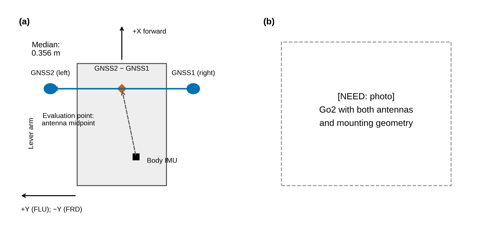
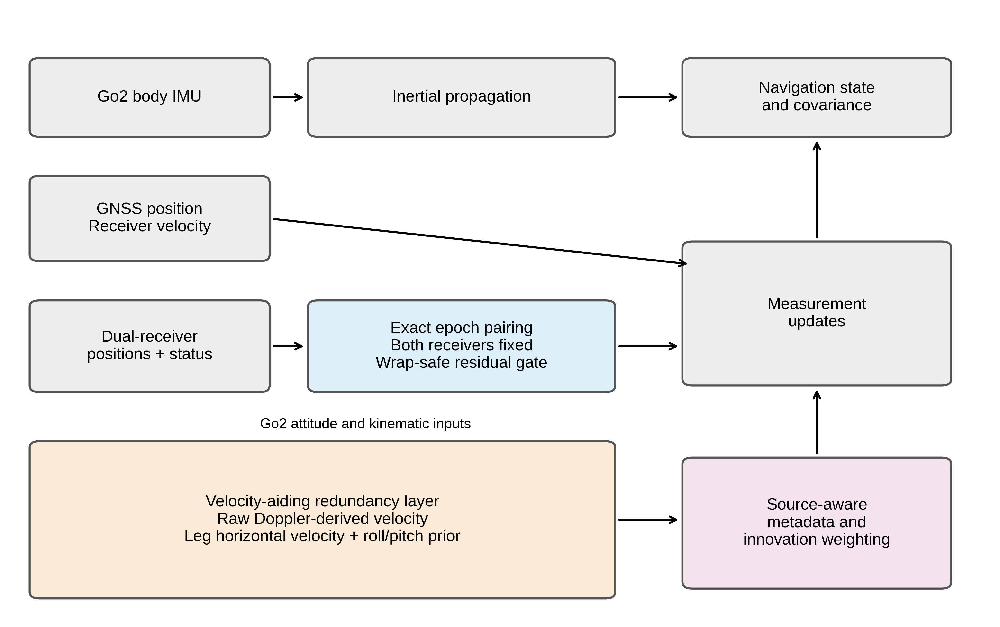
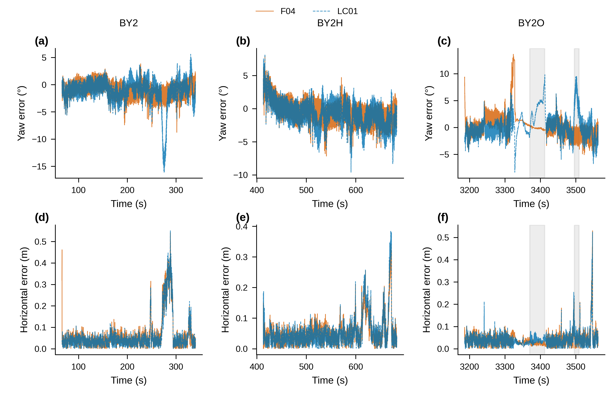
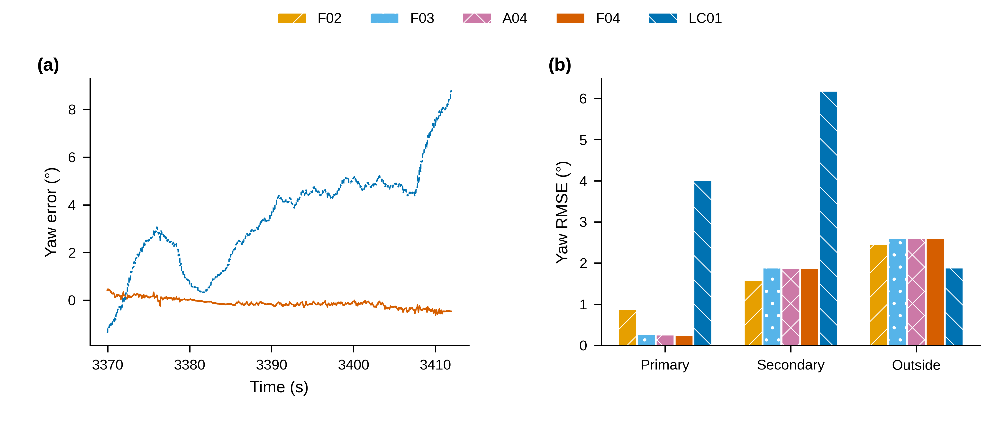
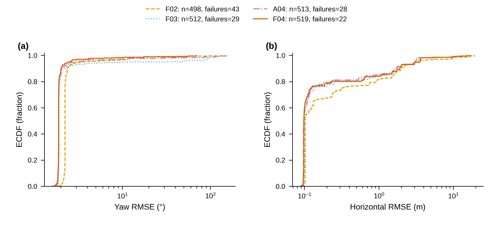
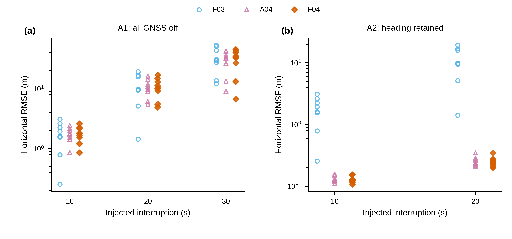

# Low-cost short-baseline dual-antenna GNSS/INS navigation for a quadruped robot: receiver-status-driven heading validity and velocity-aiding redundancy

## Abstract

Compact quadruped robots need absolute heading while walking, but a 0.35 m dual-antenna baseline challenges low-cost GNSS attitude sensing. We present an inertial navigation system combining receiver-status-driven heading validity, wrap-safe residual gating, raw-Doppler and leg-velocity redundancy, and bounded source-aware weighting. Parameters established on the primary sequence are applied unchanged to the transfer sequences. F04 heading/horizontal RMSE is 1.886°/0.098 m on BY2, 1.934°/0.068 m on BY2H, and 2.434°/0.055 m on BY2O. Heading is lower than LC01 by 1.11° on BY2 and 0.27° on BY2H, although paired intervals include zero, and comparable on BY2O. The BY2O float segment gives 0.233° versus 4.008°; outside it, the ordering reverses. Under injected position-and-velocity interruptions with heading retained, horizontal median RMSE is 0.177 m versus LC01's 1.407 m. Of 6468 runs, 283 fail: 193 divergence and 90 without valid heading input. Finite statistics retain their denominators. Ambiguity-heading fixing is limited on this baseline, ranging from no valid fixed output to approximately 13%. The reference is the commercial unit's fused output, not an independent reference system. Paired and window-realization intervals bound the interpretation. These outcomes distinguish nominal accuracy from availability during channel loss. The evidence supports usable status-qualified heading and position-aiding redundancy, while exposing installation bias, complete-outage drift, and timestamp sensitivity.

**Keywords:** dual-antenna GNSS; inertial navigation; quadruped robot; heading validity; velocity aiding; measurement uncertainty

## 1 Introduction

An outdoor quadruped must orient its motion in a global frame even when its path is short, slow, or interrupted by standing and turning. A position fix alone does not provide the same information as an absolute heading observation. A robot can stop while its body continues to oscillate with balance control, turn with little translation, or walk with body sway that makes course over the ground a poor substitute for body yaw. A navigation system that does not use LiDAR therefore has a practical reason to seek a heading observation independent of sustained forward motion. The question is how to obtain that observation from hardware small enough for the platform and how to decide when it should enter the estimator. [REF: R10 absolute heading and observability in low-cost ground-robot GNSS/INS]

A lateral pair of GNSS antennas supplies a direct geometric orientation cue. On a compact robot, however, the available separation is short. Small transverse position errors then produce appreciable angular errors, and poor receiver states can corrupt a baseline that still has a finite numerical direction. Carrier ambiguity methods offer a more precise attitude route when their fixing assumptions hold, but output availability is part of their performance. In this study, the external heading comparisons show sparse fixed solutions or unavailable outputs together with large valid-sample errors (Table 7). That observation motivates careful use of receiver-solution geometry; it does not establish that short-baseline carrier attitude is impossible in general.

Walking adds another difficulty. The body IMU, antenna baseline, receiver outputs, and robot attitude estimate do not observe exactly the same point or frame. Their time stamps may describe different stages of message production. Gait motion makes small inconsistencies visible as rapidly varying disagreement. Simply increasing the heading update rate can inject more correlated observations without correcting those physical differences. A useful design must state the antenna transform, define temporal pairing, retain failed validity checks, and keep its reference outside the estimator. These requirements concern measurement construction as much as filter algebra.

The first claim examined here is that receiver-status-driven heading validity, combined with a residual gate, makes low-cost short-baseline heading usable on the walking platform. “Validity” means whether a particular observation is eligible to enter the estimator at that time; it is not a claim about a calibrated probability of overall statistical reliability. The main comparison is therefore supported by nominal errors, paired intervals, and the receiver-degradation segments together. The method is not judged only by whether a whole-window number happens to be the smallest.

The second claim concerns position availability. Raw Doppler and leg-kinematic horizontal velocity form a velocity-aiding redundancy layer, with source-aware covariance weighting providing bounded protection. This layer is a main part of the navigation design. Its purpose is clearest when position or receiver velocity is absent, rather than when nominal heading already has an absolute observation. The controlled interruption results distinguish an outage in which heading survives from one that also invalidates the rotation needed by the robot-velocity prior. They consequently test both the value and the dependency limits of the layer.

The third claim concerns the scope and clarity of the evidence. The study combines recorded sequences, a structured fault matrix, complete internal ablations, and external methods classified by their available outputs. Parameters are fixed before evaluation and transferred unchanged from the primary sequence. The retained statistics reproduce bit-for-bit under the same software version and configuration. Reproducibility is kept distinct from measurement accuracy: a deterministic result can still contain reference uncertainty, installation bias, or an inadequate observation model. Every distribution is therefore read with its denominator, and method differences are interpreted using their retained uncertainty intervals.

The remainder of the article first places the design among GNSS attitude and robot state-estimation approaches. It then describes the platform, observation model, and experiment. Results proceed from nominal sequences to temporal segments, ablations, injected faults, and external comparisons. The discussion separates supported information-path claims from unsupported accuracy generalizations, and the final sections identify the calibration, synchronization, and sensing work needed before broader deployment claims can be made.

## 2 Related work

### 2.1 Dual-antenna heading

Carrier-phase attitude determination exploits the known geometry between antennas. Integer least-squares approaches constrain ambiguity selection by baseline length or orientation, while wrapped least-squares formulations handle the periodic carrier observation directly. The GNSS compass work of Teunissen, the constrained wrapped formulation of Liu and colleagues, the baseline-length-constrained method of Yang and colleagues, and the misalignment-aware heading module of Wu and colleagues represent relevant information structures. [REF: R01 Teunissen GNSS compass integer least squares] [REF: R02 Liu constrained wrapped least squares] [REF: R03 Yang baseline-length-constrained ambiguity resolution] [REF: R04 Wu constrained ambiguity and misalignment compensation]

Moving-base RTK provides a related practical route through relative positioning, but it should not be treated as an interchangeable implementation of every constrained-attitude algorithm. Its reported solution state and availability must accompany an angular error. A comparison restricted to fixed epochs answers a different question from a navigation filter propagated over a complete window. The present work accordingly retains valid-output and causal-hold errors beside availability. Position-difference heading avoids an additional ambiguity state in the navigation filter, but its uncertainty reflects the receiver position solutions and the short geometric baseline. It therefore needs an explicit eligibility rule rather than an assumption that every position pair yields a usable heading. [REF: R09 RTKLIB moving-base implementation and solution states]

### 2.2 GNSS/INS on ground and legged robots

Loosely coupled GNSS/INS estimation incorporates receiver solutions as position or velocity observations, whereas tightly coupled estimation works more directly with satellite measurements. These arrangements have different availability and modelling requirements; a Doppler-derived velocity factor alone does not turn an otherwise solution-level architecture into a complete tightly coupled carrier estimator. Maintained software such as KF-GINS provides a useful mechanization and error-state filtering basis, while GINav supplies an openly documented integrated-navigation implementation. [REF: R06 KF-GINS mechanization and error-state model] [REF: R07 Chen Chang Chen GINav]

The two-position-receiver invariant filter of Pavlasek and colleagues is especially relevant because the relative antenna vector carries orientation information without requiring an independent scalar heading product. [REF: R05 two-receiver invariant GNSS/INS filter and its experimental noise parameters] Its observation structure differs from scalar-heading gating, and its process-noise assumptions must be retained when describing a transferred literature configuration. Our comparison therefore identifies the implementation, parameter source, output point, and start convention. These conditions delimit what can be inferred from a nominal error difference; they are not details that can be omitted once a method name has been assigned.

### 2.3 Proprioceptive legged state estimation

Contact-aided invariant filtering uses inertial sensing and kinematic contact constraints to estimate the motion of a legged robot. The work of Hartley and colleagues provides both a theoretical treatment and an implementation for this setting. [REF: R08 Hartley contact-aided invariant EKF] Such estimators can constrain relative motion during stance, but without an absolute anchor their global translation and heading have gauge freedoms. A comparison with a globally referenced GNSS/INS trajectory must therefore define an initial alignment and report relative drift separately from absolute navigation error.

Input quality is central to that transfer. Joint encoders, link geometry, contact decisions, and foot positions computed by a high-level robot interface are not interchangeable measurements. When only the latter interface is recorded, a contact-filter result includes the limitations of that input representation. Kinematic dead reckoning driven by the robot's own attitude is useful as a separate input comparison, but it cannot establish an independent accuracy bound for the filter. Our supplementary results preserve the official library, the default-parameter alternative, and the in-house port as distinct identities.

### 2.4 Quality-aware weighting and residual checks

GNSS/INS systems commonly use measurement uncertainty, receiver status, and innovation consistency to control the effect of suspect observations. Adaptive covariance and fault-detection approaches differ in whether they diagnose a source, downweight a residual, or exclude a measurement. A residual alone generally cannot identify the origin of an inconsistency when several sensor updates affect the same state. [REF: R11 innovation-based fault detection and exclusion] [REF: R12 Yin adaptive covariance monitoring and isolation]

The present design combines a physical observation-validity condition with a bounded innovation-based covariance policy. It does not claim a general fault-isolation solution or introduce source-aware weighting as the main theoretical novelty. The contribution lies in the concrete combination of short-baseline heading admission and complementary velocity paths, with evidence that includes conditions where the added paths are neutral or unavailable. This framing also motivates paired uncertainty statements: a changed point estimate is insufficient to infer a transferable improvement when the comparison shares temporal structure and a non-independent evaluation reference.

## 3 Platform, sensors and data

### 3.1 Walking platform and antenna geometry

The experimental platform is a Unitree Go2 quadruped carrying a compact dual-antenna GNSS/INS unit. The navigation system considered here uses no LiDAR input. Its principal geometric constraint is the limited antenna separation that can be accommodated on the robot. The installation is therefore representative of a compact walking platform rather than a vehicle carrying a long attitude baseline. Body motion includes translation, turning, and gait-related angular motion. These motions make an instantaneous baseline direction useful but also expose differences between the clocks, frames, and physical output points of the available sensors.

GNSS1 is mounted on the robot's right and GNSS2 on its left. The baseline vector is always GNSS2 minus GNSS1. It points along positive lateral body Y in the forward-left-up convention; the corresponding lateral direction is negative Y after conversion to forward-right-down. This distinction matters because the inertial navigation implementation uses the latter convention. A lateral baseline is not a direct observation of forward body heading. Antenna ordering and the physical angular transformation are fixed from the installation; neither is selected by comparing navigation errors. Figure 1 shows the coordinate conventions explicitly, including the difference between the IMU origin and the point used for evaluation.

The nominal separation is 0.35 m. The sequence-specific median lengths, rounded for display, are given in the geometric annotation of Figure 1. Small differences between measured baseline lengths do not authorize a separate heading offset for each sequence. The physical installation remains the same, and the median length enters the transformation of the output point. The lever arm from the body IMU to GNSS1 is specified in the installation configuration. Moving from that antenna to the midpoint subtracts half the lateral baseline. Thus, with body-to-navigation rotation C and median baseline length b, the evaluated point is the IMU position plus C times the vector [ 0.03, 0.03 − b/2, -0.30 ] m in forward-right-down coordinates. This transformation is geometric; it is not a fitted alignment to the reference.

**Fig. 1.** Platform geometry. The schematic shows the right and left antennas, the baseline GNSS2−GNSS1, the body IMU, and the antenna-midpoint evaluation point. The baseline median on BY2 is 0.356 m; the corresponding values are 0.354 m on BY2H and 0.350 m on BY2O. The IMU-to-GNSS1 lever is [ 0.03, 0.03, -0.30 ] m in forward-right-down coordinates; the midpoint lever subtracts b/2 from its lateral component. The top-view separation and IMU location are schematic, not a dimensional installation drawing. Panel (b) is reserved for an author-supplied photograph: [NEED: photo].

### 3.2 Observation streams and reference

The estimator receives the high-precision Earth-centred position messages of both GNSS receivers and their carrier-solution states from NAV-PVT. The heading observations use the raw position streams at 5 Hz. Receiver velocity is a separate observation channel. Satellite observations from GNSS1 also support a Doppler-derived velocity channel. These channels are distinguished by their information and processing paths, even though they may respond to a common satellite visibility loss. Describing them as redundant does not imply statistically independent errors.

Propagation uses the Go2 body IMU, not the IMU embedded in the commercial GNSS/INS unit. [NEED: verify the delivered body-IMU sampling rate from the acquisition documentation; the runtime configuration declares 500 Hz, which is not a measurement of the delivered stream.] The robot supplies body attitude and motion information used as weak priors. For the contact-based external comparison, foot positions come from high-level messages and contact is inferred by thresholding foot forces. Joint encoder records needed for an independent reconstruction of forward kinematics are absent. These inputs are consequently described by their actual message-level origin, without presenting them as a complete instrumented leg model.

The evaluation reference is the fused navigation output of the commercial low-cost dual-antenna GNSS/INS receiver (Fixposition Vision-RTK 2), which the estimator under test does not read. The raw GNSS observations used by the estimator come from the two receivers within that same unit. The reference is the unit's own fused output. It is therefore not an independently measured reference. Its disagreement with an estimator includes the uncertainties of both systems and their time and frame transformations. Section 5.5 gives the measurement-uncertainty statement used when interpreting all absolute errors and paired differences.

The separation between observation and reference roles is operational as well as terminological. The reference does not initialize the estimator, select the antenna transform, choose an observation-validity flag, or determine the noise settings. A reference-derived trajectory is not supplied as a velocity or attitude prior. The evaluation can therefore compare the retained outputs without introducing a feedback route from the reference into the method under test. At the same time, using distinct software paths inside a common instrument does not remove possible correlated errors in the observations and reference.

### 3.3 Sequence preparation and motion

The observation chain uses observation-epoch timing instead of reception-time tags [NEED: verify the quoted 0.205 s correction against a directly citable timing field] and uses position measurements at 5 Hz. The sensor-noise calibration was carried out without the evaluation reference on BY2. Its settings were then applied unchanged to BY2H and BY2O. A transfer sequence is not assigned a new noise model merely because its final navigation errors differ. The attitude conventions and output-point transformation are likewise held fixed. Calibration details and their limits are collected in Table S1 rather than mixed into the method's structural description.

Table 1 distinguishes the time window, the estimator's retained epoch count, and the reference path length. The counts are not interchangeable with a nominal sensor rate multiplied by duration. The mean speed and yaw-rate RMS are recorded motion summaries; the distance comes from the existing reference-path summary, without integrating a new trajectory. BY2 is the primary sequence, BY2H supplies a transfer window, and BY2O contains the receiver degradation intervals analysed separately below. BY2H uses the contract start at 413 s and ends at 683 s. File-start alternatives remain supplementary rows, not substitute main results.

**Table 1.** Recorded sequences and motion. Epochs refer to the F04 evaluation support. Reference distance, mean receiver speed, and body yaw-rate RMS are different recorded quantities and need not satisfy an exact distance–speed identity.

| Sequence | Window (s) | Duration (s) | Epochs (F04) | Reference distance (m) | Mean speed (m/s) | Yaw-rate RMS (deg/s) | Character |
| --- | --- | --- | --- | --- | --- | --- | --- |
| BY2 | [66, 340] | 274 | 56642 | 328.471 | 1.190 | 18.000 | Primary calibration sequence |
| BY2H | [413, 683] | 270 | 58580 | 325.514 | 1.200 | 17.500 | Transfer sequence; contract start |
| BY2O | [3186, 3563] | 377 | 76548 | 337.422 | 0.890 | 15.400 | Antenna degradation and stationary interval |

## 4 Method

### 4.1 Navigation state and inertial propagation

The estimator is an error-state extended Kalman filter built on the maintained GNSS/INS mechanization. Its nominal state contains position, navigation-frame velocity, body attitude, gyroscope and accelerometer biases, and inertial scale-factor states. Attitude is propagated as a quaternion and represented by a body-to-navigation rotation matrix when projecting vectors. The associated error state consists of position error, velocity error, a small attitude error, and errors in the inertial bias and scale terms. These state blocks are carried consistently through propagation, measurement Jacobians, and feedback. Adding a heading or velocity observation does not replace the inertial state with another algorithm's output.

For transition matrix Φ and discrete process covariance Q, the implementation predicts the error covariance and error-state estimate as

\[
P^- = \Phi P^+\Phi^\mathsf{T}+Q,\qquad
\delta x^- = \Phi\delta x^+.
\]

The observation code constructs a prediction-minus-observation residual z, Jacobian H, and measurement covariance R. The correction follows

\[
S=HP^-H^\mathsf{T}+R,\quad K=P^-H^\mathsf{T}S^{-1},\quad
\delta x^+=\delta x^-+K(z-H\delta x^-).
\]

The covariance uses the Joseph form,

\[
P^+=(I-KH)P^-(I-KH)^\mathsf{T}+KRK^\mathsf{T}.
\]

These equations state the implemented correction convention. Position and velocity corrections are subtracted from their nominal states, while the small rotation is applied by left quaternion multiplication; bias and scale corrections are added. A residual sign that appears conventional in a different filter cannot be substituted without changing the feedback convention and Jacobian together. This is particularly relevant to scalar heading, where an apparently small sign change would make the update rotate in the wrong direction across every valid epoch.

The inertial propagation supplies continuity between asynchronous aiding observations. It does not by itself establish an absolute heading reference, nor does it make an arbitrarily long loss of velocity aiding benign. The observation model must therefore address two separate problems: when a geometric heading should be admitted, and which velocity information can still constrain drift when a GNSS channel is absent. Figure 2 displays these paths as separate parts of the estimator. The uncertainty parameters used in propagation are fixed configuration quantities, listed in Table S1.

**Fig. 2.** Estimator information flow. Body-IMU propagation is corrected by GNSS position and receiver velocity, status-qualified scalar heading, and the velocity-aiding redundancy layer. Raw Doppler, horizontal leg velocity, and roll/pitch priors retain their own validity and covariance metadata. Source-aware weighting acts on enabled measurement sources before their updates; it does not produce a replacement trajectory or an absolute yaw prior from the robot.

### 4.2 GNSS position and receiver-velocity updates

Position is observed at the antenna, whereas the inertial state is centred at the body IMU. Let p denote geodetic IMU position, l the body-frame lever arm, and D the local mapping from geodetic displacement to navigation-frame metres. The position residual used by the filter is

\[
z_p=D\{p+D^{-1}C l-p_{\mathrm{GNSS}}\}.
\]

Its position block is the identity, and its attitude block is the skew-symmetric matrix of C l under the implemented attitude-error convention. Receiver-reported position uncertainty supplies the diagonal observation covariance before any enabled source-aware inflation. The lever arm thus enters both the predicted measurement and its sensitivity to attitude error. Treating the antenna observation as if it occurred at the IMU would instead put installation geometry into the navigation residual.

Receiver velocity is modelled at the antenna with the implemented rotational lever-arm correction. Its residual is the predicted antenna velocity minus the supplied navigation-frame receiver velocity. This observation is distinct from satellite Doppler-derived velocity, even though a receiver's internal velocity solution may itself use Doppler. The distinction here concerns the supplied observation path, its metadata, and its availability during the controlled faults. The basic heading configuration omits the receiver-velocity update, while the stronger backbone includes it; Table 2 makes that difference explicit.

Position, heading, and receiver velocity are processed at eligible GNSS epochs according to their configuration switches and validity conditions. An absent observation is not replaced with a zero-valued measurement. Nor does the position update silently acquire the reference position. The processing order and subsequent feedback follow the implemented filter, which is why the configuration ladder should be read as a set of concrete update paths rather than names for abstract algorithm families.

### 4.3 Receiver-status-driven heading validity and residual gating

The measured lateral baseline is b = p₂ − p₁. In local north/east components, the physical transformation represented by the implementation can be written as a wrapped body-heading observation obtained from atan2(b_E,b_N) plus the lateral-to-forward angular offset. The offset is 90 degrees under the stated antenna ordering and navigation convention. Equivalently, the intermediate body-candidate convention uses −atan2(b_E,b_N), followed by the stated east-to-north heading conversion. This is a coordinate transformation, not a fitted correction to make a heading trace agree with the reference.

A raw baseline is eligible only when the receiver records have exactly equal integer iTOW values and both NAV-PVT carrier states indicate RTK fixed. Missing position pairs and missing state records are invalid. A float state is not accepted as a fixed baseline merely because its numeric direction is finite. The implementation does not interpolate a missing raw pair, replace it by a neighbouring epoch, or estimate a time shift to recover a match. Prescribed heading-outage and dropout masks are applied in addition to these requirements. Eligibility is decided from the observation stream before looking at a navigation error.

For an eligible observation ψ_obs and predicted yaw ψ_pred, the heading residual is

\[
z_\psi=\operatorname{atan2}\{\sin(\psi_{\rm pred}-\psi_{\rm obs}),
\cos(\psi_{\rm pred}-\psi_{\rm obs})\}.
\]

The heading Jacobian has the negative yaw-attitude coefficient required by the feedback convention. Wrapping the residual prevents an update from interpreting two headings separated only by the angle representation boundary as a full-turn disagreement. It does not validate a physically incorrect baseline; the eligibility test and residual gate remain necessary.

The per-row standard deviation is first floored at 0.5°. The gate has separate thresholds for observation uncertainty and absolute residual. The soft thresholds are 3.0° in standard deviation and 6.0° in residual; the hard thresholds are 6.0° and 15.0°, respectively. Reaching either hard threshold rejects the heading update. Otherwise, reaching either soft threshold inflates the heading variance by the fixed downweight factor, while an observation below both soft thresholds retains its baseline variance. The equality cases therefore belong to the downweighted or rejected category, not to the less restrictive category.

The resulting scalar covariance is the gate multiplier times the squared, floored observation standard deviation. Enabled source-aware weighting can inflate it further, but cannot turn a heading rejected by the hard gate back into an accepted measurement. This ordering distinguishes a physical validity decision from a statistical residual decision. Both receivers may report a fixed solution while the instantaneous innovation is too large to admit; conversely, a small innovation does not rescue a baseline whose receiver status fails the eligibility rule.

The thresholds have practical failure modes. A navigation prediction contaminated by a different observation can make a valid heading appear inconsistent. The gate then protects the current prediction instead of correcting it. The fault results explicitly retain such outcomes. The method does not claim that a residual test can uniquely identify the faulty sensor in every coupled navigation state, or that a receiver-state flag is a calibrated probability of a correct heading.

### 4.4 Velocity-aiding redundancy and robot priors

The velocity-aiding redundancy layer is a main component of the method. It combines a satellite-observation path with a robot-motion path so that losing a receiver solution does not necessarily remove every velocity constraint. The raw Doppler factor consumes velocity derived from GNSS1 RAWX/SFRBX observations. In the filter, it is a navigation-frame velocity measurement rather than a direct carrier-phase ambiguity state. The factor requires a valid observation, valid lineage metadata, and an available provider status. Its residual is the estimated navigation velocity minus the Doppler-derived velocity, with positive component standard deviations used to form the covariance.

This arrangement preserves a distinction between how the velocity was obtained and how it enters the filter. The estimator does not solve an additional integer ambiguity problem inside the Doppler update. It also does not infer the satellite velocity observation from its own navigation output. Satellite count, reported uncertainty, and provider status remain available to the weighting policy. A receiver velocity outage and a Doppler outage can therefore be represented as distinct faults, while a combined interruption can remove both paths.

The horizontal robot-velocity prior is prepared from body-frame velocity in forward-left-up coordinates. With Go2 roll φ, pitch θ, status-derived navigation heading ψ, and a fixed scale k_HV, the implemented transformation is

\[
v_{H}^{n}=\Pi_H\left[k_{\rm HV}R_z(\psi)R_y(-\theta)R_x(\phi)
\operatorname{diag}(1,-1,-1)v_{\rm FLU}\right],
\]

where Π_H retains only the horizontal navigation components. The sign on pitch and the forward-left-up to forward-right-down conversion belong to the physical model. The prior supplies neither a vertical velocity constraint nor a direct Go2 yaw observation. Its scale and standard-deviation proxy are given in Table S1, along with the warning that the latter is not an independently identified white-noise parameter.

The heading used in preparing this prior comes from the status stream outside the solver. It is not automatically replaced by each scalar raw-heading observation. The prior is scheduled at GNSS epochs. Linear interpolation of the preparation heading is invalid within an open interval whose gap exceeds 1.2 s, while the original endpoints remain eligible. A complete loss of this preparation heading makes the horizontal prior invalid. These dependencies are essential to interpreting the interruption tests: a channel may remain enabled in the configuration but have no eligible observation during an outage.

The roll/pitch weak prior uses the robot attitude with the coordinate conversion [roll, −pitch]. Its update constrains tilt while leaving yaw to the inertial and GNSS observation model. Body attitude and kinematic velocity are treated as fallible prior information, not as a reference. Their quality flags and active-row conditions are retained. In particular, the velocity loader requires an active source and an enabled update flag, and the horizontal policy disables the vertical component. The layer therefore has a deliberately limited role: it provides additional constraints when their input conditions are met, without asserting a complete contact or joint-kinematic model inside the navigation filter.

### 4.5 Source-aware covariance weighting

Source-aware weighting is a bounded protection mechanism applied to enabled receiver position, receiver velocity, dual-antenna heading, raw Doppler velocity, roll/pitch, and horizontal-velocity updates. It uses observation metadata and the innovation relative to its predicted covariance. It does not assign weights using the offline navigation errors, an external trajectory, or a known fault label. The same decision rule is used on clean and perturbed inputs.

The metadata branch rejects invalid sources and unavailable providers. It can inflate covariance when uncertainty metadata are missing or non-finite, time alignment is suspicious, a quality flag is non-nominal, or a source-specific condition indicates reduced confidence. For raw Doppler, such conditions include low satellite support and large velocity uncertainty. Heading has antenna-validity and standard-deviation conditions, and the robot priors have provider-availability and uncertainty conditions. Only metadata actually supplied by the active update path can trigger those rules; the presence of a field in a policy interface does not establish that every sensor produces that field.

The innovation branch uses the predicted innovation covariance rather than normalizing solely by measurement variance. Above a deadband, a source-dependent conservative quadratic rule increases covariance inflation, with additional scaling at the moderate and strong innovation levels. A rolling innovation baseline is maintained for diagnostics; it is not a reference trajectory and cannot identify an error by comparison with an offline score. The active configuration does not enable rejection solely because an innovation exceeds the optional extreme-innovation criterion.

Let a_meta and a_innov be the two inflation factors and a_cap the smaller of the source and global caps. The applied multiplier is

\[
a=\min\{a_{\rm cap},\max(1,a_{\rm meta},a_{\rm innov})\},\qquad R'=aR.
\]

Thus the combination uses the larger inflation, not their product, and never shrinks the nominal covariance. Caps limit how much any source can be suppressed. These choices make the policy protective and interpretable, but they do not guarantee correct fault isolation. The results below test whether the weighting changes errors or completion under the prescribed conditions; nominal heading parity is reported as parity rather than recast as an improvement.

### 4.6 Configuration ladder and identities

Table 2 defines the five displayed configurations. F01 is the receiver-position/velocity inertial baseline without direct dual-antenna heading. F02 adds the basic heading path while omitting receiver velocity. F03 includes receiver velocity and the residual-gated heading backbone. A04 adds the raw Doppler and robot-prior paths without source-aware weighting. F04 enables the complete configuration. Consequently, the F02-to-F03 comparison is a backbone comparison, not an isolated test of the roll/pitch prior. The latter is absent from F03. Leave-one-component-out configurations in Table S3 provide the additional identities needed to assess individual update paths.

The ablation bits are ordered raw Doppler, source-aware weighting, roll/pitch, and horizontal velocity. F03 is equivalent to A02 with all four bits off; F04 is equivalent to A01 with all four on; A04 retains all except source-aware weighting. Aliases do not create independent runs or extra observations. The method is identified by its measurement paths and fixed configuration, rather than by selecting the most favourable alias for each sequence.

**Table 2.** Configuration ladder. All rows use inertial propagation. “On” denotes an enabled update path, subject to its observation-validity conditions.

| Method | GNSS position | Receiver velocity | Heading | Residual gate | Raw Doppler | Source-aware | Roll/pitch | Horizontal velocity |
| --- | --- | --- | --- | --- | --- | --- | --- | --- |
| F01 | On | On | Off | Off | Off | Off | Off | Off |
| F02 | On | Off | On | Off | Off | Off | Off | Off |
| F03 | On | On | On | On | Off | Off | Off | Off |
| A04 | On | On | On | On | On | Off | On | On |
| F04 | On | On | On | On | On | On | On | On |

## 5 Experimental design

### 5.1 Evaluation quantities and temporal support

The primary quantities are whole-window heading, horizontal-position, and up-position RMSE at the antenna midpoint. The position errors are expressed in a local navigation frame. Heading uses the stated conversion from reference east-based yaw to navigation heading and a wrapped angular difference. For retained error samples e_i, scalar RMSE is the square root of their mean squared value. Horizontal RMSE is computed from squared north and east components together, rather than from the mean of separate component RMSEs. The up coordinate is reported separately so that a horizontal-only aiding mechanism is not credited with vertical information it does not supply.

Reference values in the existing evaluation are linearly interpolated at retained estimator epochs within the common support. The denominator is the number of retained matched epochs. For between-method uncertainty comparisons, the retained error series are intersected at common time stamps; their aligned support is distinct from each method's original whole-window support. Slight differences between a table RMSE and a paired-series RMSE can therefore arise from temporal support, without changing either result. The paired intervals in Table S9 preserve the common-epoch counts on which they were calculated.

The windows are fixed for each sequence before evaluating configuration differences. They are not shortened to omit a large residual or to remove a temporary loss of aiding. Natural degradation intervals within BY2O are reported as segments in addition to the full window. Their primary, secondary, and complementary outside regions are retained together. This prevents the interpretation of a favourable segment as if it represented the entire recording.

### 5.2 Natural-sequence comparisons

The sequence comparison asks whether parameters established on the primary recording transfer without adjustment. BY2, BY2H, and BY2O retain their distinct windows and motion characteristics in Table 1. No shared average is used to hide a reversal between sequences. The principal navigation table includes the internal ladder, a two-receiver loosely coupled baseline, and a single-receiver variant. The external comparison expands the set of output types, with the associated differences in evaluation support explained below.

The study uses each recorded sequence as a single realization. A large retained epoch count improves the description of that realization but does not create the same number of independent environmental trials. Gait motion, slowly varying heading disagreement, and outage recovery introduce temporal dependence. Absolute levels are therefore accompanied by moving-block intervals, and statements about paired differences are based on the aligned difference series. The intervals concern variation across windows of a similar kind under the resampling model, not an assurance of performance at a new site or on another robot.

### 5.3 Controlled faults and interruption families

The core evaluation consists of 541 registered cases per configuration. These comprise 540 cases with controlled faults injected into measured sequences, plus the clean case. The design contains 60 fault types and 9 seeds per type. Each type specifies the affected source, operation, and amplitude or duration. Seeds control the prescribed realization and anchor selection. A configuration change is not itself a fault type. The family summary is given in Table 3, with every type and seed anchor in Table S2.

**Table 3.** Core fault families. Counts are registered cases per configuration, regardless of whether the resulting run is finite. Type definitions and injection parameters appear in Table S2.

| Family | Types | Injected channels | Cases per method |
| --- | --- | --- | --- |
| gnss outage | D01, D02, D03, D04, D05, D06, D07 | dual_yaw, gnss_position, receiver_velocity | 63 |
| gnss sampling | D08, D09, D10, D11, D12 | dual_yaw, gnss_position, receiver_velocity | 45 |
| position value | D13, D14, D15, D16, D17, D18, D19, D20, D21, D22 | gnss_position | 90 |
| position std status | D23, D24, D25, D26, D27, D28, D29 | gnss_position, gnss_position_std, gnss_status_quality_flags | 63 |
| dual yaw | D30, D31, D32, D33, D34, D35, D36, D37, D38, D39, D40, D41 | baseline_metadata, dual_antenna_baseline_quality, dual_antenna_relpos, dual_yaw, dual_yaw_std, one_seed_selected_gnss_antenna_position | 108 |
| velocity raw doppler | D42, D43, D44, D45, D46, D47, D48, D49, D50 | raw_doppler_uncertainty, raw_doppler_velocity, receiver_velocity, receiver_velocity_std | 81 |
| go2 prior metadata | D51, D52, D53, D54, D55, D56 | go2_contact, go2_foot_force, go2_foot_speed_metadata, go2_gait_metadata, go2_horizontal_velocity_weak_prior, go2_mode, go2_roll_pitch_weak_prior | 54 |
| multi source mixed | D57, D58, D59, D60 | dual_yaw, gnss_position, raw_doppler_velocity, receiver_velocity, selected_source_timestamps, uncertainty_fields, velocity_sources | 36 |

The additional interruption design separates complete GNSS loss from loss of position and velocity while retaining heading. Family A1 contains 27 cases: position, receiver velocity, raw Doppler, and heading are disabled together. Family A2 contains 18 cases: position, receiver velocity, and raw Doppler are disabled, but the heading channel remains available. These are injected interruptions on a measured sequence, not naturally recorded outages. The distinction also controls the eligibility of a horizontal velocity prior whose rotation depends on the heading stream.

The fault design distinguishes corrupted values from overconfident or pessimistic uncertainty, from status degradation, and from missing observations. These are different experiments. For example, increased position uncertainty with unchanged position values does not have the same effect as large position noise assigned a small covariance. Similarly, a heading-only interruption leaves different constraints available from a combined position, receiver-velocity, and heading interruption. The result discussion names the relevant type rather than treating every interruption as interchangeable.

Heading perturbations on the raw observation grid follow the prescribed source-time-cell mapping; they are not independently redrawn at every inserted observation. Standard-deviation perturbations apply at their defined original rows. The horizontal-velocity preparation retains its status-heading rotation and the defined injected conditions. The tests therefore examine the implemented dependency graph, not an idealized collection of independently switchable sensors. Timestamp perturbations are especially sensitive to these paths, and their unequal exposure across methods is retained as a limitation.

### 5.4 External methods and comparable outputs

The external comparison covers short-baseline heading solvers, contact-aided quadruped state estimation, a loosely coupled two-receiver GNSS/INS filter, single-antenna GNSS/INS methods, and a kinematic dead-reckoning input reference. The heading group includes constrained ambiguity and wrapped-baseline approaches represented by EXT01–EXT04 and an unmodified RTKLIB moving-base configuration. The contact-aided main row uses the official RossHartley/invariant-ekf library with literature parameters. The loosely coupled row is LC01; EXT05C and GINav represent single-receiver alternatives. LEG-DR is an input reference and is not presented as another published filter.

Available original implementations are kept unmodified; the comparison records the identity of the maintained implementations for the remaining methods. Literature parameters are not tuned against these evaluation errors. In particular, LC01 uses IMU process noise from the original paper's experiment, not a new calibration for the Go2 body IMU. Differences from the proposed method therefore include that transfer condition. The accuracy of a method as implemented here must not be conflated with the best accuracy attainable after redesigning its sensor model for this platform. [REF: R05 two-receiver invariant GNSS/INS filter and its experimental noise parameters]

Outputs fall into three evaluation classes. Heading-only outputs are scored by valid-output availability, RMSE on their valid samples, and a separately retained causal-hold heading error. Navigation outputs are compared by whole-window heading, horizontal, and up RMSE, with their support counts. Relative-pose outputs use an initial yaw-and-translation alignment and report drift and aligned error. These metrics answer different questions. A method that yields a small error on a sparse valid subset cannot be ranked directly against a full-window navigation solution without displaying its availability.

The relative-pose alignment is applied only at the start, over the recorded initial alignment interval; it is not a full-trajectory fit. Position drift is the slope of horizontal error against cumulative reference distance, expressed per unit distance, rather than simply the endpoint error divided by path length. A negative fitted drift slope does not imply negative position error. LEG-DR uses the robot's onboard attitude and the contact-kinematic velocity input without a filter, which makes it a useful input comparison but not an independent performance ceiling for contact-aided estimation.

### 5.5 Measurement uncertainty

**Measurement uncertainty.** The evaluation reference is the fused navigation output of the commercial low-cost dual-antenna GNSS/INS receiver (Fixposition Vision-RTK 2), which the estimator under test does not read. Its heading uncertainty is taken as 1.1° (the manufacturer's 0.4° at 1 m scaled to the 0.35 m antenna separation; the receiver's own reported attitude standard deviation is 0.9–1.0°), and its position uncertainty as 0.02–0.05 m (RTK accuracy indicator and reported covariance). These terms are common to every row and cancel in paired comparisons, but they bound the absolute values. Decomposing the retained error series reveals two further common-mode terms: a motion-induced heading component below 5 s of 1.1–1.4° RMS, identical for all thirteen estimators and falling to 0.06° when the robot stands still, and an along-track position offset of 0.03–0.04 m; they account for about half of the heading and one fifth of the horizontal mean-square error. Heading biases of 0.3–1.4° differ between estimators and reflect an uncorrected installation yaw between the IMU axes and the antenna baseline. The reported values are exact for the recorded windows and reproduce bit-for-bit under the same software version and configuration; as estimates for other windows of the same kind they carry moving-block bootstrap 95% intervals of about ±0.3° (BY2, BY2H) and ±1° (BY2O) in heading and up to ±0.05 m in horizontal position. Differences between methods on the same sequence are therefore reported with paired bootstrap intervals rather than a fixed threshold, and fault-matrix quantiles are resampled by fault type rather than by case.

The word “common” in this description identifies components shared by the evaluation arrangement. It does not, by itself, prove cancellation in a difference of squared errors or RMSEs. If a common reference contribution c is added to two errors a and b, their signed difference removes c, whereas their squared-error difference also contains the cross term involving c and a−b. The retained paired intervals are therefore computed from the actual aligned squared-error sequences; no estimated reference variance is subtracted from the reported RMSE. The similar fast components support a common evaluation contribution, but their physical cause is not identified here.

### 5.6 Reporting and decision language

Finite-result summaries always retain the registered denominator and the number of algorithm failures. A failed run is not assigned an error of zero, nor is its last finite prefix substituted for a completed whole-window result. The empirical distribution describes the finite outcomes; the failure count describes the remaining outcomes. Neither alone is a sufficient account of a configuration. Paired case differences require both methods to be finite for the same case identifier, so their denominator can differ from either marginal distribution.

The seed dispersion uses the sample standard deviation within a type. Whole-matrix quantiles are accompanied by intervals that resample fault types, preserving their clustered seeds. A naive case bootstrap is retained only as a sensitivity comparison. The block analysis of a time series instead preserves local temporal dependence. These two resampling schemes address different units of variation and are not pooled into a single uncertainty number. Table S9 gives the retained absolute-window and paired intervals.

The interpretation follows the supplied distinguishability rule. A resolved difference is stated with its direction, magnitude, and interval. A directional observation whose interval includes zero is explicitly described as such. A practically negligible or parity-class comparison is described as comparable. The same wording is used when the proposed configuration has the larger point estimate. No claim of a percentage improvement is made from a ratio of errors that include common reference and installation contributions.

## 6 Results

### 6.1 Nominal navigation on the three sequences

Table 4 reports the internal ladder and principal navigation baselines. F04 heading RMSE is 1.886°, 1.934°, and 2.434° on BY2, BY2H, and BY2O. The corresponding horizontal errors are 0.098 m, 0.068 m, and 0.055 m. These absolute levels include the uncertainty of the reference and evaluation geometry; they are not estimates of an intrinsic error floor for the algorithm.

Against LC01 on BY2, F04 is lower in heading by 1.11° on this window. With the difference oriented F04 minus LC01, the paired interval is [ -2.57, 0.22 ]°, which includes zero. The excess error in LC01 is concentrated in heading-wander episodes visible in Figure 3, rather than being a uniform offset between the curves. A narrower statement about this window is supported; a general superiority claim over other windows is not.

On BY2H, F04 is lower by 0.27° on this window, and the oriented paired interval [ -0.51, 0.05 ]° again includes zero. The main LC01 row uses the same contract start as the study window. Its alternative file-start result is retained in Table S5. The auxiliary geometric audit for the dual-receiver baseline has a recorded limitation on this sequence, so the finite evaluation result is reported with that limitation rather than silently promoted to an unrestricted geometry validation.

On BY2O, F04 and LC01 are comparable over the full window: 2.434° and 2.454°, respectively. This whole-window result immediately requires the segment qualification: F04 has lower heading disagreement within the receiver-float intervals, whereas LC01 has the lower error outside them (Table 5). The full-window pair is therefore a cancellation of different temporal behaviours, not evidence that both methods followed the same heading trajectory.

Horizontal position is comparable across F04 and LC01 on all sequences in the practical interpretation of the paired intervals. This conclusion does not imply identical sample paths. It states that the observed differences are small relative to the uncertainty and application scale discussed in Section 5.5. The single-receiver EXT05C has heading RMSE 12.049°, 20.108°, and 5.846°. Its position agreement alone would therefore hide weaker heading performance (Table 4).

LC01 has lower roll RMSE than F04 on all sequences and lower pitch RMSE on BY2 and BY2O, as retained in Table S5c. On BY2H its pitch RMSE is 1.825°, compared with 1.698° for F04. The proposed method is not uniformly preferable across attitude axes. This observation is consistent with a design whose principal added absolute information is scalar heading and whose robot attitude enters only as a weak tilt prior. Reporting the roll/pitch result prevents a yaw-focused comparison from becoming an unsupported claim about full-attitude accuracy.

**Table 4.** Whole-window navigation RMSE at the antenna midpoint. BY2H uses the contract-start baseline rows. Epoch counts refer to each row's original matched support; paired intervals use the common support in Table S9. LC01 retains its BY2H auxiliary geometric-audit limitation. F01 has no direct heading update.

| Sequence | Method | Yaw RMSE (deg) | Horizontal RMSE (m) | Up RMSE (m) | Epochs |
| --- | --- | --- | --- | --- | --- |
| BY2 | F01 | 8.090 | 0.092 | 0.048 | 56642 |
| BY2 | F02 | 2.232 | 0.102 | 0.048 | 56642 |
| BY2 | F03 | 1.916 | 0.100 | 0.048 | 56642 |
| BY2 | A04 | 1.886 | 0.097 | 0.050 | 56642 |
| BY2 | F04 | 1.886 | 0.098 | 0.049 | 56642 |
| BY2 | LC01 | 2.995 | 0.098 | 0.051 | 58014 |
| BY2 | EXT05C | 12.049 | 0.088 | 0.056 | 58014 |
| BY2H | F01 | 7.137 | 0.063 | 0.045 | 58580 |
| BY2H | F02 | 2.283 | 0.072 | 0.045 | 58580 |
| BY2H | F03 | 1.941 | 0.069 | 0.045 | 58580 |
| BY2H | A04 | 1.934 | 0.070 | 0.046 | 58580 |
| BY2H | F04 | 1.934 | 0.068 | 0.045 | 58580 |
| BY2H | LC01 | 2.209 | 0.075 | 0.045 | 59934 |
| BY2H | EXT05C | 20.108 | 0.069 | 0.051 | 59934 |
| BY2O | F01 | 5.739 | 0.063 | 0.044 | 76548 |
| BY2O | F02 | 2.309 | 0.055 | 0.046 | 76548 |
| BY2O | F03 | 2.432 | 0.055 | 0.044 | 76548 |
| BY2O | A04 | 2.429 | 0.054 | 0.044 | 76548 |
| BY2O | F04 | 2.434 | 0.055 | 0.046 | 76548 |
| BY2O | LC01 | 2.454 | 0.054 | 0.045 | 78441 |
| BY2O | EXT05C | 5.846 | 0.052 | 0.049 | 78441 |

Values are exact for the evaluated windows (bit-for-bit reproducible); the 95% moving-block bootstrap intervals of the proposed method are [1.60, 2.16], [1.60, 2.04] and [1.36, 3.61]° for heading and [0.045, 0.152], [0.045, 0.085] and [0.038, 0.073] m for horizontal position on BY2, BY2H and BY2O; paired intervals for each between-method difference are given in the supplementary material.

**Fig. 3.** Retained nominal error series for F04 and LC01. Columns are BY2, BY2H, and BY2O; the upper row shows signed heading error and the lower row horizontal-error magnitude against the reference. The shaded BY2O intervals are the prescribed primary and secondary receiver-degradation regions. Curves retain their original sampled errors; no new evaluation, smoothing, or metric calculation is used to draw them.

### 6.2 BY2O segment structure

The primary interval gives a different comparison from the whole-window average. F04 heading RMSE is 0.233°, while LC01 reaches 4.008° (Table 5; Figure 4). The LC01-minus-F04 paired difference is 3.78° with interval [ 2.20, 4.44 ]°. This interval excludes zero. In the secondary interval, the corresponding table values are 1.862° and 6.174°. The benefit is consequently not confined to a single instantaneous error spike.

Outside the two intervals, the ordering reverses: F04 is 2.589° and LC01 1.878°. Whole-window parity is the net effect of those opposite regions. The retained squared-error association is weak in the full-window comparison, which is consistent with the visible separation of their large-error episodes. This pattern illustrates why aggregate RMSE alone cannot explain an observation-validity mechanism. The region where a receiver flag removes an input and the region where the estimator follows that input must be distinguished.

The primary interval also contains near-stationary behaviour. Heading consistency there should not be generalized to walking at a different angular rate. The uncertainty discussion identifies a much smaller fast heading component when the robot stands still. Both motion and receiver conditions therefore change across the segment boundary. The controlled interpretation is that the implemented validity and gating combination behaves favourably in this retained interval, with the stated reference limitation; the figure does not isolate a causal effect of receiver status independently of all changes in motion.

The heading-only methods are retained as a separate slice of Table 5. Their availability, valid-sample error, and causal-hold error have different denominators from a continuously propagated inertial solution. An unavailable heading slice is not assigned zero error, and its hold value is not restarted at a favourable segment boundary. These distinctions are needed before comparing a heading solver's valid subset to the F04 segment RMSE.

**Table 5a.** BY2O navigation segments. Primary and secondary intervals are closed; outside is the full window excluding their union. All metrics retain the original segment denominator.

| Segment | Method | Epochs | Yaw RMSE (deg) | Horizontal RMSE (m) | Up RMSE (m) |
| --- | --- | --- | --- | --- | --- |
| primary | LC01 | 7823 | 4.008 | 0.039 | 0.029 |
| secondary | LC01 | 2819 | 6.174 | 0.055 | 0.038 |
| outside | LC01 | 67799 | 1.878 | 0.056 | 0.046 |
| primary | A04 | 7612 | 0.247 | 0.024 | 0.016 |
| secondary | A04 | 2754 | 1.858 | 0.040 | 0.039 |
| outside | A04 | 66182 | 2.583 | 0.057 | 0.047 |
| primary | F02 | 7612 | 0.863 | 0.024 | 0.016 |
| secondary | F02 | 2754 | 1.579 | 0.043 | 0.037 |
| outside | F02 | 66182 | 2.445 | 0.058 | 0.049 |
| primary | F03 | 7612 | 0.253 | 0.024 | 0.015 |
| secondary | F03 | 2754 | 1.877 | 0.042 | 0.037 |
| outside | F03 | 66182 | 2.586 | 0.058 | 0.046 |
| primary | F04 | 7612 | 0.233 | 0.024 | 0.016 |
| secondary | F04 | 2754 | 1.862 | 0.041 | 0.039 |
| outside | F04 | 66182 | 2.589 | 0.057 | 0.048 |

**Table 5b.** Heading-output slices of the same regions. Availability uses all paired epochs. Valid and held heading errors remain separate; missing values are not zero.

| method | segment | paired_epochs | valid_epochs | availability | valid_rmse_deg | hold_rmse_deg | status |
| --- | --- | --- | --- | --- | --- | --- | --- |
| EXT01 | occlusion_primary | 210 | 38 | 0.181 | 106.100 | 120.346 | AVAILABLE |
| EXT01 | occlusion_secondary | 65 | 15 | 0.231 | 82.467 | 59.690 | AVAILABLE |
| EXT01 | outside | 1610 | 1175 | 0.730 | 102.126 | 106.165 | AVAILABLE |
| EXT02 | occlusion_primary | 210 | 37 | 0.176 | 105.253 | 120.200 | AVAILABLE |
| EXT02 | occlusion_secondary | 65 | 15 | 0.231 | 82.467 | 59.690 | AVAILABLE |
| EXT02 | outside | 1610 | 1139 | 0.707 | 100.886 | 105.897 | AVAILABLE |
| EXT03 | occlusion_primary | 210 | 0 | 0.000 | UNAVAILABLE_NO_VALID_EPOCHS | 36.141 | NO_VALID_HEADING |
| EXT03 | occlusion_secondary | 65 | 0 | 0.000 | UNAVAILABLE_NO_VALID_EPOCHS | 109.058 | NO_VALID_HEADING |
| EXT03 | outside | 1610 | 269 | 0.167 | 112.432 | 115.275 | AVAILABLE |
| EXT04_FAR | occlusion_primary | 210 | 0 | 0.000 | UNAVAILABLE_NO_VALID_EPOCHS | UNAVAILABLE_NO_PREVIOUS_VALID_HEADING | NO_VALID_HEADING |
| EXT04_FAR | occlusion_secondary | 65 | 0 | 0.000 | UNAVAILABLE_NO_VALID_EPOCHS | UNAVAILABLE_NO_PREVIOUS_VALID_HEADING | NO_VALID_HEADING |
| EXT04_FAR | outside | 1610 | 0 | 0.000 | UNAVAILABLE_NO_VALID_EPOCHS | UNAVAILABLE_NO_PREVIOUS_VALID_HEADING | NO_VALID_HEADING |
| EXT04_PAR | occlusion_primary | 210 | 0 | 0.000 | UNAVAILABLE_NO_VALID_EPOCHS | UNAVAILABLE_NO_PREVIOUS_VALID_HEADING | NO_VALID_HEADING |
| EXT04_PAR | occlusion_secondary | 65 | 0 | 0.000 | UNAVAILABLE_NO_VALID_EPOCHS | UNAVAILABLE_NO_PREVIOUS_VALID_HEADING | NO_VALID_HEADING |
| EXT04_PAR | outside | 1610 | 0 | 0.000 | UNAVAILABLE_NO_VALID_EPOCHS | UNAVAILABLE_NO_PREVIOUS_VALID_HEADING | NO_VALID_HEADING |
| RTKLIB_UNMODIFIED_MOVING_BASE | occlusion_primary | 210 | 0 | 0.000 | UNAVAILABLE_NO_VALID_EPOCHS | 176.655 | NO_VALID_HEADING |
| RTKLIB_UNMODIFIED_MOVING_BASE | occlusion_secondary | 65 | 0 | 0.000 | UNAVAILABLE_NO_VALID_EPOCHS | 173.057 | NO_VALID_HEADING |
| RTKLIB_UNMODIFIED_MOVING_BASE | outside | 1610 | 112 | 0.070 | 23.139 | 120.430 | AVAILABLE |

**Fig. 4.** BY2O primary-interval heading-error detail and recorded segment RMSE. Panel (a) overlays F04 and LC01 against the reference. Panel (b) compares the internal heading configurations and LC01 in the primary, secondary, and outside regions. Bar heights are copied from the segment table, not recomputed from the plotted samples.

### 6.3 Configuration ladder and ablations

The nominal ladder in Table 6 shows that introducing direct heading changes the yaw result much more than the later velocity-aiding additions. Within the heading-enabled ladder, the F02-to-F03 backbone step has a resolved reduction on BY2 and BY2H. The F03-minus-F02 paired changes are -0.32° and -0.34°, with intervals [ -0.64, -0.01 ]° and [ -0.82, -0.01 ]°. Their upper endpoints remain below zero (Table S9). This comparison includes the receiver-velocity and residual-gating differences defined in Table 2; it is not evidence for an isolated roll/pitch contribution.

F04 minus F03 is comparable in nominal heading on every sequence. The rounded paired changes are -0.03°, -0.01°, and 0.00°. The F04-minus-A04 comparison is likewise comparable. Raw Doppler, horizontal velocity, and source-aware weighting should therefore not be described as providing a resolved nominal heading improvement. Their intended position-aiding role is tested by the interruption and controlled-degradation results below.

BY2O again prevents a uniform ranking. F02 has heading RMSE 2.309°, below F04's 2.434°. On common epochs, F04 minus F02 is 0.12° with interval [ -0.03, 0.22 ]°. F02 is lower on this window, while the interval includes zero. The primary segment has the opposite ordering. Thus neither configuration dominates the other over all motion and receiver conditions represented in this recording.

The full ablation table retains every configuration rather than only the five-step display. It allows a reader to distinguish adding an update from changing a weight and to see whether a small yaw difference is accompanied by a different tilt or position error. The aliases defined in Section 4.6 are not counted twice. These details matter because a ladder step with multiple changed paths cannot support a single-component attribution without the corresponding leave-one-out evidence.

**Table 6.** Five-configuration nominal ladder. Values are whole-window errors; uncertainty statements follow Table 4 and the aligned paired intervals in Table S9.

| Sequence | Method | Yaw RMSE (deg) | Horizontal RMSE (m) | Up RMSE (m) | Epochs |
| --- | --- | --- | --- | --- | --- |
| BY2 | F01 | 8.090 | 0.092 | 0.048 | 56642 |
| BY2 | F02 | 2.232 | 0.102 | 0.048 | 56642 |
| BY2 | F03 | 1.916 | 0.100 | 0.048 | 56642 |
| BY2 | A04 | 1.886 | 0.097 | 0.050 | 56642 |
| BY2 | F04 | 1.886 | 0.098 | 0.049 | 56642 |
| BY2H | F01 | 7.137 | 0.063 | 0.045 | 58580 |
| BY2H | F02 | 2.283 | 0.072 | 0.045 | 58580 |
| BY2H | F03 | 1.941 | 0.069 | 0.045 | 58580 |
| BY2H | A04 | 1.934 | 0.070 | 0.046 | 58580 |
| BY2H | F04 | 1.934 | 0.068 | 0.045 | 58580 |
| BY2O | F01 | 5.739 | 0.063 | 0.044 | 76548 |
| BY2O | F02 | 2.309 | 0.055 | 0.046 | 76548 |
| BY2O | F03 | 2.432 | 0.055 | 0.044 | 76548 |
| BY2O | A04 | 2.429 | 0.054 | 0.044 | 76548 |
| BY2O | F04 | 2.434 | 0.055 | 0.046 | 76548 |

### 6.4 Core fault matrix, failures, and seed dispersion

Of 6468 runs, 283 terminated as algorithm failures (193 divergence, 90 no valid heading input); all statistics are computed over finite results with explicit denominators. This total includes the core matrix, the additional clean sequence/configuration combinations, and the interruption addendum. It is not the number of distinct fault cases, and it does not count aliases as additional runs. Table S4 gives the family/configuration inventory.

Within the core matrix, F04 has 519 finite results and 22 failures out of 541. F02 has 43 failures out of the same registered denominator. The finite-case ECDFs in Figure 5 do not include a fabricated error value for those failures. Their upper endpoint is the complete finite subset, not complete coverage of registered cases. The failure annotations must therefore be read together with the curve shapes.

Across the fault cases with both methods finite, F04 minus F02 has median heading difference -0.35°, negative in 98.8% of 497 pairs. F04 minus F03 has median -0.03°, also negative in 98.8% of its finite pairs; the latter paired denominator is not supplied in the authorized prose summary and is therefore [NEED: the F04–F03 paired denominator from the authorized result export]. The F04-minus-A04 median is 0.00°, with a negative difference in 37.1% of pairs. This is numerical parity, not a useful heading improvement. A high fraction of small negative changes must not be mistaken for a large practical effect.

F04's finite-case heading P95 is 2.447°, with a fault-type resampling interval [ 2.00, 4.18 ]°. Its median remains close to the clean-sequence value. The concentration near the nominal result makes the upper tail more informative than the median for many fault families. The narrower case-resampling interval is not adopted as the primary uncertainty statement because seeds of the same fault type do not represent independent choices of failure mechanism.

Within-type dispersion also differs across channels. The recorded F04 heading standard-deviation median is 0.002°, while a small set of position, heading, and mixed faults produce much larger changes. Such a small typical seed spread does not mean that the full matrix is predictable to that precision: it describes repeated realizations within a specified type. Family composition and rare high-error types still govern the tail. The missing outcomes are retained in the failure inventory rather than removed from the registered denominator before quoting that spread.

**Fig. 5.** Finite-case empirical cumulative distributions of recorded core heading and horizontal RMSE. The ECDF coordinates are taken directly from the existing distribution table. Each legend entry gives the finite count and algorithm-failure count; the registered denominator is 541 for each configuration. Logarithmic error axes show the upper tail without removing large finite errors.

### 6.5 Injected interruption families

Family A2 exposes the position role of the velocity-aiding redundancy layer. When position, receiver velocity, and Doppler are removed but heading remains, F04 minus F03 has mean paired horizontal change -1.61 m at 10 s and -10.50 m at 20 s. Both changes are negative for 9 of 9 seeds (Figure 6). The F04 horizontal medians are 0.126 m and 0.241 m at those durations. The additional horizontal constraint thus matters in a condition where the nominal yaw comparison alone showed parity.

F04 and A04 remain comparable in this family, so the large improvement relative to F03 should not be assigned to source-aware weighting alone. It is consistent with the available horizontal-velocity path, which remains usable when its preparation heading survives. The evidence supports the redundancy layer as a main component of position availability, while also limiting what can be claimed about the incremental weighting mechanism.

The layer supplies no vertical velocity information. The reported F04 up errors in this family remain 0.328 m and 1.025 m at the two durations. A horizontal recovery claim cannot be extended to height. Figure 6 deliberately plots the individual retained cases rather than introducing a new summary statistic; the distribution across seeds remains visible alongside the recorded summary values quoted here.

Under A1, all GNSS channels are interrupted together and the preparation heading required by the horizontal prior also disappears. The configurations show the same qualitative drift growth with interruption duration; their finite values are not numerically identical. The complete-loss condition removes the complementary input on which A2 relies. The reported F04 error reaches 30.800 m at 30 s. This is an explicit limit of the design: enabling a redundant update cannot preserve its information when the upstream observation that makes it valid is also absent.

**Fig. 6.** Horizontal RMSE for the retained injected interruptions. Each point is an existing case result, horizontally offset by configuration for readability. Panel (a) removes all GNSS channels; panel (b) retains heading while removing position and both GNSS velocity paths. No new median, percentile, or interval has been estimated for this figure. Points at the same duration retain the prescribed repeated-seed design.

### 6.6 External methods by output class

Table 7 and Figure 7 compare output classes without imposing a single accuracy ranking. For short-baseline ambiguity and heading methods, the main issue is the combination of availability and angular error. RTKLIB's recorded valid fractions are 0.112, 0.133, and 0.059 across the sequences, with valid heading RMSE 14.566°, 27.011°, and 23.139°. Both EXT04 strategies produce no valid heading. A small fixed subset is not sufficient evidence of usable continuous heading at this antenna separation. Table S5 retains the ratio-fixed and float subsets instead of replacing the principal availability rows with them.

For contact-aided quadruped state estimation, the official library with literature parameters gives position drift 33.634, 47.526, and 28.559 m per 100 m. These are relative-pose results after the initial alignment, not absolute GNSS heading results. The input lacks joint encoder records and uses high-level foot positions with force-derived contact. Its adequacy for this method is a transfer limitation. The result does not establish that the underlying contact-aided formulation is intrinsically inaccurate under its original sensing conditions. Our in-house port did not pass accuracy validation; its distinct results and statuses are retained only in the supplement.

The loosely coupled LC01 navigation comparison has been described in Section 6.1. Its literature configuration is retained across the sequences, including the uncalibrated-for-this-IMU process noise. Nominal horizontal agreement is comparable to F04, while yaw differences on BY2 and BY2H remain directional observations with intervals including zero. Its interruption behaviour is more differentiated: the A2 horizontal median is 1.407 m, with P95 7.769 m over 18 finite outcomes out of 18 (Table 8).

The single-antenna group separates EXT05C's finite navigation errors from GINav's failure and coverage outcomes. EXT05C's yaw range in Table 4 is much larger than its nominal horizontal position range. GINav diverges on BY2 and BY2O under the recorded bound checks. On BY2H it produces only 2 of 271 window epochs; the finite horizontal value of 2.895 m must be read with that support. A matched/output ratio computed on those few outputs cannot replace window coverage. This row is consequently not a completed full-window competitor.

LEG-DR is shown separately as kinematic dead reckoning with the robot's onboard attitude, no filter. Its aligned horizontal RMSE is 6.209 m, 9.178 m, and 6.322 m across the sequences. It describes what that input and attitude combination produces under the stated integration and initial alignment. The onboard attitude is itself an input estimate, so the comparison cannot diagnose an error in the official contact filter solely from a smaller drift slope in LEG-DR.

**Table 7.** External comparison with all principal identities retained. Heading outputs report availability with valid/paired counts, valid heading RMSE, and causal-hold RMSE. Navigation outputs report heading, horizontal and up RMSE with their support; relative-pose outputs report aligned error and drift. Units are degrees for heading, metres for position, metres per 100 m for position drift, and degrees per minute for heading drift. These output classes are not a flat ranking. LEG-DR is kinematic dead reckoning with the robot's onboard attitude, no filter.

| Method | Configuration | Output type | BY2 | BY2H | BY2O |
| --- | --- | --- | --- | --- | --- |
| EXT01 | LIT | heading_only | availability=0.715 [980/1370]; valid_rmse_deg=120.360; hold_rmse_deg=117.867 | availability=0.784 [1059/1350]; valid_rmse_deg=109.478; hold_rmse_deg=106.069 | availability=0.651 [1228/1885]; valid_rmse_deg=102.034; hold_rmse_deg=106.598 |
| EXT02 | LIT | heading_only | availability=0.704 [964/1370]; valid_rmse_deg=120.529; hold_rmse_deg=117.946 | availability=0.761 [1028/1350]; valid_rmse_deg=109.269; hold_rmse_deg=106.500 | availability=0.632 [1191/1885]; valid_rmse_deg=100.813; hold_rmse_deg=106.351 |
| EXT03 | LIT | heading_only | availability=0.395 [541/1370]; valid_rmse_deg=84.344; hold_rmse_deg=92.496 | availability=0.346 [467/1350]; valid_rmse_deg=76.924; hold_rmse_deg=80.640 | availability=0.143 [269/1885]; valid_rmse_deg=112.432; hold_rmse_deg=109.112 |
| EXT04_FAR | LIT | heading_only | availability=0 [0/1370]; valid_rmse_deg=UNAVAILABLE_NO_VALID_EPOCHS; hold_rmse_deg=UNAVAILABLE_NO_VALID_EPOCHS | availability=0 [0/1350]; valid_rmse_deg=UNAVAILABLE_NO_VALID_EPOCHS; hold_rmse_deg=UNAVAILABLE_NO_VALID_EPOCHS | availability=0 [0/1885]; valid_rmse_deg=UNAVAILABLE_NO_VALID_EPOCHS; hold_rmse_deg=UNAVAILABLE_NO_VALID_EPOCHS |
| EXT04_PAR | LIT | heading_only | availability=0 [0/1370]; valid_rmse_deg=UNAVAILABLE_NO_VALID_EPOCHS; hold_rmse_deg=UNAVAILABLE_NO_VALID_EPOCHS | availability=0 [0/1350]; valid_rmse_deg=UNAVAILABLE_NO_VALID_EPOCHS; hold_rmse_deg=UNAVAILABLE_NO_VALID_EPOCHS | availability=0 [0/1885]; valid_rmse_deg=UNAVAILABLE_NO_VALID_EPOCHS; hold_rmse_deg=UNAVAILABLE_NO_VALID_EPOCHS |
| RTKLIB_UNMODIFIED_MOVING_BASE | - | heading_only | availability=0.112 [153/1370]; valid_rmse_deg=14.566; hold_rmse_deg=58.241 | availability=0.133 [179/1350]; valid_rmse_deg=27.011; hold_rmse_deg=55.118 | availability=0.059 [112/1885]; valid_rmse_deg=23.139; hold_rmse_deg=129.988 |
| HARTLEY_OFFICIAL | OFF-LIT | relative_pose | position_drift_m_per_100m=33.634; heading_drift_deg_per_min=31.043; aligned_horizontal_rmse_m=50.187; reference_path_length_m=328.471 | position_drift_m_per_100m=47.526; heading_drift_deg_per_min=40.766; aligned_horizontal_rmse_m=68.545; reference_path_length_m=325.514 | position_drift_m_per_100m=28.559; heading_drift_deg_per_min=13.987; aligned_horizontal_rmse_m=77.504; reference_path_length_m=337.422 |
| LEG-DR | C4 | relative_pose | position_drift_m_per_100m=0.069; heading_drift_deg_per_min=0.174; aligned_horizontal_rmse_m=6.209; reference_path_length_m=328.471 | position_drift_m_per_100m=0.108; heading_drift_deg_per_min=-0.156; aligned_horizontal_rmse_m=9.178; reference_path_length_m=325.514 | position_drift_m_per_100m=-0.379; heading_drift_deg_per_min=1.426; aligned_horizontal_rmse_m=6.322; reference_path_length_m=337.422 |
| LC01 | LIT | imu_point_nav | yaw_rmse_deg=2.995; horizontal_rmse_m=0.098; up_rmse_m=0.051; coverage_ratio=1 [matched=58014/output=58014] | yaw_rmse_deg=2.209; horizontal_rmse_m=0.075; up_rmse_m=0.045; coverage_ratio=1 [matched=59934/output=59934] | yaw_rmse_deg=2.454; horizontal_rmse_m=0.054; up_rmse_m=0.045; coverage_ratio=1 [matched=78441/output=78441] |
| EXT05C | LIT | imu_point_nav | yaw_rmse_deg=12.049; horizontal_rmse_m=0.088; up_rmse_m=0.056; coverage_ratio=1 [matched=58014/output=58014] | yaw_rmse_deg=20.108; horizontal_rmse_m=0.069; up_rmse_m=0.051; coverage_ratio=1 [matched=59934/output=59934] | yaw_rmse_deg=5.846; horizontal_rmse_m=0.052; up_rmse_m=0.049; coverage_ratio=1 [matched=78441/output=78441] |
| LC02_GINAV | - | imu_point_nav | ALGORITHM_FAILURE_DIVERGED: speed=50.639 m/s @ 244.999 s | yaw_rmse_deg=11.662; horizontal_rmse_m=2.895; up_rmse_m=0.345; coverage_ratio=1 [matched=2/output=2]; rows=2/271 | ALGORITHM_FAILURE_DIVERGED: speed=68.772 m/s @ 3561.999 s |
| F04 | Study configuration | imu_point_nav | yaw_rmse_deg=1.886; horizontal_rmse_m=0.098; up_rmse_m=0.049; matched=56642/56642 | yaw_rmse_deg=1.934; horizontal_rmse_m=0.068; up_rmse_m=0.045; matched=58580/58580 | yaw_rmse_deg=2.434; horizontal_rmse_m=0.055; up_rmse_m=0.046; matched=76548/76548 |
| F02 | Study configuration | imu_point_nav | yaw_rmse_deg=2.232; horizontal_rmse_m=0.102; up_rmse_m=0.048; matched=56642/56642 | yaw_rmse_deg=2.283; horizontal_rmse_m=0.072; up_rmse_m=0.045; matched=58580/58580 | yaw_rmse_deg=2.309; horizontal_rmse_m=0.055; up_rmse_m=0.046; matched=76548/76548 |
| F01 | Study configuration | imu_point_nav | yaw_rmse_deg=8.090; horizontal_rmse_m=0.092; up_rmse_m=0.048; matched=56642/56642 | yaw_rmse_deg=7.137; horizontal_rmse_m=0.063; up_rmse_m=0.045; matched=58580/58580 | yaw_rmse_deg=5.739; horizontal_rmse_m=0.063; up_rmse_m=0.044; matched=76548/76548 |

**Fig. 7.** Principal external-method results, grouped by compatible output quantities. Columns correspond to the recorded sequences. Heading availability and valid error are displayed together; navigation error and relative drift remain separate panels. The labelled F04 and F02 lines are comparator values, not the evaluation reference. Failure and limited-coverage annotations are part of the comparison and are not omitted observations.

### 6.7 External comparisons under controlled faults

The position-noise family separates completion from small nominal error. LC01 and EXT05C each diverge in 18 of 18 cases, whereas F04 completes 18 of 18 (Table 8). This is evidence for the implemented protection and aiding combination under the specified noise and spike types. It is not a universal probability of successful operation under arbitrary GNSS corruption. The injected amplitudes and covariance conditions remain part of the definition of the comparison.

For A2, F04's recorded horizontal median is 0.177 m, against 1.407 m for LC01 and 2.913 m for F02; the corresponding P95 values are 0.288 m, 7.769 m, and 17.077 m (Table 8). The heading-preserving modified LC01-BR row has median 2.786 m in Table S5. Keeping heading available therefore does not by itself reproduce the horizontal constraint supplied by the robot-velocity path. The comparison is conditional on the actual observation model of each method: LC01-BR is explicitly a modification of LC01 and is not substituted for its literature row.

Heading interruption must be read by type. D31 removes heading while leaving a different set of navigation constraints from D06, which removes the combined GNSS updates defined in Table S2. Their aggregation can obscure the information dependency that controls drift. The lower-error heading-only outage case is not evidence that the estimator can sustain complete loss of its aiding channels. Likewise, the return of measurements and the transient accumulated during the interruption are both included in whole-window RMSE, not split into whichever interval favours a configuration.

Under a persistent position bias, the principal methods remain close to the biased observation solution. LC01 and F04 have horizontal medians of 1.611 m and 1.611 m in the recorded family (Table 8). Additional velocity constraints do not independently establish an unbiased absolute position origin. This is a useful counterexample to an unrestricted resilience claim: rejecting isolated or inconsistent measurements and bridging a missing channel are different problems from identifying a coherent absolute bias with no independent position anchor.

Figure 8 displays the family medians and empirical upper percentiles, with failure marks and finite denominators. Its whiskers are distribution summaries, not confidence intervals. The paired-difference columns of Table 8 use only common finite case identities, avoiding a subtraction of marginal medians drawn from different surviving sets. Timestamp-family exposure is discussed as a limitation rather than as an accuracy advantage for a method receiving a different disturbed observation path.

**Table 8.** External and internal methods under the recorded fault families. Each metric cell reports median/P95 and finite/registered counts, followed by failure or unavailable counts. The last columns retain median paired differences and their common-case denominators. Yaw is in degrees; horizontal and up are in metres. All interruptions are controlled faults injected into measured sequences.

| Family | LC01 | EXT05C | F02 | F04 | LC01_minus_F04 | LC01_minus_F02 |
| --- | --- | --- | --- | --- | --- | --- |
| Position noise | 18/18 algorithm divergence | 18/18 algorithm divergence | yaw_rmse_deg=6.288/20.579 [finite=18/18; failure_or_unavailable=0]; horizontal_rmse_m=1.577/2.267 [finite=18/18; failure_or_unavailable=0]; up_rmse_m=1.487/2.647 [finite=18/18; failure_or_unavailable=0] | yaw_rmse_deg=1.958/9.105 [finite=18/18; failure_or_unavailable=0]; horizontal_rmse_m=1.262/1.940 [finite=18/18; failure_or_unavailable=0]; up_rmse_m=1.236/2.252 [finite=18/18; failure_or_unavailable=0] | yaw_rmse_deg=UNAVAILABLE_NO_FINITE_PAIRS [n=0]; horizontal_rmse_m=UNAVAILABLE_NO_FINITE_PAIRS [n=0]; up_rmse_m=UNAVAILABLE_NO_FINITE_PAIRS [n=0] | yaw_rmse_deg=UNAVAILABLE_NO_FINITE_PAIRS [n=0]; horizontal_rmse_m=UNAVAILABLE_NO_FINITE_PAIRS [n=0]; up_rmse_m=UNAVAILABLE_NO_FINITE_PAIRS [n=0] |
| Position bias | yaw_rmse_deg=2.995/2.995 [finite=18/18; failure_or_unavailable=0]; horizontal_rmse_m=1.611/1.753 [finite=18/18; failure_or_unavailable=0]; up_rmse_m=0.542/0.610 [finite=18/18; failure_or_unavailable=0] | yaw_rmse_deg=12.048/12.103 [finite=18/18; failure_or_unavailable=0]; horizontal_rmse_m=1.614/1.747 [finite=18/18; failure_or_unavailable=0]; up_rmse_m=0.543/0.610 [finite=18/18; failure_or_unavailable=0] | yaw_rmse_deg=2.232/2.232 [finite=18/18; failure_or_unavailable=0]; horizontal_rmse_m=1.612/1.762 [finite=18/18; failure_or_unavailable=0]; up_rmse_m=0.543/0.588 [finite=18/18; failure_or_unavailable=0] | yaw_rmse_deg=1.886/1.886 [finite=18/18; failure_or_unavailable=0]; horizontal_rmse_m=1.611/1.751 [finite=18/18; failure_or_unavailable=0]; up_rmse_m=0.543/0.591 [finite=18/18; failure_or_unavailable=0] | yaw_rmse_deg=1.109 [n=18]; horizontal_rmse_m=-0.003 [n=18]; up_rmse_m=0.018 [n=18] | yaw_rmse_deg=0.763 [n=18]; horizontal_rmse_m=-0.012 [n=18]; up_rmse_m=0.020 [n=18] |
| Position outage | yaw_rmse_deg=2.998/3.075 [finite=18/18; failure_or_unavailable=0]; horizontal_rmse_m=1.407/7.769 [finite=18/18; failure_or_unavailable=0]; up_rmse_m=4.979/11.374 [finite=18/18; failure_or_unavailable=0] | yaw_rmse_deg=12.431/18.637 [finite=18/18; failure_or_unavailable=0]; horizontal_rmse_m=1.422/7.867 [finite=18/18; failure_or_unavailable=0]; up_rmse_m=5.030/11.503 [finite=18/18; failure_or_unavailable=0] | yaw_rmse_deg=2.232/2.234 [finite=18/18; failure_or_unavailable=0]; horizontal_rmse_m=2.913/17.077 [finite=18/18; failure_or_unavailable=0]; up_rmse_m=0.354/1.727 [finite=18/18; failure_or_unavailable=0] | yaw_rmse_deg=1.886/1.886 [finite=18/18; failure_or_unavailable=0]; horizontal_rmse_m=0.107/0.128 [finite=18/18; failure_or_unavailable=0]; up_rmse_m=0.050/0.080 [finite=18/18; failure_or_unavailable=0] | yaw_rmse_deg=1.112 [n=18]; horizontal_rmse_m=1.295 [n=18]; up_rmse_m=4.929 [n=18] | yaw_rmse_deg=0.766 [n=18]; horizontal_rmse_m=-1.494 [n=18]; up_rmse_m=4.262 [n=18] |
| Velocity outage | yaw_rmse_deg=2.995/3.004 [finite=18/18; failure_or_unavailable=0]; horizontal_rmse_m=0.260/1.234 [finite=18/18; failure_or_unavailable=0]; up_rmse_m=0.622/2.125 [finite=18/18; failure_or_unavailable=0] | yaw_rmse_deg=12.049/12.958 [finite=18/18; failure_or_unavailable=0]; horizontal_rmse_m=0.155/0.906 [finite=18/18; failure_or_unavailable=0]; up_rmse_m=0.653/2.146 [finite=18/18; failure_or_unavailable=0] | yaw_rmse_deg=2.232/2.232 [finite=18/18; failure_or_unavailable=0]; horizontal_rmse_m=0.171/2.744 [finite=18/18; failure_or_unavailable=0]; up_rmse_m=0.101/0.367 [finite=18/18; failure_or_unavailable=0] | yaw_rmse_deg=1.885/1.886 [finite=18/18; failure_or_unavailable=0]; horizontal_rmse_m=0.105/0.144 [finite=18/18; failure_or_unavailable=0]; up_rmse_m=0.055/0.311 [finite=18/18; failure_or_unavailable=0] | yaw_rmse_deg=1.111 [n=18]; horizontal_rmse_m=0.155 [n=18]; up_rmse_m=0.153 [n=18] | yaw_rmse_deg=0.763 [n=18]; horizontal_rmse_m=-0.004 [n=18]; up_rmse_m=0.416 [n=18] |
| Heading noise | yaw_rmse_deg=3.259/4.017 [finite=27/27; failure_or_unavailable=0]; horizontal_rmse_m=0.098/0.100 [finite=27/27; failure_or_unavailable=0]; up_rmse_m=0.051/0.051 [finite=27/27; failure_or_unavailable=0] | yaw_rmse_deg=12.049/12.049 [finite=27/27; failure_or_unavailable=0]; horizontal_rmse_m=0.088/0.088 [finite=27/27; failure_or_unavailable=0]; up_rmse_m=0.056/0.056 [finite=27/27; failure_or_unavailable=0] | yaw_rmse_deg=2.266/2.720 [finite=27/27; failure_or_unavailable=0]; horizontal_rmse_m=0.102/0.102 [finite=27/27; failure_or_unavailable=0]; up_rmse_m=0.048/0.048 [finite=27/27; failure_or_unavailable=0] | yaw_rmse_deg=1.948/2.384 [finite=27/27; failure_or_unavailable=0]; horizontal_rmse_m=0.098/0.098 [finite=27/27; failure_or_unavailable=0]; up_rmse_m=0.049/0.049 [finite=27/27; failure_or_unavailable=0] | yaw_rmse_deg=1.352 [n=27]; horizontal_rmse_m=0.000 [n=27]; up_rmse_m=0.002 [n=27] | yaw_rmse_deg=1.020 [n=27]; horizontal_rmse_m=-0.004 [n=27]; up_rmse_m=0.003 [n=27] |
| Heading outage | yaw_rmse_deg=3.016/3.306 [finite=18/18; failure_or_unavailable=0]; horizontal_rmse_m=3.136/8.326 [finite=18/18; failure_or_unavailable=0]; up_rmse_m=9.186/11.878 [finite=18/18; failure_or_unavailable=0] | yaw_rmse_deg=12.049/18.637 [finite=18/18; failure_or_unavailable=0]; horizontal_rmse_m=0.920/7.867 [finite=18/18; failure_or_unavailable=0]; up_rmse_m=3.959/11.503 [finite=18/18; failure_or_unavailable=0] | yaw_rmse_deg=2.299/2.488 [finite=18/18; failure_or_unavailable=0]; horizontal_rmse_m=0.861/17.057 [finite=18/18; failure_or_unavailable=0]; up_rmse_m=0.144/1.727 [finite=18/18; failure_or_unavailable=0] | yaw_rmse_deg=1.909/1.999 [finite=18/18; failure_or_unavailable=0]; horizontal_rmse_m=2.507/15.217 [finite=18/18; failure_or_unavailable=0]; up_rmse_m=0.079/1.837 [finite=18/18; failure_or_unavailable=0] | yaw_rmse_deg=1.114 [n=18]; horizontal_rmse_m=1.309 [n=18]; up_rmse_m=8.976 [n=18] | yaw_rmse_deg=0.713 [n=18]; horizontal_rmse_m=1.468 [n=18]; up_rmse_m=8.903 [n=18] |
| Doppler | yaw_rmse_deg=2.995/2.995 [finite=27/27; failure_or_unavailable=0]; horizontal_rmse_m=0.098/0.098 [finite=27/27; failure_or_unavailable=0]; up_rmse_m=0.051/0.051 [finite=27/27; failure_or_unavailable=0] | yaw_rmse_deg=12.049/12.049 [finite=27/27; failure_or_unavailable=0]; horizontal_rmse_m=0.088/0.088 [finite=27/27; failure_or_unavailable=0]; up_rmse_m=0.056/0.056 [finite=27/27; failure_or_unavailable=0] | yaw_rmse_deg=2.232/2.232 [finite=27/27; failure_or_unavailable=0]; horizontal_rmse_m=0.102/0.102 [finite=27/27; failure_or_unavailable=0]; up_rmse_m=0.048/0.048 [finite=27/27; failure_or_unavailable=0] | yaw_rmse_deg=1.886/1.887 [finite=27/27; failure_or_unavailable=0]; horizontal_rmse_m=0.098/0.099 [finite=27/27; failure_or_unavailable=0]; up_rmse_m=0.049/0.049 [finite=27/27; failure_or_unavailable=0] | yaw_rmse_deg=1.109 [n=27]; horizontal_rmse_m=-0.000 [n=27]; up_rmse_m=0.002 [n=27] | yaw_rmse_deg=0.763 [n=27]; horizontal_rmse_m=-0.004 [n=27]; up_rmse_m=0.003 [n=27] |
| Timestamps | yaw_rmse_deg=2.981/3.077 [finite=9/9; failure_or_unavailable=0]; horizontal_rmse_m=0.167/0.305 [finite=9/9; failure_or_unavailable=0]; up_rmse_m=0.050/0.051 [finite=9/9; failure_or_unavailable=0] | yaw_rmse_deg=19.361/60.639 [finite=9/9; failure_or_unavailable=0]; horizontal_rmse_m=0.167/0.226 [finite=9/9; failure_or_unavailable=0]; up_rmse_m=0.056/0.056 [finite=9/9; failure_or_unavailable=0] | yaw_rmse_deg=UNAVAILABLE_NO_FINITE_SAMPLES [finite=0/9; failure_or_unavailable=9]; horizontal_rmse_m=UNAVAILABLE_NO_FINITE_SAMPLES [finite=0/9; failure_or_unavailable=9]; up_rmse_m=UNAVAILABLE_NO_FINITE_SAMPLES [finite=0/9; failure_or_unavailable=9] | yaw_rmse_deg=UNAVAILABLE_NO_FINITE_SAMPLES [finite=0/9; failure_or_unavailable=9]; horizontal_rmse_m=UNAVAILABLE_NO_FINITE_SAMPLES [finite=0/9; failure_or_unavailable=9]; up_rmse_m=UNAVAILABLE_NO_FINITE_SAMPLES [finite=0/9; failure_or_unavailable=9] | yaw_rmse_deg=UNAVAILABLE_NO_FINITE_PAIRS [n=0]; horizontal_rmse_m=UNAVAILABLE_NO_FINITE_PAIRS [n=0]; up_rmse_m=UNAVAILABLE_NO_FINITE_PAIRS [n=0] | yaw_rmse_deg=UNAVAILABLE_NO_FINITE_PAIRS [n=0]; horizontal_rmse_m=UNAVAILABLE_NO_FINITE_PAIRS [n=0]; up_rmse_m=UNAVAILABLE_NO_FINITE_PAIRS [n=0] |
| A2 | yaw_rmse_deg=2.998/3.075 [finite=18/18; failure_or_unavailable=0]; horizontal_rmse_m=1.407/7.769 [finite=18/18; failure_or_unavailable=0]; up_rmse_m=4.979/11.374 [finite=18/18; failure_or_unavailable=0] | yaw_rmse_deg=12.431/18.637 [finite=18/18; failure_or_unavailable=0]; horizontal_rmse_m=1.422/7.867 [finite=18/18; failure_or_unavailable=0]; up_rmse_m=5.030/11.503 [finite=18/18; failure_or_unavailable=0] | yaw_rmse_deg=2.232/2.234 [finite=18/18; failure_or_unavailable=0]; horizontal_rmse_m=2.913/17.077 [finite=18/18; failure_or_unavailable=0]; up_rmse_m=0.354/1.727 [finite=18/18; failure_or_unavailable=0] | yaw_rmse_deg=1.885/1.886 [finite=18/18; failure_or_unavailable=0]; horizontal_rmse_m=0.177/0.288 [finite=18/18; failure_or_unavailable=0]; up_rmse_m=0.400/1.836 [finite=18/18; failure_or_unavailable=0] | yaw_rmse_deg=1.113 [n=18]; horizontal_rmse_m=1.188 [n=18]; up_rmse_m=3.967 [n=18] | yaw_rmse_deg=0.766 [n=18]; horizontal_rmse_m=-1.494 [n=18]; up_rmse_m=4.262 [n=18] |

**Fig. 8.** Recorded family-level external comparisons. Markers are finite-case medians and upper whiskers are empirical P95 values, not uncertainty intervals. Crosses with counts denote no finite result and do not assign an error value. Timestamp disturbances have unequal observation-path exposure across methods; the associated rows cannot be interpreted as an equal-input accuracy ranking.

### 6.8 Heading-input sensitivity

The supplementary sensitivity results separate changes in the heading source and its sampling grid from changes in weighting or measurement form. Table S7 retains the status-stream, raw low-rate, and raw higher-rate heading comparisons for F04 and F02. Table S6 reports the supplied constant-weight recalibration, receiver-reported per-epoch weighting, and baseline-vector measurement results. These are sensitivity observations, not alternative settings chosen for each main sequence. The main comparison continues to use the fixed scalar-heading configuration described above.

The transfer of a noise marker between input grids does not establish that adjacent observations on the denser grid are independent. Similarly, a receiver-reported standard deviation is useful metadata but does not automatically validate the full residual covariance after coordinate transformation. The sensitivity tables therefore report the observed errors without promoting a different setting into the main method or assigning its effect to a single noise source. The required follow-up is an independent calibration and a consistent observation model, rather than selecting a setting from the smallest retained aggregate error.

## 7 Discussion

The evidence supports the first claim most directly through the combination of nominal heading and the BY2O segment results. F04 gives 1.886° on the primary sequence, while the LC01 paired difference remains directional because its interval includes zero. Within the BY2O primary float interval, the recorded comparison is 0.233° against 4.008°, with the resolved interval reported in Section 6.2. Those statements are compatible: a method can have a resolved advantage under a specific observation condition without being resolved as better over every complete window. The appropriate claim is usable status-qualified heading, not a universally optimal yaw estimator.

The configuration ladder also bounds the mechanism attribution. F03 changes the gated backbone and receiver-velocity path relative to F02, while the subsequent additions are comparable in nominal yaw. The source-aware policy is consequently a protection mechanism whose value must be assessed under degraded conditions. It should not be credited with the nominal heading difference between unrelated configurations. F02's lower full-window yaw RMSE on BY2O and LC01's lower roll errors and lower pitch errors on BY2/BY2O remain counterexamples to any claim that the full configuration is uniformly best (Tables 4 and S3).

The LC01-S result deserves a direct response. On BY2 it is lower than F04 by 0.35°, with a resolved paired interval in Table S9. Its yaw RMSE on BY2O is 4.016°, and its roll/pitch errors are larger than those of F04 across the sequences (Table S5c). The BY2 difference is predominantly a bias difference: the retained decomposition gives LC01-S a smaller signed heading bias and a similar random component. The uncertainty analysis attributes that estimator-dependent bias to the uncorrected installation yaw between the IMU axes and antenna baseline. This is an interpretation of the retained decomposition, not an independently verified mounting-angle identification. It does not justify selecting LC01-S only on the sequence where its mean offset is favourable.

The second claim is supported by the horizontal interruption results rather than by nominal yaw. In A2, the retained mean F04-minus-F03 horizontal changes of -1.61 m and -10.50 m occur when heading still supports preparation of the robot-velocity prior. F04 and A04 are comparable there, which places the main explanatory burden on the available velocity constraint rather than on the final weighting switch. A1 removes the upstream information needed by that path and exposes rapid drift. This dependency is a property of the implemented system, not an exception to be omitted from its description.

The third claim is an evidence claim. The fixed parameter transfer, full configuration identities, failure inventory, and output-class-aware external table make each comparison traceable to its actual support. Reproducibility does not convert the reference into an independent standard. Nor does a matrix with many seeded cases replace diverse natural environments. The value of the matrix is that named mechanisms can be compared under controlled input changes and that missing outcomes remain visible. In particular, a favourable finite-only median must always be accompanied by the registered denominator and failure count.

Several representative failures explain the remaining limits. D15 injects large position noise without a matching expansion of every downstream consistency threshold. A disturbed position-driven state can cause the heading residual gate to reject valid heading, revealing a mismatch between the current prediction, the calibrated noise model, and a fixed threshold. D27 combines bad position with optimistic uncertainty and produces divergence across the configuration set. These outcomes show that covariance protection and velocity redundancy cannot guarantee recovery from mutually inconsistent or overconfident information.

D57 exposes a different mechanism. Timestamp perturbation eliminates eligible exact iTOW matches throughout the affected heading stream. Methods whose heading input follows that exact-pair rule consequently experience a different disturbance from methods using another observation path. This is unequal fault exposure, not simply a ranking of filter accuracy under identical measurements. Tolerant matching is a reasonable future investigation, but it would require a new physical timing rule and an explicit ambiguity policy for multiple candidate matches. Relaxing the match retrospectively only for the failed cases would not answer that question.

The practical design lesson is therefore conditional. A short lateral baseline can provide useful absolute orientation when its observation identity and receiver state are respected. Complementary horizontal velocity can preserve position when the required upstream orientation survives. Bounded weighting limits the influence of some inconsistent observations. None of these observations establishes independent centimetric positioning accuracy, removes coherent position bias, or supports indefinite operation after the complementary aiding has also vanished.

## 8 Limitations and future work

Three limitations concern the evaluation itself. The motion-induced common-mode heading term cannot be attributed with the retained data to time alignment at gait frequency, to the 10 Hz output rate of the reference, or to residual frame misalignment; it affects all methods equally and is excluded from the between-method comparisons. The installation yaw between the IMU axes and the antenna baseline was left at its nominal value, and each estimator resolves the resulting inconsistency differently; this contributes to the heading biases of 0.3–1.4° and to part of the difference between the proposed method and the loosely coupled baseline on BY2. Finally, the antenna-to-IMU lever arm was taken from the mounting design without independent verification; the height residuals bound its effect to about 0.02 m.

The horizontal-velocity prior is rotated outside the solver using status-stream heading and scheduled on GNSS epochs. It is not a fully synchronized raw-heading and velocity observation model. A future implementation should represent this dependency and its uncertainty explicitly, including the covariance induced by using attitude in the velocity transformation. The present scalar-heading standard-deviation marker was not independently re-estimated for the denser input grid. An observation-noise calibration that separates temporal correlation from physical sensor noise would therefore be more informative than treating the marker as a universal white-noise level.

A residual timing discrepancy of approximately 40 ms remains a candidate explanation for part of the along-track disagreement, but the retained evidence does not identify it as a unique correction. No timing adjustment is selected from the navigation errors in this study. Independent synchronization and mounting measurements would help separate clock, attitude, and lever-arm effects. A three-dimensional baseline measurement is a future modelling option, with the existing sensitivity record reported in the supplement; it is not substituted for the scalar observation in the main results.

The recordings represent one platform at one site and do not characterize seasonal, terrain, canopy, antenna-mounting, or robot-to-robot variability. Controlled faults change selected observations on measured sequences and cannot reproduce every physical multipath or contact event. The LC01 noise transfer, limited contact-filter inputs, and different timestamp-fault exposure further constrain external conclusions. A wider field campaign should preserve these distinctions while adding an independent reference, direct joint sensing where required, and repeated naturally occurring degradations.

The immediate algorithmic follow-up is a justified tolerance rule for temporal matching and a clearer covariance model for correlated aiding paths. Such changes should be evaluated on additional windows without choosing their settings from the retained error curves. The present work supplies the observation definitions and failure cases needed to formulate those tests; it does not claim that the tests have already been performed.

## 9 Conclusions

This study examined compact dual-antenna GNSS/INS navigation on a walking quadruped through receiver-status-driven heading validity and velocity-aiding redundancy. The full configuration attains heading RMSE 1.886°, 1.934°, and 2.434° on the recorded windows, with the absolute and paired intervals retained alongside the results. The BY2O segment comparison shows why full-window parity can conceal opposite behaviours within and outside receiver-degradation intervals.

The strongest position evidence for the redundancy layer comes from injected interruptions with heading retained. Its benefit is conditional on that surviving information path, and complete GNSS loss still produces substantial drift. Source-aware weighting is bounded protection; nominal heading results do not support assigning it an independent accuracy improvement. External comparisons likewise retain sparse heading availability, relative-pose drift, and navigation failures as different outcomes rather than combining them into a single ranking.

The reference is a commercial fused output from the unit providing the GNSS observations, so the reported agreement is not independent absolute accuracy. Installation bias, temporal dependence, and reference uncertainty remain part of the interpretation. With those limits, the results support a practical measurement-admission design and complementary velocity paths for short-baseline walking navigation, together with explicit failure mechanisms that guide the next calibration and field-evaluation steps.

## Declarations

**Data and code availability.** [NEED: repository/DOI to be provided by the authors]. The intended release should identify the configuration and the data-use conditions needed to reproduce the reported results.

**Funding.** [NEED: funding agencies, grant identifiers, and required wording].

**Conflicts of interest.** [NEED: authors to confirm that there are no conflicts of interest].

**Author contributions.** [NEED: author names and agreed contribution statement].

**References.** Citation placeholders are listed with the available bibliographic records in REFERENCE_REQUESTS.md. [NEED: author-verified reference list in author–year format].
