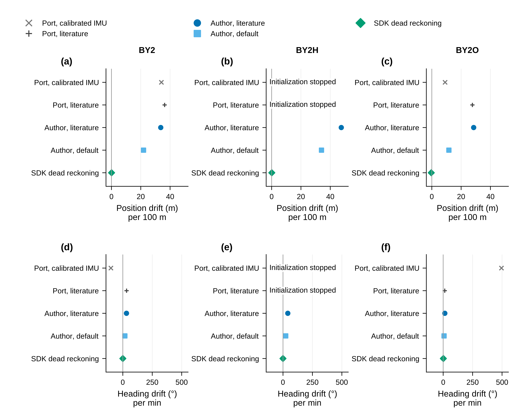
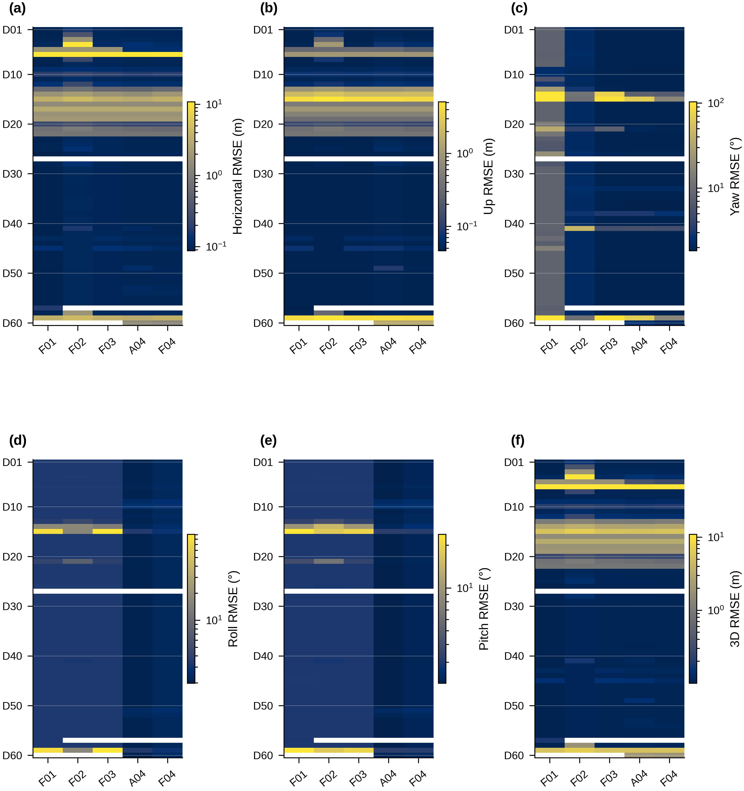
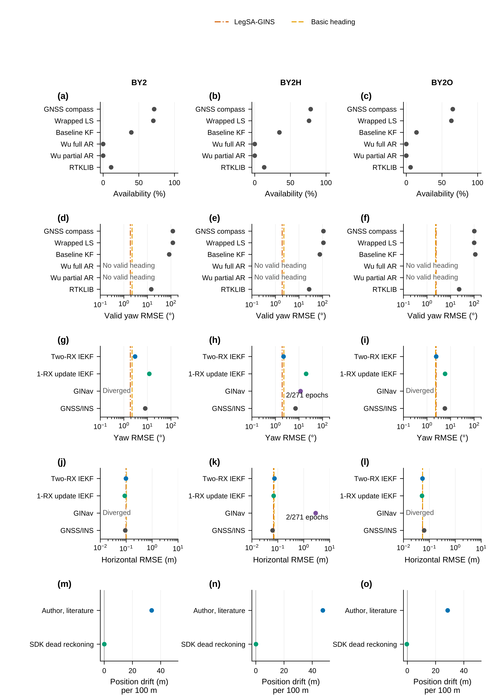
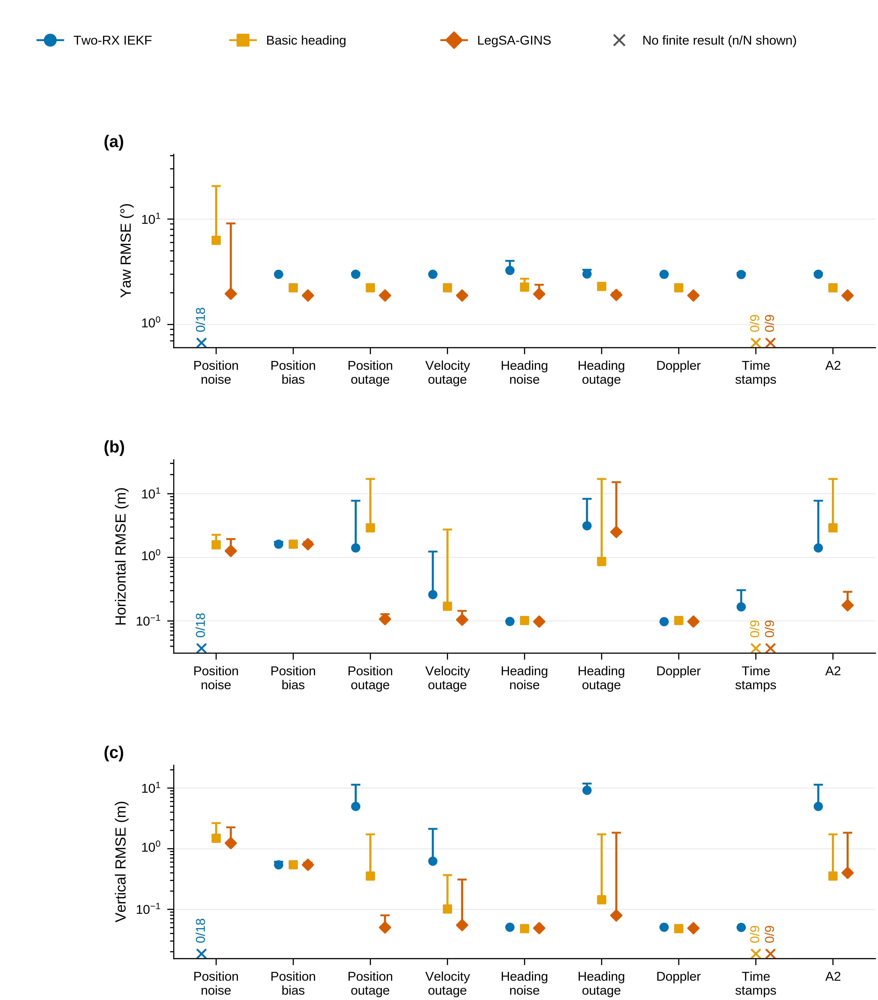

# Supplementary material

> Evidence version map: S1–S18 preserve the author-retained original V3 matrix and separately identified original comparators. S19 records model boundaries. S20–S23 describe later contract-diagnostic and external-reproduction cohorts, without adopting them as a replacement for original V3. S24 maps reproduction selectors to paper names; S25 distinguishes source, binary, document, evaluation and cohort identities. Original statistics and intervals are not transferred to later versions.

## S1 Fixed engineering configuration and effective sensor model

Table S1 retains the historical parameter tokens for reproducibility. All internal rows share dual-yaw initialization; disabling online heading does not remove that initial information. The represented scale-factor blocks have zero initial and process uncertainty in this configuration and must not be described as independently estimated active states. Unlike result tables, calibration settings are not rounded to display precision. The accelerometer engineering model and effective residual settings were developed on the primary sequence and transferred unchanged. Earlier shared-reference-visible noise development and configuration selection prevent a blanket blind-calibration claim. These are retained engineering settings, not completed laboratory calibration. Its indexed covariance proxies are not an identification of independent noise on each physical body axis. The heading marker is a residual proxy and was not independently re-estimated on the denser grid. The velocity-prior standard deviation likewise includes contributions from its preparation observations and timing. Neither should be interpreted as a laboratory white-noise specification.

**Table S1.** Fixed parameter and sequence settings. The enabled update paths for each displayed configuration are reproduced below, followed by the parameter tokens. Noise markers describe the implemented observation model rather than an independently verified accuracy specification.

| Method | GNSS position | Receiver velocity | Shared dual-yaw initialization | Online heading | Residual gate | Raw Doppler | Source-aware | Roll/pitch | Horizontal velocity |
| --- | --- | --- | --- | --- | --- | --- | --- | --- | --- |
| GNSS/INS baseline | On | On | On | Off | Off | Off | Off | Off | Off |
| Basic dual-heading GNSS/INS | On | Off | On | On | Off | Off | Off | Off | Off |
| Gated-heading backbone | On | On | On | On | On | Off | Off | Off | Off |
| Unweighted LegSA-GINS | On | On | On | On | On | On | Off | On | On |
| LegSA-GINS | On | On | On | On | On | On | On | On | On |

| Parameter | Value | Unit | Basis |
| --- | --- | --- | --- |
| Heading standard-deviation marker | 2.933193 | deg | Primary-sequence increment-residual proxy; not independent denser-grid white noise |
| Horizontal-velocity scale | 1/0.962142 | ratio | Fixed source model; no transfer-sequence refit |
| Horizontal-velocity standard deviation | 0.132838 | m/s | Residual proxy; not an independently identified white-noise component |
| Roll/pitch standard deviation | 1.6 | deg | Robot weak prior |
| Accelerometer scale | 1.0308398903907543 | ratio | Reference-free primary-sequence calibration |
| VRW index north/0 | 9.478382094779873 | (m/s)/sqrt(h) | Parameter-index proxy; not identified physical body-axis covariance |
| Accelerometer-bias std index north/0 | 4817.482008954474 | mGal | Transferred unchanged |
| VRW index east/1 | 9.784198200134004 | (m/s)/sqrt(h) | Parameter-index proxy; not identified physical body-axis covariance |
| Accelerometer-bias std index east/1 | 8259.572423450163 | mGal | Transferred unchanged |
| VRW index down/2 | 7.6321402201126745 | (m/s)/sqrt(h) | Parameter-index proxy; not identified physical body-axis covariance |
| Accelerometer-bias std index down/2 | 2257.241538343225 | mGal | Transferred unchanged |
| arw_deg_sqrt_h | [0.985, 0.985, 0.985] | deg/sqrt(h) | Fixed implementation setting |
| gyro_bias_std_deg_h | [9.38, 9.38, 9.38] | deg/h | Fixed implementation setting |
| yaw_std_min_deg | 0.5 | deg | Fixed implementation setting |
| yaw_std_soft_deg | 3.0 | deg | Fixed implementation setting |
| yaw_std_hard_deg | 6.0 | deg | Fixed implementation setting |
| yaw_res_soft_deg | 6.0 | deg | Fixed implementation setting |
| yaw_res_hard_deg | 15.0 | deg | Fixed implementation setting |
| yaw_downweight_scale | 2.5 | variance ratio | Fixed implementation setting |
| antlever_frd_m | [0.03, 0.03, -0.3] | m | Fixed implementation setting |
| BY2 base time | 1772784000.0 | Unix s | Sequence time origin |
| BY2 evaluation window | [66,340] | s | Contract window |
| BY2H base time | 1772784000.0 | Unix s | Sequence time origin |
| BY2H evaluation window | [413,683] | s | Contract window |
| BY2O base time | 1772780400.0 | Unix s | Sequence time origin |
| BY2O evaluation window | [3186,3563] | s | Contract window |

## S2 Fault definitions and seed anchors

**Table S2.** Complete core fault-type definitions. Parameters are copied from the defined injection operations. Source-specific covariance, timing, and availability changes remain distinct from value changes. The type identifier is a lookup key, not a rank of severity.

| Type | Family | Definition | Parameters | Seeds |
| --- | --- | --- | --- | --- |
| D01 | gnss outage | GNSS position outage 3s | {"operation": "outage", "sources": ["gnss_position"], "duration_s": 3} | 00–08; anchors in S2b |
| D02 | gnss outage | GNSS position outage 5s | {"operation": "outage", "sources": ["gnss_position"], "duration_s": 5} | 00–08; anchors in S2b |
| D03 | gnss outage | GNSS position outage 10s | {"operation": "outage", "sources": ["gnss_position"], "duration_s": 10} | 00–08; anchors in S2b |
| D04 | gnss outage | GNSS position outage 20s | {"operation": "outage", "sources": ["gnss_position"], "duration_s": 20} | 00–08; anchors in S2b |
| D05 | gnss outage | GNSS position velocity outage 10s | {"operation": "outage", "sources": ["gnss_position", "receiver_velocity"], "duration_s": 10} | 00–08; anchors in S2b |
| D06 | gnss outage | GNSS all update outage 20s | {"operation": "outage", "sources": ["gnss_position", "receiver_velocity", "dual_yaw"], "duration_s": 20} | 00–08; anchors in S2b |
| D07 | gnss outage | GNSS repeated short outage | {"operation": "repeated_outage", "sources": ["gnss_position"], "interval_count": 3, "duration_each_s": 3, "seed_controls": "interval_start_times"} | 00–08; anchors in S2b |
| D08 | gnss sampling | GNSS downsample 5Hz | {"operation": "downsample", "sources": ["gnss_position", "receiver_velocity", "dual_yaw"], "target_rate_hz": 5, "seed_controls": "phase"} | 00–08; anchors in S2b |
| D09 | gnss sampling | GNSS downsample 2Hz | {"operation": "downsample", "sources": ["gnss_position", "receiver_velocity", "dual_yaw"], "target_rate_hz": 2, "seed_controls": "phase"} | 00–08; anchors in S2b |
| D10 | gnss sampling | GNSS downsample 1Hz | {"operation": "downsample", "sources": ["gnss_position", "receiver_velocity", "dual_yaw"], "target_rate_hz": 1, "seed_controls": "phase"} | 00–08; anchors in S2b |
| D11 | gnss sampling | GNSS random dropout 30 | {"operation": "random_dropout", "sources": ["gnss_position", "receiver_velocity", "dual_yaw"], "dropout_ratio": 0.3, "seed_controls": "dropout_pattern"} | 00–08; anchors in S2b |
| D12 | gnss sampling | GNSS random dropout 60 | {"operation": "random_dropout", "sources": ["gnss_position", "receiver_velocity", "dual_yaw"], "dropout_ratio": 0.6, "seed_controls": "dropout_pattern"} | 00–08; anchors in S2b |
| D13 | position value | position noise mild | {"operation": "gaussian_position_noise", "h_sigma_m": 0.5, "v_sigma_m": 1.0} | 00–08; anchors in S2b |
| D14 | position value | position noise medium | {"operation": "gaussian_position_noise", "h_sigma_m": 1.5, "v_sigma_m": 2.5} | 00–08; anchors in S2b |
| D15 | position value | position noise strong | {"operation": "gaussian_position_noise", "h_sigma_m": 3.0, "v_sigma_m": 5.0} | 00–08; anchors in S2b |
| D16 | position value | position static bias 1p5m | {"operation": "static_position_bias", "horizontal_bias_m": 1.5, "vertical_bias_m": 0.5, "seed_controls": "horizontal_direction_and_vertical_sign"} | 00–08; anchors in S2b |
| D17 | position value | position static bias 3m | {"operation": "static_position_bias", "horizontal_bias_m": 3.0, "vertical_bias_m": 1.0, "seed_controls": "horizontal_direction_and_vertical_sign"} | 00–08; anchors in S2b |
| D18 | position value | position slow drift bias | {"operation": "slow_drift_bias", "horizontal_start_m": 0.0, "horizontal_end_m": 3.0, "vertical_start_m": 0.0, "vertical_end_m": 1.0} | 00–08; anchors in S2b |
| D19 | position value | position sinusoidal multipath | {"operation": "sinusoidal_multipath", "horizontal_amplitude_m": 2.0, "vertical_amplitude_m": 0.5, "seed_controls": "phase"} | 00–08; anchors in S2b |
| D20 | position value | position spike mild | {"operation": "position_spike", "probability": 0.02, "horizontal_m": 2.0, "vertical_m": 1.0} | 00–08; anchors in S2b |
| D21 | position value | position spike medium | {"operation": "position_spike", "probability": 0.05, "horizontal_m": 4.0, "vertical_m": 2.0} | 00–08; anchors in S2b |
| D22 | position value | position spike burst strong | {"operation": "position_burst_spike", "burst_length_epochs_min": 3, "burst_length_epochs_max": 5, "horizontal_m": 8.0, "vertical_m": 4.0} | 00–08; anchors in S2b |
| D23 | position std status | position std inflation 1p5 | {"operation": "std_inflation", "source": "gnss_position_std", "factor": 1.5} | 00–08; anchors in S2b |
| D24 | position std status | position std inflation 2p5 | {"operation": "std_inflation", "source": "gnss_position_std", "factor": 2.5} | 00–08; anchors in S2b |
| D25 | position std status | position std inflation 4p0 | {"operation": "std_inflation", "source": "gnss_position_std", "factor": 4.0} | 00–08; anchors in S2b |
| D26 | position std status | position std deflation 0p25 | {"operation": "std_deflation", "source": "gnss_position_std", "factor": 0.25} | 00–08; anchors in S2b |
| D27 | position std status | bad position optimistic std | {"operation": "bad_position_optimistic_std", "h_sigma_m": 3.0, "v_sigma_m": 5.0, "std_factor": 0.25} | 00–08; anchors in S2b |
| D28 | position std status | good position pessimistic std | {"operation": "good_position_pessimistic_std", "value_change": "unchanged", "std_factor": 4.0} | 00–08; anchors in S2b |
| D29 | position std status | gnss status quality downgrade only | {"operation": "status_quality_downgrade_only", "value_change": "unchanged"} | 00–08; anchors in S2b |
| D30 | dual yaw | dual yaw outage 5s | {"operation": "outage", "sources": ["dual_yaw"], "duration_s": 5} | 00–08; anchors in S2b |
| D31 | dual yaw | dual yaw outage 20s | {"operation": "outage", "sources": ["dual_yaw"], "duration_s": 20} | 00–08; anchors in S2b |
| D32 | dual yaw | dual yaw noise mild | {"operation": "dual_yaw_gaussian_noise", "sigma_deg": 1.0, "yaw_wrap": "required"} | 00–08; anchors in S2b |
| D33 | dual yaw | dual yaw noise strong | {"operation": "dual_yaw_gaussian_noise", "sigma_deg": 5.0, "yaw_wrap": "required"} | 00–08; anchors in S2b |
| D34 | dual yaw | dual yaw spike 5pct | {"operation": "dual_yaw_spike", "probability": 0.05, "yaw_wrap": "required"} | 00–08; anchors in S2b |
| D35 | dual yaw | dual yaw spike 10pct | {"operation": "dual_yaw_spike", "probability": 0.1, "yaw_wrap": "required"} | 00–08; anchors in S2b |
| D36 | dual yaw | dual yaw std inflation 1p5 | {"operation": "yaw_std_inflation", "factor": 1.5} | 00–08; anchors in S2b |
| D37 | dual yaw | dual yaw std inflation 3p0 | {"operation": "yaw_std_inflation", "factor": 3.0} | 00–08; anchors in S2b |
| D38 | dual yaw | bad yaw optimistic std | {"operation": "bad_yaw_optimistic_std", "yaw_noise_sigma_deg": 10.0, "optional_spike_component": true, "yaw_std_factor": 0.25, "yaw_wrap": "required"} | 00–08; anchors in S2b |
| D39 | dual yaw | baseline quality dropout | {"operation": "baseline_quality_dropout", "fields": ["rel_valid", "quality"], "seed_controls": "unavailable_bursts"} | 00–08; anchors in S2b |
| D40 | dual yaw | baseline length jitter relacc | {"operation": "baseline_length_jitter_relacc", "baseline_length_jitter_m": "seeded_small_jitter", "rel_acc_inflation": true} | 00–08; anchors in S2b |
| D41 | dual yaw | gnss1 gnss2 asymmetric noise | {"operation": "gnss1_gnss2_asymmetric_noise", "h_sigma_m": 3.0, "v_sigma_m": 2.0, "seed_controls": "antenna_selection"} | 00–08; anchors in S2b |
| D42 | velocity raw doppler | receiver velocity outage 20s | {"operation": "outage", "sources": ["receiver_velocity"], "duration_s": 20} | 00–08; anchors in S2b |
| D43 | velocity raw doppler | receiver velocity noise 0p5 | {"operation": "receiver_velocity_noise", "sigma_mps": 0.5} | 00–08; anchors in S2b |
| D44 | velocity raw doppler | receiver velocity spike 2mps | {"operation": "receiver_velocity_spike", "probability": 0.02, "magnitude_mps": 2.0} | 00–08; anchors in S2b |
| D45 | velocity raw doppler | receiver velocity bad optimistic std | {"operation": "receiver_velocity_noise_optimistic_std", "sigma_mps": 0.5, "std_factor": 0.25} | 00–08; anchors in S2b |
| D46 | velocity raw doppler | raw doppler outage 20s | {"operation": "outage", "sources": ["raw_doppler_velocity"], "duration_s": 20} | 00–08; anchors in S2b |
| D47 | velocity raw doppler | raw doppler noise 0p5 | {"operation": "raw_doppler_velocity_noise", "sigma_mps": 0.5} | 00–08; anchors in S2b |
| D48 | velocity raw doppler | raw doppler spike 1p5mps | {"operation": "raw_doppler_velocity_spike", "probability": 0.02, "magnitude_mps": 1.5} | 00–08; anchors in S2b |
| D49 | velocity raw doppler | raw doppler bad optimistic std | {"operation": "raw_doppler_anomaly_optimistic_std", "anomaly": "noise_or_spike_seeded", "optimistic_or_floor_std_policy": true} | 00–08; anchors in S2b |
| D50 | velocity raw doppler | raw receiver velocity conflict | {"operation": "raw_receiver_velocity_conflict", "conflict_magnitude_mps": 1.0} | 00–08; anchors in S2b |
| D51 | go2 prior metadata | go2 roll pitch dropout noise | {"operation": "go2_roll_pitch_dropout_noise", "dropout_ratio": 0.5, "remaining_noise_sigma_deg": 3.0} | 00–08; anchors in S2b |
| D52 | go2 prior metadata | go2 roll pitch bias | {"operation": "go2_roll_pitch_bias", "bias_deg": 2.0, "seed_controls": "roll_pitch_direction"} | 00–08; anchors in S2b |
| D53 | go2 prior metadata | go2 horizontal velocity noise | {"operation": "go2_horizontal_velocity_noise", "sigma_mps": 1.0} | 00–08; anchors in S2b |
| D54 | go2 prior metadata | go2 horizontal velocity scale dropout | {"operation": "go2_horizontal_velocity_scale_or_dropout", "scale": 1.5, "dropout_ratio": 0.5, "seed_group_controls": "scale_vs_dropout"} | 00–08; anchors in S2b |
| D55 | go2 prior metadata | go2 contact motion metadata uncertain | {"operation": "go2_contact_motion_metadata_uncertain", "pattern": "missing_or_uncertain_seeded"} | 00–08; anchors in S2b |
| D56 | go2 prior metadata | go2 foot speed contact conflict | {"operation": "go2_foot_speed_contact_conflict", "pattern": "foot_force_and_foot_speed_conflict_seeded"} | 00–08; anchors in S2b |
| D57 | multi source mixed | multi source latency jitter | {"operation": "multi_source_latency_jitter", "components": ["latency_shift", "timestamp_jitter"], "latency_range_s": [0.1, 0.3], "jitter_range_ms": [20, 50]} | 00–08; anchors in S2b |
| D58 | multi source mixed | outage yaw spike then recovery | {"operation": "mixed_components", "components": ["position_outage_10s", "dual_yaw_spike", "clean_recovery_interval"], "recovery_interval": "required"} | 00–08; anchors in S2b |
| D59 | multi source mixed | bad position good yaw raw conflict | {"operation": "mixed_components", "components": ["bad_position", "good_yaw", "raw_receiver_velocity_conflict"], "conflict_magnitude_mps": 1.0} | 00–08; anchors in S2b |
| D60 | multi source mixed | multisource bad optimistic then recovery | {"operation": "mixed_components", "components": ["bad_position_optimistic_std", "bad_yaw_optimistic_std", "bad_velocity_optimistic_std", "clean_recovery_interval"], "recovery_interval": "required"} | 00–08; anchors in S2b |

**Table S2b.** Seed and anchor definitions. Anchors are based on observation-side information and the fixed time rules, without reference-guided selection. A shared seed makes the prescribed case comparable across methods; it does not make all observation paths react identically.

| seed_index | seed_value | anchor_name | anchor_time_s |
| --- | --- | --- | --- |
| seed_00 | 260306001 | user_original_206p2s | 206.200 |
| seed_01 | 260306002 | early_motion | 88.000 |
| seed_02 | 260306003 | mid_straight | 146.000 |
| seed_03 | 260306004 | turn_segment | 190.000 |
| seed_04 | 260306005 | low_speed_segment | 230.000 |
| seed_05 | 260306006 | high_motion_segment | 118.000 |
| seed_06 | 260306007 | lower_quality_but_valid_heading | 272.000 |
| seed_07 | 260306008 | raw_doppler_residual_candidate | 304.000 |
| seed_08 | 260306009 | late_recovery_segment | 332.000 |

## S3 Complete internal ablation

**Table S3.** Every internal configuration on each sequence. RMSE columns retain their original units: degrees for yaw, roll and pitch; metres for horizontal and up position. Historical aliases map to the same backbone or full configuration and do not create additional method rows (Table S24). The matched-epoch count is the support for the corresponding whole-window evaluation, rather than the denominator of every possible paired comparison.

| Sequence | Method | yaw_rmse_deg | horizontal_rmse_m | up_rmse_m | roll_rmse_deg | pitch_rmse_deg | matched_epoch_count | evaluation_status |
| --- | --- | --- | --- | --- | --- | --- | --- | --- |
| BY2H | Doppler-aid ablation | 1.933 | 0.069 | 0.045 | 1.967 | 1.698 | 58580 | COMPLETED |
| BY2H | Unweighted LegSA-GINS | 1.934 | 0.070 | 0.046 | 1.837 | 1.659 | 58580 | COMPLETED |
| BY2H | Tilt-prior ablation | 1.941 | 0.068 | 0.045 | 2.785 | 1.882 | 58580 | COMPLETED |
| BY2H | Robot-velocity ablation | 1.934 | 0.069 | 0.045 | 1.966 | 1.698 | 58580 | COMPLETED |
| BY2H | Robot-prior ablation | 1.941 | 0.068 | 0.045 | 2.784 | 1.882 | 58580 | COMPLETED |
| BY2H | Backbone with Doppler aid | 1.941 | 0.068 | 0.045 | 2.784 | 1.881 | 58580 | COMPLETED |
| BY2H | Backbone with source-aware weighting | 1.940 | 0.069 | 0.045 | 2.784 | 1.882 | 58580 | COMPLETED |
| BY2H | GNSS/INS baseline | 7.137 | 0.063 | 0.045 | 2.785 | 1.884 | 58580 | COMPLETED |
| BY2H | Basic dual-heading GNSS/INS | 2.283 | 0.072 | 0.045 | 2.782 | 1.883 | 58580 | COMPLETED |
| BY2H | Gated-heading backbone | 1.941 | 0.069 | 0.045 | 2.784 | 1.882 | 58580 | COMPLETED |
| BY2H | LegSA-GINS | 1.934 | 0.068 | 0.045 | 1.966 | 1.698 | 58580 | COMPLETED |
| BY2O | Doppler-aid ablation | 2.435 | 0.054 | 0.046 | 1.507 | 1.695 | 76548 | COMPLETED |
| BY2O | Unweighted LegSA-GINS | 2.429 | 0.054 | 0.044 | 1.450 | 1.678 | 76548 | COMPLETED |
| BY2O | Tilt-prior ablation | 2.434 | 0.054 | 0.045 | 1.877 | 1.734 | 76548 | COMPLETED |
| BY2O | Robot-velocity ablation | 2.433 | 0.055 | 0.046 | 1.507 | 1.695 | 76548 | COMPLETED |
| BY2O | Robot-prior ablation | 2.434 | 0.055 | 0.045 | 1.876 | 1.734 | 76548 | COMPLETED |
| BY2O | Backbone with Doppler aid | 2.429 | 0.055 | 0.044 | 1.876 | 1.734 | 76548 | COMPLETED |
| BY2O | Backbone with source-aware weighting | 2.436 | 0.055 | 0.045 | 1.875 | 1.734 | 76548 | COMPLETED |
| BY2O | GNSS/INS baseline | 5.739 | 0.063 | 0.044 | 1.864 | 1.743 | 76548 | COMPLETED |
| BY2O | Basic dual-heading GNSS/INS | 2.309 | 0.055 | 0.046 | 1.879 | 1.731 | 76548 | COMPLETED |
| BY2O | Gated-heading backbone | 2.432 | 0.055 | 0.044 | 1.875 | 1.734 | 76548 | COMPLETED |
| BY2O | LegSA-GINS | 2.434 | 0.055 | 0.046 | 1.507 | 1.695 | 76548 | COMPLETED |
| BY2 | GNSS/INS baseline | 8.090 | 0.092 | 0.048 | 3.331 | 2.933 | 56642 | COMPLETED |
| BY2 | Basic dual-heading GNSS/INS | 2.232 | 0.102 | 0.048 | 3.335 | 2.923 | 56642 | COMPLETED |
| BY2 | Gated-heading backbone | 1.916 | 0.100 | 0.048 | 3.325 | 2.929 | 56642 | COMPLETED |
| BY2 | LegSA-GINS | 1.886 | 0.098 | 0.049 | 2.254 | 2.265 | 56642 | COMPLETED |
| BY2 | Doppler-aid ablation | 1.886 | 0.098 | 0.048 | 2.254 | 2.265 | 56642 | COMPLETED |
| BY2 | Unweighted LegSA-GINS | 1.886 | 0.097 | 0.050 | 2.067 | 2.141 | 56642 | COMPLETED |
| BY2 | Tilt-prior ablation | 1.914 | 0.099 | 0.048 | 3.326 | 2.929 | 56642 | COMPLETED |
| BY2 | Robot-velocity ablation | 1.887 | 0.099 | 0.049 | 2.255 | 2.265 | 56642 | COMPLETED |
| BY2 | Robot-prior ablation | 1.914 | 0.100 | 0.048 | 3.327 | 2.929 | 56642 | COMPLETED |
| BY2 | Backbone with Doppler aid | 1.915 | 0.100 | 0.049 | 3.325 | 2.929 | 56642 | COMPLETED |
| BY2 | Backbone with source-aware weighting | 1.914 | 0.100 | 0.048 | 3.325 | 2.929 | 56642 | COMPLETED |

## S4 Failure inventory

**Table S4.** Fault family by configuration and algorithm-failure category. Zero-count rows are retained. The registered count is the family/configuration denominator; failure classes must not be counted as additional registered cases. No failed row receives a fabricated RMSE or contributes its last finite prefix to a completed-run distribution.

| case_family | Method | failure_classification | failure_count | registered_count |
| --- | --- | --- | --- | --- |
| clean | GNSS/INS baseline | ALGORITHM_FAILURE_DIVERGED | 0 | 1 |
| clean | GNSS/INS baseline | ALGORITHM_FAILURE_NO_VALID_HEADING_INPUT | 0 | 1 |
| clean | Basic dual-heading GNSS/INS | ALGORITHM_FAILURE_DIVERGED | 0 | 1 |
| clean | Basic dual-heading GNSS/INS | ALGORITHM_FAILURE_NO_VALID_HEADING_INPUT | 0 | 1 |
| clean | Gated-heading backbone | ALGORITHM_FAILURE_DIVERGED | 0 | 1 |
| clean | Gated-heading backbone | ALGORITHM_FAILURE_NO_VALID_HEADING_INPUT | 0 | 1 |
| clean | Unweighted LegSA-GINS | ALGORITHM_FAILURE_DIVERGED | 0 | 1 |
| clean | Unweighted LegSA-GINS | ALGORITHM_FAILURE_NO_VALID_HEADING_INPUT | 0 | 1 |
| clean | LegSA-GINS | ALGORITHM_FAILURE_DIVERGED | 0 | 1 |
| clean | LegSA-GINS | ALGORITHM_FAILURE_NO_VALID_HEADING_INPUT | 0 | 1 |
| clean | Doppler-aid ablation | ALGORITHM_FAILURE_DIVERGED | 0 | 1 |
| clean | Doppler-aid ablation | ALGORITHM_FAILURE_NO_VALID_HEADING_INPUT | 0 | 1 |
| clean | Tilt-prior ablation | ALGORITHM_FAILURE_DIVERGED | 0 | 1 |
| clean | Tilt-prior ablation | ALGORITHM_FAILURE_NO_VALID_HEADING_INPUT | 0 | 1 |
| clean | Robot-velocity ablation | ALGORITHM_FAILURE_DIVERGED | 0 | 1 |
| clean | Robot-velocity ablation | ALGORITHM_FAILURE_NO_VALID_HEADING_INPUT | 0 | 1 |
| clean | Robot-prior ablation | ALGORITHM_FAILURE_DIVERGED | 0 | 1 |
| clean | Robot-prior ablation | ALGORITHM_FAILURE_NO_VALID_HEADING_INPUT | 0 | 1 |
| clean | Backbone with Doppler aid | ALGORITHM_FAILURE_DIVERGED | 0 | 1 |
| clean | Backbone with Doppler aid | ALGORITHM_FAILURE_NO_VALID_HEADING_INPUT | 0 | 1 |
| clean | Backbone with source-aware weighting | ALGORITHM_FAILURE_DIVERGED | 0 | 1 |
| clean | Backbone with source-aware weighting | ALGORITHM_FAILURE_NO_VALID_HEADING_INPUT | 0 | 1 |
| dual_yaw | GNSS/INS baseline | ALGORITHM_FAILURE_DIVERGED | 0 | 108 |
| dual_yaw | GNSS/INS baseline | ALGORITHM_FAILURE_NO_VALID_HEADING_INPUT | 0 | 108 |
| dual_yaw | Basic dual-heading GNSS/INS | ALGORITHM_FAILURE_DIVERGED | 0 | 108 |
| dual_yaw | Basic dual-heading GNSS/INS | ALGORITHM_FAILURE_NO_VALID_HEADING_INPUT | 0 | 108 |
| dual_yaw | Gated-heading backbone | ALGORITHM_FAILURE_DIVERGED | 0 | 108 |
| dual_yaw | Gated-heading backbone | ALGORITHM_FAILURE_NO_VALID_HEADING_INPUT | 0 | 108 |
| dual_yaw | Unweighted LegSA-GINS | ALGORITHM_FAILURE_DIVERGED | 0 | 108 |
| dual_yaw | Unweighted LegSA-GINS | ALGORITHM_FAILURE_NO_VALID_HEADING_INPUT | 0 | 108 |
| dual_yaw | LegSA-GINS | ALGORITHM_FAILURE_DIVERGED | 0 | 108 |
| dual_yaw | LegSA-GINS | ALGORITHM_FAILURE_NO_VALID_HEADING_INPUT | 0 | 108 |
| dual_yaw | Doppler-aid ablation | ALGORITHM_FAILURE_DIVERGED | 0 | 108 |
| dual_yaw | Doppler-aid ablation | ALGORITHM_FAILURE_NO_VALID_HEADING_INPUT | 0 | 108 |
| dual_yaw | Tilt-prior ablation | ALGORITHM_FAILURE_DIVERGED | 0 | 108 |
| dual_yaw | Tilt-prior ablation | ALGORITHM_FAILURE_NO_VALID_HEADING_INPUT | 0 | 108 |
| dual_yaw | Robot-velocity ablation | ALGORITHM_FAILURE_DIVERGED | 0 | 108 |
| dual_yaw | Robot-velocity ablation | ALGORITHM_FAILURE_NO_VALID_HEADING_INPUT | 0 | 108 |
| dual_yaw | Robot-prior ablation | ALGORITHM_FAILURE_DIVERGED | 0 | 108 |
| dual_yaw | Robot-prior ablation | ALGORITHM_FAILURE_NO_VALID_HEADING_INPUT | 0 | 108 |
| dual_yaw | Backbone with Doppler aid | ALGORITHM_FAILURE_DIVERGED | 0 | 108 |
| dual_yaw | Backbone with Doppler aid | ALGORITHM_FAILURE_NO_VALID_HEADING_INPUT | 0 | 108 |
| dual_yaw | Backbone with source-aware weighting | ALGORITHM_FAILURE_DIVERGED | 0 | 108 |
| dual_yaw | Backbone with source-aware weighting | ALGORITHM_FAILURE_NO_VALID_HEADING_INPUT | 0 | 108 |
| gnss_outage | GNSS/INS baseline | ALGORITHM_FAILURE_DIVERGED | 0 | 63 |
| gnss_outage | GNSS/INS baseline | ALGORITHM_FAILURE_NO_VALID_HEADING_INPUT | 0 | 63 |
| gnss_outage | Basic dual-heading GNSS/INS | ALGORITHM_FAILURE_DIVERGED | 0 | 63 |
| gnss_outage | Basic dual-heading GNSS/INS | ALGORITHM_FAILURE_NO_VALID_HEADING_INPUT | 0 | 63 |
| gnss_outage | Gated-heading backbone | ALGORITHM_FAILURE_DIVERGED | 0 | 63 |
| gnss_outage | Gated-heading backbone | ALGORITHM_FAILURE_NO_VALID_HEADING_INPUT | 0 | 63 |
| gnss_outage | Unweighted LegSA-GINS | ALGORITHM_FAILURE_DIVERGED | 0 | 63 |
| gnss_outage | Unweighted LegSA-GINS | ALGORITHM_FAILURE_NO_VALID_HEADING_INPUT | 0 | 63 |
| gnss_outage | LegSA-GINS | ALGORITHM_FAILURE_DIVERGED | 0 | 63 |
| gnss_outage | LegSA-GINS | ALGORITHM_FAILURE_NO_VALID_HEADING_INPUT | 0 | 63 |
| gnss_outage | Doppler-aid ablation | ALGORITHM_FAILURE_DIVERGED | 0 | 63 |
| gnss_outage | Doppler-aid ablation | ALGORITHM_FAILURE_NO_VALID_HEADING_INPUT | 0 | 63 |
| gnss_outage | Tilt-prior ablation | ALGORITHM_FAILURE_DIVERGED | 0 | 63 |
| gnss_outage | Tilt-prior ablation | ALGORITHM_FAILURE_NO_VALID_HEADING_INPUT | 0 | 63 |
| gnss_outage | Robot-velocity ablation | ALGORITHM_FAILURE_DIVERGED | 0 | 63 |
| gnss_outage | Robot-velocity ablation | ALGORITHM_FAILURE_NO_VALID_HEADING_INPUT | 0 | 63 |
| gnss_outage | Robot-prior ablation | ALGORITHM_FAILURE_DIVERGED | 0 | 63 |
| gnss_outage | Robot-prior ablation | ALGORITHM_FAILURE_NO_VALID_HEADING_INPUT | 0 | 63 |
| gnss_outage | Backbone with Doppler aid | ALGORITHM_FAILURE_DIVERGED | 0 | 63 |
| gnss_outage | Backbone with Doppler aid | ALGORITHM_FAILURE_NO_VALID_HEADING_INPUT | 0 | 63 |
| gnss_outage | Backbone with source-aware weighting | ALGORITHM_FAILURE_DIVERGED | 0 | 63 |
| gnss_outage | Backbone with source-aware weighting | ALGORITHM_FAILURE_NO_VALID_HEADING_INPUT | 0 | 63 |
| gnss_sampling | GNSS/INS baseline | ALGORITHM_FAILURE_DIVERGED | 0 | 45 |
| gnss_sampling | GNSS/INS baseline | ALGORITHM_FAILURE_NO_VALID_HEADING_INPUT | 0 | 45 |
| gnss_sampling | Basic dual-heading GNSS/INS | ALGORITHM_FAILURE_DIVERGED | 0 | 45 |
| gnss_sampling | Basic dual-heading GNSS/INS | ALGORITHM_FAILURE_NO_VALID_HEADING_INPUT | 0 | 45 |
| gnss_sampling | Gated-heading backbone | ALGORITHM_FAILURE_DIVERGED | 0 | 45 |
| gnss_sampling | Gated-heading backbone | ALGORITHM_FAILURE_NO_VALID_HEADING_INPUT | 0 | 45 |
| gnss_sampling | Unweighted LegSA-GINS | ALGORITHM_FAILURE_DIVERGED | 0 | 45 |
| gnss_sampling | Unweighted LegSA-GINS | ALGORITHM_FAILURE_NO_VALID_HEADING_INPUT | 0 | 45 |
| gnss_sampling | LegSA-GINS | ALGORITHM_FAILURE_DIVERGED | 0 | 45 |
| gnss_sampling | LegSA-GINS | ALGORITHM_FAILURE_NO_VALID_HEADING_INPUT | 0 | 45 |
| gnss_sampling | Doppler-aid ablation | ALGORITHM_FAILURE_DIVERGED | 0 | 45 |
| gnss_sampling | Doppler-aid ablation | ALGORITHM_FAILURE_NO_VALID_HEADING_INPUT | 0 | 45 |
| gnss_sampling | Tilt-prior ablation | ALGORITHM_FAILURE_DIVERGED | 0 | 45 |
| gnss_sampling | Tilt-prior ablation | ALGORITHM_FAILURE_NO_VALID_HEADING_INPUT | 0 | 45 |
| gnss_sampling | Robot-velocity ablation | ALGORITHM_FAILURE_DIVERGED | 0 | 45 |
| gnss_sampling | Robot-velocity ablation | ALGORITHM_FAILURE_NO_VALID_HEADING_INPUT | 0 | 45 |
| gnss_sampling | Robot-prior ablation | ALGORITHM_FAILURE_DIVERGED | 0 | 45 |
| gnss_sampling | Robot-prior ablation | ALGORITHM_FAILURE_NO_VALID_HEADING_INPUT | 0 | 45 |
| gnss_sampling | Backbone with Doppler aid | ALGORITHM_FAILURE_DIVERGED | 0 | 45 |
| gnss_sampling | Backbone with Doppler aid | ALGORITHM_FAILURE_NO_VALID_HEADING_INPUT | 0 | 45 |
| gnss_sampling | Backbone with source-aware weighting | ALGORITHM_FAILURE_DIVERGED | 0 | 45 |
| gnss_sampling | Backbone with source-aware weighting | ALGORITHM_FAILURE_NO_VALID_HEADING_INPUT | 0 | 45 |
| go2_prior_metadata | GNSS/INS baseline | ALGORITHM_FAILURE_DIVERGED | 0 | 54 |
| go2_prior_metadata | GNSS/INS baseline | ALGORITHM_FAILURE_NO_VALID_HEADING_INPUT | 0 | 54 |
| go2_prior_metadata | Basic dual-heading GNSS/INS | ALGORITHM_FAILURE_DIVERGED | 0 | 54 |
| go2_prior_metadata | Basic dual-heading GNSS/INS | ALGORITHM_FAILURE_NO_VALID_HEADING_INPUT | 0 | 54 |
| go2_prior_metadata | Gated-heading backbone | ALGORITHM_FAILURE_DIVERGED | 0 | 54 |
| go2_prior_metadata | Gated-heading backbone | ALGORITHM_FAILURE_NO_VALID_HEADING_INPUT | 0 | 54 |
| go2_prior_metadata | Unweighted LegSA-GINS | ALGORITHM_FAILURE_DIVERGED | 0 | 54 |
| go2_prior_metadata | Unweighted LegSA-GINS | ALGORITHM_FAILURE_NO_VALID_HEADING_INPUT | 0 | 54 |
| go2_prior_metadata | LegSA-GINS | ALGORITHM_FAILURE_DIVERGED | 0 | 54 |
| go2_prior_metadata | LegSA-GINS | ALGORITHM_FAILURE_NO_VALID_HEADING_INPUT | 0 | 54 |
| go2_prior_metadata | Doppler-aid ablation | ALGORITHM_FAILURE_DIVERGED | 0 | 54 |
| go2_prior_metadata | Doppler-aid ablation | ALGORITHM_FAILURE_NO_VALID_HEADING_INPUT | 0 | 54 |
| go2_prior_metadata | Tilt-prior ablation | ALGORITHM_FAILURE_DIVERGED | 0 | 54 |
| go2_prior_metadata | Tilt-prior ablation | ALGORITHM_FAILURE_NO_VALID_HEADING_INPUT | 0 | 54 |
| go2_prior_metadata | Robot-velocity ablation | ALGORITHM_FAILURE_DIVERGED | 0 | 54 |
| go2_prior_metadata | Robot-velocity ablation | ALGORITHM_FAILURE_NO_VALID_HEADING_INPUT | 0 | 54 |
| go2_prior_metadata | Robot-prior ablation | ALGORITHM_FAILURE_DIVERGED | 0 | 54 |
| go2_prior_metadata | Robot-prior ablation | ALGORITHM_FAILURE_NO_VALID_HEADING_INPUT | 0 | 54 |
| go2_prior_metadata | Backbone with Doppler aid | ALGORITHM_FAILURE_DIVERGED | 0 | 54 |
| go2_prior_metadata | Backbone with Doppler aid | ALGORITHM_FAILURE_NO_VALID_HEADING_INPUT | 0 | 54 |
| go2_prior_metadata | Backbone with source-aware weighting | ALGORITHM_FAILURE_DIVERGED | 0 | 54 |
| go2_prior_metadata | Backbone with source-aware weighting | ALGORITHM_FAILURE_NO_VALID_HEADING_INPUT | 0 | 54 |
| multi_source_mixed | GNSS/INS baseline | ALGORITHM_FAILURE_DIVERGED | 10 | 36 |
| multi_source_mixed | GNSS/INS baseline | ALGORITHM_FAILURE_NO_VALID_HEADING_INPUT | 0 | 36 |
| multi_source_mixed | Basic dual-heading GNSS/INS | ALGORITHM_FAILURE_DIVERGED | 17 | 36 |
| multi_source_mixed | Basic dual-heading GNSS/INS | ALGORITHM_FAILURE_NO_VALID_HEADING_INPUT | 9 | 36 |
| multi_source_mixed | Gated-heading backbone | ALGORITHM_FAILURE_DIVERGED | 10 | 36 |
| multi_source_mixed | Gated-heading backbone | ALGORITHM_FAILURE_NO_VALID_HEADING_INPUT | 9 | 36 |
| multi_source_mixed | Unweighted LegSA-GINS | ALGORITHM_FAILURE_DIVERGED | 9 | 36 |
| multi_source_mixed | Unweighted LegSA-GINS | ALGORITHM_FAILURE_NO_VALID_HEADING_INPUT | 9 | 36 |
| multi_source_mixed | LegSA-GINS | ALGORITHM_FAILURE_DIVERGED | 4 | 36 |
| multi_source_mixed | LegSA-GINS | ALGORITHM_FAILURE_NO_VALID_HEADING_INPUT | 9 | 36 |
| multi_source_mixed | Doppler-aid ablation | ALGORITHM_FAILURE_DIVERGED | 5 | 36 |
| multi_source_mixed | Doppler-aid ablation | ALGORITHM_FAILURE_NO_VALID_HEADING_INPUT | 9 | 36 |
| multi_source_mixed | Tilt-prior ablation | ALGORITHM_FAILURE_DIVERGED | 4 | 36 |
| multi_source_mixed | Tilt-prior ablation | ALGORITHM_FAILURE_NO_VALID_HEADING_INPUT | 9 | 36 |
| multi_source_mixed | Robot-velocity ablation | ALGORITHM_FAILURE_DIVERGED | 4 | 36 |
| multi_source_mixed | Robot-velocity ablation | ALGORITHM_FAILURE_NO_VALID_HEADING_INPUT | 9 | 36 |
| multi_source_mixed | Robot-prior ablation | ALGORITHM_FAILURE_DIVERGED | 4 | 36 |
| multi_source_mixed | Robot-prior ablation | ALGORITHM_FAILURE_NO_VALID_HEADING_INPUT | 9 | 36 |
| multi_source_mixed | Backbone with Doppler aid | ALGORITHM_FAILURE_DIVERGED | 10 | 36 |
| multi_source_mixed | Backbone with Doppler aid | ALGORITHM_FAILURE_NO_VALID_HEADING_INPUT | 9 | 36 |
| multi_source_mixed | Backbone with source-aware weighting | ALGORITHM_FAILURE_DIVERGED | 5 | 36 |
| multi_source_mixed | Backbone with source-aware weighting | ALGORITHM_FAILURE_NO_VALID_HEADING_INPUT | 9 | 36 |
| position_std_status | GNSS/INS baseline | ALGORITHM_FAILURE_DIVERGED | 9 | 63 |
| position_std_status | GNSS/INS baseline | ALGORITHM_FAILURE_NO_VALID_HEADING_INPUT | 0 | 63 |
| position_std_status | Basic dual-heading GNSS/INS | ALGORITHM_FAILURE_DIVERGED | 9 | 63 |
| position_std_status | Basic dual-heading GNSS/INS | ALGORITHM_FAILURE_NO_VALID_HEADING_INPUT | 0 | 63 |
| position_std_status | Gated-heading backbone | ALGORITHM_FAILURE_DIVERGED | 9 | 63 |
| position_std_status | Gated-heading backbone | ALGORITHM_FAILURE_NO_VALID_HEADING_INPUT | 0 | 63 |
| position_std_status | Unweighted LegSA-GINS | ALGORITHM_FAILURE_DIVERGED | 9 | 63 |
| position_std_status | Unweighted LegSA-GINS | ALGORITHM_FAILURE_NO_VALID_HEADING_INPUT | 0 | 63 |
| position_std_status | LegSA-GINS | ALGORITHM_FAILURE_DIVERGED | 9 | 63 |
| position_std_status | LegSA-GINS | ALGORITHM_FAILURE_NO_VALID_HEADING_INPUT | 0 | 63 |
| position_std_status | Doppler-aid ablation | ALGORITHM_FAILURE_DIVERGED | 9 | 63 |
| position_std_status | Doppler-aid ablation | ALGORITHM_FAILURE_NO_VALID_HEADING_INPUT | 0 | 63 |
| position_std_status | Tilt-prior ablation | ALGORITHM_FAILURE_DIVERGED | 9 | 63 |
| position_std_status | Tilt-prior ablation | ALGORITHM_FAILURE_NO_VALID_HEADING_INPUT | 0 | 63 |
| position_std_status | Robot-velocity ablation | ALGORITHM_FAILURE_DIVERGED | 9 | 63 |
| position_std_status | Robot-velocity ablation | ALGORITHM_FAILURE_NO_VALID_HEADING_INPUT | 0 | 63 |
| position_std_status | Robot-prior ablation | ALGORITHM_FAILURE_DIVERGED | 9 | 63 |
| position_std_status | Robot-prior ablation | ALGORITHM_FAILURE_NO_VALID_HEADING_INPUT | 0 | 63 |
| position_std_status | Backbone with Doppler aid | ALGORITHM_FAILURE_DIVERGED | 9 | 63 |
| position_std_status | Backbone with Doppler aid | ALGORITHM_FAILURE_NO_VALID_HEADING_INPUT | 0 | 63 |
| position_std_status | Backbone with source-aware weighting | ALGORITHM_FAILURE_DIVERGED | 9 | 63 |
| position_std_status | Backbone with source-aware weighting | ALGORITHM_FAILURE_NO_VALID_HEADING_INPUT | 0 | 63 |
| position_value | GNSS/INS baseline | ALGORITHM_FAILURE_DIVERGED | 1 | 90 |
| position_value | GNSS/INS baseline | ALGORITHM_FAILURE_NO_VALID_HEADING_INPUT | 0 | 90 |
| position_value | Basic dual-heading GNSS/INS | ALGORITHM_FAILURE_DIVERGED | 8 | 90 |
| position_value | Basic dual-heading GNSS/INS | ALGORITHM_FAILURE_NO_VALID_HEADING_INPUT | 0 | 90 |
| position_value | Gated-heading backbone | ALGORITHM_FAILURE_DIVERGED | 1 | 90 |
| position_value | Gated-heading backbone | ALGORITHM_FAILURE_NO_VALID_HEADING_INPUT | 0 | 90 |
| position_value | Unweighted LegSA-GINS | ALGORITHM_FAILURE_DIVERGED | 1 | 90 |
| position_value | Unweighted LegSA-GINS | ALGORITHM_FAILURE_NO_VALID_HEADING_INPUT | 0 | 90 |
| position_value | LegSA-GINS | ALGORITHM_FAILURE_DIVERGED | 0 | 90 |
| position_value | LegSA-GINS | ALGORITHM_FAILURE_NO_VALID_HEADING_INPUT | 0 | 90 |
| position_value | Doppler-aid ablation | ALGORITHM_FAILURE_DIVERGED | 0 | 90 |
| position_value | Doppler-aid ablation | ALGORITHM_FAILURE_NO_VALID_HEADING_INPUT | 0 | 90 |
| position_value | Tilt-prior ablation | ALGORITHM_FAILURE_DIVERGED | 0 | 90 |
| position_value | Tilt-prior ablation | ALGORITHM_FAILURE_NO_VALID_HEADING_INPUT | 0 | 90 |
| position_value | Robot-velocity ablation | ALGORITHM_FAILURE_DIVERGED | 0 | 90 |
| position_value | Robot-velocity ablation | ALGORITHM_FAILURE_NO_VALID_HEADING_INPUT | 0 | 90 |
| position_value | Robot-prior ablation | ALGORITHM_FAILURE_DIVERGED | 0 | 90 |
| position_value | Robot-prior ablation | ALGORITHM_FAILURE_NO_VALID_HEADING_INPUT | 0 | 90 |
| position_value | Backbone with Doppler aid | ALGORITHM_FAILURE_DIVERGED | 1 | 90 |
| position_value | Backbone with Doppler aid | ALGORITHM_FAILURE_NO_VALID_HEADING_INPUT | 0 | 90 |
| position_value | Backbone with source-aware weighting | ALGORITHM_FAILURE_DIVERGED | 0 | 90 |
| position_value | Backbone with source-aware weighting | ALGORITHM_FAILURE_NO_VALID_HEADING_INPUT | 0 | 90 |
| velocity_raw_doppler | GNSS/INS baseline | ALGORITHM_FAILURE_DIVERGED | 0 | 81 |
| velocity_raw_doppler | GNSS/INS baseline | ALGORITHM_FAILURE_NO_VALID_HEADING_INPUT | 0 | 81 |
| velocity_raw_doppler | Basic dual-heading GNSS/INS | ALGORITHM_FAILURE_DIVERGED | 0 | 81 |
| velocity_raw_doppler | Basic dual-heading GNSS/INS | ALGORITHM_FAILURE_NO_VALID_HEADING_INPUT | 0 | 81 |
| velocity_raw_doppler | Gated-heading backbone | ALGORITHM_FAILURE_DIVERGED | 0 | 81 |
| velocity_raw_doppler | Gated-heading backbone | ALGORITHM_FAILURE_NO_VALID_HEADING_INPUT | 0 | 81 |
| velocity_raw_doppler | Unweighted LegSA-GINS | ALGORITHM_FAILURE_DIVERGED | 0 | 81 |
| velocity_raw_doppler | Unweighted LegSA-GINS | ALGORITHM_FAILURE_NO_VALID_HEADING_INPUT | 0 | 81 |
| velocity_raw_doppler | LegSA-GINS | ALGORITHM_FAILURE_DIVERGED | 0 | 81 |
| velocity_raw_doppler | LegSA-GINS | ALGORITHM_FAILURE_NO_VALID_HEADING_INPUT | 0 | 81 |
| velocity_raw_doppler | Doppler-aid ablation | ALGORITHM_FAILURE_DIVERGED | 0 | 81 |
| velocity_raw_doppler | Doppler-aid ablation | ALGORITHM_FAILURE_NO_VALID_HEADING_INPUT | 0 | 81 |
| velocity_raw_doppler | Tilt-prior ablation | ALGORITHM_FAILURE_DIVERGED | 0 | 81 |
| velocity_raw_doppler | Tilt-prior ablation | ALGORITHM_FAILURE_NO_VALID_HEADING_INPUT | 0 | 81 |
| velocity_raw_doppler | Robot-velocity ablation | ALGORITHM_FAILURE_DIVERGED | 0 | 81 |
| velocity_raw_doppler | Robot-velocity ablation | ALGORITHM_FAILURE_NO_VALID_HEADING_INPUT | 0 | 81 |
| velocity_raw_doppler | Robot-prior ablation | ALGORITHM_FAILURE_DIVERGED | 0 | 81 |
| velocity_raw_doppler | Robot-prior ablation | ALGORITHM_FAILURE_NO_VALID_HEADING_INPUT | 0 | 81 |
| velocity_raw_doppler | Backbone with Doppler aid | ALGORITHM_FAILURE_DIVERGED | 0 | 81 |
| velocity_raw_doppler | Backbone with Doppler aid | ALGORITHM_FAILURE_NO_VALID_HEADING_INPUT | 0 | 81 |
| velocity_raw_doppler | Backbone with source-aware weighting | ALGORITHM_FAILURE_DIVERGED | 0 | 81 |
| velocity_raw_doppler | Backbone with source-aware weighting | ALGORITHM_FAILURE_NO_VALID_HEADING_INPUT | 0 | 81 |

## S5 External-method alternatives and limitations

**Table S5a.** Supplementary external identities. Two-receiver IEKF with project-calibrated IMU and Single-receiver-update IEKF diagnostic with project-calibrated IMU are alternative parameter configurations, OFF-DEF uses the official contact library's default parameters, and the in-house contact-filter ports remain labelled separately. Our in-house port did not pass accuracy validation. Fixed/float subsets do not replace the principal heading-availability rows. File-start alternatives are distinct from the BY2H contract-start main rows. Heading-preserved IEKF diagnostic is a modified Two-receiver IEKF used only for the injected A2 comparison.

| Method | Configuration | BY2 | BY2H | BY2O |
| --- | --- | --- | --- | --- |
| Two-receiver IEKF with project-calibrated IMU | S | yaw_rmse_deg=1.539; horizontal_rmse_m=0.104; up_rmse_m=0.045; coverage_ratio=1 [matched=58014/output=58014] | yaw_rmse_deg=1.943; horizontal_rmse_m=0.084; up_rmse_m=0.040; coverage_ratio=1 [matched=59934/output=59934] | yaw_rmse_deg=4.016; horizontal_rmse_m=0.060; up_rmse_m=0.040; coverage_ratio=1 [matched=78441/output=78441] |
| Single-receiver-update IEKF diagnostic with project-calibrated IMU | S | yaw_rmse_deg=9.722; horizontal_rmse_m=0.114; up_rmse_m=0.047; coverage_ratio=1 [matched=58014/output=58014] | yaw_rmse_deg=8.115; horizontal_rmse_m=0.085; up_rmse_m=0.043; coverage_ratio=1 [matched=59934/output=59934] | yaw_rmse_deg=8.267; horizontal_rmse_m=0.075; up_rmse_m=0.040; coverage_ratio=1 [matched=78441/output=78441] |
| Contact-aided IEKF author library | OFF-DEF | position_drift_m_per_100m=21.889; heading_drift_deg_per_min=17.424; aligned_horizontal_rmse_m=35.464; reference_path_length_m=328.471 | position_drift_m_per_100m=34.015; heading_drift_deg_per_min=23.240; aligned_horizontal_rmse_m=51.282; reference_path_length_m=325.514 | position_drift_m_per_100m=11.652; heading_drift_deg_per_min=7.502; aligned_horizontal_rmse_m=30.683; reference_path_length_m=337.422 |
| Contact IEKF port, project-calibrated IMU | S | position_drift_m_per_100m=34.077; heading_drift_deg_per_min=-101.193; aligned_horizontal_rmse_m=84.155; reference_path_length_m=328.471 | position_drift_m_per_100m=ABNORMAL_EXIT: ABNORMAL_EXIT; heading_drift_deg_per_min=ABNORMAL_EXIT: ABNORMAL_EXIT; aligned_horizontal_rmse_m=ABNORMAL_EXIT: ABNORMAL_EXIT; reference_path_length_m=ABNORMAL_EXIT: ABNORMAL_EXIT | position_drift_m_per_100m=9.048; heading_drift_deg_per_min=495.077; aligned_horizontal_rmse_m=89.676; reference_path_length_m=337.422 |
| Contact IEKF port, literature parameters | LIT | position_drift_m_per_100m=36.281; heading_drift_deg_per_min=31.940; aligned_horizontal_rmse_m=53.400; reference_path_length_m=328.471 | position_drift_m_per_100m=ABNORMAL_EXIT: ABNORMAL_EXIT; heading_drift_deg_per_min=ABNORMAL_EXIT: ABNORMAL_EXIT; aligned_horizontal_rmse_m=ABNORMAL_EXIT: ABNORMAL_EXIT; reference_path_length_m=ABNORMAL_EXIT: ABNORMAL_EXIT | position_drift_m_per_100m=27.699; heading_drift_deg_per_min=13.392; aligned_horizontal_rmse_m=77.552; reference_path_length_m=337.422 |
| Baseline-constrained filter | RATIO_FIXED_SUBSET | ratio_fixed_rate=0.077 [105/1370]; ratio_fixed_rmse_deg=40.631 | ratio_fixed_rate=0.041 [55/1350]; ratio_fixed_rmse_deg=45.050 | ratio_fixed_rate=0.003 [5/1885]; ratio_fixed_rmse_deg=35.140 |
| RTKLIB moving-base | Q2_SUBSET | q2_float_rate=0.304 [416/1370]; q2_float_rmse_deg=90.785 | q2_float_rate=0.212 [286/1350]; q2_float_rmse_deg=104.892 | q2_float_rate=0.089 [168/1885]; q2_float_rmse_deg=91.735 |
| Two-receiver IEKF | LIT | NOT_APPLICABLE: BY2H FILE_START supplement | yaw_rmse_deg=2.174; horizontal_rmse_m=0.097; up_rmse_m=0.056; coverage_ratio=1 [matched=59934/output=59934] | NOT_APPLICABLE: BY2H FILE_START supplement |
| Two-receiver IEKF with project-calibrated IMU | S | NOT_APPLICABLE: BY2H FILE_START supplement | yaw_rmse_deg=1.794; horizontal_rmse_m=0.107; up_rmse_m=0.041; coverage_ratio=1 [matched=59934/output=59934] | NOT_APPLICABLE: BY2H FILE_START supplement |
| Single-receiver-update IEKF diagnostic | LIT | NOT_APPLICABLE: BY2H FILE_START supplement | yaw_rmse_deg=55.610; horizontal_rmse_m=0.197; up_rmse_m=0.079; coverage_ratio=1 [matched=59934/output=59934] | NOT_APPLICABLE: BY2H FILE_START supplement |
| Single-receiver-update IEKF diagnostic with project-calibrated IMU | S | NOT_APPLICABLE: BY2H FILE_START supplement | yaw_rmse_deg=ALGORITHM_FAILURE_DIVERGED: ALGORITHM_FAILURE_DIVERGED; horizontal_rmse_m=ALGORITHM_FAILURE_DIVERGED: ALGORITHM_FAILURE_DIVERGED; up_rmse_m=ALGORITHM_FAILURE_DIVERGED: ALGORITHM_FAILURE_DIVERGED; coverage_ratio=ALGORITHM_FAILURE_DIVERGED: ALGORITHM_FAILURE_DIVERGED | NOT_APPLICABLE: BY2H FILE_START supplement |
| Heading-preserved IEKF diagnostic | LIT-BR | yaw_rmse_deg=2.995/3.014 [finite=18/18; failure_or_unavailable=0]; horizontal_rmse_m=2.786/8.121 [finite=18/18; failure_or_unavailable=0]; up_rmse_m=5.056/11.734 [finite=18/18; failure_or_unavailable=0] | NOT_APPLICABLE: A2 supplement is BY2 only | NOT_APPLICABLE: A2 supplement is BY2 only |

**Table S5b.** D43 velocity-noise supplementary results. Median and P95 are across finite cases; the finite, registered, and failure counts are all retained. The horizontal and up metrics use metres and yaw uses degrees.

| family | type | method | metric | median | p95 | finite_n | registered_n | failure_n |
| --- | --- | --- | --- | --- | --- | --- | --- | --- |
| Velocity noise | D43 | Two-receiver IEKF | yaw_rmse_deg | 2.995 | 2.995 | 9 | 9 | 0 |
| Velocity noise | D43 | Two-receiver IEKF | horizontal_rmse_m | 0.098 | 0.098 | 9 | 9 | 0 |
| Velocity noise | D43 | Two-receiver IEKF | up_rmse_m | 0.051 | 0.051 | 9 | 9 | 0 |
| Velocity noise | D43 | Single-receiver-update IEKF diagnostic | yaw_rmse_deg | 12.049 | 12.049 | 9 | 9 | 0 |
| Velocity noise | D43 | Single-receiver-update IEKF diagnostic | horizontal_rmse_m | 0.088 | 0.088 | 9 | 9 | 0 |
| Velocity noise | D43 | Single-receiver-update IEKF diagnostic | up_rmse_m | 0.056 | 0.056 | 9 | 9 | 0 |
| Velocity noise | D43 | Basic dual-heading GNSS/INS | yaw_rmse_deg | 2.232 | 2.232 | 9 | 9 | 0 |
| Velocity noise | D43 | Basic dual-heading GNSS/INS | horizontal_rmse_m | 0.102 | 0.102 | 9 | 9 | 0 |
| Velocity noise | D43 | Basic dual-heading GNSS/INS | up_rmse_m | 0.048 | 0.048 | 9 | 9 | 0 |
| Velocity noise | D43 | Gated-heading backbone | yaw_rmse_deg | 1.922 | 1.954 | 9 | 9 | 0 |
| Velocity noise | D43 | Gated-heading backbone | horizontal_rmse_m | 0.115 | 0.116 | 9 | 9 | 0 |
| Velocity noise | D43 | Gated-heading backbone | up_rmse_m | 0.059 | 0.060 | 9 | 9 | 0 |
| Velocity noise | D43 | Unweighted LegSA-GINS | yaw_rmse_deg | 1.892 | 1.920 | 9 | 9 | 0 |
| Velocity noise | D43 | Unweighted LegSA-GINS | horizontal_rmse_m | 0.107 | 0.108 | 9 | 9 | 0 |
| Velocity noise | D43 | Unweighted LegSA-GINS | up_rmse_m | 0.060 | 0.061 | 9 | 9 | 0 |
| Velocity noise | D43 | LegSA-GINS | yaw_rmse_deg | 1.874 | 1.894 | 9 | 9 | 0 |
| Velocity noise | D43 | LegSA-GINS | horizontal_rmse_m | 0.104 | 0.105 | 9 | 9 | 0 |
| Velocity noise | D43 | LegSA-GINS | up_rmse_m | 0.053 | 0.055 | 9 | 9 | 0 |

**Table S5c.** Attitude comparison for LegSA-GINS, Two-receiver IEKF, and Two-receiver IEKF with project-calibrated IMU at the main start convention. All entries are RMSE in degrees. This table retains the roll/pitch evidence needed to interpret the favourable BY2 yaw result of Two-receiver IEKF with project-calibrated IMU without generalizing it to complete attitude accuracy.

| Sequence | Method | yaw_rmse_deg | roll_rmse_deg | pitch_rmse_deg |
| --- | --- | --- | --- | --- |
| BY2 | LegSA-GINS | 1.886 | 2.254 | 2.265 |
| BY2H | LegSA-GINS | 1.934 | 1.966 | 1.698 |
| BY2O | LegSA-GINS | 2.434 | 1.507 | 1.695 |
| BY2 | Two-receiver IEKF | 2.995 | 1.210 | 1.568 |
| BY2 | Two-receiver IEKF with project-calibrated IMU | 1.539 | 4.243 | 2.990 |
| BY2H | Two-receiver IEKF | 2.209 | 1.168 | 1.825 |
| BY2H | Two-receiver IEKF with project-calibrated IMU | 1.943 | 4.365 | 2.725 |
| BY2O | Two-receiver IEKF | 2.454 | 1.365 | 1.464 |
| BY2O | Two-receiver IEKF with project-calibrated IMU | 4.016 | 4.074 | 3.301 |

**Fig. S1.** Contact-estimation alternatives and the kinematic input reference. The official literature and default configurations, the in-house ports, and Robot-motion dead reckoning remain separate identities. Position drift and heading drift have different units and axes. Initialization failures remain explicit. Robot-motion dead reckoning uses the robot's onboard attitude and no filter, so its curve is not an independent reference.

## S6 Heading weighting and measurement form

**Table S6.** LegSA-GINS heading RMSE in degrees for the supplied sensitivity variants. The table reports outcomes without exposing or selecting their alternative calibration constants. These rows do not replace the scalar-heading main configuration. The baseline-vector alternative is a modelling sensitivity, not an additional main-method claim.

| Variant | BY2 | BY2H | BY2O |
| --- | --- | --- | --- |
| Recalibrated constant heading weight | 1.857 | 1.976 | 2.311 |
| Per-epoch receiver-reported heading weight | 1.897 | 1.961 | 2.247 |
| Three-dimensional baseline measurement | 1.929 | 1.829 | 2.517 |

## S7 Heading source and rate

**Table S7.** Basic dual-heading GNSS/INS and LegSA-GINS heading RMSE in degrees with the recorded status and raw-input alternatives. Source and sampling changes remain labelled. A denser observation grid does not establish independent measurement noise or justify selecting a different setting for each sequence.

| Method | Input | BY2 | BY2H | BY2O |
| --- | --- | --- | --- | --- |
| Basic dual-heading GNSS/INS | Status heading, 1 Hz | 2.313 | 1.657 | 2.900 |
| Basic dual-heading GNSS/INS | Raw heading, 1 Hz | 2.282 | 1.716 | 2.688 |
| Basic dual-heading GNSS/INS | Raw heading, 5 Hz | 2.232 | 2.283 | 2.309 |
| LegSA-GINS | Status heading, 1 Hz | 2.221 | 1.773 | 3.197 |
| LegSA-GINS | Raw heading, 1 Hz | 2.149 | 1.876 | 2.865 |
| LegSA-GINS | Raw heading, 5 Hz | 1.886 | 1.934 | 2.434 |

## S8 Retained fault-subset results

**Table S8.** Recorded subset results, with registered and finite denominators and algorithm-failure counts. The yaw, horizontal, and up metrics are in degrees, metres, and metres, respectively. P95 and maximum describe finite outcomes only. No numerical value is substituted for a failure.

| Method | metric | registered_count | finite_count | algorithm_failure_count | median | p95 | maximum |
| --- | --- | --- | --- | --- | --- | --- | --- |
| Doppler-aid ablation | horizontal_rmse_m | 61 | 58 | 3 | 0.098 | 3.072 | 15.002 |
| Doppler-aid ablation | up_rmse_m | 61 | 58 | 3 | 0.048 | 1.386 | 3.933 |
| Doppler-aid ablation | yaw_rmse_deg | 61 | 58 | 3 | 1.886 | 2.116 | 10.111 |
| Unweighted LegSA-GINS | horizontal_rmse_m | 61 | 58 | 3 | 0.097 | 3.013 | 14.372 |
| Unweighted LegSA-GINS | up_rmse_m | 61 | 58 | 3 | 0.050 | 1.447 | 4.119 |
| Unweighted LegSA-GINS | yaw_rmse_deg | 61 | 58 | 3 | 1.886 | 4.010 | 29.799 |
| Tilt-prior ablation | horizontal_rmse_m | 61 | 58 | 3 | 0.099 | 3.072 | 15.694 |
| Tilt-prior ablation | up_rmse_m | 61 | 58 | 3 | 0.049 | 1.398 | 3.931 |
| Tilt-prior ablation | yaw_rmse_deg | 61 | 58 | 3 | 1.914 | 12.778 | 61.302 |
| Robot-velocity ablation | horizontal_rmse_m | 61 | 58 | 3 | 0.099 | 3.087 | 14.973 |
| Robot-velocity ablation | up_rmse_m | 61 | 58 | 3 | 0.049 | 1.428 | 3.924 |
| Robot-velocity ablation | yaw_rmse_deg | 61 | 58 | 3 | 1.887 | 2.170 | 11.690 |
| Robot-prior ablation | horizontal_rmse_m | 61 | 58 | 3 | 0.100 | 3.084 | 15.773 |
| Robot-prior ablation | up_rmse_m | 61 | 58 | 3 | 0.049 | 1.399 | 4.017 |
| Robot-prior ablation | yaw_rmse_deg | 61 | 58 | 3 | 1.914 | 7.334 | 35.720 |
| Backbone with Doppler aid | horizontal_rmse_m | 61 | 58 | 3 | 0.100 | 3.054 | 15.769 |
| Backbone with Doppler aid | up_rmse_m | 61 | 58 | 3 | 0.050 | 1.388 | 4.167 |
| Backbone with Doppler aid | yaw_rmse_deg | 61 | 58 | 3 | 1.915 | 18.644 | 147.908 |
| Backbone with source-aware weighting | horizontal_rmse_m | 61 | 58 | 3 | 0.100 | 3.086 | 15.917 |
| Backbone with source-aware weighting | up_rmse_m | 61 | 58 | 3 | 0.048 | 1.355 | 4.004 |
| Backbone with source-aware weighting | yaw_rmse_deg | 61 | 58 | 3 | 1.914 | 7.284 | 44.481 |
| GNSS/INS baseline | horizontal_rmse_m | 61 | 59 | 2 | 0.092 | 3.031 | 16.083 |
| GNSS/INS baseline | up_rmse_m | 61 | 59 | 2 | 0.048 | 1.292 | 4.121 |
| GNSS/INS baseline | yaw_rmse_deg | 61 | 59 | 2 | 8.090 | 22.466 | 134.068 |
| Basic dual-heading GNSS/INS | horizontal_rmse_m | 61 | 56 | 5 | 0.102 | 2.535 | 15.880 |
| Basic dual-heading GNSS/INS | up_rmse_m | 61 | 56 | 5 | 0.048 | 1.057 | 2.521 |
| Basic dual-heading GNSS/INS | yaw_rmse_deg | 61 | 56 | 5 | 2.232 | 2.664 | 152.335 |
| Gated-heading backbone | horizontal_rmse_m | 61 | 58 | 3 | 0.100 | 3.053 | 15.916 |
| Gated-heading backbone | up_rmse_m | 61 | 58 | 3 | 0.048 | 1.342 | 4.130 |
| Gated-heading backbone | yaw_rmse_deg | 61 | 58 | 3 | 1.916 | 15.996 | 52.938 |
| LegSA-GINS | horizontal_rmse_m | 61 | 58 | 3 | 0.098 | 3.071 | 14.896 |
| LegSA-GINS | up_rmse_m | 61 | 58 | 3 | 0.049 | 1.428 | 3.924 |
| LegSA-GINS | yaw_rmse_deg | 61 | 58 | 3 | 1.886 | 2.126 | 10.347 |

**Fig. S2.** Type/configuration mean-error map from the recorded core results. The panels retain horizontal, up, yaw, roll, pitch, and spatial-position quantities on separate scales. Each type remains present even when all displayed configurations fail. Unavailable cells are masked, never assigned zero; the explicit failure inventory is Table S4. Colours encode the existing finite-case means on logarithmic scales, not uncertainty intervals.

## S9 Diagnostic uncertainty sources and retained intervals

**Table S9a.** Historical diagnostic budget components, including manufacturer and receiver-reported indicators, common fast disagreement, installation yaw, position offset, geometry and resampling variation. These are not a calibrated or independent reference uncertainty budget. Any historical cancellation or numeric-bound labels in the source are qualified here: a common additive reference contribution does not generally cancel from squared-error or RMSE differences, and residuals do not independently bound lever-arm error. No reference variance is subtracted from the results.

| row | source | type | enters | magnitude | effect | cancels_in_paired_comparison |
| --- | --- | --- | --- | --- | --- | --- |
| 1 | reference_heading_slow_bias | diagnostic indicator | yaw | 1.14 deg scaled specification indicator (manufacturer 0.4 deg @1 m scaled to 0.35 m); receiver-reported attitude std 0.886/0.910/0.970 deg median, max 1.45/1.32/1.83 deg; short-term (<5 s) disagreement 0.059 deg from static-segment coasting estimators | shared reference contribution; magnitude not independently calibrated | not generally in squared-error/RMSE differences |
| 2 | common_mode_fast_heading_term | diagnostic indicator | yaw | fast std 1.229-1.311 / 1.391-1.415 / 1.053-1.079 deg (BY2/BY2H/BY2O) across all estimators; 0.059 deg static | 48/53/20 % of LegSA-GINS yaw MSE; similar retained components, physical cause not identified | not generally in squared-error/RMSE differences |
| 3 | estimator_heading_bias | diagnostic indicator | yaw | LegSA-GINS -1.086/-0.538/+0.339 deg; Basic dual-heading GNSS/INS -1.390 (BY2); Two-receiver IEKF -1.353/-0.805/+0.300; Two-receiver IEKF with project-calibrated IMU -0.357 (BY2) | 33/8/2 % of LegSA-GINS yaw MSE; mounting cause not independently identified | no |
| 4 | reference_position | diagnostic indicator | horizontal,height | pAcc median 0.0188/0.0185/0.0180 m (P95<=0.026) indicator; receiver-reported position std ~0.05 m/axis indicator | historical diagnostic range 0.02-0.07 m horizontal | not generally in squared-error/RMSE differences |
| 5 | along_track_common_offset | diagnostic indicator | horizontal | forward mean +0.0444/+0.0303/+0.0282 m (all IMU-point methods); 37/25/31 ms equivalent at 1.19/1.20/0.89 m/s | 20.4/19.3/25.0 % of horizontal MSE | not generally in squared-error/RMSE differences |
| 6 | evaluation_point_lever_arm | diagnostic indicator | horizontal,height | lever arm [0.03,0.03-0.178,-0.30] m; lateral model consistency 7 mm (not installation uncertainty); vertical not CAD-verified, retained height residual mean -0.0170/-0.0072/-0.0188 m; attitude x lever diagnostic leakage 17 mm (LegSA-GINS) inside measured error | installation uncertainty not independently established | not generally in squared-error/RMSE differences |
| 9 | fault_seed_sampling | resampling statistic | per-type statistics | LegSA-GINS yaw SD median 0.0023 deg, P90 0.268, <0.1 deg for 50/60 types, >=1 deg D14,D15,D41,D59; horizontal SD median 0.00045 m, P90 0.0204, >=0.1 m D06,D22,D60 | per type | pairs by case_id |
| 10 | window_realization | resampling statistic | absolute levels | LegSA-GINS yaw MBB95 [1.604,2.158]/[1.602,2.037]/[1.364,3.613] deg; horizontal [0.0452,0.1520]/[0.0452,0.0853]/[0.0376,0.0730] m | +-0.3/+-0.2/+-1.1 deg; +-0.05/+-0.02/+-0.02 m | partly; paired series carry own intervals |

For the full-window LegSA-GINS minus Basic dual-heading GNSS/INS horizontal comparisons on BY2 and BY2H, the retained CSV verdict is `RESOLVED_NEGLIGIBLE`, with wording “comparable (difference below reporting resolution).” The earlier `RESOLVED` prose label is preserved in the historical uncertainty document and is superseded for this display by the retained table classification. Likewise, the narrow fault-type median interval reported in Section S12 has distinct full-precision endpoints; equal rounded endpoints do not imply zero width. Sources: `UNC_DISTINGUISHABILITY.csv` and `UA01_DISTRIBUTION_QUANTILES.csv`.

**Table S9b.** Complete retained paired intervals. Differences are A minus B, with the pair named in the corresponding column; a negative interval favours A for an error metric. Heading quantities are degrees and horizontal quantities metres. Common-epoch count, matching method, batch and autocorrelation standard errors, moving-block limits, and the retained verdict are reported together. Statistical resolution and practical relevance remain separate judgements.

| sequence | segment | pair_A minus B | metric | n_common | match_method | rmse_A | rmse_B | delta_rmse | se_delta_batch_20s | se_delta_acf | mbb95_low | mbb95_high | corr_squared_errors | parity_threshold | verdict | wording_for_A_vs_B |
| --- | --- | --- | --- | --- | --- | --- | --- | --- | --- | --- | --- | --- | --- | --- | --- | --- |
| BY2 | full | LegSA-GINS minus Basic dual-heading GNSS/INS | yaw | 56642 | EXACT_ROUNDED_1US | 1.886 | 2.232 | -0.346 | 0.188 | 0.274 | -0.692 | -0.055 | 0.906 | 0.100 | RESOLVED | lower |
| BY2 | full | LegSA-GINS minus Basic dual-heading GNSS/INS | horizontal | 56642 | EXACT_ROUNDED_1US | 0.098 | 0.102 | -0.004 | 0.003 | 0.003 | -0.008 | -0.001 | 0.994 | 0.005 | RESOLVED_NEGLIGIBLE | comparable (difference below reporting resolution) |
| BY2 | full | LegSA-GINS minus Gated-heading backbone | yaw | 56642 | EXACT_ROUNDED_1US | 1.886 | 1.916 | -0.029 | 0.021 | 0.026 | -0.066 | 0.001 | 0.998 | 0.100 | PARITY | comparable |
| BY2 | full | LegSA-GINS minus Gated-heading backbone | horizontal | 56642 | EXACT_ROUNDED_1US | 0.098 | 0.100 | -0.002 | 0.001 | 0.001 | -0.004 | -0.001 | 0.999 | 0.005 | RESOLVED_NEGLIGIBLE | comparable (difference below reporting resolution) |
| BY2 | full | LegSA-GINS minus Unweighted LegSA-GINS | yaw | 56642 | EXACT_ROUNDED_1US | 1.886 | 1.886 | 0.000 | 0.002 | 0.003 | -0.004 | 0.005 | 1.000 | 0.100 | PARITY | comparable |
| BY2 | full | LegSA-GINS minus Unweighted LegSA-GINS | horizontal | 56642 | EXACT_ROUNDED_1US | 0.098 | 0.097 | 0.001 | 0.001 | 0.001 | 0.000 | 0.002 | 1.000 | 0.005 | RESOLVED_NEGLIGIBLE | comparable (difference below reporting resolution) |
| BY2 | full | Gated-heading backbone minus Basic dual-heading GNSS/INS | yaw | 56642 | EXACT_ROUNDED_1US | 1.916 | 2.232 | -0.316 | 0.180 | 0.262 | -0.639 | -0.014 | 0.910 | 0.100 | RESOLVED | lower |
| BY2 | full | Gated-heading backbone minus Basic dual-heading GNSS/INS | horizontal | 56642 | EXACT_ROUNDED_1US | 0.100 | 0.102 | -0.002 | 0.002 | 0.001 | -0.004 | -0.001 | 0.997 | 0.005 | RESOLVED_NEGLIGIBLE | comparable (difference below reporting resolution) |
| BY2 | full | Unweighted LegSA-GINS minus Gated-heading backbone | yaw | 56642 | EXACT_ROUNDED_1US | 1.886 | 1.916 | -0.030 | 0.024 | 0.029 | -0.073 | 0.006 | 0.998 | 0.100 | PARITY | comparable |
| BY2 | full | Unweighted LegSA-GINS minus Gated-heading backbone | horizontal | 56642 | EXACT_ROUNDED_1US | 0.097 | 0.100 | -0.003 | 0.002 | 0.002 | -0.006 | -0.001 | 0.997 | 0.005 | RESOLVED_NEGLIGIBLE | comparable (difference below reporting resolution) |
| BY2 | full | Two-receiver IEKF minus LegSA-GINS | yaw | 56628 | EXACT_ROUNDED_1US | 2.997 | 1.886 | 1.110 | 1.149 | 1.079 | -0.215 | 2.574 | 0.185 | 0.100 | DIRECTION_ONLY | higher, interval includes zero |
| BY2 | full | Two-receiver IEKF minus LegSA-GINS | horizontal | 56628 | EXACT_ROUNDED_1US | 0.098 | 0.098 | -0.000 | 0.002 | 0.002 | -0.004 | 0.003 | 0.981 | 0.005 | PARITY | comparable |
| BY2 | full | Two-receiver IEKF minus Basic dual-heading GNSS/INS | yaw | 56628 | EXACT_ROUNDED_1US | 2.997 | 2.232 | 0.765 | 0.997 | 0.931 | -0.511 | 2.101 | 0.388 | 0.100 | DIRECTION_ONLY | higher, interval includes zero |
| BY2 | full | Two-receiver IEKF minus Basic dual-heading GNSS/INS | horizontal | 56628 | EXACT_ROUNDED_1US | 0.098 | 0.102 | -0.004 | 0.005 | 0.004 | -0.011 | 0.001 | 0.974 | 0.005 | PARITY | comparable |
| BY2 | full | Two-receiver IEKF minus Gated-heading backbone | yaw | 56628 | EXACT_ROUNDED_1US | 2.997 | 1.916 | 1.081 | 1.131 | 1.066 | -0.238 | 2.533 | 0.203 | 0.100 | DIRECTION_ONLY | higher, interval includes zero |
| BY2 | full | Two-receiver IEKF minus Gated-heading backbone | horizontal | 56628 | EXACT_ROUNDED_1US | 0.098 | 0.100 | -0.002 | 0.003 | 0.003 | -0.007 | 0.002 | 0.977 | 0.005 | PARITY | comparable |
| BY2 | full | Two-receiver IEKF with project-calibrated IMU minus LegSA-GINS | yaw | 56628 | EXACT_ROUNDED_1US | 1.538 | 1.886 | -0.348 | 0.139 | 0.029 | -0.590 | -0.152 | 0.790 | 0.100 | RESOLVED | lower |
| BY2 | full | Two-receiver IEKF with project-calibrated IMU minus LegSA-GINS | horizontal | 56628 | EXACT_ROUNDED_1US | 0.104 | 0.098 | 0.006 | 0.007 | 0.006 | -0.001 | 0.015 | 0.958 | 0.005 | DIRECTION_ONLY | higher, interval includes zero |
| BY2H | full | LegSA-GINS minus Basic dual-heading GNSS/INS | yaw | 58580 | EXACT_ROUNDED_1US | 1.934 | 2.283 | -0.349 | 0.293 | 0.048 | -0.827 | -0.020 | 0.403 | 0.100 | RESOLVED | lower |
| BY2H | full | LegSA-GINS minus Basic dual-heading GNSS/INS | horizontal | 58580 | EXACT_ROUNDED_1US | 0.068 | 0.072 | -0.003 | 0.002 | 0.001 | -0.006 | -0.001 | 0.980 | 0.005 | RESOLVED_NEGLIGIBLE | comparable (difference below reporting resolution) |
| BY2H | full | LegSA-GINS minus Gated-heading backbone | yaw | 58580 | EXACT_ROUNDED_1US | 1.934 | 1.941 | -0.007 | 0.006 | 0.002 | -0.021 | 0.002 | 1.000 | 0.100 | PARITY | comparable |
| BY2H | full | LegSA-GINS minus Gated-heading backbone | horizontal | 58580 | EXACT_ROUNDED_1US | 0.068 | 0.069 | -0.000 | 0.001 | 0.001 | -0.002 | 0.001 | 0.994 | 0.005 | PARITY | comparable |
| BY2H | full | LegSA-GINS minus Unweighted LegSA-GINS | yaw | 58580 | EXACT_ROUNDED_1US | 1.934 | 1.934 | -0.000 | 0.001 | 0.000 | -0.001 | 0.001 | 1.000 | 0.100 | PARITY | comparable |
| BY2H | full | LegSA-GINS minus Unweighted LegSA-GINS | horizontal | 58580 | EXACT_ROUNDED_1US | 0.068 | 0.070 | -0.002 | 0.002 | 0.002 | -0.006 | 0.002 | 0.957 | 0.005 | PARITY | comparable |
| BY2H | full | Gated-heading backbone minus Basic dual-heading GNSS/INS | yaw | 58580 | EXACT_ROUNDED_1US | 1.941 | 2.283 | -0.342 | 0.291 | 0.048 | -0.817 | -0.013 | 0.406 | 0.100 | RESOLVED | lower |
| BY2H | full | Gated-heading backbone minus Basic dual-heading GNSS/INS | horizontal | 58580 | EXACT_ROUNDED_1US | 0.069 | 0.072 | -0.003 | 0.001 | 0.000 | -0.005 | -0.002 | 0.988 | 0.005 | RESOLVED_NEGLIGIBLE | comparable (difference below reporting resolution) |
| BY2H | full | Unweighted LegSA-GINS minus Gated-heading backbone | yaw | 58580 | EXACT_ROUNDED_1US | 1.934 | 1.941 | -0.007 | 0.007 | 0.008 | -0.022 | 0.003 | 1.000 | 0.100 | PARITY | comparable |
| BY2H | full | Unweighted LegSA-GINS minus Gated-heading backbone | horizontal | 58580 | EXACT_ROUNDED_1US | 0.070 | 0.069 | 0.001 | 0.003 | 0.003 | -0.003 | 0.006 | 0.933 | 0.005 | PARITY | comparable |
| BY2H | full | Two-receiver IEKF minus LegSA-GINS | yaw | 58554 | EXACT_ROUNDED_1US | 2.208 | 1.934 | 0.274 | 0.160 | 0.168 | -0.052 | 0.514 | 0.641 | 0.100 | DIRECTION_ONLY | higher, interval includes zero |
| BY2H | full | Two-receiver IEKF minus LegSA-GINS | horizontal | 58554 | EXACT_ROUNDED_1US | 0.075 | 0.068 | 0.006 | 0.003 | 0.004 | -0.001 | 0.011 | 0.974 | 0.005 | DIRECTION_ONLY | higher, interval includes zero |
| BY2H | full | Two-receiver IEKF minus Basic dual-heading GNSS/INS | yaw | 58554 | EXACT_ROUNDED_1US | 2.208 | 2.283 | -0.075 | 0.346 | 0.277 | -0.698 | 0.325 | 0.207 | 0.100 | PARITY | comparable |
| BY2H | full | Two-receiver IEKF minus Basic dual-heading GNSS/INS | horizontal | 58554 | EXACT_ROUNDED_1US | 0.075 | 0.072 | 0.003 | 0.002 | 0.004 | -0.006 | 0.008 | 0.967 | 0.005 | PARITY | comparable |
| BY2H | full | Two-receiver IEKF minus Gated-heading backbone | yaw | 58554 | EXACT_ROUNDED_1US | 2.208 | 1.941 | 0.267 | 0.160 | 0.167 | -0.061 | 0.511 | 0.640 | 0.100 | DIRECTION_ONLY | higher, interval includes zero |
| BY2H | full | Two-receiver IEKF minus Gated-heading backbone | horizontal | 58554 | EXACT_ROUNDED_1US | 0.075 | 0.069 | 0.006 | 0.003 | 0.005 | -0.002 | 0.011 | 0.971 | 0.005 | DIRECTION_ONLY | higher, interval includes zero |
| BY2O | full | LegSA-GINS minus Basic dual-heading GNSS/INS | yaw | 76548 | EXACT_ROUNDED_1US | 2.434 | 2.309 | 0.124 | 0.076 | 0.099 | -0.034 | 0.219 | 0.996 | 0.100 | DIRECTION_ONLY | higher, interval includes zero |
| BY2O | full | LegSA-GINS minus Basic dual-heading GNSS/INS | horizontal | 76548 | EXACT_ROUNDED_1US | 0.055 | 0.055 | -0.000 | 0.000 | 0.000 | -0.001 | 0.001 | 0.997 | 0.005 | PARITY | comparable |
| BY2O | full | LegSA-GINS minus Gated-heading backbone | yaw | 76548 | EXACT_ROUNDED_1US | 2.434 | 2.432 | 0.002 | 0.002 | 0.003 | -0.003 | 0.005 | 1.000 | 0.100 | PARITY | comparable |
| BY2O | full | LegSA-GINS minus Gated-heading backbone | horizontal | 76548 | EXACT_ROUNDED_1US | 0.055 | 0.055 | -0.000 | 0.000 | 0.000 | -0.001 | 0.000 | 1.000 | 0.005 | PARITY | comparable |
| BY2O | full | LegSA-GINS minus Unweighted LegSA-GINS | yaw | 76548 | EXACT_ROUNDED_1US | 2.434 | 2.429 | 0.005 | 0.003 | 0.004 | -0.000 | 0.009 | 1.000 | 0.100 | PARITY | comparable |
| BY2O | full | LegSA-GINS minus Unweighted LegSA-GINS | horizontal | 76548 | EXACT_ROUNDED_1US | 0.055 | 0.054 | 0.001 | 0.000 | 0.000 | 0.000 | 0.001 | 1.000 | 0.005 | RESOLVED_NEGLIGIBLE | comparable (difference below reporting resolution) |
| BY2O | full | Gated-heading backbone minus Basic dual-heading GNSS/INS | yaw | 76548 | EXACT_ROUNDED_1US | 2.432 | 2.309 | 0.123 | 0.075 | 0.097 | -0.030 | 0.212 | 0.996 | 0.100 | DIRECTION_ONLY | higher, interval includes zero |
| BY2O | full | Gated-heading backbone minus Basic dual-heading GNSS/INS | horizontal | 76548 | EXACT_ROUNDED_1US | 0.055 | 0.055 | -0.000 | 0.001 | 0.000 | -0.001 | 0.001 | 0.997 | 0.005 | PARITY | comparable |
| BY2O | full | Unweighted LegSA-GINS minus Gated-heading backbone | yaw | 76548 | EXACT_ROUNDED_1US | 2.429 | 2.432 | -0.003 | 0.002 | 0.003 | -0.006 | 0.002 | 1.000 | 0.100 | PARITY | comparable |
| BY2O | full | Unweighted LegSA-GINS minus Gated-heading backbone | horizontal | 76548 | EXACT_ROUNDED_1US | 0.054 | 0.055 | -0.001 | 0.000 | 0.000 | -0.002 | -0.000 | 0.999 | 0.005 | RESOLVED_NEGLIGIBLE | comparable (difference below reporting resolution) |
| BY2O | full | Two-receiver IEKF minus LegSA-GINS | yaw | 76166 | EXACT_ROUNDED_1US | 2.453 | 2.435 | 0.017 | 0.802 | 0.776 | -1.344 | 1.401 | 0.004 | 0.100 | PARITY | comparable |
| BY2O | full | Two-receiver IEKF minus LegSA-GINS | horizontal | 76166 | EXACT_ROUNDED_1US | 0.054 | 0.055 | -0.000 | 0.002 | 0.002 | -0.003 | 0.004 | 0.987 | 0.005 | PARITY | comparable |
| BY2O | full | Two-receiver IEKF minus Basic dual-heading GNSS/INS | yaw | 76166 | EXACT_ROUNDED_1US | 2.453 | 2.311 | 0.142 | 0.758 | 0.718 | -1.069 | 1.451 | 0.009 | 0.100 | DIRECTION_ONLY | higher, interval includes zero |
| BY2O | full | Two-receiver IEKF minus Basic dual-heading GNSS/INS | horizontal | 76166 | EXACT_ROUNDED_1US | 0.054 | 0.055 | -0.000 | 0.002 | 0.001 | -0.003 | 0.004 | 0.987 | 0.005 | PARITY | comparable |
| BY2O | full | Two-receiver IEKF minus Gated-heading backbone | yaw | 76166 | EXACT_ROUNDED_1US | 2.453 | 2.434 | 0.019 | 0.801 | 0.774 | -1.336 | 1.458 | 0.005 | 0.100 | PARITY | comparable |
| BY2O | full | Two-receiver IEKF minus Gated-heading backbone | horizontal | 76166 | EXACT_ROUNDED_1US | 0.054 | 0.055 | -0.000 | 0.001 | 0.002 | -0.003 | 0.003 | 0.986 | 0.005 | PARITY | comparable |
| BY2O | primary | LegSA-GINS minus Basic dual-heading GNSS/INS | yaw | 7612 | EXACT_ROUNDED_1US | 0.233 | 0.863 | -0.631 | 0.180 | 0.151 | -0.713 | -0.579 | 0.740 | 0.100 | RESOLVED | lower |
| BY2O | primary | LegSA-GINS minus Basic dual-heading GNSS/INS | horizontal | 7612 | EXACT_ROUNDED_1US | 0.024 | 0.024 | 0.000 | 0.000 | 0.000 | 0.000 | 0.001 | 0.954 | 0.005 | RESOLVED_NEGLIGIBLE | comparable (difference below reporting resolution) |
| BY2O | primary | Two-receiver IEKF minus LegSA-GINS | yaw | 7576 | EXACT_ROUNDED_1US | 4.009 | 0.233 | 3.776 | 1.972 | 1.836 | 2.197 | 4.438 | 0.702 | 0.100 | RESOLVED | higher |
| BY2O | primary | Two-receiver IEKF minus LegSA-GINS | horizontal | 7576 | EXACT_ROUNDED_1US | 0.040 | 0.024 | 0.015 | 0.002 | 0.003 | 0.013 | 0.018 | 0.365 | 0.005 | RESOLVED | higher |
| BY2O | primary | LegSA-GINS minus Unweighted LegSA-GINS | yaw | 7612 | EXACT_ROUNDED_1US | 0.233 | 0.247 | -0.015 | 0.011 | 0.009 | -0.023 | -0.008 | 0.995 | 0.100 | RESOLVED_NEGLIGIBLE | comparable (difference below reporting resolution) |
| BY2O | primary | LegSA-GINS minus Unweighted LegSA-GINS | horizontal | 7612 | EXACT_ROUNDED_1US | 0.024 | 0.024 | -0.000 | 0.000 | 0.000 | -0.000 | 0.000 | 0.975 | 0.005 | PARITY | comparable |

**Table S9c.** Absolute-window intervals for all retained error series. Yaw is in degrees; horizontal and up position are in metres. Effective sample sizes and time scales describe squared-error dependence under the stated correlation rule, not independent sensor readings. The paired table, rather than overlap of separate absolute intervals, is the basis for between-method statements.

| sequence | method | series | n | rmse_recomputed | tau_int_s | n_eff | se_rmse_acf | se_rmse_batch_20s | se_rmse_batch_40s | rmse_mbb_low | rmse_mbb_high | mbb_half_width | mbb_half_width_relative |
| --- | --- | --- | --- | --- | --- | --- | --- | --- | --- | --- | --- | --- | --- |
| BY2 | GNSS/INS baseline | yaw_err_deg | 56642 | 8.090 | 54.065 | 4.204 | 1.449 | 0.823 | 1.238 | 6.675 | 9.527 | 1.426 | 0.176 |
| BY2 | GNSS/INS baseline | err_u_m | 56642 | 0.048 | 1.557 | 146.023 | 0.004 | 0.004 | 0.006 | 0.040 | 0.056 | 0.008 | 0.163 |
| BY2 | GNSS/INS baseline | horizontal_err_m | 56642 | 0.092 | 12.349 | 18.406 | 0.031 | 0.024 | 0.039 | 0.042 | 0.145 | 0.052 | 0.562 |
| BY2 | Basic dual-heading GNSS/INS | yaw_err_deg | 56642 | 2.232 | 12.262 | 18.537 | 0.391 | 0.258 | 0.404 | 1.755 | 2.732 | 0.489 | 0.219 |
| BY2 | Basic dual-heading GNSS/INS | err_u_m | 56642 | 0.048 | 1.421 | 159.957 | 0.004 | 0.003 | 0.005 | 0.040 | 0.055 | 0.007 | 0.154 |
| BY2 | Basic dual-heading GNSS/INS | horizontal_err_m | 56642 | 0.102 | 12.843 | 17.699 | 0.034 | 0.026 | 0.042 | 0.050 | 0.156 | 0.053 | 0.523 |
| BY2 | Gated-heading backbone | yaw_err_deg | 56642 | 1.916 | 0.796 | 285.566 | 0.089 | 0.166 | 0.222 | 1.634 | 2.206 | 0.286 | 0.149 |
| BY2 | Gated-heading backbone | err_u_m | 56642 | 0.048 | 1.556 | 146.041 | 0.004 | 0.004 | 0.006 | 0.040 | 0.056 | 0.008 | 0.166 |
| BY2 | Gated-heading backbone | horizontal_err_m | 56642 | 0.100 | 12.618 | 18.014 | 0.034 | 0.025 | 0.041 | 0.047 | 0.154 | 0.053 | 0.535 |
| BY2 | LegSA-GINS | yaw_err_deg | 56642 | 1.886 | 0.644 | 353.212 | 0.079 | 0.153 | 0.206 | 1.604 | 2.158 | 0.277 | 0.147 |
| BY2 | LegSA-GINS | err_u_m | 56642 | 0.049 | 1.478 | 153.832 | 0.004 | 0.004 | 0.006 | 0.041 | 0.057 | 0.008 | 0.166 |
| BY2 | LegSA-GINS | horizontal_err_m | 56642 | 0.098 | 12.243 | 18.567 | 0.033 | 0.025 | 0.040 | 0.045 | 0.152 | 0.053 | 0.546 |
| BY2 | Doppler-aid ablation | yaw_err_deg | 56642 | 1.886 | 0.644 | 352.807 | 0.079 | 0.153 | 0.207 | 1.610 | 2.159 | 0.274 | 0.146 |
| BY2 | Doppler-aid ablation | err_u_m | 56642 | 0.048 | 1.465 | 155.204 | 0.004 | 0.004 | 0.006 | 0.041 | 0.056 | 0.008 | 0.162 |
| BY2 | Doppler-aid ablation | horizontal_err_m | 56642 | 0.098 | 12.251 | 18.554 | 0.033 | 0.025 | 0.040 | 0.047 | 0.153 | 0.053 | 0.545 |
| BY2 | Unweighted LegSA-GINS | yaw_err_deg | 56642 | 1.886 | 0.641 | 354.672 | 0.079 | 0.152 | 0.205 | 1.621 | 2.158 | 0.269 | 0.143 |
| BY2 | Unweighted LegSA-GINS | err_u_m | 56642 | 0.050 | 1.644 | 138.278 | 0.004 | 0.004 | 0.006 | 0.042 | 0.058 | 0.008 | 0.167 |
| BY2 | Unweighted LegSA-GINS | horizontal_err_m | 56642 | 0.097 | 12.040 | 18.878 | 0.033 | 0.024 | 0.040 | 0.046 | 0.150 | 0.052 | 0.537 |
| BY2 | Tilt-prior ablation | yaw_err_deg | 56642 | 1.914 | 0.794 | 286.377 | 0.089 | 0.165 | 0.221 | 1.621 | 2.199 | 0.289 | 0.151 |
| BY2 | Tilt-prior ablation | err_u_m | 56642 | 0.048 | 1.583 | 143.623 | 0.004 | 0.004 | 0.006 | 0.040 | 0.057 | 0.008 | 0.169 |
| BY2 | Tilt-prior ablation | horizontal_err_m | 56642 | 0.099 | 12.414 | 18.311 | 0.034 | 0.025 | 0.041 | 0.046 | 0.157 | 0.056 | 0.565 |
| BY2 | Robot-velocity ablation | yaw_err_deg | 56642 | 1.887 | 0.644 | 353.087 | 0.079 | 0.153 | 0.206 | 1.607 | 2.158 | 0.276 | 0.146 |
| BY2 | Robot-velocity ablation | err_u_m | 56642 | 0.049 | 1.475 | 154.087 | 0.004 | 0.004 | 0.006 | 0.041 | 0.056 | 0.008 | 0.157 |
| BY2 | Robot-velocity ablation | horizontal_err_m | 56642 | 0.099 | 12.425 | 18.294 | 0.033 | 0.025 | 0.041 | 0.047 | 0.157 | 0.055 | 0.555 |
| BY2 | Robot-prior ablation | yaw_err_deg | 56642 | 1.914 | 0.794 | 286.261 | 0.089 | 0.165 | 0.221 | 1.618 | 2.209 | 0.295 | 0.154 |
| BY2 | Robot-prior ablation | err_u_m | 56642 | 0.048 | 1.578 | 144.078 | 0.004 | 0.004 | 0.006 | 0.040 | 0.056 | 0.008 | 0.164 |
| BY2 | Robot-prior ablation | horizontal_err_m | 56642 | 0.100 | 12.620 | 18.012 | 0.034 | 0.025 | 0.041 | 0.048 | 0.154 | 0.053 | 0.535 |
| BY2 | Backbone with Doppler aid | yaw_err_deg | 56642 | 1.915 | 0.793 | 286.497 | 0.089 | 0.165 | 0.221 | 1.613 | 2.224 | 0.306 | 0.160 |
| BY2 | Backbone with Doppler aid | err_u_m | 56642 | 0.049 | 1.799 | 126.356 | 0.004 | 0.004 | 0.006 | 0.041 | 0.058 | 0.009 | 0.174 |
| BY2 | Backbone with Doppler aid | horizontal_err_m | 56642 | 0.100 | 12.587 | 18.058 | 0.034 | 0.025 | 0.041 | 0.047 | 0.157 | 0.055 | 0.554 |
| BY2 | Backbone with source-aware weighting | yaw_err_deg | 56642 | 1.914 | 0.795 | 285.851 | 0.089 | 0.166 | 0.222 | 1.613 | 2.216 | 0.301 | 0.157 |
| BY2 | Backbone with source-aware weighting | err_u_m | 56642 | 0.048 | 1.553 | 146.365 | 0.004 | 0.004 | 0.006 | 0.040 | 0.056 | 0.008 | 0.166 |
| BY2 | Backbone with source-aware weighting | horizontal_err_m | 56642 | 0.100 | 12.629 | 17.999 | 0.034 | 0.025 | 0.041 | 0.047 | 0.156 | 0.054 | 0.541 |
| BY2 | Two-receiver IEKF | yaw_err_deg | 58014 | 2.995 | 7.801 | 29.822 | 0.897 | 0.863 | 1.094 | 1.618 | 4.553 | 1.468 | 0.490 |
| BY2 | Two-receiver IEKF | err_u_m | 58014 | 0.051 | 2.449 | 94.987 | 0.004 | 0.004 | 0.004 | 0.045 | 0.058 | 0.007 | 0.130 |
| BY2 | Two-receiver IEKF | horizontal_err_m | 58014 | 0.098 | 12.314 | 18.891 | 0.034 | 0.030 | 0.042 | 0.044 | 0.155 | 0.056 | 0.572 |
| BY2 | Two-receiver IEKF with project-calibrated IMU | yaw_err_deg | 58014 | 1.539 | 0.351 | 662.283 | 0.048 | 0.084 | 0.098 | 1.349 | 1.700 | 0.175 | 0.114 |
| BY2 | Two-receiver IEKF with project-calibrated IMU | err_u_m | 58014 | 0.045 | 2.099 | 110.839 | 0.003 | 0.004 | 0.004 | 0.040 | 0.052 | 0.006 | 0.129 |
| BY2 | Two-receiver IEKF with project-calibrated IMU | horizontal_err_m | 58014 | 0.104 | 14.779 | 15.741 | 0.036 | 0.029 | 0.046 | 0.048 | 0.163 | 0.058 | 0.558 |
| BY2H | GNSS/INS baseline | yaw_err_deg | 58580 | 7.137 | 38.355 | 6.118 | 0.946 | 0.548 | 0.767 | 6.172 | 8.029 | 0.929 | 0.130 |
| BY2H | GNSS/INS baseline | err_u_m | 58580 | 0.045 | 5.133 | 45.718 | 0.009 | 0.002 | 0.001 | 0.032 | 0.055 | 0.012 | 0.260 |
| BY2H | GNSS/INS baseline | horizontal_err_m | 58580 | 0.063 | 5.787 | 40.553 | 0.013 | 0.007 | 0.012 | 0.038 | 0.080 | 0.021 | 0.327 |
| BY2H | Basic dual-heading GNSS/INS | yaw_err_deg | 58580 | 2.283 | 9.445 | 24.846 | 0.330 | 0.314 | 0.341 | 1.735 | 2.721 | 0.493 | 0.216 |
| BY2H | Basic dual-heading GNSS/INS | err_u_m | 58580 | 0.045 | 4.914 | 47.759 | 0.009 | 0.002 | 0.001 | 0.032 | 0.056 | 0.012 | 0.259 |
| BY2H | Basic dual-heading GNSS/INS | horizontal_err_m | 58580 | 0.072 | 6.080 | 38.600 | 0.012 | 0.007 | 0.012 | 0.049 | 0.089 | 0.020 | 0.282 |
| BY2H | Gated-heading backbone | yaw_err_deg | 58580 | 1.941 | 0.164 | 1428.211 | 0.037 | 0.162 | 0.139 | 1.631 | 2.040 | 0.205 | 0.105 |
| BY2H | Gated-heading backbone | err_u_m | 58580 | 0.045 | 5.125 | 45.789 | 0.009 | 0.002 | 0.001 | 0.032 | 0.055 | 0.012 | 0.266 |
| BY2H | Gated-heading backbone | horizontal_err_m | 58580 | 0.069 | 5.701 | 41.167 | 0.012 | 0.007 | 0.011 | 0.046 | 0.085 | 0.019 | 0.282 |
| BY2H | LegSA-GINS | yaw_err_deg | 58580 | 1.934 | 0.165 | 1421.062 | 0.037 | 0.164 | 0.141 | 1.602 | 2.037 | 0.218 | 0.113 |
| BY2H | LegSA-GINS | err_u_m | 58580 | 0.045 | 4.638 | 50.592 | 0.008 | 0.002 | 0.002 | 0.033 | 0.057 | 0.012 | 0.263 |
| BY2H | LegSA-GINS | horizontal_err_m | 58580 | 0.068 | 4.651 | 50.457 | 0.011 | 0.007 | 0.011 | 0.045 | 0.085 | 0.020 | 0.294 |
| BY2H | Doppler-aid ablation | yaw_err_deg | 58580 | 1.933 | 0.165 | 1418.192 | 0.037 | 0.165 | 0.143 | 1.621 | 2.041 | 0.210 | 0.109 |
| BY2H | Doppler-aid ablation | err_u_m | 58580 | 0.045 | 4.879 | 48.100 | 0.008 | 0.002 | 0.001 | 0.032 | 0.055 | 0.011 | 0.253 |
| BY2H | Doppler-aid ablation | horizontal_err_m | 58580 | 0.069 | 4.662 | 50.339 | 0.011 | 0.007 | 0.011 | 0.046 | 0.085 | 0.020 | 0.286 |
| BY2H | Unweighted LegSA-GINS | yaw_err_deg | 58580 | 1.934 | 0.165 | 1419.629 | 0.037 | 0.164 | 0.141 | 1.626 | 2.043 | 0.208 | 0.108 |
| BY2H | Unweighted LegSA-GINS | err_u_m | 58580 | 0.046 | 4.420 | 53.088 | 0.008 | 0.002 | 0.002 | 0.033 | 0.055 | 0.011 | 0.243 |
| BY2H | Unweighted LegSA-GINS | horizontal_err_m | 58580 | 0.070 | 4.627 | 50.716 | 0.013 | 0.009 | 0.013 | 0.044 | 0.090 | 0.023 | 0.330 |
| BY2H | Tilt-prior ablation | yaw_err_deg | 58580 | 1.941 | 0.164 | 1431.817 | 0.037 | 0.161 | 0.138 | 1.644 | 2.068 | 0.212 | 0.109 |
| BY2H | Tilt-prior ablation | err_u_m | 58580 | 0.045 | 4.848 | 48.401 | 0.009 | 0.002 | 0.001 | 0.032 | 0.056 | 0.012 | 0.267 |
| BY2H | Tilt-prior ablation | horizontal_err_m | 58580 | 0.068 | 5.732 | 40.942 | 0.013 | 0.007 | 0.011 | 0.044 | 0.085 | 0.020 | 0.298 |
| BY2H | Robot-velocity ablation | yaw_err_deg | 58580 | 1.934 | 0.165 | 1421.243 | 0.037 | 0.163 | 0.141 | 1.620 | 2.049 | 0.215 | 0.111 |
| BY2H | Robot-velocity ablation | err_u_m | 58580 | 0.045 | 4.637 | 50.606 | 0.008 | 0.002 | 0.002 | 0.033 | 0.055 | 0.011 | 0.248 |
| BY2H | Robot-velocity ablation | horizontal_err_m | 58580 | 0.069 | 5.736 | 40.916 | 0.012 | 0.006 | 0.010 | 0.046 | 0.086 | 0.020 | 0.287 |
| BY2H | Robot-prior ablation | yaw_err_deg | 58580 | 1.941 | 0.164 | 1432.141 | 0.037 | 0.160 | 0.137 | 1.633 | 2.058 | 0.212 | 0.109 |
| BY2H | Robot-prior ablation | err_u_m | 58580 | 0.045 | 4.847 | 48.419 | 0.009 | 0.002 | 0.001 | 0.032 | 0.055 | 0.012 | 0.257 |
| BY2H | Robot-prior ablation | horizontal_err_m | 58580 | 0.068 | 5.718 | 41.039 | 0.012 | 0.007 | 0.011 | 0.045 | 0.085 | 0.020 | 0.293 |
| BY2H | Backbone with Doppler aid | yaw_err_deg | 58580 | 1.941 | 0.164 | 1432.945 | 0.037 | 0.160 | 0.137 | 1.635 | 2.060 | 0.213 | 0.110 |
| BY2H | Backbone with Doppler aid | err_u_m | 58580 | 0.045 | 4.630 | 50.686 | 0.009 | 0.002 | 0.001 | 0.033 | 0.056 | 0.012 | 0.261 |
| BY2H | Backbone with Doppler aid | horizontal_err_m | 58580 | 0.068 | 5.679 | 41.326 | 0.012 | 0.007 | 0.011 | 0.046 | 0.086 | 0.020 | 0.289 |
| BY2H | Backbone with source-aware weighting | yaw_err_deg | 58580 | 1.940 | 0.164 | 1429.013 | 0.037 | 0.162 | 0.139 | 1.632 | 2.049 | 0.209 | 0.108 |
| BY2H | Backbone with source-aware weighting | err_u_m | 58580 | 0.045 | 5.088 | 46.123 | 0.009 | 0.002 | 0.001 | 0.032 | 0.056 | 0.012 | 0.265 |
| BY2H | Backbone with source-aware weighting | horizontal_err_m | 58580 | 0.069 | 5.711 | 41.089 | 0.012 | 0.007 | 0.011 | 0.046 | 0.086 | 0.020 | 0.294 |
| BY2H | Two-receiver IEKF | yaw_err_deg | 59934 | 2.209 | 2.504 | 95.858 | 0.177 | 0.162 | 0.180 | 1.744 | 2.421 | 0.339 | 0.153 |
| BY2H | Two-receiver IEKF | err_u_m | 59934 | 0.045 | 0.835 | 287.453 | 0.002 | 0.002 | 0.002 | 0.041 | 0.049 | 0.004 | 0.080 |
| BY2H | Two-receiver IEKF | horizontal_err_m | 59934 | 0.075 | 5.955 | 40.301 | 0.015 | 0.010 | 0.016 | 0.044 | 0.095 | 0.025 | 0.340 |
| BY2O | GNSS/INS baseline | yaw_err_deg | 76548 | 5.739 | 9.200 | 33.424 | 0.534 | 0.450 | 0.376 | 4.881 | 6.711 | 0.915 | 0.159 |
| BY2O | GNSS/INS baseline | err_u_m | 76548 | 0.044 | 0.366 | 839.351 | 0.003 | 0.004 | 0.004 | 0.035 | 0.050 | 0.007 | 0.167 |
| BY2O | GNSS/INS baseline | horizontal_err_m | 76548 | 0.063 | 2.451 | 125.478 | 0.010 | 0.010 | 0.003 | 0.048 | 0.080 | 0.016 | 0.251 |
| BY2O | Basic dual-heading GNSS/INS | yaw_err_deg | 76548 | 2.309 | 7.959 | 38.636 | 0.646 | 0.632 | 0.693 | 1.331 | 3.488 | 1.078 | 0.467 |
| BY2O | Basic dual-heading GNSS/INS | err_u_m | 76548 | 0.046 | 0.294 | 1046.391 | 0.004 | 0.004 | 0.004 | 0.037 | 0.054 | 0.008 | 0.179 |
| BY2O | Basic dual-heading GNSS/INS | horizontal_err_m | 76548 | 0.055 | 2.370 | 129.770 | 0.011 | 0.012 | 0.003 | 0.037 | 0.074 | 0.018 | 0.336 |
| BY2O | Gated-heading backbone | yaw_err_deg | 76548 | 2.432 | 7.974 | 38.564 | 0.692 | 0.660 | 0.716 | 1.336 | 3.641 | 1.153 | 0.474 |
| BY2O | Gated-heading backbone | err_u_m | 76548 | 0.044 | 0.366 | 839.168 | 0.003 | 0.004 | 0.004 | 0.035 | 0.050 | 0.007 | 0.168 |
| BY2O | Gated-heading backbone | horizontal_err_m | 76548 | 0.055 | 2.417 | 127.239 | 0.011 | 0.011 | 0.003 | 0.038 | 0.073 | 0.017 | 0.318 |
| BY2O | LegSA-GINS | yaw_err_deg | 76548 | 2.434 | 7.980 | 38.532 | 0.693 | 0.661 | 0.717 | 1.364 | 3.612 | 1.124 | 0.462 |
| BY2O | LegSA-GINS | err_u_m | 76548 | 0.046 | 0.342 | 898.172 | 0.004 | 0.004 | 0.004 | 0.037 | 0.052 | 0.007 | 0.163 |
| BY2O | LegSA-GINS | horizontal_err_m | 76548 | 0.055 | 2.471 | 124.432 | 0.011 | 0.011 | 0.003 | 0.038 | 0.073 | 0.018 | 0.325 |
| BY2O | Doppler-aid ablation | yaw_err_deg | 76548 | 2.435 | 7.984 | 38.515 | 0.693 | 0.661 | 0.717 | 1.362 | 3.603 | 1.121 | 0.460 |
| BY2O | Doppler-aid ablation | err_u_m | 76548 | 0.046 | 0.346 | 889.894 | 0.004 | 0.004 | 0.004 | 0.037 | 0.053 | 0.008 | 0.168 |
| BY2O | Doppler-aid ablation | horizontal_err_m | 76548 | 0.054 | 2.441 | 125.957 | 0.011 | 0.011 | 0.003 | 0.038 | 0.073 | 0.018 | 0.323 |
| BY2O | Unweighted LegSA-GINS | yaw_err_deg | 76548 | 2.429 | 7.974 | 38.561 | 0.691 | 0.660 | 0.716 | 1.357 | 3.641 | 1.142 | 0.470 |
| BY2O | Unweighted LegSA-GINS | err_u_m | 76548 | 0.044 | 0.367 | 838.080 | 0.003 | 0.004 | 0.004 | 0.036 | 0.050 | 0.007 | 0.160 |
| BY2O | Unweighted LegSA-GINS | horizontal_err_m | 76548 | 0.054 | 2.472 | 124.404 | 0.011 | 0.012 | 0.003 | 0.037 | 0.073 | 0.018 | 0.332 |
| BY2O | Tilt-prior ablation | yaw_err_deg | 76548 | 2.434 | 7.974 | 38.560 | 0.693 | 0.660 | 0.716 | 1.350 | 3.650 | 1.150 | 0.472 |
| BY2O | Tilt-prior ablation | err_u_m | 76548 | 0.045 | 0.340 | 904.099 | 0.004 | 0.004 | 0.004 | 0.036 | 0.052 | 0.008 | 0.177 |
| BY2O | Tilt-prior ablation | horizontal_err_m | 76548 | 0.054 | 2.452 | 125.419 | 0.011 | 0.011 | 0.003 | 0.038 | 0.072 | 0.017 | 0.321 |
| BY2O | Robot-velocity ablation | yaw_err_deg | 76548 | 2.433 | 7.981 | 38.526 | 0.693 | 0.661 | 0.717 | 1.344 | 3.650 | 1.153 | 0.474 |
| BY2O | Robot-velocity ablation | err_u_m | 76548 | 0.046 | 0.342 | 898.200 | 0.004 | 0.004 | 0.004 | 0.037 | 0.053 | 0.008 | 0.171 |
| BY2O | Robot-velocity ablation | horizontal_err_m | 76548 | 0.055 | 2.472 | 124.410 | 0.011 | 0.011 | 0.003 | 0.038 | 0.074 | 0.018 | 0.320 |
| BY2O | Robot-prior ablation | yaw_err_deg | 76548 | 2.434 | 7.974 | 38.560 | 0.693 | 0.660 | 0.716 | 1.348 | 3.662 | 1.157 | 0.475 |
| BY2O | Robot-prior ablation | err_u_m | 76548 | 0.045 | 0.340 | 904.048 | 0.004 | 0.004 | 0.004 | 0.036 | 0.052 | 0.008 | 0.172 |
| BY2O | Robot-prior ablation | horizontal_err_m | 76548 | 0.055 | 2.450 | 125.491 | 0.011 | 0.011 | 0.003 | 0.038 | 0.073 | 0.018 | 0.320 |
| BY2O | Backbone with Doppler aid | yaw_err_deg | 76548 | 2.429 | 7.969 | 38.588 | 0.691 | 0.659 | 0.715 | 1.356 | 3.621 | 1.132 | 0.466 |
| BY2O | Backbone with Doppler aid | err_u_m | 76548 | 0.044 | 0.367 | 838.226 | 0.003 | 0.004 | 0.004 | 0.035 | 0.050 | 0.007 | 0.164 |
| BY2O | Backbone with Doppler aid | horizontal_err_m | 76548 | 0.055 | 2.454 | 125.308 | 0.011 | 0.011 | 0.003 | 0.038 | 0.072 | 0.017 | 0.306 |
| BY2O | Backbone with source-aware weighting | yaw_err_deg | 76548 | 2.436 | 7.978 | 38.542 | 0.693 | 0.661 | 0.716 | 1.354 | 3.595 | 1.121 | 0.460 |
| BY2O | Backbone with source-aware weighting | err_u_m | 76548 | 0.045 | 0.343 | 897.256 | 0.004 | 0.004 | 0.004 | 0.037 | 0.052 | 0.008 | 0.170 |
| BY2O | Backbone with source-aware weighting | horizontal_err_m | 76548 | 0.055 | 2.418 | 127.177 | 0.011 | 0.011 | 0.003 | 0.038 | 0.073 | 0.017 | 0.318 |
| BY2O | Two-receiver IEKF | yaw_err_deg | 78441 | 2.454 | 7.853 | 40.081 | 0.385 | 0.329 | 0.439 | 1.707 | 3.139 | 0.716 | 0.292 |
| BY2O | Two-receiver IEKF | err_u_m | 78441 | 0.045 | 1.030 | 305.452 | 0.002 | 0.002 | 0.003 | 0.040 | 0.048 | 0.004 | 0.097 |
| BY2O | Two-receiver IEKF | horizontal_err_m | 78441 | 0.054 | 2.462 | 127.858 | 0.011 | 0.008 | 0.003 | 0.038 | 0.072 | 0.017 | 0.318 |

## S10 Evaluation-audit correction

An audit tool correction after results changed the observer-side coordinate projection to WGS84. The original evaluator's scientific outputs were unchanged. The corrected observer check allowed previously audit-unavailable entries to be classified using the proper projection. This historical change concerns the consistency audit, not a newly selected navigation trajectory or a performance-dependent deletion of epochs. It is separate from the 2026-10-04 scientific corrections, which need their own result identities and completed validation. The present tables use the corrected audit interpretation while retaining algorithm failures as failures.

**Table S10.** Scope of the audit correction. This concise statement distinguishes observer-side bookkeeping from the numerical navigation outputs; it does not reproduce the diagnostic process.

| Item | Statement | Consequence |
| --- | --- | --- |
| Audit tool correction after results | The observer projection was corrected to WGS84; the original evaluator scientific outputs were unchanged. | Previously audit-unavailable entries could be admitted using the corrected check; no new trajectory was selected. |

## S11 Detailed nominal and ladder evidence

Primary original V3 evidence retained with its comparator and evaluation identities. These values are not later contract-diagnostic results.

### Nominal navigation on the three sequences

Table 3 reports the internal ladder and principal navigation baselines. LegSA-GINS heading RMSE is 1.886°, 1.934°, and 2.434° on BY2, BY2H, and BY2O. The corresponding horizontal errors are 0.098 m, 0.068 m, and 0.055 m. These absolute levels include the uncertainty of the reference and evaluation geometry; they are not estimates of an intrinsic error floor for the algorithm.

Against Two-receiver IEKF on BY2, LegSA-GINS is lower in heading by 1.11° on this window. With the difference oriented LegSA-GINS minus Two-receiver IEKF, the paired interval is [ -2.57, 0.22 ]°, which includes zero. The excess error in Two-receiver IEKF is concentrated in heading-wander episodes visible in Figure 3, rather than being a uniform offset between the curves. A narrower statement about this window is supported; a general superiority claim over other windows is not.

On BY2H, LegSA-GINS is lower by 0.27° on this window, and the oriented paired interval [ -0.51, 0.05 ]° again includes zero. The main Two-receiver IEKF row uses the same contract start as the study window. Its alternative file-start result is retained in Table S5. The auxiliary geometric audit for the dual-receiver baseline has a recorded limitation on this sequence, so the finite evaluation result is reported with that limitation rather than silently promoted to an unrestricted geometry validation.

On BY2O, LegSA-GINS and Two-receiver IEKF are comparable over the full window: 2.434° and 2.454°, respectively. This whole-window result immediately requires the segment qualification: LegSA-GINS has lower heading disagreement within the receiver-float intervals, whereas Two-receiver IEKF has the lower error outside them (Table 4). The full-window pair is therefore a cancellation of different temporal behaviours, not evidence that both methods followed the same heading trajectory.

Horizontal position is comparable across LegSA-GINS and Two-receiver IEKF on all sequences in the practical interpretation of the paired intervals. This conclusion does not imply identical sample paths. It states that the observed differences are small relative to the uncertainty and application scale discussed in Section S14. The Single-receiver-update IEKF diagnostic has heading RMSE 12.049°, 20.108°, and 5.846°. Its position agreement alone would therefore hide weaker heading performance (Table 3).

Two-receiver IEKF has lower roll RMSE than LegSA-GINS on all sequences and lower pitch RMSE on BY2 and BY2O, as retained in Table S5c. On BY2H its pitch RMSE is 1.825°, compared with 1.698° for LegSA-GINS. The proposed method is not uniformly preferable across attitude axes. This observation is consistent with a design whose principal added absolute information is scalar heading and whose robot attitude enters only as a weak tilt prior. Reporting the roll/pitch result prevents a yaw-focused comparison from becoming an unsupported claim about full-attitude accuracy.

**Table S11a.** Historical V3 whole-window navigation discrepancies at the antenna midpoint. BY2H uses the contract-start baseline rows. Epoch counts refer to each row's original matched support; paired intervals use common support in Table S9. Two-receiver IEKF retains its BY2H auxiliary geometric-audit limitation. GNSS/INS baseline has no online heading update after the shared dual-yaw initialization.

| Sequence | Method | Yaw RMSE (deg) | Horizontal RMSE (m) | Up RMSE (m) | Epochs |
| --- | --- | --- | --- | --- | --- |
| BY2 | GNSS/INS baseline | 8.090 | 0.092 | 0.048 | 56642 |
| BY2 | Basic dual-heading GNSS/INS | 2.232 | 0.102 | 0.048 | 56642 |
| BY2 | Gated-heading backbone | 1.916 | 0.100 | 0.048 | 56642 |
| BY2 | Unweighted LegSA-GINS | 1.886 | 0.097 | 0.050 | 56642 |
| BY2 | LegSA-GINS | 1.886 | 0.098 | 0.049 | 56642 |
| BY2 | Two-receiver IEKF | 2.995 | 0.098 | 0.051 | 58014 |
| BY2 | Single-receiver-update IEKF diagnostic | 12.049 | 0.088 | 0.056 | 58014 |
| BY2H | GNSS/INS baseline | 7.137 | 0.063 | 0.045 | 58580 |
| BY2H | Basic dual-heading GNSS/INS | 2.283 | 0.072 | 0.045 | 58580 |
| BY2H | Gated-heading backbone | 1.941 | 0.069 | 0.045 | 58580 |
| BY2H | Unweighted LegSA-GINS | 1.934 | 0.070 | 0.046 | 58580 |
| BY2H | LegSA-GINS | 1.934 | 0.068 | 0.045 | 58580 |
| BY2H | Two-receiver IEKF | 2.209 | 0.075 | 0.045 | 59934 |
| BY2H | Single-receiver-update IEKF diagnostic | 20.108 | 0.069 | 0.051 | 59934 |
| BY2O | GNSS/INS baseline | 5.739 | 0.063 | 0.044 | 76548 |
| BY2O | Basic dual-heading GNSS/INS | 2.309 | 0.055 | 0.046 | 76548 |
| BY2O | Gated-heading backbone | 2.432 | 0.055 | 0.044 | 76548 |
| BY2O | Unweighted LegSA-GINS | 2.429 | 0.054 | 0.044 | 76548 |
| BY2O | LegSA-GINS | 2.434 | 0.055 | 0.046 | 76548 |
| BY2O | Two-receiver IEKF | 2.454 | 0.054 | 0.045 | 78441 |
| BY2O | Single-receiver-update IEKF diagnostic | 5.846 | 0.052 | 0.049 | 78441 |

Values are the retained historical-window statistics, checked within declared numerical tolerances; 95% moving-block intervals are [1.60, 2.16], [1.60, 2.04] and [1.36, 3.61]° for heading and [0.045, 0.152], [0.045, 0.085] and [0.038, 0.073] m horizontally on BY2, BY2H and BY2O. These intervals do not include every systematic or reference contribution. Paired intervals are given in the supplement.

The corresponding historical figure is retained in the main article.

### Configuration ladder and ablations

The nominal ladder in Table S11b compares online update paths conditional on the shared dual-yaw initialization. Its heading-enabled configurations differ substantially from GNSS/INS baseline, while the later velocity-aiding additions change nominal yaw much less. This is not an experiment on the value of heading initialization. Within the heading-enabled ladder, the Basic dual-heading GNSS/INS to Gated-heading backbone backbone step has a resolved reduction on BY2 and BY2H. The Gated-heading backbone minus Basic dual-heading GNSS/INS paired changes are -0.32° and -0.34°, with intervals [ -0.64, -0.01 ]° and [ -0.82, -0.01 ]°. Their upper endpoints remain below zero (Table S9). This comparison includes the receiver-velocity and residual-gating differences defined in Table 2; it is not evidence for an isolated roll/pitch contribution.

LegSA-GINS minus Gated-heading backbone is comparable in nominal heading on every sequence. The rounded paired changes are -0.03°, -0.01°, and 0.00°. The LegSA-GINS minus Unweighted LegSA-GINS comparison is likewise comparable. Raw Doppler, horizontal velocity, and source-aware weighting should therefore not be described as providing a resolved nominal heading improvement. Their intended position-aiding role is tested by the interruption and controlled-degradation results below.

BY2O again prevents a uniform ranking. Basic dual-heading GNSS/INS has heading RMSE 2.309°, below LegSA-GINS's 2.434°. On common epochs, LegSA-GINS minus Basic dual-heading GNSS/INS is 0.12° with interval [ -0.03, 0.22 ]°. Basic dual-heading GNSS/INS is lower on this window, while the interval includes zero. The primary segment has the opposite ordering. Thus neither configuration dominates the other over all motion and receiver conditions represented in this recording.

The full ablation table retains every configuration rather than only the five-step display. It allows a reader to distinguish adding an update from changing a weight and to see whether a small yaw difference is accompanied by a different tilt or position error. The aliases defined in Section 4.6 are not counted twice. These details matter because a ladder step with multiple changed paths cannot support a single-component attribution without the corresponding leave-one-out evidence.

**Table S11b.** Five-configuration nominal ladder. Values are whole-window errors; uncertainty statements follow Table 3 and the aligned paired intervals in Table S9.

| Sequence | Method | Yaw RMSE (deg) | Horizontal RMSE (m) | Up RMSE (m) | Epochs |
| --- | --- | --- | --- | --- | --- |
| BY2 | GNSS/INS baseline | 8.090 | 0.092 | 0.048 | 56642 |
| BY2 | Basic dual-heading GNSS/INS | 2.232 | 0.102 | 0.048 | 56642 |
| BY2 | Gated-heading backbone | 1.916 | 0.100 | 0.048 | 56642 |
| BY2 | Unweighted LegSA-GINS | 1.886 | 0.097 | 0.050 | 56642 |
| BY2 | LegSA-GINS | 1.886 | 0.098 | 0.049 | 56642 |
| BY2H | GNSS/INS baseline | 7.137 | 0.063 | 0.045 | 58580 |
| BY2H | Basic dual-heading GNSS/INS | 2.283 | 0.072 | 0.045 | 58580 |
| BY2H | Gated-heading backbone | 1.941 | 0.069 | 0.045 | 58580 |
| BY2H | Unweighted LegSA-GINS | 1.934 | 0.070 | 0.046 | 58580 |
| BY2H | LegSA-GINS | 1.934 | 0.068 | 0.045 | 58580 |
| BY2O | GNSS/INS baseline | 5.739 | 0.063 | 0.044 | 76548 |
| BY2O | Basic dual-heading GNSS/INS | 2.309 | 0.055 | 0.046 | 76548 |
| BY2O | Gated-heading backbone | 2.432 | 0.055 | 0.044 | 76548 |
| BY2O | Unweighted LegSA-GINS | 2.429 | 0.054 | 0.044 | 76548 |
| BY2O | LegSA-GINS | 2.434 | 0.055 | 0.046 | 76548 |

## S12 Fault exposure and interruption evidence

Primary original V3 evidence retained with its comparator and evaluation identities. These values are not later contract-diagnostic results.

### Core fault matrix, failures, and seed dispersion

Of 6468 runs, 283 terminated as algorithm failures (193 divergence, 90 no valid heading input); all statistics are computed over finite results with explicit denominators. This total includes the core matrix, the additional clean sequence/configuration combinations, and the interruption addendum. It is not the number of distinct fault cases, and it does not count aliases as additional runs. Table S4 gives the family/configuration inventory.

Within the core matrix, LegSA-GINS has 519 finite results and 22 failures out of 541. Basic dual-heading GNSS/INS has 43 failures out of the same registered denominator. The finite-case ECDFs in Figure 5 do not include a fabricated error value for those failures. Their upper endpoint is the complete finite subset, not complete coverage of registered cases. The failure annotations must therefore be read together with the curve shapes.

Across the fault cases with both methods finite, LegSA-GINS minus Basic dual-heading GNSS/INS has median heading difference -0.35°, negative in 98.8% of 497 pairs. LegSA-GINS minus Gated-heading backbone has median -0.03°, also negative in 98.8% of 511 common finite pairs from the 540 registered fault cases (excluding C00). The LegSA-GINS minus Unweighted LegSA-GINS median is 0.00°, with a negative difference in 37.1% of pairs. This is numerical parity, not a useful heading improvement. A high fraction of small negative changes must not be mistaken for a large practical effect.

LegSA-GINS's finite-case heading P95 is 2.447°, with a fault-type resampling interval [ 2.00, 4.18 ]°. Its median remains close to the clean-sequence value. The retained fault-type median interval is [ 1.8859878395987226, 1.8862718548526467 ]°, narrow but not zero width; its endpoints would coincide at three-decimal display precision. The concentration near the nominal result makes the upper tail more informative than the median for many fault families. The narrower case-resampling interval is not adopted as the primary uncertainty statement because seeds of the same fault type do not represent independent choices of failure mechanism.

Within-type dispersion also differs across channels. The recorded LegSA-GINS heading standard-deviation median is 0.002°, while a small set of position, heading, and mixed faults produce much larger changes. Such a small typical seed spread does not mean that the full matrix is predictable to that precision: it describes repeated realizations within a specified type. Family composition and rare high-error types still govern the tail. The missing outcomes are retained in the failure inventory rather than removed from the registered denominator before quoting that spread.

The corresponding historical figure is retained in the main article.

### Injected interruption families

Family A2 exposes the position role of the velocity-aiding redundancy layer. When position, receiver velocity, and Doppler are removed but heading remains, LegSA-GINS minus Gated-heading backbone has mean paired whole-window horizontal change -1.61 m at 10 s and -10.51 m at 20 s. Both changes are negative for 9 of 9 seeds (Figure 6). The LegSA-GINS horizontal medians are 0.126 m and 0.241 m at those durations. The additional prior combination thus matters in a condition where nominal yaw showed parity. LegSA-GINS to Gated-heading backbone changes several paths, not horizontal velocity alone; the narrower historical switch pairing is Table S18.

LegSA-GINS and Unweighted LegSA-GINS remain comparable in this family, so the large improvement relative to Gated-heading backbone should not be assigned to source-aware weighting alone. It is consistent with the available horizontal-velocity path, which remains usable when its preparation heading survives. The evidence supports the redundancy layer as a main component of position availability, while also limiting what can be claimed about the incremental weighting mechanism.

The layer supplies no vertical velocity information. The reported LegSA-GINS up errors in this family remain 0.328 m and 1.025 m at the two durations. A horizontal recovery claim cannot be extended to height. Figure 6 deliberately plots the individual retained cases rather than introducing a new summary statistic; the distribution across seeds remains visible alongside the recorded summary values quoted here.

Under A1, all GNSS channels are interrupted together and the preparation heading required by the horizontal prior also disappears. The configurations show the same qualitative drift growth with interruption duration; their finite values are not numerically identical. The complete-loss condition removes the complementary input on which A2 relies. The LegSA-GINS mean whole-window horizontal RMSE across the nine cases is 30.806 m for the 30 s interruption. This is an explicit limit of the design: enabling a redundant update cannot preserve its information when the upstream observation that makes it valid is also absent.

The corresponding historical figure is retained in the main article.

## S13 External outputs and controlled-fault comparisons

Primary original V3 evidence retained with its comparator and evaluation identities. These values are not later contract-diagnostic results.

### External methods by output class

Table S13a and Figure S3 compare output classes without imposing a single accuracy ranking. For short-baseline ambiguity and heading methods, the main issue is the combination of availability and angular error. RTKLIB's recorded valid fractions are 0.112, 0.133, and 0.059 across the sequences, with valid heading RMSE 14.566°, 27.011°, and 23.139°. Both Wu heading module strategies produce no valid heading. A small fixed subset is not sufficient evidence of usable continuous heading at this antenna separation. Table S5 retains the ratio-fixed and float subsets instead of replacing the principal availability rows with them.

For contact-aided quadruped state estimation, the official library with literature parameters gives position drift 33.634, 47.526, and 28.559 m per 100 m. These are relative-pose results after the initial alignment, not absolute GNSS heading results. The input lacks joint encoder records and uses high-level foot positions with force-derived contact. Its adequacy for this method is a transfer limitation. The result does not establish that the underlying contact-aided formulation is intrinsically inaccurate under its original sensing conditions. Our in-house port did not pass accuracy validation; its distinct results and statuses are retained only in the supplement.

The loosely coupled Two-receiver IEKF navigation comparison has been described in Section 6.1. Its literature configuration is retained across the sequences, including the uncalibrated-for-this-IMU process noise. Nominal horizontal agreement is comparable to LegSA-GINS, while yaw differences on BY2 and BY2H remain directional observations with intervals including zero. Its interruption behaviour is more differentiated: the A2 horizontal median is 1.407 m, with P95 7.769 m over 18 finite outcomes out of 18 (Table S13b).

The single-receiver-update group with retained dual-heading initialization separates Single-receiver-update IEKF diagnostic's finite navigation errors from GINav's failure and coverage outcomes. Single-receiver-update IEKF diagnostic's yaw range in Table 3 is much larger than its nominal horizontal position range. GINav diverges on BY2 and BY2O under the recorded bound checks. On BY2H it produces only 2 of 271 window epochs; the finite horizontal value of 2.895 m must be read with that support. A matched/output ratio computed on those few outputs cannot replace window coverage. This row is consequently not a completed full-window competitor.

Robot-motion dead reckoning is shown separately as kinematic dead reckoning with the robot's onboard attitude, no filter. Its aligned horizontal RMSE is 6.209 m, 9.178 m, and 6.322 m across the sequences. It describes what that input and attitude combination produces under the stated integration and initial alignment. The onboard attitude is itself an input estimate, so the comparison cannot diagnose an error in the official contact filter solely from a smaller drift slope in Robot-motion dead reckoning.

**Table S13a.** External comparison with all principal identities retained. Heading outputs report availability with valid/paired counts, valid heading RMSE, and causal-hold RMSE. Navigation outputs report heading, horizontal and up RMSE with their support; relative-pose outputs report aligned error and drift. Units are degrees for heading, metres for position, metres per 100 m for position drift, and degrees per minute for heading drift. These output classes are not a flat ranking. Robot-motion dead reckoning is kinematic dead reckoning with the robot's onboard attitude, no filter.

| Method | Configuration | Output type | BY2 | BY2H | BY2O |
| --- | --- | --- | --- | --- | --- |
| GNSS-compass branch | LIT | heading_only | availability=0.715 [980/1370]; valid_rmse_deg=120.360; hold_rmse_deg=117.867 | availability=0.784 [1059/1350]; valid_rmse_deg=109.478; hold_rmse_deg=106.069 | availability=0.651 [1228/1885]; valid_rmse_deg=102.034; hold_rmse_deg=106.598 |
| Wrapped-LS branch | LIT | heading_only | availability=0.704 [964/1370]; valid_rmse_deg=120.529; hold_rmse_deg=117.946 | availability=0.761 [1028/1350]; valid_rmse_deg=109.269; hold_rmse_deg=106.500 | availability=0.632 [1191/1885]; valid_rmse_deg=100.813; hold_rmse_deg=106.351 |
| Baseline-constrained filter | LIT | heading_only | availability=0.395 [541/1370]; valid_rmse_deg=84.344; hold_rmse_deg=92.496 | availability=0.346 [467/1350]; valid_rmse_deg=76.924; hold_rmse_deg=80.640 | availability=0.143 [269/1885]; valid_rmse_deg=112.432; hold_rmse_deg=109.112 |
| Wu full-ambiguity heading module | LIT | heading_only | availability=0 [0/1370]; valid_rmse_deg=UNAVAILABLE_NO_VALID_EPOCHS; hold_rmse_deg=UNAVAILABLE_NO_VALID_EPOCHS | availability=0 [0/1350]; valid_rmse_deg=UNAVAILABLE_NO_VALID_EPOCHS; hold_rmse_deg=UNAVAILABLE_NO_VALID_EPOCHS | availability=0 [0/1885]; valid_rmse_deg=UNAVAILABLE_NO_VALID_EPOCHS; hold_rmse_deg=UNAVAILABLE_NO_VALID_EPOCHS |
| Wu partial-ambiguity heading module | LIT | heading_only | availability=0 [0/1370]; valid_rmse_deg=UNAVAILABLE_NO_VALID_EPOCHS; hold_rmse_deg=UNAVAILABLE_NO_VALID_EPOCHS | availability=0 [0/1350]; valid_rmse_deg=UNAVAILABLE_NO_VALID_EPOCHS; hold_rmse_deg=UNAVAILABLE_NO_VALID_EPOCHS | availability=0 [0/1885]; valid_rmse_deg=UNAVAILABLE_NO_VALID_EPOCHS; hold_rmse_deg=UNAVAILABLE_NO_VALID_EPOCHS |
| RTKLIB moving-base | - | heading_only | availability=0.112 [153/1370]; valid_rmse_deg=14.566; hold_rmse_deg=58.241 | availability=0.133 [179/1350]; valid_rmse_deg=27.011; hold_rmse_deg=55.118 | availability=0.059 [112/1885]; valid_rmse_deg=23.139; hold_rmse_deg=129.988 |
| Contact-aided IEKF author library | OFF-LIT | relative_pose | position_drift_m_per_100m=33.634; heading_drift_deg_per_min=31.043; aligned_horizontal_rmse_m=50.187; reference_path_length_m=328.471 | position_drift_m_per_100m=47.526; heading_drift_deg_per_min=40.766; aligned_horizontal_rmse_m=68.545; reference_path_length_m=325.514 | position_drift_m_per_100m=28.559; heading_drift_deg_per_min=13.987; aligned_horizontal_rmse_m=77.504; reference_path_length_m=337.422 |
| Robot-motion dead reckoning | C4 | relative_pose | position_drift_m_per_100m=0.069; heading_drift_deg_per_min=0.174; aligned_horizontal_rmse_m=6.209; reference_path_length_m=328.471 | position_drift_m_per_100m=0.108; heading_drift_deg_per_min=-0.156; aligned_horizontal_rmse_m=9.178; reference_path_length_m=325.514 | position_drift_m_per_100m=-0.379; heading_drift_deg_per_min=1.426; aligned_horizontal_rmse_m=6.322; reference_path_length_m=337.422 |
| Two-receiver IEKF | LIT | imu_point_nav | yaw_rmse_deg=2.995; horizontal_rmse_m=0.098; up_rmse_m=0.051; coverage_ratio=1 [matched=58014/output=58014] | yaw_rmse_deg=2.209; horizontal_rmse_m=0.075; up_rmse_m=0.045; coverage_ratio=1 [matched=59934/output=59934] | yaw_rmse_deg=2.454; horizontal_rmse_m=0.054; up_rmse_m=0.045; coverage_ratio=1 [matched=78441/output=78441] |
| Single-receiver-update IEKF diagnostic | LIT | imu_point_nav | yaw_rmse_deg=12.049; horizontal_rmse_m=0.088; up_rmse_m=0.056; coverage_ratio=1 [matched=58014/output=58014] | yaw_rmse_deg=20.108; horizontal_rmse_m=0.069; up_rmse_m=0.051; coverage_ratio=1 [matched=59934/output=59934] | yaw_rmse_deg=5.846; horizontal_rmse_m=0.052; up_rmse_m=0.049; coverage_ratio=1 [matched=78441/output=78441] |
| GINav GNSS/INS | - | imu_point_nav | ALGORITHM_FAILURE_DIVERGED: speed=50.639 m/s @ 244.999 s | yaw_rmse_deg=11.662; horizontal_rmse_m=2.895; up_rmse_m=0.345; coverage_ratio=1 [matched=2/output=2]; rows=2/271 | ALGORITHM_FAILURE_DIVERGED: speed=68.772 m/s @ 3561.999 s |
| LegSA-GINS | Study configuration | imu_point_nav | yaw_rmse_deg=1.886; horizontal_rmse_m=0.098; up_rmse_m=0.049; matched=56642/56642 | yaw_rmse_deg=1.934; horizontal_rmse_m=0.068; up_rmse_m=0.045; matched=58580/58580 | yaw_rmse_deg=2.434; horizontal_rmse_m=0.055; up_rmse_m=0.046; matched=76548/76548 |
| Basic dual-heading GNSS/INS | Study configuration | imu_point_nav | yaw_rmse_deg=2.232; horizontal_rmse_m=0.102; up_rmse_m=0.048; matched=56642/56642 | yaw_rmse_deg=2.283; horizontal_rmse_m=0.072; up_rmse_m=0.045; matched=58580/58580 | yaw_rmse_deg=2.309; horizontal_rmse_m=0.055; up_rmse_m=0.046; matched=76548/76548 |
| GNSS/INS baseline | Study configuration | imu_point_nav | yaw_rmse_deg=8.090; horizontal_rmse_m=0.092; up_rmse_m=0.048; matched=56642/56642 | yaw_rmse_deg=7.137; horizontal_rmse_m=0.063; up_rmse_m=0.045; matched=58580/58580 | yaw_rmse_deg=5.739; horizontal_rmse_m=0.063; up_rmse_m=0.044; matched=76548/76548 |

**Fig. S3.** Principal external-method results, grouped by compatible output quantities. Columns correspond to the recorded sequences. Heading availability and valid error are displayed together; navigation error and relative drift remain separate panels. The labelled LegSA-GINS and Basic dual-heading GNSS/INS lines are comparator values, not the evaluation reference. Failure and limited-coverage annotations are part of the comparison and are not omitted observations.

### External comparisons under controlled faults

The position-noise family separates completion from small nominal error. Two-receiver IEKF and Single-receiver-update IEKF diagnostic each diverge in 18 of 18 cases, whereas LegSA-GINS completes 18 of 18 (Table S13b). This is evidence for the implemented protection and aiding combination under the specified noise and spike types. It is not a universal probability of successful operation under arbitrary GNSS corruption. The injected amplitudes and covariance conditions remain part of the definition of the comparison.

For A2, LegSA-GINS's recorded horizontal median is 0.177 m, against 1.407 m for Two-receiver IEKF and 2.913 m for Basic dual-heading GNSS/INS; the corresponding P95 values are 0.288 m, 7.769 m, and 17.077 m (Table S13b). The heading-preserving modified Heading-preserved IEKF diagnostic row has median 2.786 m in Table S5. Keeping heading available therefore does not by itself reproduce the complete added-prior combination. The comparison is conditional on the actual observation model of each method: Heading-preserved IEKF diagnostic is explicitly a modification of Two-receiver IEKF and is not substituted for its literature row.

Heading interruption must be read by type. D31 removes heading while leaving a different set of navigation constraints from D06, which removes the combined GNSS updates defined in Table S2. Their aggregation can obscure the information dependency that controls drift. The lower-error heading-only outage case is not evidence that the estimator can sustain complete loss of its aiding channels. Likewise, the return of measurements and the transient accumulated during the interruption are both included in whole-window RMSE, not split into whichever interval favours a configuration.

Under a persistent position bias, the principal methods remain close to the biased observation solution. Two-receiver IEKF and LegSA-GINS have horizontal medians of 1.611 m and 1.611 m in the recorded family (Table S13b). Additional velocity constraints do not independently establish an unbiased absolute position origin. This is a useful counterexample to an unrestricted resilience claim: rejecting isolated or inconsistent measurements and bridging a missing channel are different problems from identifying a coherent absolute bias with no independent position anchor.

Figure S4 displays the family medians and empirical upper percentiles, with failure marks and finite denominators. Its whiskers are distribution summaries, not confidence intervals. The paired-difference columns of Table S13b use only common finite case identities, avoiding a subtraction of marginal medians drawn from different surviving sets. Timestamp-family exposure is discussed as a limitation rather than as an accuracy advantage for a method receiving a different disturbed observation path.

**Table S13b.** External and internal methods under the recorded fault families. Each metric cell reports median/P95 and finite/registered counts, followed by failure or unavailable counts. The last columns retain median paired differences and their common-case denominators. Yaw is in degrees; horizontal and up are in metres. All interruptions are controlled faults injected into measured sequences.

| Family | Two-receiver IEKF | Single-receiver-update IEKF diagnostic | Basic dual-heading GNSS/INS | LegSA-GINS | Two-receiver IEKF minus LegSA-GINS | Two-receiver IEKF minus Basic dual-heading GNSS/INS |
| --- | --- | --- | --- | --- | --- | --- |
| Position noise | 18/18 algorithm divergence | 18/18 algorithm divergence | yaw_rmse_deg=6.288/20.579 [finite=18/18; failure_or_unavailable=0]; horizontal_rmse_m=1.577/2.267 [finite=18/18; failure_or_unavailable=0]; up_rmse_m=1.487/2.647 [finite=18/18; failure_or_unavailable=0] | yaw_rmse_deg=1.958/9.105 [finite=18/18; failure_or_unavailable=0]; horizontal_rmse_m=1.262/1.940 [finite=18/18; failure_or_unavailable=0]; up_rmse_m=1.236/2.252 [finite=18/18; failure_or_unavailable=0] | yaw_rmse_deg=UNAVAILABLE_NO_FINITE_PAIRS [n=0]; horizontal_rmse_m=UNAVAILABLE_NO_FINITE_PAIRS [n=0]; up_rmse_m=UNAVAILABLE_NO_FINITE_PAIRS [n=0] | yaw_rmse_deg=UNAVAILABLE_NO_FINITE_PAIRS [n=0]; horizontal_rmse_m=UNAVAILABLE_NO_FINITE_PAIRS [n=0]; up_rmse_m=UNAVAILABLE_NO_FINITE_PAIRS [n=0] |
| Position bias | yaw_rmse_deg=2.995/2.995 [finite=18/18; failure_or_unavailable=0]; horizontal_rmse_m=1.611/1.753 [finite=18/18; failure_or_unavailable=0]; up_rmse_m=0.542/0.610 [finite=18/18; failure_or_unavailable=0] | yaw_rmse_deg=12.048/12.103 [finite=18/18; failure_or_unavailable=0]; horizontal_rmse_m=1.614/1.747 [finite=18/18; failure_or_unavailable=0]; up_rmse_m=0.543/0.610 [finite=18/18; failure_or_unavailable=0] | yaw_rmse_deg=2.232/2.232 [finite=18/18; failure_or_unavailable=0]; horizontal_rmse_m=1.612/1.762 [finite=18/18; failure_or_unavailable=0]; up_rmse_m=0.543/0.588 [finite=18/18; failure_or_unavailable=0] | yaw_rmse_deg=1.886/1.886 [finite=18/18; failure_or_unavailable=0]; horizontal_rmse_m=1.611/1.751 [finite=18/18; failure_or_unavailable=0]; up_rmse_m=0.543/0.591 [finite=18/18; failure_or_unavailable=0] | yaw_rmse_deg=1.109 [n=18]; horizontal_rmse_m=-0.003 [n=18]; up_rmse_m=0.018 [n=18] | yaw_rmse_deg=0.763 [n=18]; horizontal_rmse_m=-0.012 [n=18]; up_rmse_m=0.020 [n=18] |
| Position outage | yaw_rmse_deg=2.998/3.075 [finite=18/18; failure_or_unavailable=0]; horizontal_rmse_m=1.407/7.769 [finite=18/18; failure_or_unavailable=0]; up_rmse_m=4.979/11.374 [finite=18/18; failure_or_unavailable=0] | yaw_rmse_deg=12.431/18.637 [finite=18/18; failure_or_unavailable=0]; horizontal_rmse_m=1.422/7.867 [finite=18/18; failure_or_unavailable=0]; up_rmse_m=5.030/11.503 [finite=18/18; failure_or_unavailable=0] | yaw_rmse_deg=2.232/2.234 [finite=18/18; failure_or_unavailable=0]; horizontal_rmse_m=2.913/17.077 [finite=18/18; failure_or_unavailable=0]; up_rmse_m=0.354/1.727 [finite=18/18; failure_or_unavailable=0] | yaw_rmse_deg=1.886/1.886 [finite=18/18; failure_or_unavailable=0]; horizontal_rmse_m=0.107/0.128 [finite=18/18; failure_or_unavailable=0]; up_rmse_m=0.050/0.080 [finite=18/18; failure_or_unavailable=0] | yaw_rmse_deg=1.112 [n=18]; horizontal_rmse_m=1.295 [n=18]; up_rmse_m=4.929 [n=18] | yaw_rmse_deg=0.766 [n=18]; horizontal_rmse_m=-1.494 [n=18]; up_rmse_m=4.262 [n=18] |
| Velocity outage | yaw_rmse_deg=2.995/3.004 [finite=18/18; failure_or_unavailable=0]; horizontal_rmse_m=0.260/1.234 [finite=18/18; failure_or_unavailable=0]; up_rmse_m=0.622/2.125 [finite=18/18; failure_or_unavailable=0] | yaw_rmse_deg=12.049/12.958 [finite=18/18; failure_or_unavailable=0]; horizontal_rmse_m=0.155/0.906 [finite=18/18; failure_or_unavailable=0]; up_rmse_m=0.653/2.146 [finite=18/18; failure_or_unavailable=0] | yaw_rmse_deg=2.232/2.232 [finite=18/18; failure_or_unavailable=0]; horizontal_rmse_m=0.171/2.744 [finite=18/18; failure_or_unavailable=0]; up_rmse_m=0.101/0.367 [finite=18/18; failure_or_unavailable=0] | yaw_rmse_deg=1.885/1.886 [finite=18/18; failure_or_unavailable=0]; horizontal_rmse_m=0.105/0.144 [finite=18/18; failure_or_unavailable=0]; up_rmse_m=0.055/0.311 [finite=18/18; failure_or_unavailable=0] | yaw_rmse_deg=1.111 [n=18]; horizontal_rmse_m=0.155 [n=18]; up_rmse_m=0.153 [n=18] | yaw_rmse_deg=0.763 [n=18]; horizontal_rmse_m=-0.004 [n=18]; up_rmse_m=0.416 [n=18] |
| Heading noise | yaw_rmse_deg=3.259/4.017 [finite=27/27; failure_or_unavailable=0]; horizontal_rmse_m=0.098/0.100 [finite=27/27; failure_or_unavailable=0]; up_rmse_m=0.051/0.051 [finite=27/27; failure_or_unavailable=0] | yaw_rmse_deg=12.049/12.049 [finite=27/27; failure_or_unavailable=0]; horizontal_rmse_m=0.088/0.088 [finite=27/27; failure_or_unavailable=0]; up_rmse_m=0.056/0.056 [finite=27/27; failure_or_unavailable=0] | yaw_rmse_deg=2.266/2.720 [finite=27/27; failure_or_unavailable=0]; horizontal_rmse_m=0.102/0.102 [finite=27/27; failure_or_unavailable=0]; up_rmse_m=0.048/0.048 [finite=27/27; failure_or_unavailable=0] | yaw_rmse_deg=1.948/2.384 [finite=27/27; failure_or_unavailable=0]; horizontal_rmse_m=0.098/0.098 [finite=27/27; failure_or_unavailable=0]; up_rmse_m=0.049/0.049 [finite=27/27; failure_or_unavailable=0] | yaw_rmse_deg=1.352 [n=27]; horizontal_rmse_m=0.000 [n=27]; up_rmse_m=0.002 [n=27] | yaw_rmse_deg=1.020 [n=27]; horizontal_rmse_m=-0.004 [n=27]; up_rmse_m=0.003 [n=27] |
| Heading outage | yaw_rmse_deg=3.016/3.306 [finite=18/18; failure_or_unavailable=0]; horizontal_rmse_m=3.136/8.326 [finite=18/18; failure_or_unavailable=0]; up_rmse_m=9.186/11.878 [finite=18/18; failure_or_unavailable=0] | yaw_rmse_deg=12.049/18.637 [finite=18/18; failure_or_unavailable=0]; horizontal_rmse_m=0.920/7.867 [finite=18/18; failure_or_unavailable=0]; up_rmse_m=3.959/11.503 [finite=18/18; failure_or_unavailable=0] | yaw_rmse_deg=2.299/2.488 [finite=18/18; failure_or_unavailable=0]; horizontal_rmse_m=0.861/17.057 [finite=18/18; failure_or_unavailable=0]; up_rmse_m=0.144/1.727 [finite=18/18; failure_or_unavailable=0] | yaw_rmse_deg=1.909/1.999 [finite=18/18; failure_or_unavailable=0]; horizontal_rmse_m=2.507/15.217 [finite=18/18; failure_or_unavailable=0]; up_rmse_m=0.079/1.837 [finite=18/18; failure_or_unavailable=0] | yaw_rmse_deg=1.114 [n=18]; horizontal_rmse_m=1.309 [n=18]; up_rmse_m=8.976 [n=18] | yaw_rmse_deg=0.713 [n=18]; horizontal_rmse_m=1.468 [n=18]; up_rmse_m=8.903 [n=18] |
| Doppler | yaw_rmse_deg=2.995/2.995 [finite=27/27; failure_or_unavailable=0]; horizontal_rmse_m=0.098/0.098 [finite=27/27; failure_or_unavailable=0]; up_rmse_m=0.051/0.051 [finite=27/27; failure_or_unavailable=0] | yaw_rmse_deg=12.049/12.049 [finite=27/27; failure_or_unavailable=0]; horizontal_rmse_m=0.088/0.088 [finite=27/27; failure_or_unavailable=0]; up_rmse_m=0.056/0.056 [finite=27/27; failure_or_unavailable=0] | yaw_rmse_deg=2.232/2.232 [finite=27/27; failure_or_unavailable=0]; horizontal_rmse_m=0.102/0.102 [finite=27/27; failure_or_unavailable=0]; up_rmse_m=0.048/0.048 [finite=27/27; failure_or_unavailable=0] | yaw_rmse_deg=1.886/1.887 [finite=27/27; failure_or_unavailable=0]; horizontal_rmse_m=0.098/0.099 [finite=27/27; failure_or_unavailable=0]; up_rmse_m=0.049/0.049 [finite=27/27; failure_or_unavailable=0] | yaw_rmse_deg=1.109 [n=27]; horizontal_rmse_m=-0.000 [n=27]; up_rmse_m=0.002 [n=27] | yaw_rmse_deg=0.763 [n=27]; horizontal_rmse_m=-0.004 [n=27]; up_rmse_m=0.003 [n=27] |
| Timestamps | yaw_rmse_deg=2.981/3.077 [finite=9/9; failure_or_unavailable=0]; horizontal_rmse_m=0.167/0.305 [finite=9/9; failure_or_unavailable=0]; up_rmse_m=0.050/0.051 [finite=9/9; failure_or_unavailable=0] | yaw_rmse_deg=19.361/60.639 [finite=9/9; failure_or_unavailable=0]; horizontal_rmse_m=0.167/0.226 [finite=9/9; failure_or_unavailable=0]; up_rmse_m=0.056/0.056 [finite=9/9; failure_or_unavailable=0] | yaw_rmse_deg=UNAVAILABLE_NO_FINITE_SAMPLES [finite=0/9; failure_or_unavailable=9]; horizontal_rmse_m=UNAVAILABLE_NO_FINITE_SAMPLES [finite=0/9; failure_or_unavailable=9]; up_rmse_m=UNAVAILABLE_NO_FINITE_SAMPLES [finite=0/9; failure_or_unavailable=9] | yaw_rmse_deg=UNAVAILABLE_NO_FINITE_SAMPLES [finite=0/9; failure_or_unavailable=9]; horizontal_rmse_m=UNAVAILABLE_NO_FINITE_SAMPLES [finite=0/9; failure_or_unavailable=9]; up_rmse_m=UNAVAILABLE_NO_FINITE_SAMPLES [finite=0/9; failure_or_unavailable=9] | yaw_rmse_deg=UNAVAILABLE_NO_FINITE_PAIRS [n=0]; horizontal_rmse_m=UNAVAILABLE_NO_FINITE_PAIRS [n=0]; up_rmse_m=UNAVAILABLE_NO_FINITE_PAIRS [n=0] | yaw_rmse_deg=UNAVAILABLE_NO_FINITE_PAIRS [n=0]; horizontal_rmse_m=UNAVAILABLE_NO_FINITE_PAIRS [n=0]; up_rmse_m=UNAVAILABLE_NO_FINITE_PAIRS [n=0] |
| A2 | yaw_rmse_deg=2.998/3.075 [finite=18/18; failure_or_unavailable=0]; horizontal_rmse_m=1.407/7.769 [finite=18/18; failure_or_unavailable=0]; up_rmse_m=4.979/11.374 [finite=18/18; failure_or_unavailable=0] | yaw_rmse_deg=12.431/18.637 [finite=18/18; failure_or_unavailable=0]; horizontal_rmse_m=1.422/7.867 [finite=18/18; failure_or_unavailable=0]; up_rmse_m=5.030/11.503 [finite=18/18; failure_or_unavailable=0] | yaw_rmse_deg=2.232/2.234 [finite=18/18; failure_or_unavailable=0]; horizontal_rmse_m=2.913/17.077 [finite=18/18; failure_or_unavailable=0]; up_rmse_m=0.354/1.727 [finite=18/18; failure_or_unavailable=0] | yaw_rmse_deg=1.885/1.886 [finite=18/18; failure_or_unavailable=0]; horizontal_rmse_m=0.177/0.288 [finite=18/18; failure_or_unavailable=0]; up_rmse_m=0.400/1.836 [finite=18/18; failure_or_unavailable=0] | yaw_rmse_deg=1.113 [n=18]; horizontal_rmse_m=1.188 [n=18]; up_rmse_m=3.967 [n=18] | yaw_rmse_deg=0.766 [n=18]; horizontal_rmse_m=-1.494 [n=18]; up_rmse_m=4.262 [n=18] |

**Fig. S4.** Recorded family-level external comparisons. Markers are finite-case medians and upper whiskers are empirical P95 values, not uncertainty intervals. Crosses with counts denote no finite result and do not assign an error value. Timestamp disturbances have unequal observation-path exposure across methods; the associated rows cannot be interpreted as an equal-input accuracy ranking.

## S14 Heading sensitivity and uncertainty interpretation

Primary original V3 evidence retained with its comparator and evaluation identities. These values are not later contract-diagnostic results.

### Heading-input sensitivity

The supplementary sensitivity results separate changes in the heading source and its sampling grid from changes in weighting or measurement form. Table S7 retains the status-stream, raw low-rate, and raw higher-rate heading comparisons for LegSA-GINS and Basic dual-heading GNSS/INS. Table S6 reports the supplied constant-weight recalibration, receiver-reported per-epoch weighting, and baseline-vector measurement results. These are sensitivity observations, not alternative settings chosen for each main sequence. The main comparison continues to use the fixed scalar-heading configuration described above.

The transfer of a noise marker between input grids does not establish that adjacent observations on the denser grid are independent. Similarly, a receiver-reported standard deviation is useful metadata but does not automatically validate the full residual covariance after coordinate transformation. The sensitivity tables therefore report the observed errors without promoting a different setting into the main method or assigning its effect to a single noise source. The required follow-up is an independent calibration and a consistent observation model, rather than selecting a setting from the smallest retained aggregate error.

### Measurement uncertainty

**Measurement uncertainty.** The commercial Fixposition Vision-RTK 2 fusion reference shares GNSS input lineage with the estimator and uses a separate internal IMU and visual information. Its error is not independently characterized. The historical 1.1° heading indicator was obtained by scaling a manufacturer value of 0.4° at 1 m to the 0.35 m baseline; receiver-reported attitude deviations of 0.9–1.0° and position indicators of 0.02–0.05 m are also retained. These are conditional specifications or internal covariance indicators, not calibrated confidence limits on this experiment. The fast heading disagreement below 5 s is approximately 1.1–1.4° RMS across the retained methods and drops to 0.06° during a stationary segment. Similarity across methods does not establish identical errors, a unique physical cause or exclusion from paired RMSE differences. An along-track discrepancy of 0.03–0.04 m and heading biases of 0.3–1.4° describe the retained evaluation; mounting yaw is a plausible contributor, not an independently measured explanation. The exported errors and their supported statistics have been checked against archived hashes and stated numerical tolerances. Moving-block 95% intervals describe window-realization variation under their resampling model, approximately ±0.3° on BY2/BY2H and ±1° on BY2O for heading and up to ±0.05 m horizontally. They are not total instrument uncertainty or new-site guarantees. Between-method statements use aligned paired intervals, and fault-matrix quantiles resample fault types rather than treating their seeds as independent mechanisms.

The word “common” in this description identifies components shared by the evaluation arrangement. It does not, by itself, prove cancellation in a difference of squared errors or RMSEs. If a common reference contribution c is added to two errors a and b, their signed difference removes c, whereas their squared-error difference also contains the cross term involving c and a−b. The retained paired intervals are therefore computed from the actual aligned squared-error sequences; no estimated reference variance is subtracted from the reported RMSE. The similar fast components are consistent with a common evaluation contribution, but their physical cause is not identified here.

Three limitations concern the evaluation itself. Similar fast heading disagreement cannot distinguish timing, reference output rate or frame effects; it remains present in the retained paired errors. Estimator-dependent heading biases are consistent with a mounting inconsistency but do not identify its angle independently. The lever arm is a declared installation value without independent verification; a small height residual does not by itself establish a bound on its error. Shared GNSS and transformed robot priors can introduce correlation that is not removed by using a different fusion algorithm or IMU.

## S15 Extended velocity and weighting contracts

Primary original V3 evidence retained with its comparator and evaluation identities. These values are not later contract-diagnostic results.

### Velocity-aiding redundancy and robot priors

The velocity-aiding redundancy layer is a main component of the method. It combines a satellite-observation path with a robot-motion path so that losing a receiver solution does not necessarily remove every velocity constraint. The raw Doppler factor consumes velocity derived from GNSS1 RAWX/SFRBX observations. In the filter, it is a navigation-frame velocity measurement rather than a direct carrier-phase ambiguity state. The factor requires a valid observation, valid lineage metadata, and an available provider status. Its residual is the estimated navigation velocity minus the Doppler-derived velocity, with positive component standard deviations used to form the covariance.

This arrangement preserves a distinction between how the velocity was obtained and how it enters the filter. The estimator does not solve an additional integer ambiguity problem inside the Doppler update. It also does not infer the satellite velocity observation from its own navigation output. Satellite count, reported uncertainty, and provider status remain available to the weighting policy. A receiver velocity outage and a Doppler outage can therefore be represented as distinct faults, while a combined interruption can remove both paths.

The horizontal robot-velocity prior is prepared from body-frame velocity in forward-left-up coordinates. With Go2 roll φ, pitch θ, status-derived navigation heading ψ, and a fixed scale k_HV, the implemented transformation is

\[
v_{H}^{n}=\Pi_H\left[k_{\rm HV}R_z(\psi)R_y(-\theta)R_x(\phi)
\operatorname{diag}(1,-1,-1)v_{\rm FLU}\right],
\]

where Π_H retains only the horizontal navigation components. The sign on pitch and the forward-left-up to forward-right-down conversion belong to the frozen engineering preparation transform; they do not establish a physically calibrated true-attitude rotation. The prior supplies neither a vertical velocity constraint nor a direct Go2 yaw observation. Its scale and standard-deviation proxy are given in Table S1, along with the warning that the latter is not an independently identified white-noise parameter.

The heading used in preparing this prior comes from the status stream outside the solver. It is not automatically replaced by each scalar raw-heading observation. The prior is scheduled at GNSS epochs. Linear interpolation of the preparation heading is invalid within an open interval whose gap exceeds 1.2 s, while the original endpoints remain eligible. A complete loss of this preparation heading makes the horizontal prior invalid. These dependencies are essential to interpreting the interruption tests: a channel may remain enabled in the configuration but have no eligible observation during an outage.

The roll/pitch weak prior uses the robot attitude with the coordinate conversion [roll, −pitch]. Its update constrains tilt while leaving yaw to the inertial and GNSS observation model. Body attitude and robot-reported body velocity are treated as fallible prior information, not as a reference. Their quality flags and active-row conditions are retained. In particular, the velocity loader requires an active source and an enabled update flag. The horizontal observation disables the vertical component; when source-aware metadata scaling is active, however, the frozen maxStd calculation still includes that disabled component's standard-deviation sentinel. Auxiliary updates also require the global GNSS-entry condition: at least one enabled position, receiver-velocity, or heading channel must be valid. Source-specific eligibility alone does not guarantee entry into the auxiliary update functions. These constraints define a limited prior layer, without asserting a complete contact or joint-kinematic model inside the navigation filter.

### Source-aware covariance weighting

Source-aware weighting is a bounded protection mechanism applied to enabled receiver position, receiver velocity, dual-antenna heading, raw Doppler velocity, roll/pitch, and horizontal-velocity updates. It uses observation metadata and the innovation relative to its predicted covariance. It does not assign weights using the offline navigation errors, an external trajectory, or a known fault label. The same decision rule is used on clean and perturbed inputs. In the frozen implementation, this statistic is formed from `dz` and `H P_before H^T + base_R`, without subtracting the accumulated sequential-update term `H dx_before` from `dz`. Same-state offline shadow calculations using `dz - H dx_before` can change covariance multipliers; these local differences do not establish a closed-loop benefit or change the reported trajectories.

The metadata branch rejects invalid sources and unavailable providers. It can inflate covariance when uncertainty metadata are missing or non-finite, time alignment is suspicious, a quality flag is non-nominal, or a source-specific condition indicates reduced confidence. For raw Doppler, such conditions include low satellite support and large velocity uncertainty. Heading has antenna-validity and standard-deviation conditions, and the robot priors have provider-availability and uncertainty conditions. Only metadata actually supplied by the active update path can trigger those rules; the presence of a field in a policy interface does not establish that every sensor produces that field.

The innovation branch uses the predicted innovation covariance rather than normalizing solely by measurement variance. Above a deadband, a source-dependent conservative quadratic rule increases covariance inflation, with additional scaling at the moderate and strong innovation levels. A rolling innovation baseline is maintained for diagnostics; it is not a reference trajectory and cannot identify an error by comparison with an offline score. The active configuration does not enable rejection solely because an innovation exceeds the optional extreme-innovation criterion.

Let a_meta and a_innov be the two inflation factors and a_cap the smaller of the source and global caps. The applied multiplier is

\[
a=\min\{a_{\rm cap},\max(1,a_{\rm meta},a_{\rm innov})\},\qquad R'=aR.
\]

Thus the combination uses the larger inflation, not their product, and never shrinks the nominal covariance. Caps limit how much any source can be suppressed. These choices make the policy protective and interpretable, but they do not guarantee correct fault isolation. The results below test whether the weighting changes errors or completion under the prescribed conditions; nominal heading parity is reported as parity rather than recast as an improvement.

## S16 Fault families and heading-output support

**Table S16a.** Prescribed historical fault families.

| Family | Types | Injected channels | Cases per method |
| --- | --- | --- | --- |
| gnss outage | D01, D02, D03, D04, D05, D06, D07 | dual_yaw, gnss_position, receiver_velocity | 63 |
| gnss sampling | D08, D09, D10, D11, D12 | dual_yaw, gnss_position, receiver_velocity | 45 |
| position value | D13, D14, D15, D16, D17, D18, D19, D20, D21, D22 | gnss_position | 90 |
| position std status | D23, D24, D25, D26, D27, D28, D29 | gnss_position, gnss_position_std, gnss_status_quality_flags | 63 |
| dual yaw | D30, D31, D32, D33, D34, D35, D36, D37, D38, D39, D40, D41 | baseline_metadata, dual_antenna_baseline_quality, dual_antenna_relpos, dual_yaw, dual_yaw_std, one_seed_selected_gnss_antenna_position | 108 |
| velocity raw doppler | D42, D43, D44, D45, D46, D47, D48, D49, D50 | raw_doppler_uncertainty, raw_doppler_velocity, receiver_velocity, receiver_velocity_std | 81 |
| go2 prior metadata | D51, D52, D53, D54, D55, D56 | go2_contact, go2_foot_force, go2_foot_speed_metadata, go2_gait_metadata, go2_horizontal_velocity_weak_prior, go2_mode, go2_roll_pitch_weak_prior | 54 |
| multi source mixed | D57, D58, D59, D60 | dual_yaw, gnss_position, raw_doppler_velocity, receiver_velocity, selected_source_timestamps, uncertainty_fields, velocity_sources | 36 |

**Table S16b.** Heading-only BY2O regional outputs, retaining distinct availability, valid-sample and causal-hold support.

| method | segment | paired_epochs | valid_epochs | availability | valid_rmse_deg | hold_rmse_deg | status |
| --- | --- | --- | --- | --- | --- | --- | --- |
| GNSS-compass branch | occlusion_primary | 210 | 38 | 0.181 | 106.100 | 120.346 | AVAILABLE |
| GNSS-compass branch | occlusion_secondary | 65 | 15 | 0.231 | 82.467 | 59.690 | AVAILABLE |
| GNSS-compass branch | outside | 1610 | 1175 | 0.730 | 102.126 | 106.165 | AVAILABLE |
| Wrapped-LS branch | occlusion_primary | 210 | 37 | 0.176 | 105.253 | 120.200 | AVAILABLE |
| Wrapped-LS branch | occlusion_secondary | 65 | 15 | 0.231 | 82.467 | 59.690 | AVAILABLE |
| Wrapped-LS branch | outside | 1610 | 1139 | 0.707 | 100.886 | 105.897 | AVAILABLE |
| Baseline-constrained filter | occlusion_primary | 210 | 0 | 0.000 | UNAVAILABLE_NO_VALID_EPOCHS | 36.141 | NO_VALID_HEADING |
| Baseline-constrained filter | occlusion_secondary | 65 | 0 | 0.000 | UNAVAILABLE_NO_VALID_EPOCHS | 109.058 | NO_VALID_HEADING |
| Baseline-constrained filter | outside | 1610 | 269 | 0.167 | 112.432 | 115.275 | AVAILABLE |
| Wu full-ambiguity heading module | occlusion_primary | 210 | 0 | 0.000 | UNAVAILABLE_NO_VALID_EPOCHS | UNAVAILABLE_NO_PREVIOUS_VALID_HEADING | NO_VALID_HEADING |
| Wu full-ambiguity heading module | occlusion_secondary | 65 | 0 | 0.000 | UNAVAILABLE_NO_VALID_EPOCHS | UNAVAILABLE_NO_PREVIOUS_VALID_HEADING | NO_VALID_HEADING |
| Wu full-ambiguity heading module | outside | 1610 | 0 | 0.000 | UNAVAILABLE_NO_VALID_EPOCHS | UNAVAILABLE_NO_PREVIOUS_VALID_HEADING | NO_VALID_HEADING |
| Wu partial-ambiguity heading module | occlusion_primary | 210 | 0 | 0.000 | UNAVAILABLE_NO_VALID_EPOCHS | UNAVAILABLE_NO_PREVIOUS_VALID_HEADING | NO_VALID_HEADING |
| Wu partial-ambiguity heading module | occlusion_secondary | 65 | 0 | 0.000 | UNAVAILABLE_NO_VALID_EPOCHS | UNAVAILABLE_NO_PREVIOUS_VALID_HEADING | NO_VALID_HEADING |
| Wu partial-ambiguity heading module | outside | 1610 | 0 | 0.000 | UNAVAILABLE_NO_VALID_EPOCHS | UNAVAILABLE_NO_PREVIOUS_VALID_HEADING | NO_VALID_HEADING |
| RTKLIB moving-base | occlusion_primary | 210 | 0 | 0.000 | UNAVAILABLE_NO_VALID_EPOCHS | 176.655 | NO_VALID_HEADING |
| RTKLIB moving-base | occlusion_secondary | 65 | 0 | 0.000 | UNAVAILABLE_NO_VALID_EPOCHS | 173.057 | NO_VALID_HEADING |
| RTKLIB moving-base | outside | 1610 | 112 | 0.070 | 23.139 | 120.430 | AVAILABLE |

## S17 Delivered cadence and reference acquisition evidence

**Table S17.** Read-only timestamp summaries of the previously identified historical delivered IMU files. Median interval and whole-window effective output rate measure different quantities. They do not identify the physical sensor internal sampling frequency.

| Sequence | Formal output records | Median output interval | Mean records per second | Intervals over 0.1 s |
| --- | --- | --- | --- | --- |
| BY2 | 56643 | 0.004013 s | 206.726 | 0 |
| BY2H | 58581 | 0.004006 s | 217.000 | 1 |
| BY2O | 76549 | 0.004017 s | 203.047 | 6 |

The exact input hashes, formal windows, scan script and before/after identity checks accompany the delivered-cadence evidence package. All hashes matched the earlier input audit and remained unchanged. No raw body frames, generator, estimator or evaluator were used for this timestamp scan. A long interval alone does not quantify trajectory damage. The later increment/time correction remains a separate scientific identity.

Recorded reference status indicates camera use throughout the formal windows and no wheel-speed use. It establishes an additional input path, rather than calibrated reference accuracy. GNSS observations and the commercial fusion reference belong to the same device sessions, while propagation uses separate Go2 body measurements. A product tutorial describes possible wiring and modes, but cannot establish the actual serial numbers, firmware, mounting, export topic or clock relation of this acquisition. Those facts require author records.

The corrected stage repairs tilted-baseline projection as well as interval/increment and sequential-update contracts. Its difference from the historical configuration is a composite version comparison. Local synthetic derivative checks do not establish a navigation benefit, independent truth, or a complete uncertainty budget. Corrected scores are supplied separately in S20–S21, without retrospectively changing this cadence evidence.

## S18 Historical horizontal-velocity leave-one-out pairing

**Table S18.** Arithmetic pairing of existing LegSA-GINS and Robot-velocity ablation whole-window horizontal RMSE records. LegSA-GINS uses all four layer switches and Robot-velocity ablation disables only horizontal velocity. Differences are LegSA-GINS minus Robot-velocity ablation in metres; negative favours LegSA-GINS. These are historical scalar-result comparisons, not corrected runs, common-epoch time-series intervals, or independent velocity calibration.

| Family | Duration (s) | Finite/registered pairs | Mean delta H (m) | Median delta H (m) | Negative/positive/zero |
| --- | --- | --- | --- | --- | --- |
| A1 | 10 | 9/9 | -0.001 | -0.000 | 5/4/0 |
| A1 | 20 | 9/9 | -0.010 | -0.004 | 6/3/0 |
| A1 | 30 | 9/9 | -0.020 | -0.038 | 5/4/0 |
| A2 | 10 | 9/9 | -1.416 | -1.479 | 9/0/0 |
| A2 | 20 | 9/9 | -7.966 | -7.750 | 9/0/0 |

The paired records share case, sequence, provider/raw-source hashes, evaluator contract/hash and formal window. Both rows are completed, finite and admitted in the retained aggregate; its online-reference flag is false. The Robot-velocity ablation horizontal-velocity update count is zero. In A2 every retained paired horizontal difference favours LegSA-GINS. A1 has mixed signs and does not support continued protection under complete upstream loss. The enabled switch applies throughout the window, so this comparison does not isolate an instantaneous outage-period mechanism. Other state and weighting paths may react nonlinearly.

The analysis reads only existing aggregate fields and performs arithmetic; it is not a new native payload audit, estimator replay or bootstrap. Within-type seeds are dependent experimental units. The machine receipt and all case-level differences retain full precision and source hashes. The later single-component replay in S21 supplies separate diagnostic evidence for the prescribed interruption subset; it does not adopt these historical scalar differences as corrected performance.

## S19. Retained dynamic-model and covariance-reset approximations

The scientific port retains two explicit model boundaries beyond the present corrections. The N08 attitude feedback clears the error vector without an explicit tangent-frame covariance reset. In the archived stage-07 source, stateFeedback (lines 480–508) updates the nominal quaternion, biases and scales and then zeroes dx; it does not apply a reset Jacobian to P. The N17 error-state matrix retains a subset of coupling blocks, omitting position/velocity blocks such as Fpp, Fvp and Fvv; Earth-radius quantities are calculated but unused in buildErrorStateMatrices (lines 811–850), and Phi uses first-order I+F dt. These are retained engineering approximations, not claimed to have been resolved by the current correction stage.

The present corrections concern the measured increment-duration contract, tilted lateral-baseline projection, compensated angular-rate/velocity sensitivity, sequential conditional innovations, active-component metadata, and covariance recording. Fixed scale covariance blocks and positive-semidefinite checks on saved active-state matrices do not show calibrated state uncertainty. No new Earth-coupling or tangent-reset model is introduced in the completed velocity-ablation replay. A stronger probabilistic or TIM measurement-uncertainty claim needs quantitative assessment of these approximations under its stated regime and a complete uncertainty model, rather than merely increasing the number of replayed epochs.

## S20 Later contract-diagnostic natural cohort and restart support

**Table S20.** All later contract-diagnostic natural configurations; these do not replace the original V3 rows. Values are discrepancies against the shared-input commercial reference. The table is a direct transcription of [natural33.csv](evidence/natural33.csv), with identities in [RESULT_IDENTITY_MAP.json](evidence/RESULT_IDENTITY_MAP.json). H/V/3D use metres and yaw degrees. Historical intervals and literature-baseline comparisons are not transferred to these results.

| Sequence | Method | H RMSE (m) | V RMSE (m) | 3D RMSE (m) | Yaw RMSE (deg) | Matched | Expected | Restarts |
| --- | --- | --- | --- | --- | --- | --- | --- | --- |
| BY2 | GNSS/INS baseline | 0.09177286379185128 | 0.04788055047569619 | 0.10351234536234497 | 8.086925769620697 | 56642 | 56642 | 0 |
| BY2 | Basic dual-heading GNSS/INS | 0.10164101884600418 | 0.04807288375014683 | 0.11243619908245259 | 2.2938825295290624 | 56642 | 56642 | 0 |
| BY2 | Gated-heading backbone | 0.09979539669927097 | 0.047876237822042145 | 0.11068538905545575 | 1.9548660058521274 | 56642 | 56642 | 0 |
| BY2 | LegSA-GINS | 0.09756038132131692 | 0.04900095209510492 | 0.10917472834766997 | 1.90266201392062 | 56642 | 56642 | 0 |
| BY2 | Doppler-aid ablation | 0.09770945505969364 | 0.04841996333506591 | 0.10904875266334513 | 1.9020875743537549 | 56642 | 56642 | 0 |
| BY2 | Unweighted LegSA-GINS | 0.09687933052419585 | 0.050019762630702125 | 0.10903018543709889 | 1.8991731000797587 | 56642 | 56642 | 0 |
| BY2 | Tilt-prior ablation | 0.09817604527377945 | 0.048485990041297604 | 0.10949624238248545 | 1.952572479509779 | 56642 | 56642 | 0 |
| BY2 | Robot-velocity ablation | 0.09892239219724114 | 0.04899662258176354 | 0.11039161518179075 | 1.9034349433400064 | 56642 | 56642 | 0 |
| BY2 | Robot-prior ablation | 0.09969682140813642 | 0.04848313550735931 | 0.11086059095779173 | 1.9532214512783268 | 56642 | 56642 | 0 |
| BY2 | Backbone with Doppler aid | 0.09963464005437725 | 0.04946227227651449 | 0.11123658515758822 | 1.9538819898734607 | 56642 | 56642 | 0 |
| BY2 | Backbone with source-aware weighting | 0.09983234328977383 | 0.04786701172485618 | 0.11071471256429638 | 1.952715735375259 | 56642 | 56642 | 0 |
| BY2H | Doppler-aid ablation | 0.06835888966736305 | 0.045325461567758296 | 0.08202033444753228 | 1.9404883043424617 | 58556 | 58580 | 1 |
| BY2H | Unweighted LegSA-GINS | 0.07003565408410718 | 0.045964912348958165 | 0.08377210759098834 | 1.9406970702522195 | 58556 | 58580 | 1 |
| BY2H | Tilt-prior ablation | 0.06762084405476933 | 0.04505342131878701 | 0.08125508798350763 | 1.9513183062558033 | 58556 | 58580 | 1 |
| BY2H | Robot-velocity ablation | 0.06889105373942972 | 0.045335087143379194 | 0.08246967570947991 | 1.9415746133622678 | 58556 | 58580 | 1 |
| BY2H | Robot-prior ablation | 0.06839859047614247 | 0.04505743776855298 | 0.08190567671040923 | 1.9513260652743185 | 58556 | 58580 | 1 |
| BY2H | Backbone with Doppler aid | 0.06843868196384664 | 0.04566044683155095 | 0.08227228934340798 | 1.9517289770782111 | 58556 | 58580 | 1 |
| BY2H | Backbone with source-aware weighting | 0.06869260159843342 | 0.04505717215579893 | 0.08215121591941535 | 1.9501654495889282 | 58556 | 58580 | 1 |
| BY2H | GNSS/INS baseline | 0.06709076173357399 | 0.045066297501337955 | 0.08082166467272435 | 3.6785466469739583 | 58556 | 58580 | 1 |
| BY2H | Basic dual-heading GNSS/INS | 0.07149261087766741 | 0.04548788879939034 | 0.08473689537345153 | 2.283034776728836 | 58556 | 58580 | 1 |
| BY2H | Gated-heading backbone | 0.06868838413460683 | 0.04505972908725547 | 0.08214909190271165 | 1.9503375935190361 | 58556 | 58580 | 1 |
| BY2H | LegSA-GINS | 0.06805593881816448 | 0.0453322179603534 | 0.08177176036766443 | 1.9414758146710627 | 58556 | 58580 | 1 |
| BY2O | Doppler-aid ablation | 0.054327963541163614 | 0.04162612105459281 | 0.06844166550122535 | 2.411364974767009 | 72810 | 76548 | 6 |
| BY2O | Unweighted LegSA-GINS | 0.054121500885185414 | 0.041602487871655804 | 0.06826348844863113 | 2.4068756026535616 | 72810 | 76548 | 6 |
| BY2O | Tilt-prior ablation | 0.05422709798195204 | 0.041131467804937316 | 0.06806155889584681 | 2.41532651622572 | 72810 | 76548 | 6 |
| BY2O | Robot-velocity ablation | 0.055489372623492524 | 0.041538429331001894 | 0.06931458421887447 | 2.412713728718304 | 72810 | 76548 | 6 |
| BY2O | Robot-prior ablation | 0.0552556069709095 | 0.041137237584889415 | 0.06888725874818408 | 2.415598631237808 | 72810 | 76548 | 6 |
| BY2O | Backbone with Doppler aid | 0.055234431677487913 | 0.0411730544163901 | 0.06889167477068693 | 2.410303398083883 | 72810 | 76548 | 6 |
| BY2O | Backbone with source-aware weighting | 0.055113824483566054 | 0.04122537237728492 | 0.06882633926667271 | 2.4144140250398602 | 72810 | 76548 | 6 |
| BY2O | GNSS/INS baseline | 0.05618083180908479 | 0.041226836340654195 | 0.06968455996431175 | 4.647701631964363 | 72810 | 76548 | 6 |
| BY2O | Basic dual-heading GNSS/INS | 0.055082632978794184 | 0.04123831781139271 | 0.06880912230068027 | 2.226516445470938 | 72810 | 76548 | 6 |
| BY2O | Gated-heading backbone | 0.05510637057177028 | 0.04122322299820247 | 0.06881908305079922 | 2.409879667922184 | 72810 | 76548 | 6 |
| BY2O | LegSA-GINS | 0.05444403287422519 | 0.04153659418929802 | 0.06847949600030756 | 2.4125224716896723 | 72810 | 76548 | 6 |

The accepted cohort comprises 33 configurations and 110 native segments. Its separately retained binary is c53784f418b7bafa3441a0a707bc579ede45c3751e2910efd2ab7615a224eb2f. BY2H has one unsupported measured-motion interval; BY2O has six. The duration-preserving input does not reconstruct missing increments. Stops and GNSS-based restarts retain the original observed-record denominators; later segments initialize from position and preparation heading with velocity, tilt and biases zero. Initial segments retain shared dual-yaw initialization. New heading initialization information and discarded waiting/seed records are explicit parts of this segmented policy, not hidden continuous propagation.

The saved active-state covariance check covers 8052 recorded boundaries, not every propagation instant. Fifteen components are active and six scale components have fixed zero covariance. Positive-semidefinite saved matrices establish recorded numerical health only, not a calibrated uncertainty model, tangent-reset completeness or full dynamic coupling. No online reference was opened by native execution. This excludes online reference access without proving that historical calibration and configuration selection were blind to earlier shared-reference outcomes.

## S21 Later single-component interruption diagnostics

The accepted study retains all 135 prescribed configurations: LegSA-GINS, Doppler-aid ablation (only the separate Doppler-derived aid disabled, with receiver velocity retained) and Robot-velocity ablation (only robot horizontal velocity disabled) for 45 controlled interruptions. D61 covers 10, 20 and 30 s full upstream losses; D62 covers 10 and 20 s position/receiver-velocity/Doppler losses with preparation heading retained. Nine fixed placements are reused across duration and family. They are dependent placement blocks rather than 45 independently sampled trials. Every run matches 56642 originally observed output epochs, with no restart in this subset. Native online reference reads are zero; evaluation follows completion of the entire native cohort.

**Table S21.** Fault-window placement-block summaries. Differences are LegSA-GINS minus the ablation; negative favours LegSA-GINS. The mean averages case RMSE differences, not underlying squared errors. All outcomes, including vertical and yaw counterexamples, remain in the [full135 records](evidence/claim135.csv), [2520 paired domain rows](evidence/claim_pairs2520.csv) and [280 placement summaries](evidence/claim_placement280.csv).

| Family | Duration (s) | Ablation | Metric | Mean paired delta (m) | Improved | Worsened | Unavailable |
| --- | --- | --- | --- | --- | --- | --- | --- |
| D61 | 10 | Doppler-aid ablation | H | -0.05387742294261787 | 7 | 2 | 0 |
| D61 | 10 | Doppler-aid ablation | V | -0.01386111146690077 | 6 | 3 | 0 |
| D61 | 10 | Robot-velocity ablation | H | -0.006992680844239985 | 5 | 4 | 0 |
| D61 | 10 | Robot-velocity ablation | V | -0.00046862026224579897 | 6 | 3 | 0 |
| D61 | 20 | Doppler-aid ablation | H | -0.13492379230353851 | 6 | 3 | 0 |
| D61 | 20 | Doppler-aid ablation | V | -0.0006128366365693645 | 5 | 4 | 0 |
| D61 | 20 | Robot-velocity ablation | H | -0.048617801846256095 | 6 | 3 | 0 |
| D61 | 20 | Robot-velocity ablation | V | 0.002048202651304201 | 4 | 5 | 0 |
| D61 | 30 | Doppler-aid ablation | H | 0.009531292960878722 | 6 | 3 | 0 |
| D61 | 30 | Doppler-aid ablation | V | -0.0278880314949945 | 5 | 4 | 0 |
| D61 | 30 | Robot-velocity ablation | H | -0.08434062988899092 | 5 | 4 | 0 |
| D61 | 30 | Robot-velocity ablation | V | 0.006439389680548777 | 4 | 5 | 0 |
| D62 | 10 | Doppler-aid ablation | H | 0.0006908259125325248 | 4 | 5 | 0 |
| D62 | 10 | Doppler-aid ablation | V | -0.015402781260678226 | 6 | 3 | 0 |
| D62 | 10 | Robot-velocity ablation | H | -7.439889597909058 | 9 | 0 | 0 |
| D62 | 10 | Robot-velocity ablation | V | 0.10823838409626088 | 2 | 7 | 0 |
| D62 | 20 | Doppler-aid ablation | H | 0.0008963316345197178 | 4 | 5 | 0 |
| D62 | 20 | Doppler-aid ablation | V | -0.014689776584131694 | 6 | 3 | 0 |
| D62 | 20 | Robot-velocity ablation | H | -29.614411360942807 | 9 | 0 | 0 |
| D62 | 20 | Robot-velocity ablation | V | 0.18889564820558707 | 3 | 6 | 0 |

D62 favours LegSA-GINS over Robot-velocity ablation in horizontal fault RMSE at every placement, while fault-window vertical RMSE worsens in seven of nine short and six of nine long cases. Full-window yaw worsens with Doppler enabled in 44 of 45 LegSA-GINS–Doppler-aid ablation pairs. D61 shows drift and mixed deltas, including an adverse mean Doppler delta for the longest interruption. These outcomes prohibit uniform yaw, vertical or all-axis benefit claims. Seven support domains, including the outage endpoint and recovery intervals, are retained; an endpoint error is not an RMSE.

Actual accepted-event evidence is stricter than provider-clock availability. [Fault-source counts](evidence/fault_accepted_source_counts.csv) establish no evaluated fault-window source in D61. D62 has no accepted position, receiver-velocity or Doppler fault updates; LegSA-GINS has 50–100 accepted horizontal-velocity and tilt updates per fault. Doppler-switch differences in either family therefore do not demonstrate new in-fault Doppler bridging. Pre-fault state/covariance, recovery and outside-window effects remain possible. An enabled source flag does not prove independent dispatch when the global GNSS entry condition fails.

The controlled cohort uses binary 7ca1568ea75f11dad63aec5f16966c28f3ce6596207eb234c1b0f878b95fbe42 and a separately saved source/input identity. Its additional input guards do not change the natural cohort retrospectively. Independent saved-error arithmetic checked 540 whole-window metrics, 810 own-domain rows, 2520 paired metrics and 280 summaries; the largest whole-window recomputation difference is 3.907985046680551e-14. This is transcription/arithmetic acceptance under the shared reference, not independent measurement calibration or a single-repair causal experiment.

## S22 Separately identified factor-graph reproduction branches

**Table S22.** Own-valid support of the three implemented branches. Empty metrics mean unavailable support or unestimated attitude; no borrowed robot attitude is reported as the method's estimate. Full precision and common-support rows remain in [fgo_metrics.csv](evidence/fgo_metrics.csv).

| Sequence | Method | H RMSE (m) | V RMSE (m) | 3D RMSE (m) | Yaw RMSE (deg) | Matched | Expected |
| --- | --- | --- | --- | --- | --- | --- | --- |
| BY2 | GNC | 2.1735031349078904 | 4.543967587105827 | 5.037038545626069 |  | 274 | 275 |
| BY2 | Wen tightly coupled FGO | 7.692119358962685 | 11.281931510830628 | 13.654694388656289 |  | 274 | 275 |
| BY2 | OiSAM | 0.1057883871777829 | 0.04364734766628688 | 0.11443895237190099 | 4.652920679592655 | 275 | 275 |
| BY2H | GNC | 2.1342794857219705 | 4.212907337585545 | 4.722683258303033 |  | 270 | 271 |
| BY2H | Wen tightly coupled FGO | 7.672239414562305 | 12.139729104071723 | 14.360928951659409 |  | 270 | 271 |
| BY2H | OiSAM |  |  |  |  | 0 | 271 |
| BY2O | GNC | 2.72416383187136 | 2.9459374075607667 | 4.0124326526612135 |  | 377 | 378 |
| BY2O | Wen tightly coupled FGO | 9.58372419556402 | 16.42458599459274 | 19.016171921562215 |  | 377 | 378 |
| BY2O | OiSAM | 0.04043946017571802 | 0.03927958144050333 | 0.05637584107970911 | 0.9798763612357353 | 55 | 378 |

All nine native runs preceded three sequence-level offline evaluations; native online reference reads are zero. OiSAM is strictly continuous from one initialization, and stops at the first unsupported IMU interval. Its BY2H support is 0/271; BY2O is 55/378, with three-dimensional RMSE 0.056376 m only on that prefix. The old repeated-initialization records cannot replace these strict results. Three-method common support is 274, 0 and 54 nodes across the windows, preventing a complete middle-window comparison.

The OiSAM branch implements structured Givens, the stated joint sliding-window rule, Schur marginalization and nonlinear relinearization, with explicitly adapted robot priors and an author inertial model library. Wen's branch contains pseudorange, motion and an adapted robot AHRS/INS relation; this AHRS is not the original instrument. GNC uses the mathematically consistent squared-weight objective of Equations 18/21 and Algorithm 1's continuation divide-by-1.4 rule until below one, without an extra clamped-one alternation. The printed unsquared Equation 22 is a separately labelled ambiguity, not the same objective. Input physical points, parameters, failure support, solver stopping and returned-state/weight identities are retained.

These are selected paper-branch implementations and real-data executions. Complete author OiSAM/Wen/GNC programmes and the original papers' full experimental campaigns were not obtained or reproduced. A separately continuous author ADIS diagnostic has 601/601 nodes; it demonstrates branch execution on that input, not accuracy equivalence or robot full-window success. Regression checks are local verification, not experimental equivalence. Different input layers and physical points prevent same-input solver ranking or comparison of offline duration as worst-case online latency.

## S23 Separately identified external heading branches and measurand

**Table S23.** Native-valid heading support in the formal paired windows. The reported quantity is lateral-baseline projected azimuth plus the fixed forward offset; the reference is commercial Euler yaw. The RMSE is therefore a diagnostic disagreement, not an unconditional identical-attitude or independent-accuracy ranking. Source support and causal-hold alternatives remain in [ext_comparison.csv](evidence/ext_comparison.csv).

| Sequence | Method | Valid | Expected pairs | Projected-heading versus Euler RMSE (deg) |
| --- | --- | --- | --- | --- |
| BY2 | GNSS-compass branch | 980 | 1370 | 85.01547170149344 |
| BY2 | Wrapped-LS branch | 961 | 1370 | 85.17979534428157 |
| BY2 | Baseline-constrained filter | 541 | 1370 | 79.93184477512393 |
| BY2H | GNSS-compass branch | 1059 | 1350 | 89.12738833212403 |
| BY2H | Wrapped-LS branch | 1029 | 1350 | 89.19292278722824 |
| BY2H | Baseline-constrained filter | 467 | 1350 | 63.99455641404237 |
| BY2O | GNSS-compass branch | 1173 | 1885 | 81.27346536636341 |
| BY2O | Wrapped-LS branch | 1210 | 1885 | 81.48607092261156 |
| BY2O | Baseline-constrained filter | 269 | 1885 | 103.75420005976044 |

All nine accepted executions use the second technical retry of the external version, after geometric signal-flight SPP, clock-jump diagnostic and sequence-identity corrections. The constrained integer search, wrapped least-squares and baseline-constrained filter branches retain actual candidate/fixing rules and unavailable outputs. They do not establish complete author-system equivalence. The earlier solution-level and carrier comparisons retain separate historical identities.

For baseline b, the measured quantity is psi_perp=atan2(b_E,b_N)+pi/2. Under the disclosed right/left antenna and body convention, tilt makes this differ from Euler yaw by atan2(-sin(theta)sin(phi),cos(phi)). The native-valid horizontal projection reaches 0.0198182443 m, or 0.0566236 of the baseline, without reaching a numerical zero. This does not establish practical availability or a calibrated angular uncertainty threshold. Angular covariance must propagate the horizontal projection Jacobian with both receiver covariance and their cross covariance; receiver status alone supplies neither. The nine accepted external executions did not contain the later explicit zero/near-vertical guard. After result acceptance, a separately identified source repair added the dimensionless projection gate and invalid-heading fallback. Nineteen new boundary tests and the bounded 75-test suite passed; an independent peer ran nineteen boundary tests separately. Passing the 9100 published valid baselines through the new pure conversion triggered no rejection; the saved angles remained compatible. The 6569 invalid records have no published final baseline, so this check does not establish counterfactual failed-solver behaviour. Old nine-run and 135-run source snapshots and result pins remain unchanged; no solver/evaluator was rerun or historical execution rebound. [Repair receipt](evidence/ext_heading_post_result_repair.json) and [independent review](evidence/ext_heading_post_result_peer.json) identify this post-result source, not the source executed for Table S23.

Physical mounting, reference output-point and clock transport, body-velocity attitude uncertainty, lever geometry and shared-reference cross terms remain required records. Their measurement equations and unfulfilled record requirements are separately supplied in the review material. A measurement-model note does not constitute completed calibration. This supplement preserves the honest support and adverse outcomes of the accepted cohorts while leaving author declarations, formal bibliography and independent measurement validation pending.

## S24 Reproduction selectors and paper names

Internal selectors below are retained only to locate archived code, configuration and results. They are not algorithm names or additional methods. LegSA-GINS denotes source-aware dual-antenna GNSS/INS for legged robots. Robot velocity is reported by the SDK; it is not an independent reconstruction from joint encoders. The Doppler-aid ablation removes the separate Doppler-derived velocity channel while receiver-reported velocity remains enabled. The robot-velocity ablation removes the robot-reported horizontal-velocity aid.

**Table S24.** Reader names and exact reproduction selectors. Main V3 and later contract-diagnostic versions retain separate source/result identities even when their configuration selectors agree.

| Internal selector | Paper name | Short displayed name | Role/boundary |
| --- | --- | --- | --- |
| F04 | LegSA-GINS | LegSA-GINS | AB1111 |
| A01 | LegSA-GINS | LegSA-GINS | AB1111 alias of F04 |
| F01 | GNSS/INS baseline | GNSS/INS baseline | No subsequent dual-heading; shared dual-yaw initialization retained |
| F02 | Basic dual-heading GNSS/INS | Basic dual-heading GNSS/INS | No receiver-velocity update; basic online heading |
| F03 | Gated-heading backbone | Gated-heading backbone | AB0000 |
| A02 | Gated-heading backbone | Gated-heading backbone | AB0000 alias of F03 |
| A03 | LegSA-GINS without Doppler-derived velocity aiding | Doppler-aid ablation | AB0111 |
| A04 | LegSA-GINS without source-aware weighting | Unweighted LegSA-GINS | AB1011 |
| A05 | LegSA-GINS without robot tilt prior | Tilt-prior ablation | AB1101 |
| A06 | LegSA-GINS without robot-reported horizontal velocity aiding | Robot-velocity ablation | AB1110 |
| A07 | LegSA-GINS without robot priors | Robot-prior ablation | AB1100 |
| A08 | Gated-heading backbone with Doppler | Backbone with Doppler aid | AB1000 |
| A09 | Gated-heading backbone with source-aware weighting | Backbone with source-aware weighting | AB0100 |
| LC01 | Two-position-receiver invariant EKF | Two-receiver IEKF | Pavlasek et al. (2021); retained literature configuration, not an alias of another independent baseline |
| LC01-S | Two-receiver invariant EKF with project-calibrated IMU model | Two-receiver IEKF with project-calibrated IMU | Project IMU calibration settings, not the original literature noise |
| EXT05C | Single-receiver-update diagnostic variant of the two-receiver IEKF | Single-receiver-update IEKF diagnostic | Dual-receiver yaw initialization; thereafter GNSS1 position and IMU only |
| EXT05C-S | Single-receiver-update IEKF diagnostic with project-calibrated IMU model | Single-receiver-update IEKF diagnostic with project-calibrated IMU | Same diagnostic variant and shared dual-receiver initialization |
| LC01-BR | Heading-preserved modified two-receiver IEKF | Heading-preserved IEKF diagnostic | Project modification, not the original author method |
| EXT01 | GNSS compass constrained integer least-squares branch | GNSS-compass branch | Selected adapted paper branch, not complete author-system reproduction |
| EXT02 | Constrained wrapped least-squares heading branch | Wrapped-LS branch | Selected adapted paper branch |
| EXT03 | Baseline-length-constrained heading filter branch | Baseline-constrained filter | Selected adapted paper branch |
| EXT04_FAR | Wu heading module with full ambiguity resolution | Wu full-ambiguity heading module | Heading module, not complete paper GNSS/INS architecture |
| EXT04_PAR | Wu heading module with partial ambiguity resolution | Wu partial-ambiguity heading module | Heading module, not complete paper GNSS/INS architecture |
| EXT04 | Wu heading module | Wu heading module | Module only |
| RTKLIB_UNMODIFIED_MOVING_BASE | RTKLIB moving-base configuration | RTKLIB moving-base | Unmodified moving-base implementation/configuration identity retained |
| HARTLEY_OFFICIAL | Contact-aided invariant EKF author library | Contact-aided IEKF author library | Adapted high-level foot positions and force-derived contacts, not complete original joint-kinematic inputs |
| Hartley-S | In-house contact IEKF port with project-calibrated IMU model | Contact IEKF port, project-calibrated IMU | In-house port failed accuracy validation; not an author-library alias |
| Hartley-LIT | In-house contact IEKF port with literature parameters | Contact IEKF port, literature parameters | In-house port failed accuracy validation |
| LC02_GINAV | GINav GNSS/INS implementation | GINav GNSS/INS | Recorded failure/support retained |
| LEG-DR | Robot-motion dead reckoning with SDK attitude | Robot-motion dead reckoning | Robot-reported motion and onboard attitude; not independent reconstructed leg kinematics |
| OISAM | OiSAM selected adapted branch | OiSAM | Strict continuous branch; original full experimental campaign not reproduced |
| WEN_TC | Wen tightly coupled FGO selected adapted branch | Wen tightly coupled FGO | Robot AHRS relation adapted, not original AHRS instrument |
| GNC | GNC GNSS positioning selected branch | GNC | Selected squared-weight objective and Algorithm 1 branch |
| EXT05A | Two-receiver IEKF | Two-receiver IEKF | Alias of LC01; not an additional algorithm |
| EXT05A_PAVLASEK_TWO_RECEIVER_IEKF | Two-receiver IEKF | Two-receiver IEKF | Alias of LC01; not an additional algorithm |
| LC01_EXT05A | Two-receiver IEKF | Two-receiver IEKF | Alias of LC01; not an additional algorithm |

## S25 Primary version, task census and later-cohort roles

The paper's primary LegSA-GINS configuration is the original author-retained scalar-heading V3, with its full comparison matrix. Its scientific source revision is 7d43b9af26120ed5dde21f53e515386361072ba6 and native binary SHA256 is 96ae436d82ba8922c68382bd73fc42c8bf4bcb22d72a43a8bd05f506043a9c1c. The ca73cb1fb48a020fd2a450d79e520562c34eeb24 definition/documentation anchor has a different role and is not the original native binary identity. [Original matrix receipt](evidence/original_v3_registry_receipt.json) and [version-role map](evidence/RESULT_IDENTITY_MAP.json) locate the complete records. These identities preserve the author's choice without modifying original inputs or results.

The task census is 541 core cases across 11 configurations, 45 additional controlled interruption cases across the same configurations, and 2 additional natural sequences. BY2 natural configurations reuse core clean-case records; they are not extra executions. The total is 6468 native tasks, including 6185 completed and the failure classes retained in S4. Each completed native trajectory has two evaluation-point contracts: the original IMU point and the declared antenna midpoint. These are evaluation transforms, not two estimators or independent experiments. The census contains 12936 evaluation slots, of which 12370 were executed; native failure leaves 566 unexecuted slots with no invented metrics. Aliases, seeds, dense timestamps and redundant metric fields do not increase the count of independent physical trials.

The later natural cohort jointly changes six contracts and uses explicit missing-motion segmentation and GNSS-based reinitialization. The controlled subset uses a distinct guarded identity and only its prescribed single-component comparisons. Neither replaces the complete primary matrix or establishes an isolated correction benefit. The external-heading and factor-graph branches have their own inputs, output points, support and adaptation limits. Their implementation and testing do not imply complete author-program or full-paper experimental reproduction. Any later cohort awaiting acceptance is outside the numbers in this version. Post-result pure heading-domain repairs remain source-only checks with old execution pins unchanged, as S23 states.

Complete matrix metadata and compressed task/action/metric ledgers are linked through the original registry receipt. Some original high-volume payloads were intentionally released or cold-archived; a retained result hash does not assert that every old payload is presently hot or was manually reread. Retained cold archives require the documented restore helper. Measurement geometry, covariance transport and shared-reference independence remain outside this software identity evidence.
